# **Codoku | Built with Logic**

_Project Milestone 2_

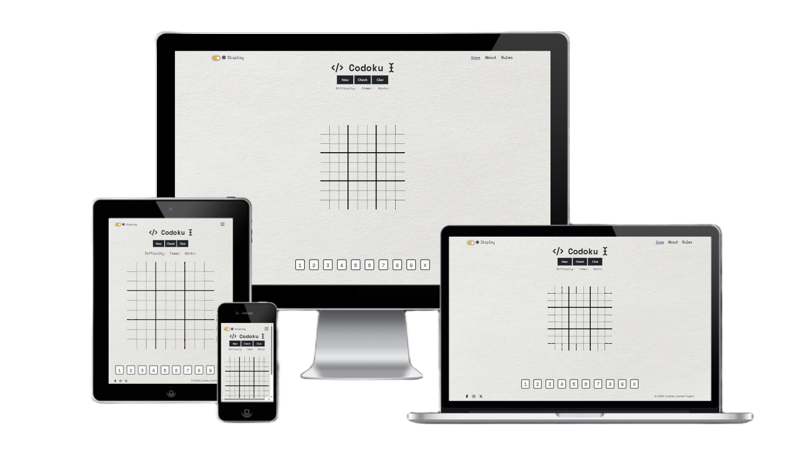

# **Contents**

# 1. **Site Overview**

**Codoku** is a responsive, interactive Sudoku game application built to offer a dynamic and user-centric experience. Developed as part of Project Milestone 2 for the Code Institute's Full Stack Software Development programme, the project encourages logical thinking through engaging gameplay, where each move is driven by the user and validated through real-time interactivity.

Branded with the tagline _“Built with Logic”_, **Codoku** provides users with the ability to select their preferred difficulty level, complete a timed puzzle, receive instant feedback on incorrect entries, and track progress toward solving the grid. The project serves as a practical demonstration of modern front-end development skills, showcasing interactive JavaScript functionality, structured layout through HTML and CSS, and a strong focus on accessibility and user experience design.

👉 Visit the deployed site on GitHub Pages [**here**](https://teseolou.github.io/codoku/index.html).

👉 You can access the full **Codoku** Project Board [**here**](https://github.com/users/TeseoLou/projects/4).

## 1.1. **Project Criteria**

This project has been built to meet the following core assessment requirements:

✔️ Develop a dynamic front-end web application using custom HTML, CSS, and JavaScript.  
✔️ Implement interactivity that allows users to initiate actions (e.g., entering numbers, selecting difficulty) and receive clear, immediate feedback.  
✔️ Follow UX design principles and accessibility guidelines, ensuring intuitive navigation and a clear, structured layout.  
✔️ Create a fully responsive interface compatible across mobile, tablet, and desktop devices.  
✔️ Apply version control through Git and GitHub, documenting progress via consistent and meaningful commits.  
✔️ Provide comprehensive documentation in a `README.md` file, covering project rationale, UX strategy, features, testing processes, and deployment steps.  
✔️ Deploy the final site using a cloud-based platform (GitHub Pages), ensuring clean code, working links, and no errors.  
✔️ Clearly attribute any external resources or third-party code in both the codebase and `README.md`.

## 1.2. **Web Developer Showcase**

As a developer in training, **Codoku** is a platform through which I have demonstrated the following skills:

⭐ Writing clean, semantic HTML and modular CSS, including use of CSS variables, media queries, and reusable styling classes.  
⭐ Building interactive functionality with JavaScript, including puzzle logic, input validation, feedback handling, and a working timer.  
⭐ Integrating a third-party API to dynamically generate Sudoku puzzles based on selected difficulty, handling asynchronous requests and data rendering.  
⭐ Enhancing development efficiency and user experience using jQuery for streamlined DOM manipulation and responsive UI behavior.  
⭐ Implementing an accessible, responsive layout using custom CSS and Bootstrap 5 grid components.  
⭐ Applying UX and accessibility best practices, such as visual hierarchy, color contrast, keyboard navigation, and clear user feedback.  
⭐ Structuring JavaScript code with well-defined functions and control logic to manage game states and user interaction.  
⭐ Maintaining a clear, scalable project file structure, separating concerns between HTML, CSS, and JavaScript assets.  
⭐ Using Git and GitHub for full project life cycle management, with detailed and descriptive commit messages for traceability.  
⭐ Conducting manual and automated testing, using validators, Lighthouse, and device emulation to ensure performance, accessibility, and error-free code.

## **1.3. Key Goals**

The **Codoku** project focuses on achieving the following:

⚽ Deliver a clean and engaging logic-based puzzle experience for users at varying skill levels.  
⚽ Empower users with interactive control, allowing them to input, erase, and validate moves based on real-time feedback.  
⚽ Provide intuitive visual responses, from input error indicators to successful puzzle completion alerts.  
⚽ Ensure broad accessibility, offering responsive design, high contrast UI, and keyboard-friendly features.  
⚽ Demonstrate front-end development proficiency, particularly in implementing dynamic logic through JavaScript and integrating API data.  
⚽ Document the full development journey, from initial planning through to testing and deployment, showcasing a clear and structured workflow in this README.  

# 2. **User Experience**

User experience (UX) design is at the heart of **Codoku**, aiming to create a clean, intuitive, and satisfying interaction between the user and the puzzle-solving interface. For this project, UX involved crafting a layout and flow that makes playing Sudoku feel seamless, whether on desktop, tablet, or mobile.

Prioritizing user experience was essential to ensuring that users could quickly understand how to begin, navigate the grid, receive feedback, and progress through a puzzle without frustration. **Codoku** focuses on creating a minimal but thoughtful design that supports concentration and rewards logic-driven decision making.

## **2.1. Strategy**

The Strategy Plane in UX design laid the foundation for **Codoku**, aligning user needs with creator intent and guiding all subsequent decisions throughout the design and development process. Addressing the core strategic questions early ensured a thoughtful, purpose-driven approach to the project from the start.

Key questions that framed the project vision:

❓ What are the creator’s goals for this website, beyond functionality and technical proficiency?  
❓ Who are the users of this game, and what are they looking for?  
❓ How can the project goals be met while delivering value to users?

These were pivotal in establishing the project's purpose and influenced every stage of its development. From user stories to interface choices, they served as the crux of UX, ensuring all features and design elements were not only practical but meaningful and aligned to real-world usage.

### **2.1.1. Initial Vision**

At the beginning of the project, I knew I wanted to create something that was both engaging and mentally stimulating. Something that exercised the brain and encouraged users to think logically and solve problems. I was drawn to the idea of building a project that wasn’t just functional or visually pleasing, but also offered intrinsic value by challenging users in a way that felt rewarding.

Whether through education, pattern recognition, or critical thinking, I wanted the experience to feel "brain-building", giving users the opportunity to immerse themselves in something that could sharpen their minds while also offering enjoyment.

Accessibility was also a key motivator from the start. Having had loved ones who lived with dementia, the idea of creating something mentally stimulating, something I know they enjoyed, held a personal significance. Cognitive activities like puzzles have long been associated with supporting mental agility and slowing cognitive decline, important for individuals with dementia. Being able to build a simple, enjoyable game that might engage users in this way felt like a meaningful contribution, even if small.

I wanted to ensure the final product was easy to use across devices and welcoming to a wide range of users, regardless of their experience level with puzzles or technology. The principles of a single-player game, like Sudoku, felt like the perfect fit. A quiet, self-contained challenge that could be played anytime, anywhere, without pressure or distraction.

In short, my goal was to create something familiar. A simple, satisfying game with purpose, built with both care and logic at its core.

### **2.1.2. Creator Targets**

Following the initial vision, several specific goals were established to shape how Codoku would serve its users and stand out as a thoughtfully developed interactive application.

 🎯 **Maintain a classic, uncluttered aesthetic**  
  Sudoku is a timeless puzzle, and part of its appeal lies in its simplicity. Codoku embraces that tradition by presenting a clean, focused interface that reflects the classic Sudoku grid style users are already familiar with. This minimalist design avoids unnecessary complexity and distractions.  
  Call to Action: _“Sit back, clear your mind, and enjoy a focused puzzle experience, no clutter, just clarity.”_

 🎯 **Ensure accessibility**  
  Recognising the diversity in players’ experience levels, Codoku offers multiple difficulty settings and straightforward controls. Font sizes, color contrast, spacing, and button placement have all been considered to create an experience that is easy to use across different devices and abilities.  
  Call to Action: _“Choose the level that fits your pace, Codoku adapts to your comfort, not the other way around.”_

 🎯 **Provide unlimited engagement**  
  With a puzzle-generating API integrated into the application, Codoku delivers a fresh, unique puzzle every time a user plays. This supports long-term engagement and ensures the game never feels repetitive.  
  Call to Action: _“Refresh and replay, no two games are ever the same.”_

 🎯 **Encourage return visits**  
  By combining unlimited puzzles, a clean and calming layout, and user-friendly features, the game is designed to be something users enjoy coming back to — whether as a daily brain challenge or a relaxing break.  
  Call to Action: _“Come back anytime, Codoku is your go-to space for daily logic and calm.”_

 🎯 **Attract new users**  
  A polished interface, responsive layout, and intuitive game mechanics help position Codoku as a welcoming space for new users — whether they’re casual players, puzzle lovers, or visitors exploring logic games.  
  Call to Action: _“Discover the joy of problem solving in a space made for everyone.”_

 🎯 **Establish a distinct identity**  
  While maintaining familiar Sudoku mechanics, Codoku sets itself apart through its branding, visual tone, and modern minimalist approach. The goal was to create a game that not only functions well but feels like a refined and standalone product.  
  Call to Action: _“Enjoy the charm of the daily puzzle page, without the ink stains or wasted paper.”_

These creator goals acted as a guiding framework throughout development, influencing both small interface details and overarching design decisions. Ultimately, the aim was to build something simple, smart, and satisfying. A game that users would remember, enjoy, and return to.

Each of these goals reflects the considerations of the user perspective, helping to ensure that the final product is not just a technical success, but an experience that feels relevant, usable, and genuinely enjoyable for the people who interact with it.

### **2.1.3. Puzzler Demographics**

The development of Codoku was shaped by a deeper understanding of puzzler demographics, user habits, and the cognitive benefits associated with puzzle-solving. This insight helped identify core audience segments and informed how features like accessibility, difficulty scaling, and interface design were approached.

Each audience group aligns with specific user goals (from mental engagement to learning, relaxation, or habit-forming gameplay) ensuring Codoku is both relevant and rewarding to a broad spectrum of users.

**Children (in Education)**  
Young learners engaging with puzzles to develop important cognitive skills, including mathematics, pattern recognition, and memory. Sudoku is especially suitable for children aged 8 and up, as it promotes logical thinking and concentration—key for academic and cognitive development. While specific statistics on Sudoku usage within schools are limited, the puzzles are widely recognized for their educational benefits. Research, including findings from the University of Cambridge, supports the use of puzzles like Sudoku in classrooms to enhance focus, logic, and brain development, making it a valuable educational tool for kids.

**Young Adults (Digital First)**  
Curious, mobile-savvy users who enjoy quick access to games that stimulate their minds. Puzzle-solving remains popular with younger demographics, with 34% of 18–24-year-olds reported engaging with tactile logic games like the Rubik’s Cube. While many still enjoy physical puzzles, this group increasingly prefers sleek, digital formats. Codoku caters to them by offering a responsive, accessible interface that captures the feel of classic Sudoku without the clutter or paper waste.

**Adults (Habitual Puzzlers & Cognitive Health Seekers)**  
Everyday adult users who enjoy puzzles as part of their routine — including the 84% of UK adults who describe themselves as puzzlers. This group tackles Sudoku regularly for enjoyment, stress relief, or as a light mental workout. Additionally, it includes adults seeking activities that promote long-term brain health, such as those with a personal or family connection to dementia. Research shows that puzzle-solving can help maintain mental agility and slow cognitive decline, making it a meaningful demographic for Codoku’s quiet, stimulating gameplay.

**Older Adults (Technology Newcomers)**  
According to research published in the *International Journal of Geriatric Psychiatry*, the more people over 50 engage in games such as Sudoku and crosswords, the better their brains function. This group includes older adults who may not be as comfortable with technology but still enjoy puzzles for mental stimulation. They value simple, easy-to-navigate interfaces and puzzles that help maintain cognitive function. Codoku is designed to be intuitive and accessible, offering clear controls and minimal distractions — making it a suitable choice for those who prefer an uncomplicated digital experience.

**Estimated Demographic Breakdown for Codoku Users**

| Demographic Segment | Estimated Share of Target Audience | Rationale Highlights                                                          |
| ------------------- | ---------------------------------- | ------------------------------------------------------------------------------------------- |
| 🔵 **Children**     | **10%**                            | Niche educational users; access typically guided by parents/teachers.                       |
| 🟢 **Young Adults** | **25%**                            | High mobile usage and strong engagement with casual logic games.                            |
| 🟡 **Adults**       | **35%**                            | Largest core group; puzzling as a routine hobby or for cognitive wellness.                  |
| 🔴 **Older Adults** | **20%**                            | Increasing digital literacy and strong interest in cognitive stimulation for mental health. |

**Children** a smaller direct market due to limited device access and dependence on adults or school settings for puzzle games. However, they represent a meaningful niche in education.

**Young Adults** tend to seek quick, minimal-stress cognitive engagement (often on mobile) and are likely to appreciate Codoku’s clean, responsive design.

**Adults** represent the core base, many engage with puzzles as part of routine, stress relief, or brain health. They tend to be consistent and long-term users.

**Older Adults** are increasingly turning to digital puzzles, especially due to growing awareness of dementia prevention. Codoku’s accessible, simple interface can meet their needs.

_Pie chart illustrating the estimated distribution of Codoku’s target demographics:  
🔵 Children (10%), 🟢 Young Adults (25%), 🟡 Adults (35%), 🔴 Older Adults (20%)._

### **2.1.4. Target Audiences**

The broad demographic spread of Codoku’s users highlights the need to thoughtfully accommodate diverse user types as well as age groups. While demographic analysis reveals trends in age, cognitive goals, and device preferences, effective user experience design must go further — considering not just *who* the users are, but *how* they interact with the product and *why* they return.

Codoku was designed with the following key audience groups in mind:

👋 **New Users**  
Newcomers to Sudoku or puzzle games require a clear, intuitive onboarding experience. Whether they are children encountering logic puzzles in an educational context or older adults using digital puzzles for the first time, Codoku must communicate rules, controls, and game flow effortlessly. This includes:
- Simple, welcoming UI and layout
- Clear feedback on input (correct/incorrect)
- Minimal distractions
- Device-agnostic accessibility

🔁 **Repeat Users**  
Many users return to puzzles regularly for stress relief, mental stimulation, or routine. For this group, Codoku emphasizes:
- Puzzle variety via dynamic generation (no two games the same)
- A soothing visual experience for repeated use
- Difficulty selection to match changing moods or goals
- Instant, frictionless replayability

🏫 **Educational Organisations**
For schools, teachers, or parents using Codoku as a learning tool, clarity and focus are essential. Codoku supports these users by:
- Promoting concentration and logical reasoning
- Minimizing unnecessary UI complexity
- Offering challenge scaling suitable for a range of learning levels
- Functioning seamlessly across desktops and tablets

👤 **Individual Casual Users**
This includes mobile-savvy young adults and hobbyist puzzlers who seek brief but satisfying experiences. Codoku’s modern, responsive interface supports:
- Quick game sessions on-the-go
- Accessible play without account creation
- Immediate, rewarding interactions
- A clean, ad-free experience focused on mental play

💡 **Tech-Savvy Users**  
Users already familiar with digital games — especially puzzle enthusiasts — expect responsive design, clean performance, and subtle polish. Codoku appeals to this group through:
- Mobile responsiveness and touch optimization
- Fast load times
- Fluid input handling and keyboard shortcuts (where applicable)
- Structured, elegant game flow

🤝 **Tech Newbies**  
Older users or digital newcomers may be less confident with device interfaces. For them, Codoku intentionally avoids overwhelm by:
- Using familiar visual metaphors (like a paper Sudoku grid)
- Enlarged touch targets
- Clear game progression with no unnecessary features
- Accessible color contrast and readability

Each of these audiences spans across the previously identified age demographics, reinforcing the importance of inclusive design that scales by ability, comfort, and purpose — not just age alone.

This understanding directly informed the development of user stories, which capture and prioritize the needs, behaviors, and goals of these distinct audience groups. The next section explores how Codoku's user stories shaped design and functionality decisions to serve these varied user types.

### **2.1.5. User Stories**

For this project, user stories were developed to capture the diverse needs of Codoku’s target audience, ensuring the application delivers a responsive, rewarding, and user-centric puzzle experience. The creation of user stories helped define what different user groups—such as new users, returning players, educational institutions, and older tech newcomers—expected from the platform. These stories bridged the gap between user needs and the technical development process, ensuring that every feature contributed to a smooth user experience and served as a roadmap for development and design decisions.

To ensure effective and timely delivery, the user stories were divided into three priority categories. These categories reflect essential, important, and desirable features respectively:

🟥 **Must-Have** stories represent the core features Codoku cannot function without. These include elements like puzzle interactivity, user input, feedback systems, and accessibility design.  
🟨 **Should-Have** stories focus on improving the experience for specific audiences, such as offering difficulty levels or enhancing usability across devices.  
🟩 **Could-Have** stories introduce advanced or bonus functionality that, while not essential, would significantly enhance the experience if time and resources allow.

This prioritization ensures that the application’s most critical features are completed first, while also allowing for thoughtful expansion based on user needs.

🟥 **Must-Have User Stories**

_As a **multi-device owner**, I want the website to display correctly and function smoothly across mobile, tablet, and desktop, so that I can enjoy a consistent experience no matter how I access it._

_As a **mobile user**, I want the game to work smoothly on smaller screens so that I can play on-the-go._

_As a **touchscreen user**, I want large, easy-to-tap buttons so that the interface feels natural on touch devices._

_As an **accessibility-focused user**, I want keyboard and mouse input so that I can play without relying on a mouse or touchscreen._

_As a **computer newbie**, I want to be shown a custom 404 error page with clear navigation back to the homepage, so that I don’t get lost or frustrated._

_As a **new user**, I want clear instructions on how to play Sudoku so that I can start the game without confusion._

_As a **casual user**, I want to select a difficulty level so that the puzzle matches my ability and keeps me engaged._

_As a **puzzle player**, I want to be able to input numbers into the grid so that I can solve the puzzle interactively._

_As a **sudoku rookie**, I want the option to get responsive visual feedback on correct or incorrect moves so that I can learn from mistakes in real time._

_As a **repeating user**, I want a new puzzle to be generated each time I play so that I don’t get bored with repetition._

_As a **tech newcomer**, I want the controls to be intuitive and minimal so that I’m not overwhelmed._

_As an **older user**, I want a clean layout with large fonts and strong contrast so that I can comfortably see and interact with the puzzle._

_As a **visually impaired user**, I want a dark mode theme to make the interface easier on my eyes._

🟨 **Should-Have**

_As a **gamer**, I want a popup message to appear when I finish the puzzle, letting me know whether it was solved correctly, so that I get a clear and satisfying sense of completion._

_As a **student**, I want puzzles to help me build logic and pattern recognition skills so that I can improve cognitive ability over time._

 _As a **returning player**, I want a timer feature so that I can track how quickly I complete puzzles._

_As a **curious new user**, I want to view an About section that explains the purpose and inspiration behind Codoku, so that I can understand the intent and values behind the game._

_As a **sensory-oriented user**, I want optional sound effects for actions like correct entries or puzzle completion, so that I receive auditory feedback that enhances engagement._

_As a **returning user**, I want to find social media links in the footer so that I can follow Codoku updates, share the game with others, and stay connected with new features or challenges._

🟩 **Could-Have**

_As a **competitive user**, I want to save my best times so that I can track personal progress._

_As an **educational facilitator**, I want printable puzzle sheets so that I can use Codoku in classrooms with limited digital access._

_As a **user who prefers auditory learning**, I want audio instructions so that I can engage through sound rather than reading._

By creating and prioritizing these user stories, the Codoku project ensures a structured, inclusive, and scalable development process. The application addresses the core needs of all user types while leaving space for innovation and enhancement. Each story links directly back to the user personas and demographics explored in earlier sections, reinforcing the project’s commitment to delivering thoughtful, user-centered design.

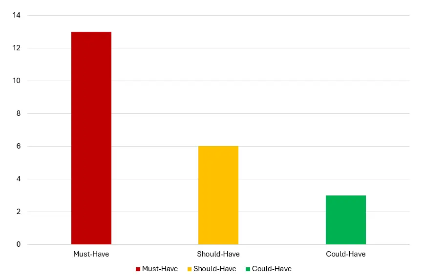

*Bar chart illustrating the number of Codoku user stories by category: 13 Must-Have, 6 Should-Have, and 3 Could-Have.*

### **2.1.6. Emerging Components**

Informed by the initial vision, creator goals, user demographics, and audience needs, several critical components began to emerge early in the design process as essential to Codoku’s success. These components reflect a balance of functionality, accessibility, and user enjoyment, and were developed not only to support gameplay mechanics, but also to reinforce the project’s broader UX goals and inclusive design ethos.

Each element stems from a combination of logical necessity and user-centered design thinking, ensuring Codoku remains simple to use, yet rich in value.

🧠 **Core Gameplay Logic**  
At the heart of the application is the interactive Sudoku grid. This had to:
- Support number input and validation
- Respond to user difficulty selections
- Be visually clean and scale across device types

This grid was the anchor of every design decision, requiring structure that felt familiar yet modern, and mechanics that were responsive and accessible.

📲 **Responsive Interface**  
Given the wide-ranging demographics and device preferences, Codoku needed a layout that automatically adapted to:
- Mobile, tablet, and desktop screens
- Touch interaction as well as keyboard input
- Larger fonts and high contrast for readability

Responsiveness was not a bonus—it was foundational to making the app usable by everyone from school children to older adults.

🚦 **Difficulty Selector**  
To appeal to users of all skill levels, an adjustable difficulty feature emerged early as a must-have. Whether easing beginners in or offering a challenge for seasoned puzzlers, this component:
- Instantly reconfigures the grid
- Interfaces with the puzzle-generation API
- Offers intuitive feedback without needing multiple steps or screens

⚡**Feedback System**  
Clear feedback was essential to support learning and engagement. Early planning prioritized:
- Visual indicators of errors or correct inputs
- A success modal or popup for puzzle completion
- Optional sound cues for auditory reinforcement  

This ensured every move felt meaningful and users were motivated to improve over time.

🌐 **Navigation & Page Flow**  
While Codoku is a single-page game experience, it still required intuitive navigation, including:
- An accessible homepage layout with logical content flow
- A persistent footer with social media links and accessibility tools
- A custom 404 page to guide users who stray from the main path

💬 **About & Purpose Section**  
Emerging from the creator’s personal motivation, the *About* section provides context and a deeper connection to users. Its purpose:
- Humanize the app experience
- Build trust with new users
- Highlight educational and cognitive benefits  

Though not central to gameplay, it reflects Codoku’s intention as more than just a game—it’s a purposeful tool for mental wellness.

📖 **Rules & How-To-Play Section**  
From the beginning, it was clear that Codoku needed to cater to a wide range of familiarity levels with Sudoku — including complete beginners. A dedicated rules component was identified early on as a key tool to:

- Educate new users about Sudoku gameplay and objectives
- Reduce barriers for first-time players across all ages
- Reinforce logical structure through clear, step-by-step guidance

This component ensures that anyone, regardless of experience or background, can confidently begin playing. It also aligns with the project’s commitment to accessibility and lifelong learning by promoting inclusive, self-directed exploration.

🎚️ **Accessibility Tools**  
From the outset, Codoku was designed to be accessible across a wide spectrum of abilities. Core accessibility components include:
- A toggleable dark mode for visual comfort
- Keyboard support for users without a mouse
- Large, clearly labeled buttons with adequate spacing
- Semantic HTML and screen-reader-friendly structure

Together, these components laid the groundwork for a focused, inclusive experience that delivers both functionality and delight. They were not imagined in isolation, but directly shaped by the needs, habits, and feedback of the users Codoku aims to serve—making them fundamental to the project’s success and longevity.

### **2.1.7. Feasibility / Importance**

The Importance/Feasibility analysis evaluated each of Codoku’s website components based on two criteria:  

- **Feasibility** measures the practicality of implementation within the project’s constraints, such as development time, resources, and technical complexity.
- **Importance** refers to how essential a feature is for delivering value to users and supporting the project’s goals of accessibility, engagement, and cognitive benefit. 

This analysis was used to guide development priorities and identify which features would deliver the most impact early on, while also ensuring that lower-effort, high-value items were not overlooked. The scatter plot below visualizes this evaluation.

*Scatter plot illustrating the feasibility and importance of Codoku's planned components.*

#### **Graph Insights**  

🔵 High Importance & High Feasibility    
Features such as the **Responsive Interface**, **Sound Cues**, **Navigation & Page Flow**, **Rules Section**, **Visual Feedback Styling**, and the **404 Error Page** fall into this quadrant. These components are highly impactful and easy to deliver — making them first-priority for the MVP. They directly support key user stories related to accessibility, learnability, and cross-device usability.

🟠 High Importance & Moderate Feasibility    
Elements like the **Core Gameplay Grid**, **Difficulty Selector**, and **API Integration** are essential to gameplay but involve more implementation complexity. These features drive Codoku’s core logic and replayability. While not trivial, they are still crucial for the success of the game and were tackled early in the development roadmap.

🟢 Moderate Importance & High Feasibility    
Items such as the **About & Purpose Section** and **Celebration Pop-Up** offer additional user engagement and narrative context with minimal implementation overhead. These were positioned as enhancements that add polish without compromising development time.

🟣 Low Importance & Low Feasibility    
Features such as **Progress Tracking Dashboards**, **Puzzle Score Saving**, **Audio/Video Instructions**, and **Puzzle PDF Exporting** were ranked lowest in priority. These additions offer niche or future-facing value but would require significantly more work to implement (e.g., local storage, printing logic, or media handling). As such, they are considered stretch goals and not part of the initial MVP.

This analysis helped keep development focused and realistic, ensuring that Codoku delivered its essential features (a clean, cognitive, and user-friendly puzzle experience) while reserving room for enhancement once the foundational elements were in place.

## **2.2. Scope**

In UX design, the Scope Plane defines the specific features and content that a product needs in order to meet its strategic aims. While the Strategy Plane outlined the purpose of Codoku and the audiences it serves, the Scope Plane clarified what the application must include to deliver on those goals.

For Codoku, this phase was critical in determining the game’s core functionality and content structure. It helped translate the broader vision of creating an accessible, mentally stimulating puzzle game into clear, actionable requirements. The features identified through emerging components, user stories, and demographic analysis provided a foundation for prioritizing what needed to be built.

This process ensured that development remained tightly focused on what mattered most to users, such as usability, interactivity, and cross-device support, while setting aside lower-priority features for future iterations. 

### **2.2.1. Deriving Requirements**

The feature planning and UX analysis clearly highlighted which components were essential for Codoku to provide value to users and meet its project goals. These insights allowed requirements to be organized into three categories based on their priority and impact: **must-have**, **should-have**, and **could-have** features.

This structured breakdown helped ensure that development stayed focused on delivering a usable, engaging, and scalable Sudoku experience — while leaving room for future improvements once the core functionality was in place.

#### 🟥 Must-Have

- Present a fully interactive Sudoku grid with input validation  
- Generate puzzles dynamically based on selected difficulty  
- Offer clear instructions for how to play the game  
- Ensure full responsiveness across devices (desktop, tablet, mobile)  
- Provide a button to allow users to request visual feedback on correct/incorrect entries  
- Provide a button to allow users to reveal one square if needed  
- Include a dark mode or accessible contrast options
- Include a basic navigation bar for quick access to game sections (e.g., Rules, About)  
- Include a dedicated game stats section for tracking puzzle-related data  
- Display a completion message when the puzzle is solved
- Support both mouse/touch and keyboard input for accessibility  
- Prevent navigation errors with a custom 404 page  

#### 🟨 Should-Have

- Include a timer to track how long a puzzle takes to complete
- Display timeout message when user has run out of time  
- Display a incorrect message when the puzzle is full but incorrect
- Show game stats in the completion message
- Add optional sound cues for game actions (input, errors, completion)  
- Display a short About section describing the purpose of the app  
- Offer social media links in the footer to allow users to share or follow updates  

#### 🟩 Could-Have

- Allow users to save best completion times for personal tracking  
- Generate printable versions of puzzles for offline or classroom use  
- Offer optional audio or video guidance for users who prefer verbal instruction  

These requirements represent a clear path from user insights to actionable development goals. By categorizing features in this way, Codoku was able to prioritize delivering a minimal viable product (MVP) that fulfilled its educational and cognitive aims while maintaining flexibility for future enhancements.

### **2.2.2. Functional Requirements**

Functional requirements define how Codoku operates on a technical and interactive level, outlining the behaviors, inputs, and user flows that allow the game to deliver a smooth, rewarding experience. While UX strategy defined the *why* behind Codoku and user stories outlined the *who* and *what*, functional requirements focus on the *how*, ensuring the game responds accurately to input, renders correctly across devices, and delivers user feedback in a clear and accessible way.

Because Codoku is a fully interactive, logic-driven game rather than a static content site, this section plays a more prominent role than it did in other project types ([Milestone Project 1](https://github.com/TeseoLou/clancy-nook-walking-tours)). Interactivity is not just a feature of Codoku, it's the foundation. These functional elements power the game experience, define progression and reward, and ensure the site meets the goals of accessibility, replayability, and mental stimulation.

Functional requirements were derived from user stories, accessibility considerations, and the emerging UX components. They are categorized here by their level of scope:

- **Macro Functions**: Site-wide behaviors and foundations (e.g., responsiveness, accessibility)
- **Meso Functions**: Features spanning multiple areas of the game/app (e.g., navigation, stats tracking)
- **Micro Functions**: Focused behaviors tied to specific game elements (e.g., number input, square validation)

#### 🟥 **Must-Have**

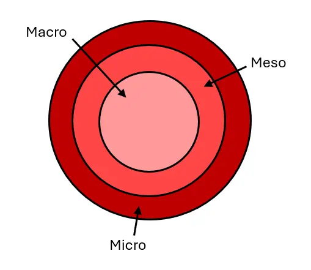

_Conceptual diagram showing how **Codoku's** must-have functional requirements are layered._

Macro:
- Responsive layout that adjusts across desktop, tablet, and mobile  
- Keyboard and mouse/touch compatibility for puzzle control  
- Toggleable dark mode or high-contrast option  
- Navigation bar for accessing key sections (e.g., Rules, About)  
- Custom 404 page for broken links or navigation errors  

Meso:
- API integration for generating unique sudoku boards on game page grid section
- Difficulty selector that dynamically adjusts puzzle logic and grid state  
- Completion feedback modal with restart option  
- Visual and/or sound-based user feedback system (optional by button press)  
- “About” and “Rules” sections that are accessible

Micro:
- Number input directly into grid cells  
- Input erase/overwrite functionality  
- Button to reveal a single square as a clue  
- Button to check the grid and highlight incorrect entries  
- Interactive timer that tracks puzzle duration  
- Game state reset functionality for replay  

#### 🟨 **Should-Have**

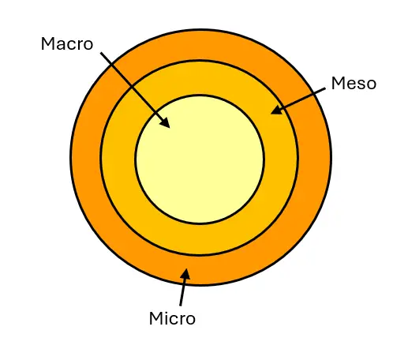

_Visual breakdown of **Codoku’s** Should-Have features, categorized by functional scope._  

Macro:
- Footer with links to GitHub and optional social media accounts

Meso:
- Game stats tracker for difficulty, time, and hint usage  
- Timer selector that dynamically adjusts the time limit for game completion 
- Pop-up display of game stats (e.g., completion time, difficulty level, number of hints used)
- Sound feedback

Micro:
- Timeout message for unfinished games after user-set time limit
- Error message display when puzzle is full but incorrect

#### 🟩 **Could-Have**

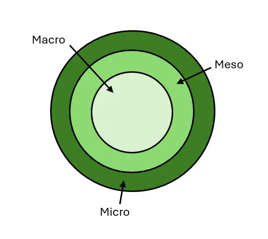

_Representation of **Codoku’s** Could-Have features, grouped by functional depth._

Meso:
- Option to print the current puzzle grid for offline play
- Save and display best puzzle completion times locally

Micro:
- Audio narration of instructions or feedback for users who benefit from auditory support
- Advanced settings panel (e.g., disable hints, manual validation only)

By organizing functional requirements by scope, **Codoku** ensured that critical interactivity was developed first while reserving room for enhancements that add polish and accessibility. This approach allowed for a structured and scalable game development process, one that balances functionality, logic, and user satisfaction.

### **2.2.3. Content Requirements**

Content requirements identify the textual, visual, and interactive assets **Codoku** needs to effectively support its functionality and fulfill user expectations. These elements bring the site to life by guiding the user through the game interface, enhancing engagement, and supporting cognitive clarity.

For **Codoku**, content plays a particularly active role — not just providing information, but directly supporting gameplay through real-time feedback, instructional clarity, and aesthetic reinforcement. Content elements were shaped by the project’s UX strategy, user stories, and emerging components, ensuring everything from visuals to text supported usability, accessibility, and gameplay enjoyment.

In an interactive game like **Codoku**, content isn’t static — it's central to the player experience. Clear instructions, intuitive feedback, accessible visuals, and an inviting aesthetic all contribute to maintaining user concentration, reducing friction, and encouraging return visits.

To support a smooth and organized development process, content was broken into the following categories:

- **Graphic Content**: Visual assets used to support brand identity, readability, and gameplay clarity.  
- **Textual Content**: Written content needed for instructions, navigation, feedback, and accessibility.  
- **Aesthetic Content**: Visual styling choices that shape the user’s impression and support usability.  
- **Interactive Content**: Dynamic or reactive components that users engage with during gameplay.

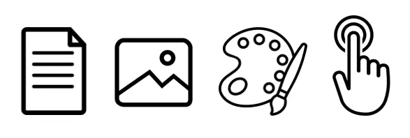

_Visual icons representing Codoku’s four content categories, textual, graphic, aesthetic, and interactive._

#### 🟥 **Must-Have**

Graphic:
- Codoku logo (for header and favicon)  

Textual:
- Game instructions (how to play, rules, controls)  
- Page titles and meta descriptions  
- Section headings (e.g., About, Rules, Feedback)  
- Error messages (e.g., incorrect entry, timeout)  
- Completion messages for solved puzzles  
- Accessibility labels and ARIA tags for key controls  

Aesthetic:
- Sudoku grid visual layout with clear styling  
- Distinct styling for editable vs. static cells  
- Button state visuals
- Clean, readable font hierarchy  
- High contrast color palette with dark mode support  
- Consistent styling across main game and About pages  
- Highlight styles for selected cells, invalid inputs, and system feedback

Interactive:
- Start/reset buttons  
- Difficulty selector  
- Visual feedback effects
- Ckeck and Clue buttons 
- Timer display  
- Theme Toggle
- Navigation between Game and About pages  
- 404 error handling  
- Game completion modal with replay option  
- Fully responsive layout across all devices

#### 🟨 **Should-Have**

Graphic:
- Animated celebration (e.g., confetti) on puzzle completion  
- Images for About Section

Textual:
- About section content describing the purpose and development of Codoku  
- Game statistics summary (time, difficulty, hints used) in completion popup 

Aesthetic: 
- Animations for transitions and button interactions

Interactive:
- Footer with social media links  

#### 🟩 **Could-Have**

Graphic:
- Thematic illustrations or mascots for storytelling

Textual:
- Puzzle-related tips or facts for enrichment  
- Downloadable printable puzzle sheet text prompts  

Interactive:
- Audio narration or verbal game instructions  
- Adjustable color themes or font scaling for accessibility preferences  

By defining these content requirements, **Codoku** ensures a game experience that is not only functional and interactive but also clear, visually coherent, and accessible to users of all backgrounds and abilities.

### **2.2.4. Core Features**

Core Features outlined the key components integrated into the Codoku application to ensure it fulfilled both user needs and project objectives. These features were derived directly from the UX strategy, user stories, and scope planning, allowing for the prioritization of functionality and content into clearly scoped deliverables.

Each feature was evaluated based on its importance to gameplay, usability, and accessibility, as well as its feasibility within the project timeline. Features were categorized as **Must-Have**, **Should-Have**, or **Could-Have**, and further classified by their scope of implementation:

- **Website**: Features applied universally across all pages and user sessions  
- **Page**: Features tied to individual views or templates  
- **Section**: Features that exist within a page, like stats or rules  
- **Elemental**: Specific interactive or visual components

| Component                                             | Importance | Feasibility | Scope  | Priority |
|-------------------------------------------------------|------------|-------------|-----------|----------|
| Navigation bar (Home, About, Rules)                   | 5          | 5           | Website   | 🟥       |
| Responsive layout (mobile/tablet/desktop)             | 5          | 4           | Website   | 🟥       |
| Page titles & meta descriptions                       | 5          | 5           | Website   | 🟥       |
| Favicon (browser tab branding icon)                   | 5          | 5           | Elemental | 🟥       |
| 404 Error Page                                        | 5          | 5           | Page      | 🟥       |
| Keyboard and mouse/touch compatibility                | 5          | 4           | Website   | 🟥       |
| Dark mode / high-contrast toggle                      | 5          | 4           | Elemental | 🟥       |
| Difficulty selector (Easy / Medium / Hard)            | 5          | 3           | Elemental | 🟥       |
| Time selector (select puzzle duration)                | 5          | 3           | Elemental | 🟥       |
| Interactive Sudoku grid                               | 5          | 3           | Section   | 🟥       |
| Visual distinction between fixed and editable cells   | 5          | 4           | Section   | 🟥       |
| Input validation & number checking button             | 5          | 3           | Elemental | 🟥       |
| Clue button (single square reveal)                    | 5          | 3           | Elemental | 🟥       |
| Number buttons for mouse/touch input                  | 5          | 4           | Elemental | 🟥       |
| API integration for dynamic puzzle generation         | 5          | 2           | Website   | 🟥       |
| Footer with navigation & legal info                   | 5          | 5           | Website   | 🟥       |
| Rules section with game instructions                  | 5          | 5           | Section   | 🟥       |
| Timeout popup (user runs out of time)                 | 4          | 3           | Elemental | 🟨       |
| Incorrect puzzle completion popup                     | 4          | 3           | Elemental | 🟨       |
| Game timer                                            | 4          | 3           | Section   | 🟨       |
| Stats panel (difficulty, time, hints used)            | 4          | 3           | Section   | 🟨       |
| Scoreboard or personal record display                 | 4          | 3           | Section   | 🟨       |
| Completion popup with message and stats               | 4          | 4           | Elemental | 🟨       |
| About page                                            | 3          | 5           | Page      | 🟨       |
| About page images (branding or purpose visual support)| 3          | 5           | Graphic   | 🟨       |
| Donation button (linking to external charity site)    | 3          | 5           | Elemental | 🟨       |
| Sound feedback toggle (input, error, win sounds)      | 3          | 3           | Elemental | 🟨       |
| Social media / GitHub links in footer                 | 3          | 5           | Elemental | 🟨       |
| Printable puzzle feature                              | 2          | 2           | Elemental | 🟩       |
| Audio instructions or narration                       | 2          | 3           | Section   | 🟩       |
| Save best time to local storage                       | 2          | 2           | Elemental | 🟩       |

- 🟥 **Must-Have** → Essential for gameplay and accessibility  
- 🟨 **Should-Have** → Valuable enhancements, not vital for MVP  
- 🟩 **Could-Have** → Nice-to-have features for future development

These core features served as a structured development blueprint, ensuring Codoku's MVP delivered essential gameplay, accessibility, and visual consistency—while leaving room for feature growth in future iterations.

## **2.3. Structure**

The Structure Plane defines how Codoku’s content, features, and interactions are arranged to support ease of use and logical flow. It connects strategic goals with the interface’s layout, ensuring that players—regardless of age, ability, or device—can navigate and play comfortably.

As a game-based application, Codoku prioritizes interaction design over dense content. Key features like the grid, number inputs, validation tools, and timers are placed for intuitive access, with real-time feedback to reduce frustration and aid progression.

Navigation remains simple but purposeful. A top nav bar provides quick access to the Home, About, and Rules pages, while the footer offers consistent links to external platforms like GitHub and the donation page.

The layout includes:
- An interactive Sudoku grid
- Touch/mouse-friendly number buttons
- Difficulty and timer selectors
- Clue and check buttons
- Feedback messages and modals

Information is structured to minimize distractions and cognitive load, with semantic HTML and ARIA support for screen readers. Elements are grouped by function and follow consistent patterns to support user familiarity.

Codoku’s responsive structure adapts seamlessly across desktop, tablet, and mobile, using scalable fonts, high-contrast visuals, and keyboard-friendly controls. Altogether, this creates an inclusive, focused space that enhances logic-based engagement and replayability.

### **2.3.1 MoSCoW Prioritization**

Throughout the project, effective prioritization according to business goals, user needs, and developer capabilities was crucial. With the project scoped to deliver a complete, accessible Sudoku game interface within a limited timeframe, it became essential to continually assess what was realistic and achievable based on available time, technical complexity, and learning goals.

To support this, the **MoSCoW** prioritization framework was used to categorize tasks into **Must-Have**, **Should-Have**, **Could-Have**, and eventually, **Won’t-Have**. This final category emerged as development progressed and certain features though potentially valuable proved too complex, time-intensive, or peripheral for the scope of a front-end milestone project.

Features marked as **Won’t-Have** were not removed from consideration altogether, but rather postponed for a future iteration or stretch project once more time and experience could be dedicated to their successful implementation. Below is a summary of the features assigned to this category and the rationale for each decision:

| 🟦 Feature               | Reason for Won’t-Have Status                                                                 |
|--------------------------|---------------------------------------------------------------------------------------------|
| **Scoreboard**           | Requires data persistence and local storage logic that proved difficult to implement in time. |
| **Save Game**            | Though planned, saving and restoring puzzle state (including grid, timer, clues) required more advanced JavaScript than currently manageable. |
| **Print Puzzle Button**  | Would require custom print styling and puzzle state management, which was deprioritized to focus on core interactivity. |
| **Multimedia Instructions** | Recording, editing, and embedding accessible audio/video content exceeded the available development time and required tools outside the project scope. |

These decisions helped ensure that core interactive and accessible features were delivered to a high standard, while leaving the door open for future improvements and enhancements.

### **2.3.2 Site Hierarchy**

Site hierarchy refers to how Codoku’s content, features, and pages are logically organized and accessed by users. It shapes the user’s journey through the application, affecting clarity, efficiency, and accessibility. For a game-based web app like Codoku, hierarchy needed to support both discovery and flow, prioritizing gameplay while offering seamless access to supporting features like instructions and about information.

**Aims of Codoku's Site Structure**

- 🏠 Make core gameplay immediately accessible with minimal clicks  
- ⚙️ Guide users through setup before play (difficulty and timer)  
- ➕ Support learning and accessibility with modals and structured layout  

Codoku is structured around a single-page core gameplay interface, with supplemental navigation to an About page and modal overlays that support the user without removing them from the experience. Functional elements such as the Setup Modal, Rules Modal, and Completion Feedback act as focused UI components that enhance clarity while keeping the player in flow.

| Page / Modal          | Function                                             | Role in UX Journey           |
|-----------------------|------------------------------------------------------|------------------------------|
| **Home (Game)**    | Primary interface for Sudoku gameplay                | 🎮 Start, Play, Progress     |
| **Setup Modal**       | Appears before game begins, lets user pick difficulty & timer | ⚙️ Customization & Onboarding |
| **Rules Modal**       | On-demand gameplay instructions                      | 🧾 Learn & Assist            |
| **About Page**        | Project background and donation information          | 👋 Context & Mission         |
| **404 Error Page**    | Redirect users who hit an incorrect route            | ⚠️ Recovery & Redirection    |
| **Completion Modal**  | Feedback, stats, and new game options post-solve     | 🏆 Success & Replay          |

The structure of the Codoku site hierarchy is intentionally designed as a pyramid, placing the most essential user-facing elements at the top and progressively layering supportive or contextual features beneath.

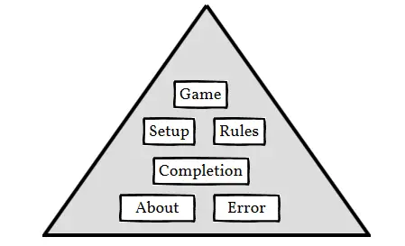  
*A pyramid diagram showing the importance and relationship between the main interface, modals, and support pages in Codoku.*

**Game**  
At the top of the hierarchy is the game itself — the Sudoku grid, number inputs, timer, and validation. It is the core experience, drawing immediate focus and requiring an uncluttered, accessible layout.

**Pre-Game Modals**  
These appear before gameplay begins.  
- **Setup** lets users choose difficulty and timer options.  
- **Rules** explains how to play.  
They enhance onboarding and accessibility while staying separate from the main grid.

**Post-Game Modal**  
Triggered after a puzzle is solved.  
- Gives success feedback and stats.  
- Offers options to start a new game or admire the board.  
It supports user motivation and replay.

**Supplementary Pages**  
Supportive but non-core. These are accessed less frequently but strengthen the experience.

- **About** shares project purpose and links to donations.  
- **Error** (404) redirects users from broken links.  

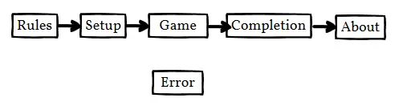  
*A sequential flow from Setup → Game → Completion or Support Pages.*

The diagram outlines the typical user journey through Codoku. It follows a linear but flexible progression, guiding users from instruction to gameplay and through to completion, with supportive pathways for accessing additional context or handling errors.

1. 🧾**Rules**  
   - Users may begin by reviewing game instructions.  
   - This modal ensures new players understand how to play before continuing.

2. ⚙️ **Setup**  
   - Players configure their game preferences, such as difficulty level and timer settings.  
   - This step customizes the gameplay experience.

3. 🎮 **Game**  
   - The core phase of the app, where users interact with the Sudoku grid and input their answers.  
   - Includes buttons for checking answers and requesting clues.

4. 🏆 **Completion**  
   - Appears once a puzzle is solved.  
   - Displays success feedback, game statistics, and options to replay or start a new game.

5. 👋 **About**  
   - An optional informational page that shares the project's mission, purpose, and donation link.  
   - Helps users understand the wider goals behind Codoku.

6. ⚠️ **Error**  
   - Positioned outside the main flow, the error page is triggered when users navigate to an invalid or broken route.  
   - Acts as a safeguard across the entire site by redirecting users back to a valid entry point like the Home/Game page.  
   - Enhances accessibility and trust by ensuring all interactions result in a usable path forward.

This structure helps players remain focused on solving puzzles while providing fallback mechanisms and optional exploration without breaking flow or causing confusion.

### **2.3.4 Navigation**

Effective navigation was essential to Codoku’s user experience (UX) design, ensuring users could move confidently between gameplay and supporting content without unnecessary complexity. Because Codoku is a game-first web app, navigation needed to feel lightweight, accessible, and non-disruptive, guiding users through core game actions while offering easy access to help, context, and redirection when needed.

Codoku’s navigation follows best practices in clarity, predictability, and responsiveness:

- **Predictability**: Users know where buttons and links will take them.
- **Efficiency**: Core actions like starting a puzzle or checking the rules are one click away.
- **Guidance**: Navigation encourages a clear journey from setup to gameplay and beyond.

The navbar appears persistently across pages and includes quick access to:

📌 **Home**: Puzzle interface and game logic  
📌 **Rules**: Modal with instructions for new users  
📌 **About**: Purpose of the project and donation link  

This ensures users are never far from core functions, while modals and page transitions are used to maintain focus and flow within the single-page app experience.

While gameplay is central, Codoku also includes utility pages and overlays:

⚙️ **Setup Modal** — Opens at launch, allowing users to select difficulty and timer options.  
🧾 **Rules Modal** — Available on demand for help.  
🏆 **Completion Modal** — Triggered when the puzzle is solved, showing stats and restart options.  
❌ **404 Error Page** — Loads when a broken or invalid URL is visited, offering return-to-home navigation.  

These elements are not listed in the main navbar, but play key roles in usability and player flow.

External navigation is minimal, but still present:

💝 **Donation Link** – Found in the About page, linking to a trusted cognitive health charity.  
🔗 **Social Media Links** – Displayed in the site footer for sharing and project visibility (e.g., GitHub, LinkedIn).  

These external links open in new tabs to ensure users remain anchored in the Codoku experience.

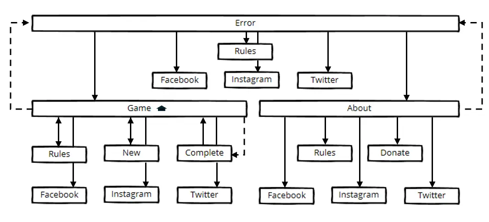
_A navigation map of Codoku showing flow from the Game Page to supporting modals, About, and Error pages, with external links branching consistently._

The diagram illustrates Codoku's navigation ecosystem, capturing both user-directed flows (via navbars and buttons) and automated fallbacks (like error recovery). The structure is built around three main nodes: Game, About, and Error, with consistent access to modals and external links across all routes.

#### 🎮 **Game Page (Central Hub)**
Game is the core of the user journey and central interaction point.
- The navbar allows users to move between:
  - Pages 
  - Rules modal
- Users can also navigate to:
  - New to reset/start a new puzzle.
  - Complete (Completion Modal) when the puzzle is solved.
- The footer provides access to socials links:
  - Facebook
  - Instagram
  - Twitter

This path keeps essential puzzle actions just one step away, allowing users to stay engaged while still accessing help or restarting as needed.

#### 👋 **About Page (Supportive Content)**
The About page provides contextual information and connects users to Codoku’s mission.
- The navbar allows users to move between:
  - Pages 
  - Rules modal
- Users can also navigate to:
  - Donate (external link to Alzheimer’s Society)
- The footer provides access to socials links:
  - Facebook
  - Instagram
  - Twitter

Like the Game section, About maintains full access to supporting content and platforms without disrupting the user flow.

#### ⚠️ **Error Page (Safety Net)**
Error Page sits as a universal fallback.
- The navbar allows users to move between:
  - Pages 
  - Rules modal
- Users can also navigate to:
  - Home Page (additional button)
- The footer provides access to socials links:
  - Facebook
  - Instagram
  - Twitter

It's accessible from anywhere via broken links or redirects.

### **2.3.4 User Interaction (UI)**

Interaction design in Codoku played a central role in shaping how users engaged with the interface, particularly given the puzzle-focused nature of the project. The aim was to create a game environment that felt intuitive, responsive, and rewarding across devices and skill levels.

Rather than designing for content browsing or form submission (as in more traditional sites), Codoku’s UI focused on player interaction with game elements such as the Sudoku the grid, difficulty selector, feedback modals, and control buttons. Every element was implemented with usability, responsiveness, and feedback in mind.

Codoku’s interaction model followed front-end best practices:

⭐ Ensured smooth, predictable input handling across keyboard, mouse, and touch devices  
⭐ Provided real-time feedback through color changes, pop-ups, and sounds  
⭐ Used modals instead of separate pages to keep gameplay immersive  
⭐ Maintained consistent navigation elements (navbar and footer) for orientation  
⭐ Applied hover/focus states to buttons and grid cells for improved accessibility  
⭐ Focused on mobile-first responsiveness and performance  

| Area            | Description                                                                 | Interactive Features                                                                                                   | Benefits                                                                                  |
|-------------------------|-----------------------------------------------------------------------------|------------------------------------------------------------------------------------------------------------------------|-------------------------------------------------------------------------------------------|
| 🔼 **Navbar**              | Persistent top-level navigation on all pages                                | Links to Game (Home), Rules (Modal), About Page                                                                       | Fast access to core features; supports wayfinding             |
| 🔽 **Footer Navigation**   | Fixed at the bottom of each page                                            | Social links (Facebook, Instagram, X), consistent site presence                                                       | Promotes brand presence            |
| 🎛️ **Game Buttons**        | Key inputs that control gameplay                                            | New, Enter, Donate, Home (404 only); styled with hover & focus feedback                                 | Encourages clear actions                  |
| 🔲 **Sudoku Grid**         | Core interaction space of the game                                          | Click/tap or keyboard input, cell highlighting, editable cells, locked cells, input deletion                          | Provides a focused, interactive puzzle experience     |
| 🔢 **Number Keys**         | Number pad for easy input                                                   | Click/tap digit → apply to grid, visual highlight for selected number, reset via deselection                          | Enhances accessibility (esp. touchscreen)                      |
| 🪟 **Modals**              | Lightweight overlays for key flows                                          | Setup (difficulty/time), Rules (instructions), Completion (feedback & stats), keyboard-trappable                      | Keeps users in flow; avoids disruptive page loads; supports onboarding and feedback       |
| 🔊 **Sound Feedback**      | Audio cues linked to interaction                                            | Button sounds, alert tones, theme change sounds (hoot/tweet), input sounds                                            | Reinforces interaction feedback          |
| ❓ **Check Button**        | On-demand input validation                                                  | Highlights incorrect cells; disables input temporarily during check                                                    | Promotes learning without punishment              |
| 🔎 **Clue Button**         | Optional assistive feature                                                  | Fills in one correct cell, updates clue counter, supports keyboard and tap                                            | Encourages confidence                    |
| ℹ️ **About Page**          | Secondary page with project info and donation link                          | Scrollable layout, external donation button, consistent nav/footer                                                    | Encourages community support                             |
| ⚠️ **404 Error Page**      | Fallback screen for broken/invalid links                                    | Clear error message, Home Button, consistent nav and footer                                                           | Preserves user flow                       |

This table outlines the key interactive components of the Codoku website, breaking down their purpose, how users engage with them, and the specific benefits each offers in terms of user experience. 

By organizing interface elements this way, it became easier to assess their role in supporting accessibility, clarity, and user satisfaction. This also helped prioritize development tasks based on user value and interaction impact.

### **2.3.5. Information Architecture (IA)**

Codoku’s information architecture defines how all pages, components, and links are organized to support smooth navigation and intuitive interaction across the game-focused site. This structure ensures that users, regardless of age, ability, or device, can locate core features, learn the rules, complete a puzzle, and explore the project’s background without confusion.

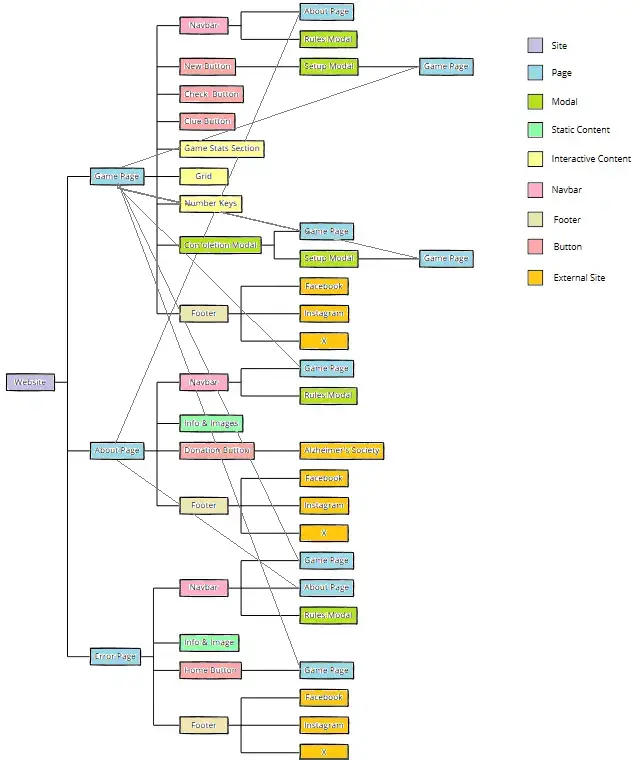  
*A visual breakdown of Codoku’s site structure, including interactive components, pages, buttons, and external destinations.*

The diagram below visualizes Codoku’s IA, showing how the site’s core page (Game) branches into modals, buttons, and links, with secondary and fallback pages connected via navbar and footer elements.

#### **Core Pages & Components**

| Page / Section  | Purpose |
|-----------------|---------|
| 🎮 **Game Page**   | Central UI for puzzle solving. Contains the grid, input buttons, completion modal, and stats section. |
| 👋 **About Page**  | Provides project background, accessibility focus, and donation call-to-action. |
| ⚠️ **Error Page**  | Catches invalid URLs and redirects users to safe navigation points. |

#### **Navigation & Linking**

| Type               | Implementation |
|--------------------|----------------|
| 🔼 **Primary Nav (Navbar)** | Links to Home, Rules (Modal), and About. Always visible and fixed. |
| 🔽 **Secondary Nav (Footer)** | Includes social links: Facebook, Instagram, and X (Twitter). |
| 🔗 **External Linking** | Donation Button opens a trusted charity in a new tab. Footer links direct to social platforms. |

#### **Interactive Elements**

| Modal / Element      | Description |
|----------------------|-------------|
| ⚙️ **Setup Modal**      | Launch modal where users choose difficulty and timer. |
| 📃 **Rules Modal**      | Offers gameplay instructions at any time. |
| 🏆 **Completion Modal** | Triggered upon successful puzzle completion. Displays stats and replay options. |
| 🎛️ **Buttons**          | Include New, Check, Clue, Donate, and Home. These are styled consistently and offer instant feedback. |
| 🔢 **Grid & Number Keys** | Accept interactive input via keyboard, mouse, or touchscreen. |

#### **Static Elements**

| **Element Type** | **Examples**                                                                 | **Purpose**                                                                 |
|------------------|------------------------------------------------------------------------------|------------------------------------------------------------------------------|
| 📝 **Text**       | - Game instructions (Rules Modal) - About content - Completion messages - Error explanation | Provides clarity, context, and guidance across key parts of the experience. |
| 🖼️ **Images**     | - 404 page cartoon - About page imagery - Iconography (e.g., donation, social media) | Enhances visual engagement, improves comprehension, and supports UX tone.   |

The IA design followed UX best practices:
- **Hierarchy & Organization** – Pages are structured with the Game Page at the top, while modals, informational content, and fallback routes flow outward in logical layers.
- **Logical Flow** – The architecture mirrors the user journey: setup → game → completion → external exploration.
- **Accessibility** – Key features like Rules, Setup, and Game Stats are accessible in one click from or less from the navbar or modals.
- **Consistency** – The same footer and navbar structure appear across Game, About, and Error pages.
- **Scalability** – The modular structure allows for future enhancements like new modals, features, or external integrations without disrupting the experience.

## **2.4 Skeleton**

The Skeleton Plane for **Codoku** translates the conceptual structure of the site into a tangible, interactive layout that users can navigate with ease. While the Structure Plane established how key components such as gameplay, guidance, and content were organized, the Skeleton Plane focused on refining the placement, flow, and usability of those elements within the browser viewport.

At this stage, interface interactions were visually defined, ensuring that the user journey from puzzle setup to completion felt seamless, intuitive, and consistent across all devices.

This addressed three main areas of user experience:

1. **Interface Design**: Focuses on arranging buttons, controls, images, and other interactive components to make navigation simple and intuitive for users.
2. **Information Design**: Structures content in a clear, accessible, and well-organized format to support readability and logical flow.
3. **Responsiveness**: Ensures layouts and interactive features automatically adjust to different screen sizes (desktop, tablet, or mobile) for a smooth and consistent user experience.

### **2.4.1 Navigation Design**

A clear and consistent navigation system was essential in Codoku to support both ease of use and player engagement. While the Structure Plane defined the relationships between pages and content areas, the Skeleton Plane transformed that framework into an interactive visual system guiding users across gameplay and support areas.

#### **2.4.1.a Navbar**

The **main navbar** remained visible at the top of every page.

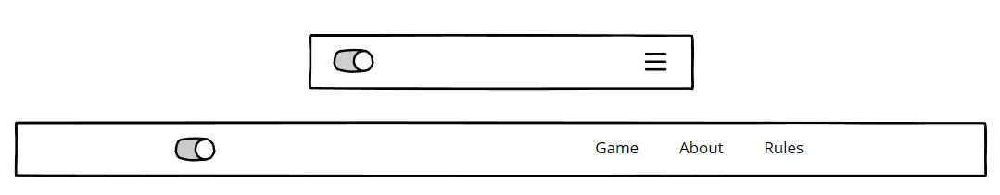
*Wireframe mockup of the Codoku navigation bar showing both the mobile (collapsed menu) and desktop (expanded links) states.*

🎨 **Theme Toggle** - Switch between light and dark mode 
🏠 **Game (Home)** – The central hub of user interaction  
📃 **Rules** – A modal with gameplay instructions  
👋 **About** – A page with background, project rationale, and donation link  

This ensured users could always find help, return to the game, or explore the site’s mission. Anchor links change color on hover and underline on active page. 

#### **2.4.1.b Footer Navigation**

The **footer** also appeared consistently across all pages.

*Wireframe mockup of the Codoku footer showing both mobile and desktop layouts.*

🔗 **Social Media Links**: Facebook, Instagram, and X (Twitter) icons that enlarge on hover
©️ **Copyright Message**: The footer remained compact and uncluttered to preserve focus on the game interface.

#### **2.4.1.c Navigation Buttons**

Interactive buttons acted as immediate access points to key actions and locations.

*Wireframe of Codoku’s navigation buttons — New, Donate, and Home.*

➕ **New Button**: Resets the grid and launches the Setup Modal  
🏠 **Home Button**: Visible on the Error page to guide users back to the Game page  
💸 **Donate Button**: Located on the About page and links externally to a cognitive health charity in a new tab  

All buttons included consistent styling that contrast the background colors and include hover feedback to reinforce interactivity. 

#### **2.4.1.d Modals**

Modals allowed users to complete important tasks without navigating away from the core game screen.

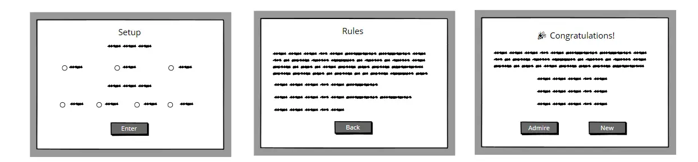
*Wireframe mockups of Codoku's modal interfaces. From left to right: Setup Modal , Rules Modal, and Completion Modal.*

⚙️ **Setup Modal**: Appears when starting a new puzzle using 'New' button. 'Enter' proceeds to game page with board loaded.   
📃 **Rules Modal**: Accessible from both the navbar and Game page. 'Back' closes the modal.  
🏆 **Completion Modal**: Triggers after puzzle completion, providing options to start a new game or review the solved grid with 'Admire' and 'New' respectively.

These modals were focus-trappable, styled for contrast, and screen-reader friendly.

#### **2.4.1.e Alerts**

Feedback mechanisms played a critical role in guiding and informing users during gameplay. Codoku incorporated several alert types.

*Wireframes of Codoku’s alert pop-ups. From left to right: Navigation alert, error alert, timeout alert.*

⚠️ **Navigation Alert**: Appears when user presses 'About' in navbar while on homepage. 'OK' proceeds user to next page and 'Cancel' calls off the navigation.   
⏰ **Timeout Alert**: Appears when the timer reaches zero and displays a message with option to try again  
🔎 **Incorrect Puzzle Alert**: Notifies users when they submit a grid that is fully filled but contains errors. 'OK' returns user to puzzle.

These alerts were designed to provide non-intrusive, multi-sensory feedback that enhanced usability without overwhelming the user.

The navigation design followed UX best practices, focusing on:

- **Clarity & Simplicity**: Only essential items were placed in the navbar to reduce cognitive load during gameplay.  
- **Persistent Access**: Both the navigation bar and footer remained fixed across pages for easy access.  
- **Predictable Flow**: Users could navigate from the game to support content (e.g., rules or about) without disrupting progress.

### **2.4.2 Interface & Information Design**

Codoku’s interface and information design were shaped by a mobile-first approach, ensuring that the application was intuitive, accessible, and visually coherent on smaller screens before scaling up to desktops. Given that many users engage with puzzles via mobile devices, the site was optimized for vertical flow, touch-friendly inputs, and minimal distraction.

Interface Design focused on how users interact with elements such as the grid, number keys, buttons, and modals. Components were spaced for easy tapping and logically placed to maintain focus on gameplay.

Information Design guided how content was structured and displayed. Readability, visual hierarchy, and grouping were used to deliver instructions, game stats, and support content in a smooth, non-intrusive format. 

#### 🎮 **2.4.2.a Game Page**

The Game Page is the central hub and default landing view for Codoku. It prioritizes functionality and minimalism. 

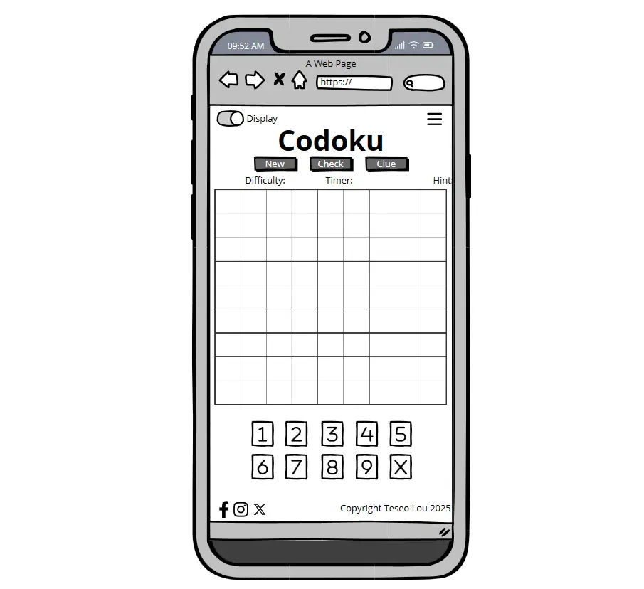  
*Game UI wireframe on mobile showing grid, controls, and footer*

- A fixed **Navbar** includes a hamburger menu and a theme toggle switch. 
- **New**, **Check**, and **Clue** buttons appear above the grid for instant access.   
- **Game Stats Panel** is below buttons so user can track how they are doing. 
- The **Game grid** is clearly defined and centrally aligned.  
- **Number keys** below the grid support touch and mouse input.  
- The **Footer** provides persistent access to social links and copyright info.

#### 👋 **2.4.2.b About Page**

This page shares Codoku’s purpose, accessibility considerations, and educational goals. The layout is scroll-friendly, guiding users through alternating blocks of text and visuals.

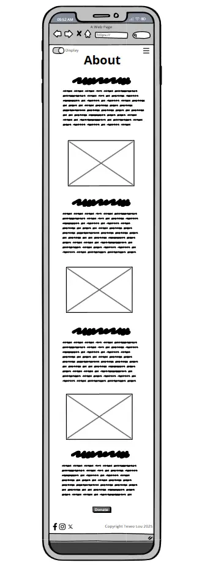  
*About Page wireframe with image/text structure and footer*

- Informational content is split into digestible chunks.  
- Supportive images enhance narrative and keep users engaged.  
- The **Donate button** is prominently placed toward the end.  
- The navbar and footer remain visible for seamless return to gameplay.

#### ⚠️ **2.4.2.c Error Page**

The Error Page provides a fallback for broken or invalid links, guiding users back to the game without confusion:

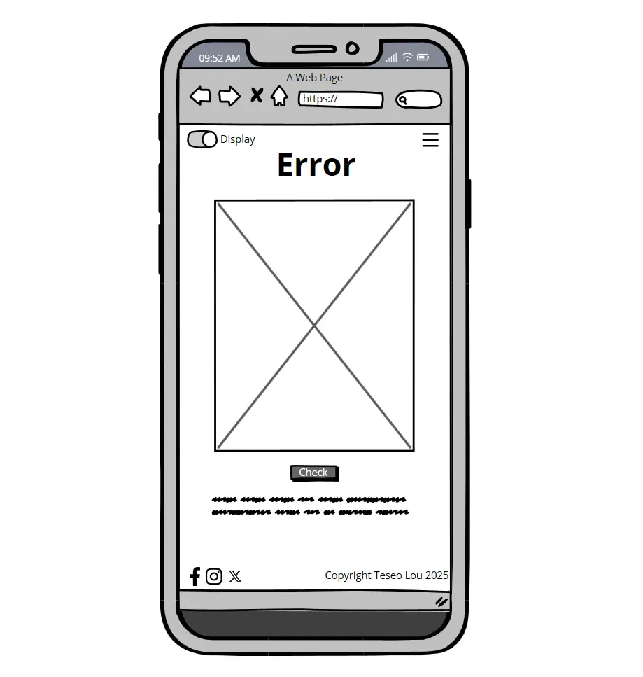  
*Error page wireframe with navigation and Home button*

- A short, humorous message reassures the user.  
- A **Home button** enables immediate return to the Game Page.  
- Footer and navbar remain consistent to reinforce user control.

## 2.4.5. Responsiveness

Responsive design is essential to Codoku’s usability and success. As a logic-based puzzle app, Codoku prioritizes interaction and accessibility across all devices—especially smartphones and tablets, where users often play on the go. A mobile-first approach ensures smooth gameplay, adaptable layouts, and a consistent interface regardless of screen size.

Responsive Design Principles Applied in Codoku:
- **Mobile-First Development:** Layouts are designed first for small screens to ensure accessibility on mobile. Touch-friendly interactions are prioritized from the start.
- **Flexible Layouts:** CSS Grid and Flexbox allow UI components like the grid, number keys, and buttons to rearrange themselves based on screen size.
- **Media Queries:** Responsive breakpoints allow seamless transitions between mobile, tablet, and desktop views while preserving structure.
- **Optimized Navigation:** A collapsible hamburger menu is used on smaller screens, and fixed nav/footer bars help with orientation.
- **Accessibility:** All buttons are comfortably spaced, font sizes scale with viewport changes, and icons remain easily tappable across devices.

Codoku takes advantage of Bootstrap 5 to manage layout responsiveness. The framework's default breakpoints help scale content across viewports:

| Breakpoint | Label     | Range              | Example Device        |
|------------|-----------|--------------------|------------------------|
| `xs`       | Extra Small | `<576px`          | Small phones           |
| `sm`       | Small      | `≥576px`           | Larger phones          |
| `md`       | Medium     | `≥768px`           | Tablets                |
| `lg`       | Large      | `≥992px`           | Laptops                |
| `xl`       | Extra Large| `≥1200px`          | Desktops               |
| `xxl`      | XXL        | `≥1400px`          | Large desktops         |

Codoku’s design targets the `sm` breakpoints first, gradually enhancing layout and content presentation for `md`, `lg`, and `xl` screens.

#### **2.4.5.a. Game Page Responsiveness**

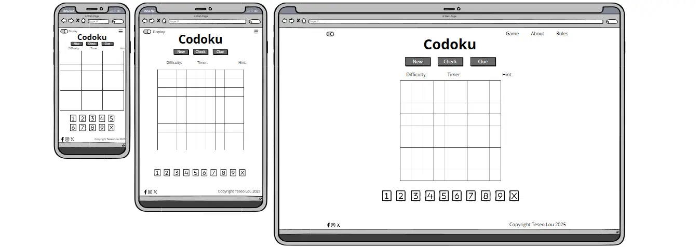  
*Responsive wireframes of the Codoku game page across mobile, tablet, and desktop.*

- **Mobile View:** Game elements are stacked vertically with clear separation between controls, game stats, grid and number keys. Number keys span to rows to ensure they are not small.
- **Tablet View:** Slightly expanded layout with more space between buttons, larger grid cells and number keys span one row only. Larger text and more generous spacing for buttons and paragraphs improved clarity and reduced user frustration.
- **Desktop View:** Central alignment with broader margins, allowing room for future enhancements (e.g., a scoreboard or puzzle history). Larger text and more generous spacing for buttons and paragraphs improved clarity and reduced user frustration.

#### **2.4.5.b. About Page Responsiveness**

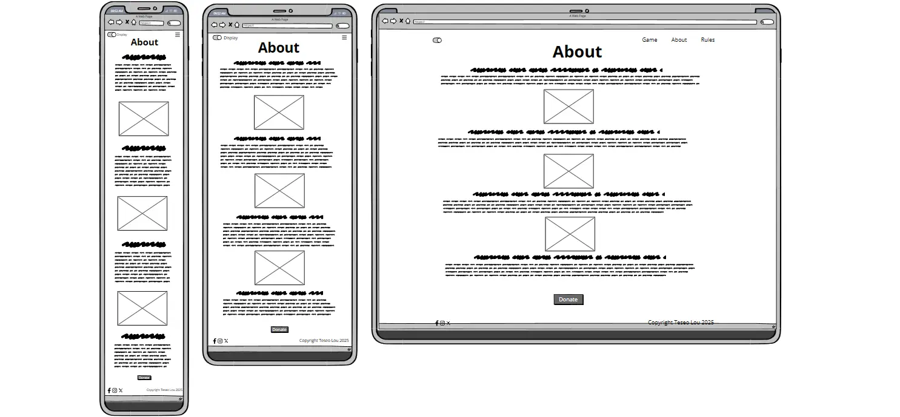  
*Wireframes showing content scalability and layout shift across devices.*

- **Mobile:** Text and images stack in a scrollable column with ample white space.
- **Tablet & Desktop:** Larger text and more generous spacing for buttons and paragraphs improved clarity and reduced user frustration.

#### **2.4.5.c. 404 Page Responsiveness**

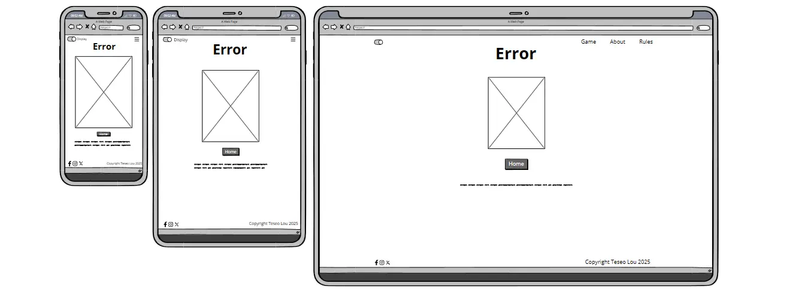  
*Responsive error page with fallback navigation.*

- **All Screens:** The page maintains consistent branding and includes a "Home" button and helpful visual cue.
- **Mobile:** Content is centered and compact, reducing bounce rates from accidental page errors.
- **Tablet & Desktop:** Larger and more generous spacing for buttons and texted improved clarity and reduced user frustration.

The Codoku site follows current responsive design best practices, ensuring that all interactions—from tapping a clue button to navigating the rules—are fluid, intuitive, and accessible.

## **2.5 Surface**

The **Surface Plane** represents the final layer of Codoku’s UX process—where layout, functionality, and interaction meet a cohesive and refined visual design. While previous stages focused on how the application worked and guided users through content and interactions, the surface focuses on how everything *looks* and *feels*.

For **Codoku**, the surface wasn’t simply about styling—it was about creating an accessible, calming, and logic-focused environment that supports player focus and cognitive engagement. Since Sudoku is an activity grounded in mental clarity, Codoku’s interface was designed to be free from distraction while reinforcing thoughtful play.

Rather than adopting complex patterns or overly decorative elements, Codoku’s aesthetic was intentionally minimal, intuitive, and built around:

- Neutral Color Palette  
- Functional Typography  
- Grid-Driven Layout  
- Familiarity & Ergonomics 

Principles That Guided the Surface Design

| Principle            | Application in Codoku                                   |
|----------------------|----------------------------------------------------------|
| **Visual Hierarchy** | Clear typography and spacing prioritize gameplay actions (e.g., New, Check, Clue buttons). |
| **Consistency**      | Repeated layout rules and component styling across modals, buttons, and navigation. |
| **Accessibility**    | High contrast text, large interactive elements, and keyboard/touch compatibility. |
| **Minimal Distraction** | Simple backgrounds and generous white space allow users to focus solely on solving the puzzle. |
| **Subtle Feedback**  | Light hover animations, sound cues, and modals guide without overwhelming. |

Codoku’s surface design complements its purpose: 
- foster logical thinking
- encourage user flow
- create an environment that feels both intelligent and approachable

Every interface decision was filtered through a lens of simplicity and user empathy so that nothing distracts from what really matters... the puzzle.

### 2.5.1 **Branding and Aesthetic**

Codoku’s surface design draws inspiration from the clean, logic-focused visuals seen in traditional puzzle spreads—such as those found in newspapers and printed puzzle books.

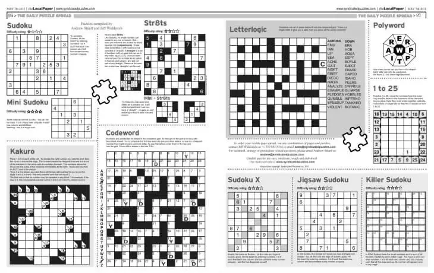  
*Reference image showing traditional print puzzles like Sudoku, Codeword, and Kakuro.*

Where many puzzle apps adopt vibrant colors and gamified styles, Codoku takes a calmer, print-inspired approach. The aim is to provide a focused and thoughtful experience that evokes the feeling of solving puzzles in a newspaper or logic book.

**🔘 Minimalism**  
  Inspired by black-and-white puzzle spreads, Codoku uses a clean layout with minimal distractions to support extended concentration.

**🧩 Puzzle-First Layout**  
  The Sudoku grid remains the visual and functional centerpiece. Buttons, stats, and UI elements are designed to support—not compete with—it.

**🎨 Monochrome-Inspired Theme**  
  The light and dark modes avoid oversaturation, echoing grayscale design patterns found in print logic puzzles.

**🗞️ Print-to-Digital Aesthetic**  
  Codoku brings the tactile familiarity of paper puzzles into the digital age, with responsive layouts and screen-friendly enhancements.

The result is an interface that feels focused, timeless, and cognitively engaging. Codoku’s visual identity is simple yet meaningful—designed for thinkers, logic lovers, and lifelong puzzlers across all devices.

>_Inspired by the pages we’ve been puzzling, poring and pencilling over for decades. Codoku puts the print tradition in your pocket._

