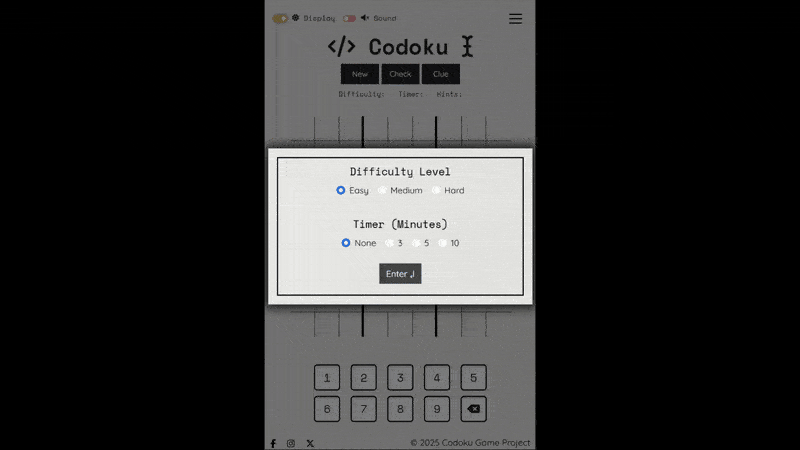
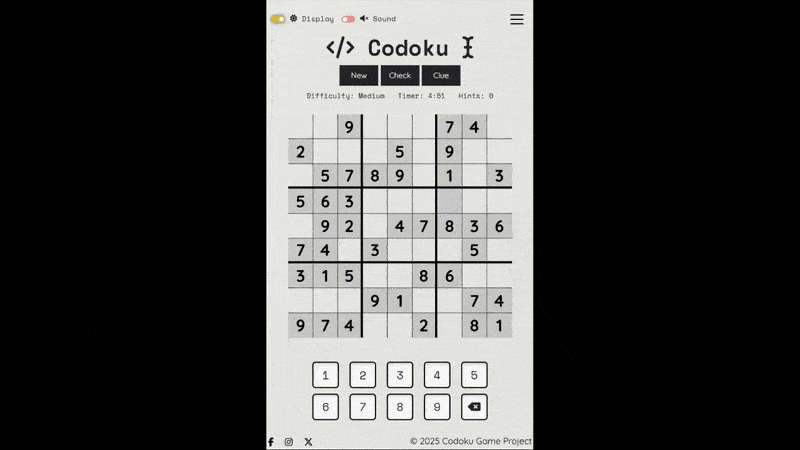

# **Codoku | Built with Logic**

_Project Milestone 2_


# **Contents**

# 1. **Site Overview**

**Codoku** is a responsive, interactive Sudoku game application built to offer a dynamic and user-centric experience. Developed as part of Project Milestone 2 for the Code Institute's Full Stack Software Development programme, the project encourages logical thinking through engaging gameplay, where each move is driven by the user and validated through real-time interactivity.

Branded with the tagline _“Built with Logic”_, **Codoku** provides users with the ability to select their preferred difficulty level, complete a timed puzzle, receive instant feedback on incorrect entries, and track progress toward solving the grid. The project serves as a practical demonstration of modern front-end development skills, showcasing interactive `JavaScript` functionality, structured layout through `HTML` and `CSS`, and a strong focus on accessibility and user experience design.

👉 Visit the deployed site on `GitHub` Pages [**here**](https://teseolou.github.io/codoku/index.html).

👉 You can access the full **Codoku** Project Board [**here**](https://github.com/users/TeseoLou/projects/4).

## 1.1. **Project Criteria**

This project has been built to meet the following core assessment requirements:

✔️ Develop a dynamic front-end web application using custom `HTML`, `CSS`, and `JavaScript`.  
✔️ Implement interactivity that allows users to initiate actions (e.g., entering numbers, selecting difficulty) and receive clear, immediate feedback.  
✔️ Follow UX design principles and accessibility guidelines, ensuring intuitive navigation and a clear, structured layout.  
✔️ Create a fully responsive interface compatible across mobile, tablet, and desktop devices.  
✔️ Apply version control through `Git` and `GitHub`, documenting progress via consistent and meaningful commits.  
✔️ Provide comprehensive documentation in a `README.md` file, covering project rationale, UX strategy, features, testing processes, and deployment steps.  
✔️ Deploy the final site using a cloud-based platform (GitHub Pages), ensuring clean code, working links, and no errors.  
✔️ Clearly attribute any external resources or third-party code in both the codebase and `README.md`.

## 1.2. **Web Developer Showcase**

As a developer in training, **Codoku** is a platform through which I have demonstrated the following skills:

⭐ Writing clean, semantic `HTML` and modular `CSS`, including use of `CSS` variables, media queries, and reusable styling classes.  
⭐ Building interactive functionality with `JavaScript`, including puzzle logic, input validation, feedback handling, and a working timer.  
⭐ Integrating a third-party API to dynamically generate Sudoku puzzles based on selected difficulty, handling asynchronous requests and data rendering.  
⭐ Enhancing development efficiency and user experience using `jQuery` for streamlined DOM manipulation and responsive UI behavior.  
⭐ Implementing an accessible, responsive layout using custom `CSS` and `Bootstrap 5` grid components.  
⭐ Applying UX and accessibility best practices, such as visual hierarchy, color contrast, keyboard navigation, and clear user feedback.  
⭐ Structuring `JavaScript` code with well-defined functions and control logic to manage game states and user interaction.  
⭐ Maintaining a clear, scalable project file structure, separating concerns between `HTML`, `CSS`, and `JavaScript` assets.  
⭐ Using `Git` and `GitHub` for full project life cycle management, with detailed and descriptive commit messages for traceability.  
⭐ Conducting manual and automated testing, using validators, Lighthouse, and device emulation to ensure performance, accessibility, and error-free code.

## **1.3. Key Goals**

The **Codoku** project focuses on achieving the following:

⚽ Deliver a clean and engaging logic-based puzzle experience for users at varying skill levels.  
⚽ Empower users with interactive control, allowing them to input, erase, and validate moves based on real-time feedback.  
⚽ Provide intuitive visual responses, from input error indicators to successful puzzle completion alerts.  
⚽ Ensure broad accessibility, offering responsive design, high contrast UI, and keyboard-friendly features.  
⚽ Demonstrate front-end development proficiency, particularly in implementing dynamic logic through `JavaScript` and integrating API data.  
⚽ Document the full development journey, from initial planning through to testing and deployment, showcasing a clear and structured workflow in this README.  

# 2. **User Experience**

User experience (UX) design is at the heart of **Codoku**, aiming to create a clean, intuitive, and satisfying interaction between the user and the puzzle-solving interface. For this project, UX involved crafting a layout and flow that makes playing Sudoku feel seamless, whether on desktop, tablet, or mobile.

Prioritizing user experience was essential to ensuring that users could quickly understand how to begin, navigate the grid, receive feedback, and progress through a puzzle without frustration. **Codoku** focuses on creating a minimal but thoughtful design that supports concentration and rewards logic-driven decision making.

## **2.1. Strategy**

The Strategy Plane in UX design laid the foundation for **Codoku**, aligning user needs with creator intent and guiding all subsequent decisions throughout the design and development process. Addressing the core strategic questions early ensured a thoughtful, purpose-driven approach to the project from the start.

Key questions that framed the project vision:

❓ What are the creator’s goals for this website, beyond functionality and technical proficiency?  
❓ Who are the users of this game, and what are they looking for?  
❓ How can the project goals be met while delivering value to users?

These were pivotal in establishing the project's purpose and influenced every stage of its development. From user stories to interface choices, they served as the crux of UX, ensuring all features and design elements were not only practical but meaningful and aligned to real-world usage.

### **2.1.1. Initial Vision**

At the beginning of the project, I knew I wanted to create something that was both engaging and mentally stimulating. Something that exercised the brain and encouraged users to think logically and solve problems. I was drawn to the idea of building a project that wasn’t just functional or visually pleasing, but also offered intrinsic value by challenging users in a way that felt rewarding.

Whether through education, pattern recognition, or critical thinking, I wanted the experience to feel "brain-building", giving users the opportunity to immerse themselves in something that could sharpen their minds while also offering enjoyment.

Accessibility was also a key motivator from the start. Having had loved ones who lived with dementia, the idea of creating something mentally stimulating, something I know they enjoyed, held a personal significance. Cognitive activities like puzzles have long been associated with supporting mental agility and slowing cognitive decline, important for individuals with dementia. Being able to build a simple, enjoyable game that might engage users in this way felt like a meaningful contribution, even if small.

I wanted to ensure the final product was easy to use across devices and welcoming to a wide range of users, regardless of their experience level with puzzles or technology. The principles of a single-player game, like Sudoku, felt like the perfect fit. A quiet, self-contained challenge that could be played anytime, anywhere, without pressure or distraction.

In short, my goal was to create something familiar. A simple, satisfying game with purpose, built with both care and logic at its core.

### **2.1.2. Creator Targets**

Following the initial vision, several specific goals were established to shape how **Codoku** would serve its users and stand out as a thoughtfully developed interactive application.

 🎯 **Maintain a classic, uncluttered aesthetic**  
  Sudoku is a timeless puzzle, and part of its appeal lies in its simplicity. **Codoku** embraces that tradition by presenting a clean, focused interface that reflects the classic Sudoku grid style users are already familiar with. This minimalist design avoids unnecessary complexity and distractions.  
  Call to Action: _“Sit back, clear your mind, and enjoy a focused puzzle experience, no clutter, just clarity.”_

 🎯 **Ensure accessibility**  
  Recognising the diversity in players’ experience levels, **Codoku** offers multiple difficulty settings and straightforward controls. Font sizes, color contrast, spacing, and button placement have all been considered to create an experience that is easy to use across different devices and abilities.  
  Call to Action: _“Choose the level that fits your pace, **Codoku** adapts to your comfort, not the other way around.”_

 🎯 **Provide unlimited engagement**  
  With a puzzle-generating API integrated into the application, **Codoku** delivers a fresh, unique puzzle every time a user plays. This supports long-term engagement and ensures the game never feels repetitive.  
  Call to Action: _“Refresh and replay, no two games are ever the same.”_

 🎯 **Encourage return visits**  
  By combining unlimited puzzles, a clean and calming layout, and user-friendly features, the game is designed to be something users enjoy coming back to — whether as a daily brain challenge or a relaxing break.  
  Call to Action: _“Come back anytime, **Codoku** is your go-to space for daily logic and calm.”_

 🎯 **Attract new users**  
  A polished interface, responsive layout, and intuitive game mechanics help position **Codoku** as a welcoming space for new users — whether they’re casual players, puzzle lovers, or visitors exploring logic games.  
  Call to Action: _“Discover the joy of problem solving in a space made for everyone.”_

 🎯 **Establish a distinct identity**  
  While maintaining familiar Sudoku mechanics, **Codoku** sets itself apart through its branding, visual tone, and modern minimalist approach. The goal was to create a game that not only functions well but feels like a refined and standalone product.  
  Call to Action: _“Enjoy the charm of the daily puzzle page, without the ink stains or wasted paper.”_

These creator goals acted as a guiding framework throughout development, influencing both small interface details and overarching design decisions. Ultimately, the aim was to build something simple, smart, and satisfying. A game that users would remember, enjoy, and return to.

Each of these goals reflects the considerations of the user perspective, helping to ensure that the final product is not just a technical success, but an experience that feels relevant, usable, and genuinely enjoyable for the people who interact with it.

### **2.1.3. Puzzler Demographics**

The development of **Codoku** was shaped by a deeper understanding of puzzler demographics, user habits, and the cognitive benefits associated with puzzle-solving. This insight helped identify core audience segments and informed how features like accessibility, difficulty scaling, and interface design were approached.

Each audience group aligns with specific user goals (from mental engagement to learning, relaxation, or habit-forming gameplay) ensuring Codoku is both relevant and rewarding to a broad spectrum of users.

**Children (in Education)**  
Young learners engaging with puzzles to develop important cognitive skills, including mathematics, pattern recognition, and memory. Sudoku is especially suitable for children aged 8 and up, as it promotes logical thinking and concentration—key for academic and cognitive development. While specific statistics on Sudoku usage within schools are limited, the puzzles are widely recognized for their educational benefits. Research, including findings from the University of Cambridge, supports the use of puzzles like Sudoku in classrooms to enhance focus, logic, and brain development, making it a valuable educational tool for kids.

**Young Adults (Digital First)**  
Curious, mobile-savvy users who enjoy quick access to games that stimulate their minds. Puzzle-solving remains popular with younger demographics, with 34% of 18–24-year-olds reported engaging with tactile logic games like the Rubik’s Cube. While many still enjoy physical puzzles, this group increasingly prefers sleek, digital formats. **Codoku** caters to them by offering a responsive, accessible interface that captures the feel of classic Sudoku without the clutter or paper waste.

**Adults (Habitual Puzzlers & Cognitive Health Seekers)**  
Everyday adult users who enjoy puzzles as part of their routine — including the 84% of UK adults who describe themselves as puzzlers. This group tackles Sudoku regularly for enjoyment, stress relief, or as a light mental workout. Additionally, it includes adults seeking activities that promote long-term brain health, such as those with a personal or family connection to dementia. Research shows that puzzle-solving can help maintain mental agility and slow cognitive decline, making it a meaningful demographic for **Codoku’s** quiet, stimulating gameplay.

**Older Adults (Technology Newcomers)**  
According to research published in the *International Journal of Geriatric Psychiatry*, the more people over 50 engage in games such as Sudoku and crosswords, the better their brains function. This group includes older adults who may not be as comfortable with technology but still enjoy puzzles for mental stimulation. They value simple, easy-to-navigate interfaces and puzzles that help maintain cognitive function. **Codoku** is designed to be intuitive and accessible, offering clear controls and minimal distractions — making it a suitable choice for those who prefer an uncomplicated digital experience.

**Estimated Demographic Breakdown for Codoku Users**

| Demographic Segment | Estimated Share of Target Audience | Rationale Highlights                                                          |
| ------------------- | ---------------------------------- | ------------------------------------------------------------------------------------------- |
| 🔵 **Children**     | **10%**                            | Niche educational users; access typically guided by parents/teachers.                       |
| 🟢 **Young Adults** | **25%**                            | High mobile usage and strong engagement with casual logic games.                            |
| 🟡 **Adults**       | **35%**                            | Largest core group; puzzling as a routine hobby or for cognitive wellness.                  |
| 🔴 **Older Adults** | **20%**                            | Increasing digital literacy and strong interest in cognitive stimulation for mental health. |

**Children** a smaller direct market due to limited device access and dependence on adults or school settings for puzzle games. However, they represent a meaningful niche in education.

**Young Adults** tend to seek quick, minimal-stress cognitive engagement (often on mobile) and are likely to appreciate Codoku’s clean, responsive design.

**Adults** represent the core base, many engage with puzzles as part of routine, stress relief, or brain health. They tend to be consistent and long-term users.

**Older Adults** are increasingly turning to digital puzzles, especially due to growing awareness of dementia prevention. Codoku’s accessible, simple interface can meet their needs.


_Pie chart illustrating the estimated distribution of **Codoku’s** target demographics:  
🔵 Children (10%), 🟢 Young Adults (25%), 🟡 Adults (35%), 🔴 Older Adults (20%)._

### **2.1.4. Target Audiences**

The broad demographic spread of Codoku’s users highlights the need to thoughtfully accommodate diverse user types as well as age groups. While demographic analysis reveals trends in age, cognitive goals, and device preferences, effective user experience design must go further — considering not just *who* the users are, but *how* they interact with the product and *why* they return.

Codoku was designed with the following key audience groups in mind:

👋 **New Users**  
Newcomers to Sudoku or puzzle games require a clear, intuitive onboarding experience. Whether they are children encountering logic puzzles in an educational context or older adults using digital puzzles for the first time, **Codoku** must communicate rules, controls, and game flow effortlessly. This includes:
- Simple, welcoming UI and layout
- Clear feedback on input (correct/incorrect)
- Minimal distractions
- Device-agnostic accessibility

🔁 **Repeat Users**  
Many users return to puzzles regularly for stress relief, mental stimulation, or routine. For this group, **Codoku** emphasizes:
- Puzzle variety via dynamic generation (no two games the same)
- A soothing visual experience for repeated use
- Difficulty selection to match changing moods or goals
- Instant, frictionless replayability

🏫 **Educational Organisations**
For schools, teachers, or parents using **Codoku** as a learning tool, clarity and focus are essential. **Codoku** supports these users by:
- Promoting concentration and logical reasoning
- Minimizing unnecessary UI complexity
- Offering challenge scaling suitable for a range of learning levels
- Functioning seamlessly across desktops and tablets

👤 **Individual Casual Users**
This includes mobile-savvy young adults and hobbyist puzzlers who seek brief but satisfying experiences. **Codoku’s** modern, responsive interface supports:
- Quick game sessions on-the-go
- Accessible play without account creation
- Immediate, rewarding interactions
- A clean, ad-free experience focused on mental play

💡 **Tech-Savvy Users**  
Users already familiar with digital games — especially puzzle enthusiasts — expect responsive design, clean performance, and subtle polish. **Codoku** appeals to this group through:
- Mobile responsiveness and touch optimization
- Fast load times
- Fluid input handling and keyboard shortcuts (where applicable)
- Structured, elegant game flow

🤝 **Tech Newbies**  
Older users or digital newcomers may be less confident with device interfaces. For them, **Codoku** intentionally avoids overwhelm by:
- Using familiar visual metaphors (like a paper Sudoku grid)
- Enlarged touch targets
- Clear game progression with no unnecessary features
- Accessible color contrast and readability

Each of these audiences spans across the previously identified age demographics, reinforcing the importance of inclusive design that scales by ability, comfort, and purpose — not just age alone.

This understanding directly informed the development of user stories, which capture and prioritize the needs, behaviors, and goals of these distinct audience groups. The next section explores how **Codoku**'s user stories shaped design and functionality decisions to serve these varied user types.

### **2.1.5. User Stories**

For this project, user stories were developed to capture the diverse needs of **Codoku’s** target audience, ensuring the application delivers a responsive, rewarding, and user-centric puzzle experience. The creation of user stories helped define what different user groups—such as new users, returning players, educational institutions, and older tech newcomers—expected from the platform. These stories bridged the gap between user needs and the technical development process, ensuring that every feature contributed to a smooth user experience and served as a roadmap for development and design decisions.

To ensure effective and timely delivery, the user stories were divided into three priority categories. These categories reflect essential, important, and desirable features respectively:

🟥 **Must-Have** stories represent the core features **Codoku** cannot function without. These include elements like puzzle interactivity, user input, feedback systems, and accessibility design.  
🟨 **Should-Have** stories focus on improving the experience for specific audiences, such as offering difficulty levels or enhancing usability across devices.  
🟩 **Could-Have** stories introduce advanced or bonus functionality that, while not essential, would significantly enhance the experience if time and resources allow.

This prioritization ensures that the application’s most critical features are completed first, while also allowing for thoughtful expansion based on user needs.

🟥 **Must-Have User Stories**

_As a **multi-device owner**, I want the website to display correctly and function smoothly across mobile, tablet, and desktop, so that I can enjoy a consistent experience no matter how I access it._

_As a **mobile user**, I want the game to work smoothly on smaller screens so that I can play on-the-go._

_As a **touchscreen user**, I want large, easy-to-tap buttons so that the interface feels natural on touch devices._

_As an **accessibility-focused user**, I want keyboard and mouse input so that I can play without relying on a mouse or touchscreen._

_As a **computer newbie**, I want to be shown a custom 404 error page with clear navigation back to the homepage, so that I don’t get lost or frustrated._

_As a **new user**, I want clear instructions on how to play Sudoku so that I can start the game without confusion._

_As a **casual user**, I want to select a difficulty level so that the puzzle matches my ability and keeps me engaged._

_As a **puzzle player**, I want to be able to input numbers into the grid so that I can solve the puzzle interactively._

_As a **sudoku rookie**, I want the option to get responsive visual feedback on correct or incorrect moves so that I can learn from mistakes in real time._

_As a **repeating user**, I want a new puzzle to be generated each time I play so that I don’t get bored with repetition._

_As a **tech newcomer**, I want the controls to be intuitive and minimal so that I’m not overwhelmed._

_As an **older user**, I want a clean layout with large fonts and strong contrast so that I can comfortably see and interact with the puzzle._

_As a **visually impaired user**, I want a dark mode theme to make the interface easier on my eyes._

🟨 **Should-Have**

_As a **gamer**, I want a popup message to appear when I finish the puzzle, letting me know whether it was solved correctly, so that I get a clear and satisfying sense of completion._

_As a **student**, I want puzzles to help me build logic and pattern recognition skills so that I can improve cognitive ability over time._

 _As a **returning player**, I want a timer feature so that I can track how quickly I complete puzzles._

_As a **curious new user**, I want to view an About section that explains the purpose and inspiration behind **Codoku**, so that I can understand the intent and values behind the game._

_As a **sensory-oriented user**, I want optional sound effects for actions like correct entries or puzzle completion, so that I receive auditory feedback that enhances engagement._

_As a **returning user**, I want to find social media links in the footer so that I can follow **Codoku** updates, share the game with others, and stay connected with new features or challenges._

🟩 **Could-Have**

_As a **competitive user**, I want to save my best times so that I can track personal progress._

_As an **educational facilitator**, I want printable puzzle sheets so that I can use **Codoku** in classrooms with limited digital access._

_As a **user who prefers auditory learning**, I want audio instructions so that I can engage through sound rather than reading._

By creating and prioritizing these user stories, the **Codoku** project ensures a structured, inclusive, and scalable development process. The application addresses the core needs of all user types while leaving space for innovation and enhancement. Each story links directly back to the user personas and demographics explored in earlier sections, reinforcing the project’s commitment to delivering thoughtful, user-centered design.


*Bar chart illustrating the number of **Codoku** user stories by category: 13 Must-Have, 6 Should-Have, and 3 Could-Have.*

### **2.1.6. Emerging Components**

Informed by the initial vision, creator goals, user demographics, and audience needs, several critical components began to emerge early in the design process as essential to Codoku’s success. These components reflect a balance of functionality, accessibility, and user enjoyment, and were developed not only to support gameplay mechanics, but also to reinforce the project’s broader UX goals and inclusive design ethos.

Each element stems from a combination of logical necessity and user-centered design thinking, ensuring **Codoku** remains simple to use, yet rich in value.

🧠 **Core Gameplay Logic**  
At the heart of the application is the interactive Sudoku grid. This had to:
- Support number input and validation
- Respond to user difficulty selections
- Be visually clean and scale across device types

This grid was the anchor of every design decision, requiring structure that felt familiar yet modern, and mechanics that were responsive and accessible.

📲 **Responsive Interface**  
Given the wide-ranging demographics and device preferences, **Codoku** needed a layout that automatically adapted to:
- Mobile, tablet, and desktop screens
- Touch interaction as well as keyboard input
- Larger fonts and high contrast for readability

Responsiveness was not a bonus—it was foundational to making the app usable by everyone from school children to older adults.

🚦 **Difficulty Selector**  
To appeal to users of all skill levels, an adjustable difficulty feature emerged early as a must-have. Whether easing beginners in or offering a challenge for seasoned puzzlers, this component:
- Instantly reconfigures the grid
- Interfaces with the puzzle-generation API
- Offers intuitive feedback without needing multiple steps or screens

⚡**Feedback System**  
Clear feedback was essential to support learning and engagement. Early planning prioritized:
- Visual indicators of errors or correct inputs
- A success modal or popup for puzzle completion
- Optional sound cues for auditory reinforcement  

This ensured every move felt meaningful and users were motivated to improve over time.

🌐 **Navigation & Page Flow**  
While **Codoku** is a single-page game experience, it still required intuitive navigation, including:
- An accessible homepage layout with logical content flow
- A persistent footer with social media links and accessibility tools
- A custom 404 page to guide users who stray from the main path

💬 **About & Purpose Section**  
Emerging from the creator’s personal motivation, the *About* section provides context and a deeper connection to users. Its purpose:
- Humanize the app experience
- Build trust with new users
- Highlight educational and cognitive benefits  

Though not central to gameplay, it reflects **Codoku’s** intention as more than just a game—it’s a purposeful tool for mental wellness.

📖 **Rules & How-To-Play Section**  
From the beginning, it was clear that **Codoku** needed to cater to a wide range of familiarity levels with Sudoku — including complete beginners. A dedicated rules component was identified early on as a key tool to:

- Educate new users about Sudoku gameplay and objectives
- Reduce barriers for first-time players across all ages
- Reinforce logical structure through clear, step-by-step guidance

This component ensures that anyone, regardless of experience or background, can confidently begin playing. It also aligns with the project’s commitment to accessibility and lifelong learning by promoting inclusive, self-directed exploration.

🎚️ **Accessibility Tools**  
From the outset, **Codoku** was designed to be accessible across a wide spectrum of abilities. Core accessibility components include:
- A toggleable dark mode for visual comfort
- Keyboard support for users without a mouse
- Large, clearly labeled buttons with adequate spacing
- Semantic `HTML` and screen-reader-friendly structure

Together, these components laid the groundwork for a focused, inclusive experience that delivers both functionality and delight. They were not imagined in isolation, but directly shaped by the needs, habits, and feedback of the users **Codoku** aims to serve—making them fundamental to the project’s success and longevity.

### **2.1.7. Feasibility / Importance**

The Importance/Feasibility analysis evaluated each of **Codoku’s** website components based on two criteria:  

- **Feasibility** measures the practicality of implementation within the project’s constraints, such as development time, resources, and technical complexity.
- **Importance** refers to how essential a feature is for delivering value to users and supporting the project’s goals of accessibility, engagement, and cognitive benefit. 

This analysis was used to guide development priorities and identify which features would deliver the most impact early on, while also ensuring that lower-effort, high-value items were not overlooked. The scatter plot below visualizes this evaluation.


*Scatter plot illustrating the feasibility and importance of Codoku's planned components.*

#### **Graph Insights**  

🔵 High Importance & High Feasibility    
Features such as the **Responsive Interface**, **Sound Cues**, **Navigation & Page Flow**, **Rules Section**, **Visual Feedback Styling**, and the **404 Error Page** fall into this quadrant. These components are highly impactful and easy to deliver — making them first-priority for the MVP. They directly support key user stories related to accessibility, learnability, and cross-device usability.

🟠 High Importance & Moderate Feasibility    
Elements like the **Core Gameplay Grid**, **Difficulty Selector**, and **API Integration** are essential to gameplay but involve more implementation complexity. These features drive Codoku’s core logic and replayability. While not trivial, they are still crucial for the success of the game and were tackled early in the development roadmap.

🟢 Moderate Importance & High Feasibility    
Items such as the **About & Purpose Section** and **Celebration Pop-Up** offer additional user engagement and narrative context with minimal implementation overhead. These were positioned as enhancements that add polish without compromising development time.

🟣 Low Importance & Low Feasibility    
Features such as **Progress Tracking Dashboards**, **Puzzle Score Saving**, **Audio/Video Instructions**, and **Puzzle PDF Exporting** were ranked lowest in priority. These additions offer niche or future-facing value but would require significantly more work to implement (e.g., local storage, printing logic, or media handling). As such, they are considered stretch goals and not part of the initial MVP.

This analysis helped keep development focused and realistic, ensuring that **Codoku** delivered its essential features (a clean, cognitive, and user-friendly puzzle experience) while reserving room for enhancement once the foundational elements were in place.

## **2.2. Scope**

In UX design, the Scope Plane defines the specific features and content that a product needs in order to meet its strategic aims. While the Strategy Plane outlined the purpose of **Codoku** and the audiences it serves, the Scope Plane clarified what the application must include to deliver on those goals.

For **Codoku**, this phase was critical in determining the game’s core functionality and content structure. It helped translate the broader vision of creating an accessible, mentally stimulating puzzle game into clear, actionable requirements. The features identified through emerging components, user stories, and demographic analysis provided a foundation for prioritizing what needed to be built.

This process ensured that development remained tightly focused on what mattered most to users, such as usability, interactivity, and cross-device support, while setting aside lower-priority features for future iterations. 

### **2.2.1. Deriving Requirements**
The feature planning and UX analysis clearly highlighted which components were essential for **Codoku** to provide value to users and meet its project goals. These insights allowed requirements to be organized into three categories based on their priority and impact: **must-have**, **should-have**, and **could-have** features.

This structured breakdown helped ensure that development stayed focused on delivering a usable, engaging, and scalable Sudoku experience — while leaving room for future improvements once the core functionality was in place.

#### 🟥 Must-Have

- Present a fully interactive Sudoku grid with input validation  
- Generate puzzles dynamically based on selected difficulty  
- Offer clear instructions for how to play the game  
- Ensure full responsiveness across devices (desktop, tablet, mobile)  
- Provide a button to allow users to request visual feedback on correct/incorrect entries  
- Provide a button to allow users to reveal one square if needed  
- Include a dark mode or accessible contrast options
- Include a basic navigation bar for quick access to game sections (e.g., Rules, About)  
- Include a dedicated game stats section for tracking puzzle-related data  
- Display a completion message when the puzzle is solved
- Support both mouse/touch and keyboard input for accessibility  
- Prevent navigation errors with a custom 404 page  

#### 🟨 Should-Have

- Include a timer to track how long a puzzle takes to complete
- Display timeout message when user has run out of time  
- Display a incorrect message when the puzzle is full but incorrect
- Show game stats in the completion message
- Add optional sound cues for game actions (input, errors, completion)  
- Display a short About section describing the purpose of the app  
- Offer social media links in the footer to allow users to share or follow updates  

#### 🟩 Could-Have

- Allow users to save best completion times for personal tracking  
- Generate printable versions of puzzles for offline or classroom use  
- Offer optional audio or video guidance for users who prefer verbal instruction  

These requirements represent a clear path from user insights to actionable development goals. By categorizing features in this way, Codoku was able to prioritize delivering a minimal viable product (MVP) that fulfilled its educational and cognitive aims while maintaining flexibility for future enhancements.

### **2.2.2. Functional Requirements**

Functional requirements define how **Codoku** operates on a technical and interactive level, outlining the behaviors, inputs, and user flows that allow the game to deliver a smooth, rewarding experience. While UX strategy defined the *why* behind **Codoku** and user stories outlined the *who* and *what*, functional requirements focus on the *how*, ensuring the game responds accurately to input, renders correctly across devices, and delivers user feedback in a clear and accessible way.

Because **Codoku** is a fully interactive, logic-driven game rather than a static content site, this section plays a more prominent role than it did in other project types ([Milestone Project 1](https://github.com/TeseoLou/clancy-nook-walking-tours)). Interactivity is not just a feature of Codoku, it's the foundation. These functional elements power the game experience, define progression and reward, and ensure the site meets the goals of accessibility, replayability, and mental stimulation.

Functional requirements were derived from user stories, accessibility considerations, and the emerging UX components. They are categorized here by their level of scope:

- **Macro Functions**: Site-wide behaviors and foundations (e.g., responsiveness, accessibility)
- **Meso Functions**: Features spanning multiple areas of the game/app (e.g., navigation, stats tracking)
- **Micro Functions**: Focused behaviors tied to specific game elements (e.g., number input, square validation)

#### 🟥 **Must-Have**


_Conceptual diagram showing how **Codoku's** must-have functional requirements are layered._


Macro:
- Responsive layout that adjusts across desktop, tablet, and mobile  
- Keyboard and mouse/touch compatibility for puzzle control  
- Toggleable dark mode or high-contrast option  
- Navigation bar for accessing key sections (e.g., Rules, About)  
- Custom 404 page for broken links or navigation errors  

Meso:
- API integration for generating unique sudoku boards on game page grid section
- Difficulty selector that dynamically adjusts puzzle logic and grid state  
- Completion feedback modal with restart option  
- Visual and/or sound-based user feedback system (optional by button press)  
- “About” and “Rules” sections that are accessible

Micro:
- Number input directly into grid cells  
- Input erase/overwrite functionality  
- Button to reveal a single square as a clue  
- Button to check the grid and highlight incorrect entries  
- Interactive timer that tracks puzzle duration  
- Game state reset functionality for replay  

#### 🟨 **Should-Have**


_Visual breakdown of **Codoku’s** Should-Have features, categorized by functional scope._  

Macro:
- Footer with links to `GitHub` and optional social media accounts

Meso:
- Game stats tracker for difficulty, time, and hint usage  
- Timer selector that dynamically adjusts the time limit for game completion 
- Pop-up display of game stats (e.g., completion time, difficulty level, number of hints used)
- Sound feedback

Micro:
- Timeout message for unfinished games after user-set time limit
- Error message display when puzzle is full but incorrect

#### 🟩 **Could-Have**


_Representation of **Codoku’s** Could-Have features, grouped by functional depth._

Meso:
- Option to print the current puzzle grid for offline play
- Save and display best puzzle completion times locally

Micro:
- Audio narration of instructions or feedback for users who benefit from auditory support
- Advanced settings panel (e.g., disable hints, manual validation only)

By organizing functional requirements by scope, **Codoku** ensured that critical interactivity was developed first while reserving room for enhancements that add polish and accessibility. This approach allowed for a structured and scalable game development process, one that balances functionality, logic, and user satisfaction.

### **2.2.3. Content Requirements**

Content requirements identify the textual, visual, and interactive assets **Codoku** needs to effectively support its functionality and fulfill user expectations. These elements bring the site to life by guiding the user through the game interface, enhancing engagement, and supporting cognitive clarity.

For **Codoku**, content plays a particularly active role — not just providing information, but directly supporting gameplay through real-time feedback, instructional clarity, and aesthetic reinforcement. Content elements were shaped by the project’s UX strategy, user stories, and emerging components, ensuring everything from visuals to text supported usability, accessibility, and gameplay enjoyment.

In an interactive game like **Codoku**, content isn’t static — it's central to the player experience. Clear instructions, intuitive feedback, accessible visuals, and an inviting aesthetic all contribute to maintaining user concentration, reducing friction, and encouraging return visits.

To support a smooth and organized development process, content was broken into the following categories:

- **Graphic Content**: Visual assets used to support brand identity, readability, and gameplay clarity.  
- **Textual Content**: Written content needed for instructions, navigation, feedback, and accessibility.  
- **Aesthetic Content**: Visual styling choices that shape the user’s impression and support usability.  
- **Interactive Content**: Dynamic or reactive components that users engage with during gameplay.


_Visual icons representing **Codoku’s** four content categories, textual, graphic, aesthetic, and interactive._

#### 🟥 **Must-Have**

Graphic:
- **Codoku** logo (for `header` and favicon)  

Textual:
- Game instructions (how to play, rules, controls)  
- Page titles and meta descriptions  
- Section headings (e.g., About, Rules, Feedback)  
- Error messages (e.g., incorrect entry, timeout)  
- Completion messages for solved puzzles  
- Accessibility labels and ARIA tags for key controls  

Aesthetic:
- Sudoku grid visual layout with clear styling  
- Distinct styling for editable vs. static cells  
- Button state visuals
- Clean, readable font hierarchy  
- High contrast color palette with dark mode support  
- Consistent styling across main game and About pages  
- Highlight styles for selected cells, invalid inputs, and system feedback

Interactive:
- Start/reset buttons  
- Difficulty selector  
- Visual feedback effects
- Check and Clue buttons 
- Timer display  
- Theme Toggle
- Navigation between Game and About pages  
- 404 error handling  
- Game completion modal with replay option  
- Fully responsive layout across all devices

#### 🟨 **Should-Have**

Graphic:
- Animated celebration (e.g., confetti) on puzzle completion  
- Images for About Section

Textual:
- About section content describing the purpose and development of **Codoku**  
- Game statistics summary (time, difficulty, hints used) in completion popup 

Aesthetic: 
- Animations for transitions and button interactions

Interactive:
- Footer with social media links  

#### 🟩 **Could-Have**

Graphic:
- Thematic illustrations or mascots for storytelling

Textual:
- Puzzle-related tips or facts for enrichment  
- Downloadable printable puzzle sheet text prompts  

Interactive:
- Audio narration or verbal game instructions  
- Adjustable color themes or font scaling for accessibility preferences  

By defining these content requirements, **Codoku** ensures a game experience that is not only functional and interactive but also clear, visually coherent, and accessible to users of all backgrounds and abilities.

### **2.2.4. Core Features**

Core Features outlined the key components integrated into the **Codoku** application to ensure it fulfilled both user needs and project objectives. These features were derived directly from the UX strategy, user stories, and scope planning, allowing for the prioritization of functionality and content into clearly scoped deliverables.

Each feature was evaluated based on its importance to gameplay, usability, and accessibility, as well as its feasibility within the project timeline. Features were categorized as **Must-Have**, **Should-Have**, or **Could-Have**, and further classified by their scope of implementation:

- **Website**: Features applied universally across all pages and user sessions  
- **Page**: Features tied to individual views or templates  
- **Section**: Features that exist within a page, like stats or rules  
- **Elemental**: Specific interactive or visual components

| Component                                             | Importance | Feasibility | Scope  | Priority |
|-------------------------------------------------------|------------|-------------|-----------|----------|
| Navigation bar (Home, About, Rules)                   | 5          | 5           | Website   | 🟥       |
| Responsive layout (mobile/tablet/desktop)             | 5          | 4           | Website   | 🟥       |
| Page titles & meta descriptions                       | 5          | 5           | Website   | 🟥       |
| Favicon (browser tab branding icon)                   | 5          | 5           | Elemental | 🟥       |
| 404 Error Page                                        | 5          | 5           | Page      | 🟥       |
| Keyboard and mouse/touch compatibility                | 5          | 4           | Website   | 🟥       |
| Dark mode / high-contrast toggle                      | 5          | 4           | Elemental | 🟥       |
| Difficulty selector (Easy / Medium / Hard)            | 5          | 3           | Elemental | 🟥       |
| Time selector (select puzzle duration)                | 5          | 3           | Elemental | 🟥       |
| Interactive Sudoku grid                               | 5          | 3           | Section   | 🟥       |
| Visual distinction between fixed and editable cells   | 5          | 4           | Section   | 🟥       |
| Input validation & number checking button             | 5          | 3           | Elemental | 🟥       |
| Clue button (single square reveal)                    | 5          | 3           | Elemental | 🟥       |
| Number buttons for mouse/touch input                  | 5          | 4           | Elemental | 🟥       |
| API integration for dynamic puzzle generation         | 5          | 2           | Website   | 🟥       |
| Footer with navigation & legal info                   | 5          | 5           | Website   | 🟥       |
| Rules section with game instructions                  | 5          | 5           | Section   | 🟥       |
| Timeout popup (user runs out of time)                 | 4          | 3           | Elemental | 🟨       |
| Incorrect puzzle completion popup                     | 4          | 3           | Elemental | 🟨       |
| Game timer                                            | 4          | 3           | Section   | 🟨       |
| Stats panel (difficulty, time, hints used)            | 4          | 3           | Section   | 🟨       |
| Scoreboard or personal record display                 | 4          | 3           | Section   | 🟨       |
| Completion popup with message and stats               | 4          | 4           | Elemental | 🟨       |
| About page                                            | 3          | 5           | Page      | 🟨       |
| About page images (branding or purpose visual support)| 3          | 5           | Graphic   | 🟨       |
| Donation button (linking to external charity site)    | 3          | 5           | Elemental | 🟨       |
| Sound feedback toggle (input, error, win sounds)      | 3          | 3           | Elemental | 🟨       |
| Social media / `GitHub` links in footer                 | 3          | 5           | Elemental | 🟨       |
| Printable puzzle feature                              | 2          | 2           | Elemental | 🟩       |
| Audio instructions or narration                       | 2          | 3           | Section   | 🟩       |
| Save best time to local storage                       | 2          | 2           | Elemental | 🟩       |


- 🟥 **Must-Have** → Essential for gameplay and accessibility  
- 🟨 **Should-Have** → Valuable enhancements, not vital for MVP  
- 🟩 **Could-Have** → Nice-to-have features for future development

These core features served as a structured development blueprint, ensuring **Codoku's** MVP delivered essential gameplay, accessibility, and visual consistency—while leaving room for feature growth in future iterations.

## **2.3. Structure**

The Structure Plane defines how **Codoku’s** content, features, and interactions are arranged to support ease of use and logical flow. It connects strategic goals with the interface’s layout, ensuring that players—regardless of age, ability, or device—can navigate and play comfortably.

As a game-based application, **Codoku** prioritizes interaction design over dense content. Key features like the grid, number inputs, validation tools, and timers are placed for intuitive access, with real-time feedback to reduce frustration and aid progression.

Navigation remains simple but purposeful. A top nav bar provides quick access to the Home, About, and Rules pages, while the footer offers consistent links to external platforms like `GitHub` and the donation page.

The layout includes:
- An interactive Sudoku grid
- Touch/mouse-friendly number buttons
- Difficulty and timer selectors
- Clue and check buttons
- Feedback messages and modals

Information is structured to minimize distractions and cognitive load, with semantic `HTML` and `ARIA` support for screen readers. Elements are grouped by function and follow consistent patterns to support user familiarity.

**Codoku’s** responsive structure adapts seamlessly across desktop, tablet, and mobile, using scalable fonts, high-contrast visuals, and keyboard-friendly controls. Altogether, this creates an inclusive, focused space that enhances logic-based engagement and replayability.

### **2.3.1 MoSCoW Prioritization**

Throughout the project, effective prioritization according to business goals, user needs, and developer capabilities was crucial. With the project scoped to deliver a complete, accessible Sudoku game interface within a limited timeframe, it became essential to continually assess what was realistic and achievable based on available time, technical complexity, and learning goals.

To support this, the **MoSCoW** prioritization framework was used to categorize tasks into **Must-Have**, **Should-Have**, **Could-Have**, and eventually, **Won’t-Have**. This final category emerged as development progressed and certain features though potentially valuable proved too complex, time-intensive, or peripheral for the scope of a front-end milestone project.

Features marked as **Won’t-Have** were not removed from consideration altogether, but rather postponed for a future iteration or stretch project once more time and experience could be dedicated to their successful implementation. Below is a summary of the features assigned to this category and the rationale for each decision:

| 🟦 Feature               | Reason for Won’t-Have Status                                                                 |
|--------------------------|---------------------------------------------------------------------------------------------|
| **Scoreboard**           | Requires data persistence and local storage logic that proved difficult to implement in time. |
| **Save Game**            | Though planned, saving and restoring puzzle state (including grid, timer, clues) required more advanced `JavaScript` than currently manageable. |
| **Print Puzzle Button**  | Would require custom print styling and puzzle state management, which was deprioritized to focus on core interactivity. |
| **Multimedia Instructions** | Recording, editing, and embedding accessible audio/video content exceeded the available development time and required tools outside the project scope. |

These decisions helped ensure that core interactive and accessible features were delivered to a high standard, while leaving the door open for future improvements and enhancements.

### **2.3.2 Site Hierarchy**

Site hierarchy refers to how **Codoku’s** content, features, and pages are logically organized and accessed by users. It shapes the user’s journey through the application, affecting clarity, efficiency, and accessibility. For a game-based web app like **Codoku**, hierarchy needed to support both discovery and flow, prioritizing gameplay while offering seamless access to supporting features like instructions and about information.

**Aims of Codoku's Site Structure**

- 🏠 Make core gameplay immediately accessible with minimal clicks  
- ⚙️ Guide users through setup before play (difficulty and timer)  
- ➕ Support learning and accessibility with modals and structured layout  

**Codoku** is structured around a single-page core gameplay interface, with supplemental navigation to an About page and modal overlays that support the user without removing them from the experience. Functional elements such as the Setup Modal, Rules Modal, and Completion Feedback act as focused UI components that enhance clarity while keeping the player in flow.

| Page / Modal          | Function                                             | Role in UX Journey           |
|-----------------------|------------------------------------------------------|------------------------------|
| **Home (Game)**    | Primary interface for Sudoku gameplay                | 🎮 Start, Play, Progress     |
| **Setup Modal**       | Appears before game begins, lets user pick difficulty & timer | ⚙️ Customization & Onboarding |
| **Rules Modal**       | On-demand gameplay instructions                      | 🧾 Learn & Assist            |
| **About Page**        | Project background and donation information          | 👋 Context & Mission         |
| **404 Error Page**    | Redirect users who hit an incorrect route            | ⚠️ Recovery & Redirection    |
| **Completion Modal**  | Feedback, stats, and new game options post-solve     | 🏆 Success & Replay          |

The structure of the Codoku site hierarchy is intentionally designed as a pyramid, placing the most essential user-facing elements at the top and progressively layering supportive or contextual features beneath.

  
*A pyramid diagram showing the importance and relationship between the main interface, modals, and support pages in **Codoku**.*

**Game**  
At the top of the hierarchy is the game itself — the Sudoku grid, number inputs, timer, and validation. It is the core experience, drawing immediate focus and requiring an uncluttered, accessible layout.

**Pre-Game Modals**  
These appear before gameplay begins.  
- **Setup** lets users choose difficulty and timer options.  
- **Rules** explains how to play.  
They enhance onboarding and accessibility while staying separate from the main grid.

**Post-Game Modal**  
Triggered after a puzzle is solved.  
- Gives success feedback and stats.  
- Offers options to start a new game or admire the board.  
It supports user motivation and replay.

**Supplementary Pages**  
Supportive but non-core. These are accessed less frequently but strengthen the experience.

- **About** shares project purpose and links to donations.  
- **Error** (404) redirects users from broken links.  

  
*A sequential flow from Setup → Game → Completion or Support Pages.*

The diagram outlines the typical user journey through **Codoku**. It follows a linear but flexible progression, guiding users from instruction to gameplay and through to completion, with supportive pathways for accessing additional context or handling errors.

1. 🧾**Rules**  
   - Users may begin by reviewing game instructions.  
   - This modal ensures new players understand how to play before continuing.

2. ⚙️ **Setup**  
   - Players configure their game preferences, such as difficulty level and timer settings.  
   - This step customizes the gameplay experience.

3. 🎮 **Game**  
   - The core phase of the app, where users interact with the Sudoku grid and input their answers.  
   - Includes buttons for checking answers and requesting clues.

4. 🏆 **Completion**  
   - Appears once a puzzle is solved.  
   - Displays success feedback, game statistics, and options to replay or start a new game.

5. 👋 **About**  
   - An optional informational page that shares the project's mission, purpose, and donation link.  
   - Helps users understand the wider goals behind **Codoku**.

6. ⚠️ **Error**  
   - Positioned outside the main flow, the error page is triggered when users navigate to an invalid or broken route.  
   - Acts as a safeguard across the entire site by redirecting users back to a valid entry point like the Home/Game page.  
   - Enhances accessibility and trust by ensuring all interactions result in a usable path forward.

This structure helps players remain focused on solving puzzles while providing fallback mechanisms and optional exploration without breaking flow or causing confusion.

### **2.3.4 Navigation**

Effective navigation was essential to **Codoku’s** user experience (UX) design, ensuring users could move confidently between gameplay and supporting content without unnecessary complexity. Because **Codoku** is a game-first web app, navigation needed to feel lightweight, accessible, and non-disruptive, guiding users through core game actions while offering easy access to help, context, and redirection when needed.

**Codoku’s** navigation follows best practices in clarity, predictability, and responsiveness:

- **Predictability**: Users know where buttons and links will take them.
- **Efficiency**: Core actions like starting a puzzle or checking the rules are one click away.
- **Guidance**: Navigation encourages a clear journey from setup to gameplay and beyond.

The navbar appears persistently across pages and includes quick access to:

📌 **Home**: Puzzle interface and game logic  
📌 **Rules**: Modal with instructions for new users  
📌 **About**: Purpose of the project and donation link  

This ensures users are never far from core functions, while modals and page transitions are used to maintain focus and flow within the single-page app experience.

While gameplay is central, **Codoku** also includes utility pages and overlays:

⚙️ **Setup Modal** — Opens at launch, allowing users to select difficulty and timer options.  
🧾 **Rules Modal** — Available on demand for help.  
🏆 **Completion Modal** — Triggered when the puzzle is solved, showing stats and restart options.  
❌ **404 Error Page** — Loads when a broken or invalid URL is visited, offering return-to-home navigation.  

These elements are not listed in the main navbar, but play key roles in usability and player flow.

External navigation is minimal, but still present:

💝 **Donation Link** – Found in the About page, linking to a trusted cognitive health charity.  
🔗 **Social Media Links** – Displayed in the site footer for sharing and project visibility (e.g., `GitHub`, LinkedIn).  

These external links open in new tabs to ensure users remain anchored in the **Codoku** experience.


_A navigation map of **Codoku** showing flow from the Game Page to supporting modals, About, and Error pages, with external links branching consistently._

The diagram illustrates **Codoku's** navigation ecosystem, capturing both user-directed flows (via navbars and buttons) and automated fallbacks (like error recovery). The structure is built around three main nodes: Game, About, and Error, with consistent access to modals and external links across all routes.

#### 🎮 **Game Page (Central Hub)**
Game is the core of the user journey and central interaction point.
- The navbar allows users to move between:
  - Pages 
  - Rules modal
- Users can also navigate to:
  - New to reset/start a new puzzle.
  - Complete (Completion Modal) when the puzzle is solved.
- The footer provides access to socials links:
  - Facebook
  - Instagram
  - Twitter

This path keeps essential puzzle actions just one step away, allowing users to stay engaged while still accessing help or restarting as needed.

#### 👋 **About Page (Supportive Content)**
The About page provides contextual information and connects users to **Codoku’s** mission.
- The navbar allows users to move between:
  - Pages 
  - Rules modal
- Users can also navigate to:
  - Donate (external link to Alzheimer’s Society)
- The footer provides access to socials links:
  - Facebook
  - Instagram
  - Twitter

Like the Game section, About maintains full access to supporting content and platforms without disrupting the user flow.

#### ⚠️ **Error Page (Safety Net)**
Error Page sits as a universal fallback.
- The navbar allows users to move between:
  - Pages 
  - Rules modal
- Users can also navigate to:
  - Home Page (additional button)
- The footer provides access to socials links:
  - Facebook
  - Instagram
  - Twitter

It's accessible from anywhere via broken links or redirects.

### **2.3.4 User Interaction (UI)**

Interaction design in **Codoku** played a central role in shaping how users engaged with the interface, particularly given the puzzle-focused nature of the project. The aim was to create a game environment that felt intuitive, responsive, and rewarding across devices and skill levels.

Rather than designing for content browsing or form submission (as in more traditional sites), **Codoku’s** UI focused on player interaction with game elements such as the Sudoku the grid, difficulty selector, feedback modals, and control buttons. Every element was implemented with usability, responsiveness, and feedback in mind.

**Codoku’s** interaction model followed front-end best practices:

⭐ Ensured smooth, predictable input handling across keyboard, mouse, and touch devices  
⭐ Provided real-time feedback through color changes, pop-ups, and sounds  
⭐ Used modals instead of separate pages to keep gameplay immersive  
⭐ Maintained consistent navigation elements (navbar and footer) for orientation  
⭐ Applied hover/focus states to buttons and grid cells for improved accessibility  
⭐ Focused on mobile-first responsiveness and performance  


| Area            | Description                                                                 | Interactive Features                                                                                                   | Benefits                                                                                  |
|-------------------------|-----------------------------------------------------------------------------|------------------------------------------------------------------------------------------------------------------------|-------------------------------------------------------------------------------------------|
| 🔼 **Navbar**              | Persistent top-level navigation on all pages                                | Links to Game (Home), Rules (Modal), About Page                                                                       | Fast access to core features; supports wayfinding             |
| 🔽 **Footer Navigation**   | Fixed at the bottom of each page                                            | Social links (Facebook, Instagram, X), consistent site presence                                                       | Promotes brand presence            |
| 🎛️ **Game Buttons**        | Key inputs that control gameplay                                            | New, Enter, Donate, Home (404 only); styled with hover & focus feedback                                 | Encourages clear actions                  |
| 🔲 **Sudoku Grid**         | Core interaction space of the game                                          | Click/tap or keyboard input, cell highlighting, editable cells, locked cells, input deletion                          | Provides a focused, interactive puzzle experience     |
| 🔢 **Number Keys**         | Number pad for easy input                                                   | Click/tap digit → apply to grid, visual highlight for selected number, reset via deselection                          | Enhances accessibility (esp. touchscreen)                      |
| 🪟 **Modals**              | Lightweight overlays for key flows                                          | Setup (difficulty/time), Rules (instructions), Completion (feedback & stats), keyboard-trappable                      | Keeps users in flow; avoids disruptive page loads; supports onboarding and feedback       |
| 🔊 **Sound Feedback**      | Audio cues linked to interaction                                            | Button sounds, alert tones, theme change sounds (hoot/tweet), input sounds                                            | Reinforces interaction feedback          |
| ❓ **Check Button**        | On-demand input validation                                                  | Highlights incorrect cells; disables input temporarily during check                                                    | Promotes learning without punishment              |
| 🔎 **Clue Button**         | Optional assistive feature                                                  | Fills in one correct cell, updates clue counter, supports keyboard and tap                                            | Encourages confidence                    |
| ℹ️ **About Page**          | Secondary page with project info and donation link                          | Scrollable layout, external donation button, consistent nav/footer                                                    | Encourages community support                             |
| ⚠️ **404 Error Page**      | Fallback screen for broken/invalid links                                    | Clear error message, Home Button, consistent nav and footer                                                           | Preserves user flow                       |

This table outlines the key interactive components of the **Codoku** website, breaking down their purpose, how users engage with them, and the specific benefits each offers in terms of user experience. 

By organizing interface elements this way, it became easier to assess their role in supporting accessibility, clarity, and user satisfaction. This also helped prioritize development tasks based on user value and interaction impact.

### **2.3.5. Information Architecture (IA)**

**Codoku’s** information architecture defines how all pages, components, and links are organized to support smooth navigation and intuitive interaction across the game-focused site. This structure ensures that users, regardless of age, ability, or device, can locate core features, learn the rules, complete a puzzle, and explore the project’s background without confusion.

  
*A visual breakdown of **Codoku’s** site structure, including interactive components, pages, buttons, and external destinations.*

The diagram below visualizes **Codoku’s** IA, showing how the site’s core page (Game) branches into modals, buttons, and links, with secondary and fallback pages connected via navbar and footer elements.

#### **Core Pages & Components**

| Page / Section  | Purpose |
|-----------------|---------|
| 🎮 **Game Page**   | Central UI for puzzle solving. Contains the grid, input buttons, completion modal, and stats section. |
| 👋 **About Page**  | Provides project background, accessibility focus, and donation call-to-action. |
| ⚠️ **Error Page**  | Catches invalid URLs and redirects users to safe navigation points. |

#### **Navigation & Linking**

| Type               | Implementation |
|--------------------|----------------|
| 🔼 **Primary Nav (Navbar)** | Links to Home, Rules (Modal), and About. Always visible and fixed. |
| 🔽 **Secondary Nav (Footer)** | Includes social links: Facebook, Instagram, and X (Twitter). |
| 🔗 **External Linking** | Donation Button opens a trusted charity in a new tab. Footer links direct to social platforms. |

#### **Interactive Elements**

| Modal / Element      | Description |
|----------------------|-------------|
| ⚙️ **Setup Modal**      | Launch modal where users choose difficulty and timer. |
| 📃 **Rules Modal**      | Offers gameplay instructions at any time. |
| 🏆 **Completion Modal** | Triggered upon successful puzzle completion. Displays stats and replay options. |
| 🎛️ **Buttons**          | Include New, Check, Clue, Donate, and Home. These are styled consistently and offer instant feedback. |
| 🔢 **Grid & Number Keys** | Accept interactive input via keyboard, mouse, or touchscreen. |

#### **Static Elements**

| **Element Type** | **Examples**                                                                 | **Purpose**                                                                 |
|------------------|------------------------------------------------------------------------------|------------------------------------------------------------------------------|
| 📝 **Text**       | - Game instructions (Rules Modal) - About content - Completion messages - Error explanation | Provides clarity, context, and guidance across key parts of the experience. |
| 🖼️ **Images**     | - 404 page cartoon - About page imagery - Iconography (e.g., donation, social media) | Enhances visual engagement, improves comprehension, and supports UX tone.   |

The IA design followed UX best practices:
- **Hierarchy & Organization** – Pages are structured with the Game Page at the top, while modals, informational content, and fallback routes flow outward in logical layers.
- **Logical Flow** – The architecture mirrors the user journey: setup → game → completion → external exploration.
- **Accessibility** – Key features like Rules, Setup, and Game Stats are accessible in one click from or less from the navbar or modals.
- **Consistency** – The same footer and navbar structure appear across Game, About, and Error pages.
- **Scalability** – The modular structure allows for future enhancements like new modals, features, or external integrations without disrupting the experience.

## **2.4 Skeleton**

The Skeleton Plane for **Codoku** translates the conceptual structure of the site into a tangible, interactive layout that users can navigate with ease. While the Structure Plane established how key components such as gameplay, guidance, and content were organized, the Skeleton Plane focused on refining the placement, flow, and usability of those elements within the browser viewport.

At this stage, interface interactions were visually defined, ensuring that the user journey from puzzle setup to completion felt seamless, intuitive, and consistent across all devices.

This addressed three main areas of user experience:

1. **Interface Design**: Focuses on arranging buttons, controls, images, and other interactive components to make navigation simple and intuitive for users.
2. **Information Design**: Structures content in a clear, accessible, and well-organized format to support readability and logical flow.
3. **Responsiveness**: Ensures layouts and interactive features automatically adjust to different screen sizes (desktop, tablet, or mobile) for a smooth and consistent user experience.

### **2.4.1 Navigation Design**

A clear and consistent navigation system was essential in **Codoku** to support both ease of use and player engagement. While the Structure Plane defined the relationships between pages and content areas, the Skeleton Plane transformed that framework into an interactive visual system guiding users across gameplay and support areas.

#### **2.4.1.a Navbar**

The **main navbar** remained visible at the top of every page.


*Wireframe mockup of the **Codoku** navigation bar showing both the mobile (collapsed menu) and desktop (expanded links) states.*

🎨 **Theme Toggle** - Switch between light and dark mode 
🏠 **Game (Home)** – The central hub of user interaction  
📃 **Rules** – A modal with gameplay instructions  
👋 **About** – A page with background, project rationale, and donation link  

This ensured users could always find help, return to the game, or explore the site’s mission. Anchor links change color on hover and underline on active page. 

#### **2.4.1.b Footer Navigation**

The **footer** also appeared consistently across all pages.


*Wireframe mockup of the **Codoku** footer showing both mobile and desktop layouts.*

🔗 **Social Media Links**: Facebook, Instagram, and X (Twitter) icons that enlarge on hover
©️ **Copyright Message**: The footer remained compact and uncluttered to preserve focus on the game interface.

#### **2.4.1.c Navigation Buttons**

Interactive buttons acted as immediate access points to key actions and locations.


*Wireframe of **Codoku’s** navigation buttons — New, Donate, and Home.*

➕ **New Button**: Resets the grid and launches the Setup Modal  
🏠 **Home Button**: Visible on the Error page to guide users back to the Game page  
💸 **Donate Button**: Located on the About page and links externally to a cognitive health charity in a new tab  

All buttons included consistent styling that contrast the background colors and include hover feedback to reinforce interactivity. 

#### **2.4.1.d Modals**

Modals allowed users to complete important tasks without navigating away from the core game screen.


*Wireframe mockups of **Codoku's** modal interfaces. From left to right: Setup Modal , Rules Modal, and Completion Modal.*

⚙️ **Setup Modal**: Appears when starting a new puzzle using 'New' button. 'Enter' proceeds to game page with board loaded.   
📃 **Rules Modal**: Accessible from both the navbar and Game page. 'Back' closes the modal.  
🏆 **Completion Modal**: Triggers after puzzle completion, providing options to start a new game or review the solved grid with 'Admire' and 'New' respectively.

These modals were focus-trappable, styled for contrast, and screen-reader friendly.

#### **2.4.1.e Alerts**

Feedback mechanisms played a critical role in guiding and informing users during gameplay. **Codoku** incorporated several alert types.


*Wireframes of **Codoku’s** alert pop-ups. From left to right: Navigation alert, error alert, timeout alert.*

⚠️ **Navigation Alert**: Appears when user presses 'About' in navbar while on homepage. 'OK' proceeds user to next page and 'Cancel' calls off the navigation.   
⏰ **Timeout Alert**: Appears when the timer reaches zero and displays a message with option to try again  
🔎 **Incorrect Puzzle Alert**: Notifies users when they submit a grid that is fully filled but contains errors. 'OK' returns user to puzzle.

These alerts were designed to provide non-intrusive, multi-sensory feedback that enhanced usability without overwhelming the user.

The navigation design followed UX best practices, focusing on:

- **Clarity & Simplicity**: Only essential items were placed in the navbar to reduce cognitive load during gameplay.  
- **Persistent Access**: Both the navigation bar and footer remained fixed across pages for easy access.  
- **Predictable Flow**: Users could navigate from the game to support content (e.g., rules or about) without disrupting progress.

### **2.4.2 Interface & Information Design**

**Codoku’s** interface and information design were shaped by a mobile-first approach, ensuring that the application was intuitive, accessible, and visually coherent on smaller screens before scaling up to desktops. Given that many users engage with puzzles via mobile devices, the site was optimized for vertical flow, touch-friendly inputs, and minimal distraction.

Interface Design focused on how users interact with elements such as the grid, number keys, buttons, and modals. Components were spaced for easy tapping and logically placed to maintain focus on gameplay.

Information Design guided how content was structured and displayed. Readability, visual hierarchy, and grouping were used to deliver instructions, game stats, and support content in a smooth, non-intrusive format. 

#### 🎮 **2.4.2.a Game Page**

The Game Page is the central hub and default landing view for **Codoku**. It prioritizes functionality and minimalism. 

  
*Game UI wireframe on mobile showing grid, controls, and footer*

- A fixed **Navbar** includes a hamburger menu and a theme toggle switch. 
- **New**, **Check**, and **Clue** buttons appear above the grid for instant access.   
- **Game Stats Panel** is below buttons so user can track how they are doing. 
- The **Game grid** is clearly defined and centrally aligned.  
- **Number keys** below the grid support touch and mouse input.  
- The **Footer** provides persistent access to social links and copyright info.

#### 👋 **2.4.2.b About Page**

This page shares **Codoku’s** purpose, accessibility considerations, and educational goals. The layout is scroll-friendly, guiding users through alternating blocks of text and visuals.

  
*About Page wireframe with image/text structure and footer*

- Informational content is split into digestible chunks.  
- Supportive images enhance narrative and keep users engaged.  
- The **Donate button** is prominently placed toward the end.  
- The navbar and footer remain visible for seamless return to gameplay.

#### ⚠️ **2.4.2.c Error Page**

The Error Page provides a fallback for broken or invalid links, guiding users back to the game without confusion:

  
*Error page wireframe with navigation and Home button*

- A short, humorous message reassures the user.  
- A **Home button** enables immediate return to the Game Page.  
- Footer and navbar remain consistent to reinforce user control.

## 2.4.5. Responsiveness

Responsive design is essential to **Codoku’s** usability and success. As a logic-based puzzle app, **Codoku** prioritizes interaction and accessibility across all devices—especially smartphones and tablets, where users often play on the go. A mobile-first approach ensures smooth gameplay, adaptable layouts, and a consistent interface regardless of screen size.

Responsive Design Principles Applied in **Codoku**:
- **Mobile-First Development:** Layouts are designed first for small screens to ensure accessibility on mobile. Touch-friendly interactions are prioritized from the start.
- **Flexible Layouts:** `CSS` Grid and Flexbox allow UI components like the grid, number keys, and buttons to rearrange themselves based on screen size.
- **Media Queries:** Responsive breakpoints allow seamless transitions between mobile, tablet, and desktop views while preserving structure.
- **Optimized Navigation:** A collapsible hamburger menu is used on smaller screens, and fixed nav/footer bars help with orientation.
- **Accessibility:** All buttons are comfortably spaced, font sizes scale with viewport changes, and icons remain easily tappable across devices.

**Codoku** takes advantage of `Bootstrap 5` to manage layout responsiveness. The framework's default breakpoints help scale content across viewports:

| Breakpoint | Label     | Range              | Example Device        |
|------------|-----------|--------------------|------------------------|
| `xs`       | Extra Small | `<576px`          | Small phones           |
| `sm`       | Small      | `≥576px`           | Larger phones          |
| `md`       | Medium     | `≥768px`           | Tablets                |
| `lg`       | Large      | `≥992px`           | Laptops                |
| `xl`       | Extra Large| `≥1200px`          | Desktops               |
| `xxl`      | XXL        | `≥1400px`          | Large desktops         |

**Codoku’s** design targets the `sm` breakpoints first, gradually enhancing layout and content presentation for `md`, `lg`, and `xl` screens.

#### **2.4.5.a. Game Page Responsiveness**

  
*Responsive wireframes of the **Codoku** game page across mobile, tablet, and desktop.*

- **Mobile View:** Game elements are stacked vertically with clear separation between controls, game stats, grid and number keys. Number keys span to rows to ensure they are not small.
- **Tablet View:** Slightly expanded layout with more space between buttons, larger grid cells and number keys span one row only. Larger text and more generous spacing for buttons and paragraphs improved clarity and reduced user frustration.
- **Desktop View:** Central alignment with broader margins, allowing room for future enhancements (e.g., a scoreboard or puzzle history). Larger text and more generous spacing for buttons and paragraphs improved clarity and reduced user frustration.

#### **2.4.5.b. About Page Responsiveness**

  
*Wireframes showing content scalability and layout shift across devices.*

- **Mobile:** Text and images stack in a scrollable column with ample white space.
- **Tablet & Desktop:** Larger text and more generous spacing for buttons and paragraphs improved clarity and reduced user frustration.

#### **2.4.5.c. 404 Page Responsiveness**

  
*Responsive error page with fallback navigation.*

- **All Screens:** The page maintains consistent branding and includes a 'Home' button and helpful visual cue.
- **Mobile:** Content is centered and compact, reducing bounce rates from accidental page errors.
- **Tablet & Desktop:** Larger and more generous spacing for buttons and texted improved clarity and reduced user frustration.

The **Codoku** site follows current responsive design best practices, ensuring that all interactions—from tapping a clue button to navigating the rules—are fluid, intuitive, and accessible.

## **2.5 Surface**

The **Surface Plane** represents the final layer of **Codoku’s** UX process—where layout, functionality, and interaction meet a cohesive and refined visual design. While previous stages focused on how the application worked and guided users through content and interactions, the surface focuses on how everything *looks* and *feels*.

For **Codoku**, the surface wasn’t simply about styling—it was about creating an accessible, calming, and logic-focused environment that supports player focus and cognitive engagement. Since Sudoku is an activity grounded in mental clarity, **Codoku’s** interface was designed to be free from distraction while reinforcing thoughtful play.

Rather than adopting complex patterns or overly decorative elements, **Codoku’s** aesthetic was intentionally minimal, intuitive, and built around:

- Neutral Color Palette  
- Functional Typography  
- Grid-Driven Layout  
- Familiarity & Ergonomics 

Principles That Guided the Surface Design

| Principle            | Application in **Codoku**                                   |
|----------------------|----------------------------------------------------------|
| **Visual Hierarchy** | Clear typography and spacing prioritize gameplay actions (e.g., New, Check, Clue buttons). |
| **Consistency**      | Repeated layout rules and component styling across modals, buttons, and navigation. |
| **Accessibility**    | High contrast text, large interactive elements, and keyboard/touch compatibility. |
| **Minimal Distraction** | Simple backgrounds and generous white space allow users to focus solely on solving the puzzle. |
| **Subtle Feedback**  | Light hover animations, sound cues, and modals guide without overwhelming. |

**Codoku’s** surface design complements its purpose: 
- foster logical thinking
- encourage user flow
- create an environment that feels both intelligent and approachable

Every interface decision was filtered through a lens of simplicity and user empathy so that nothing distracts from what really matters... the puzzle.

### **2.5.1 Branding and Aesthetic**

**Codoku’s** surface design draws inspiration from the clean, logic-focused visuals seen in traditional puzzle spreads—such as those found in newspapers and printed puzzle books.

  
*Reference image showing traditional print puzzles like Sudoku, Codeword, and Kakuro.*

Where many puzzle apps adopt vibrant colors and gamified styles, **Codoku** takes a calmer, print-inspired approach. The aim is to provide a focused and thoughtful experience that evokes the feeling of solving puzzles in a newspaper or logic book.

**🔘 Minimalism**  
Inspired by black-and-white puzzle spreads, **Codoku** uses a clean layout with minimal distractions to support extended concentration.

**🧩 Puzzle-First Layout**  
The Sudoku grid remains the visual and functional centerpiece. Buttons, stats, and UI elements are designed to support—not compete with—it.

**🎨 Monochrome-Inspired Theme**  
The light and dark modes avoid oversaturation, echoing grayscale design patterns found in print logic puzzles.

**🗞️ Print-to-Digital Aesthetic**  
**Codoku** brings the tactile familiarity of paper puzzles into the digital age, with responsive layouts and screen-friendly enhancements.

The result is an interface that feels focused, timeless, and cognitively engaging. **Codoku’s** visual identity is simple yet meaningful—designed for thinkers, logic lovers, and lifelong puzzlers across all devices.

>_Inspired by the pages we’ve been puzzling, poring and pencilling over for decades. **Codoku** puts the print tradition in your pocket._

### **2.5.2 Color Scheme**

Color played a crucial role in **Codoku's** visual identity, enhancing both user experience and accessibility across themes. As a game rooted in logic and feedback, color was used both decoratively and functionally, reinforcing gameplay and user interaction. 

#### **2.5.2.a Dual Theme Design**

**Codoku** uses two themes to support varying lighting conditions and user preference: 

**☀️ Day Mode**: Light background and dark text for high readability.  
**🌙 Night Mode**: Dark background and lighter text to reduce eye strain during extended play or night time use. 

To support both modes, **Codoku's** color system included contrast checked tones for primary, accent and feedback-driven use cases.

#### **2.5.2.b Color Selection Strategy**

The color palette was curated using a combination of WCAG contrast testing and visual harmony tools like Adobe Color. The palette was validated using Contrast Checker and Pilestone’s Color Vision Simulator to check compatibility for visually impaired users.

  
***Codoku** color swatches for day and night mode.*

Background  
> #F8F9FA (Off-white) ⚪   
> #212529 (Off-black) ⚫  

These tones mirror the visual softness of black-and-white newspaper prints, evoking a sense of logic, calm, and familiarity.

Key Accents
> #E0B336 (Yellow) 🟡  
> #403A6B (Purple) 🟣 

These complementary colors were selected for their strong contrast and symbolic representation of day vs. night.

Feedback Colors
> #285228 or #A5F3A5(Green) 🟢  
> #7D2525 or #F69696 (Red) 🔴 

Green will signpost numbers revealed by the Clue button, reinforcing positive feedback. Red will highlight incorrect numbers when the Check function is used. These will aid users through intuitive color cues, globally understood as correct and incorrect respectively.

**Color Accessibility**

To ensure **Codoku’s** color combinations met accessibility standards, the WCAG 2.1 guidelines were followed using a contrast checker tool. Each pair was tested to verify readability and UI clarity, especially across different lighting conditions and vision types.

  
*Contrast matrix showing WCAG-compliant pairings used in **Codoku's** UI design.*

The image above displays a contrast ratio matrix, where the circled values indicate the approved combinations used throughout **Codoku’s** interface. These selections exceed 7:1 for enhanced clarity.

To ensure **Codoku's** interface remained inclusive, color accessibility was tested using a color blindness simulator by Pilestone. This visual tool helped preview how the chosen palette would appear to users with different types of color vision deficiency, including:
- Deutan (green-weak)
- Protan (red-weak)
- Tritan (blue-yellow deficiency)

  
*Simulated color palette display across various forms of color blindness.*

This process reinforced WCAG compliance and ensured **Codoku** remained readable and engaging for a wide spectrum of users.

### **2.5.3. Typography**

Typography played a critical role in **Codoku’s** design, shaping both visual personality and readability. The typefaces were selected to reflect the project’s brand aesthetic, emphasizing clarity, a retro-futuristic style, and an inviting tone for users across devices.

#### **2.5.3.a Primary Typeface: Space Mono**
Space Mono was selected as **Codoku’s** primary typeface for headings, navigation, and puzzle-related labels. Its monospaced design and geometric structure align with the game’s logical nature and retro-code aesthetic.

According to FontForge:
-	**Legibility**: Fixed-width character spacing improves alignment in puzzle grid labels and form elements. High x-height and clear character differentiation ensure clarity, especially when displaying digits or similar characters like 1, l, and I.
-	**Readability**: While not ideal for dense text passages, Space Mono excels in short strings, buttons, and UI labels. Its distinct, tech-inspired appearance evokes the aesthetic of vintage programming environments.
-	**Visual Character**: The font’s design is influenced by early computer interfaces, lending **Codoku** a futuristic and playful edge.
-	**Accessibility Recommendations**: Space Mono performs best in bold weights and high-contrast settings. It’s complemented with sufficient font size and spacing to reduce visual fatigue in puzzle grids and modal interactions.

#### **2.5.3.b Secondary Typeface: Quicksand**
Quicksand was chosen for body text and supportive content such as instructions, tooltips, and alert messages. Its open forms create a friendly and accessible tone that contrasts Space Mono’s technical precision.

According to FontForge:
-	**Legibility**: Balanced x-height and smooth strokes improve readability across sizes, particularly in paragraph and label text.
-	**Readability**: Performs well in longer-form content like rules explanations or modal descriptions. Its soft geometry complements the rigid forms of Space Mono.
-	**Visual Fatigue & Adaptability**: Well-suited to both mobile and desktop reading. Maintains clarity at small sizes with low eye strain for prolonged reading.

| Font        | Usage                            | Characteristics                                                                                   |
|-------------|----------------------------------|----------------------------------------------------------------------------------------------------|
| Space Mono  | Headings, Game Stats Panel, Modals | Monospaced, retro-futuristic, print-style with fixed-width. Emphasizes logic and precision.        |
| Quicksand   | Paragraph Text, Grid Cells, Number Keys | Rounded, geometric sans-serif with a friendly tone. Optimized for readability and visual warmth.   |


#### **2.5.3.c Font Pairing Strategy**
The combination of Space Mono and Quicksand establishes a clear typographic hierarchy:

-	**Contrast in Structure**: Space Mono has sharp, structured letterforms with equal spacing, which pairs well with Quicksand’s smooth, rounded curves. This visual balance creates both hierarchy and harmony.
-	**Tone Balance**: Space Mono conveys logic, precision, and “puzzle energy,” while Quicksand adds friendliness, softness, and approachability. This balance reflects **Codoku’s** design ethos—challenging but calming.
-	**Legibility Across Contexts**: Space Mono is ideal for the grid and number interactions due to its monospaced structure. Quicksand shines in paragraphs and UI content, where open shapes and generous spacing support accessibility.
-	**Functional Contrast**: Their stylistic differences make transitions between header and body text visually distinct, helping users quickly scan, navigate, and absorb content.  

  
*Screenshots of font previews on Google Fonts. From top to bottom: Space Mono, Quicksand.*

Font delivery was handled via Google Fonts, ensuring fast loading and cross-platform rendering. The font sizes were responsive and set using rem units to adapt across screen sizes. `Bootstrap`’s base typography classes (e.g., .display-6, .lead, .fw-bold) were layered on top of these fonts for scalable responsiveness and accessibility compliance.

### **2.5.4 Backgrounds**

In **Codoku**, background design plays a vital role in enhancing both aesthetic appeal and usability across themes. Two primary background textures are used. One for Day Mode and one for Night Mode, ensuring each theme provides visual consistency and immersive contrast.


*Subtle, tactile paper texture reinforces clarity and approachability.*


*Soft charcoal texture simulates print paper for a soothing dark theme.*

These backgrounds were sourced from the Unsplash Creative Photo Community and chosen for their subtle, paper-like textures. They evoke the familiar feel of traditional printed puzzles, aligning with **Codoku's** branding as a calming, cognitively engaging digital experience.

Both backgrounds are static (non-scrolling) to minimize motion distractions and preserve a sense of stability throughout gameplay. This static design choice reflects the calming, analog qualities of a physical Sudoku grid—grounding users in the puzzle-solving experience.

#### **2.5.4.a Design Application**
**Body**: Acts as the foundation of the user interface, providing consistent tactile background context.

**Navbar & Footer**: These structural elements inherit the background texture to reinforce thematic coherence.

**Modals**: Setup, Rules, and Completion modals blend with the background while remaining clearly defined using inner container styling.

The visual contrast between the soft off-white paper texture and the charcoal fiber pattern ensures each mode feels distinct but consistent in tone, emphasizing calmness, focus, and logic-driven thinking.

By using grounded textures over flat colors, **Codoku's** interface subtly reinforces the tactile satisfaction of pen-and-paper puzzle-solving—bridging the nostalgia of analog games with the accessibility of digital design.

#### **2.5.4.b Fallback Color Support**  
To support environments where background images may not load or where high-contrast settings are enabled, fallback colors were defined in the `CSS` using values from **Codoku’s** palette:

> #F8F9FA (Off-white) ⚪ for Day Mode  
> #212529 (Off-black) ⚫ for Night Mode

These shades were chosen not only to preserve contrast and readability in the absence of textures, but also to mimic the soft greyscale tones of printed newspaper pages.

This approach ensures WCAG-compliant contrast across modes while staying true to the project's visual identity. Even in simplified rendering environments, the fallback maintains **Codoku’s** minimalist, calming feel, supporting a broad range of accessibility needs and device capabilities.

### **2.5.5 Imagery**

Visual storytelling played a subtle but important role in shaping **Codoku’s** surface layer. A small collection of hand-picked images and a bespoke illustration were used across the site to support branding and reinforce user engagement through tone, familiarity, and theme.

#### **2.5.5.a About Page Imagery** 
The first three images were selected or created specifically for the About page, where they helped communicate **Codoku’s** purpose and tone of voice. These image blocks were inserted between paragraphs to offer breathing space, aesthetic variety, and subtle visual storytelling.

📰 **Newspaper Sudoku Puzzle** photograph (sourced from the Unsplash) evokes the tactile, analog origins of logic games, grounding **Codoku** in a familiar and nostalgic context.


*Photograph of a section of a Sudoku Puzzle from a newspaper puzzle page.*

⌨️ **Keyboard Rubik’s Cube** image (also from Unsplash) symbolically bridges logic, interactivity, and tech, an ideal visual metaphor for the type of experience **Codoku** provides.


*Photograph of a Rubik's Cube created with computer keyboard tiles.*

📱 **Child and Adult on Tablet** was generated using ChatGPT’s image tools and edited on Pixlr, designed to represent a realistic scenario where digital puzzle play is used for focus, education, and quiet engagement.


*Photograph of a child and older adult working together to solve a **Codoku** puzzle on tablet.*

Together, these visuals help convey that **Codoku** is more than just a game—it’s a cognitive, accessible, and multi-generational tool for mindful play.

#### **2.5.5.b 404 Page Illustration**
To maintain brand consistency and a sense of humor, a custom hand-drawn illustration was created for the 404 Error page. Styled like a vintage newspaper comic strip with a headline proclaiming a '404 Alert' the image places a missing puzzle grid front and center. The image was then edited in Sketchbook to refine and digitize. This approach:


*Illustration of a person in business attire reading the news paper with 404 message alert on front page.*

- Reinforces the printed-paper puzzle theme used across the site
- Keeps the user experience light and on-brand even during navigation errors
- Adds personality while subtly guiding users back to the main game

This design was deliberately playful, matching the tone of **Codoku** without compromising usability or clarity.

All imagery, both photographic and illustrated, was intentionally presented in black and white. This stylistic decision was made to maintain visual cohesion across both day and night themes, reinforce the print-inspired aesthetic, and reduce visual noise to keep focus on the puzzle interface itself. 

### **2.5.6 Buttons**

The buttons and number keys on **Codoku** were designed to enhance clarity, accessibility, and tactile feedback across both themes. Inspired by physical interactions, their visual style was developed to feel familiar, playful, and functional.

All **core interactive buttons** (New, Check, Clue, etc.) share a consistent layout and structure, but invert color schemes between Day and Night Mode:


*GIF to illustrate the hover affects and styling for the buttons. Left to Right: Day Mode, Night Mode.*

The goal was to offer high contrast and accessibility in both visual environments, while also providing a satisfying user experience through visual feedback. Button text uses Space Mono for its clean, bold styling and coding-inspired tone.

The **number keys** (1–9 and ⨉ for erase) are exclusive to the Game page. These were styled to resemble raised keyboard keys with:


*GIF to illustrate the hover affects and styling for the Number keys.*

- A monochrome color palette remains consistent for both themes
- Bold outlines to reinforce the tactile quality
- Hover effects that lighten or darken depending on the mode
- Click feedback using subtle animations and shadows

These keys provide an alternative to typing, making **Codoku** accessible for touch users and enhancing the physicality of the digital experience.

### **2.5.7 Iconography**
Icons played a subtle but important role, serving as recognizable micro-interactions for navigation, feedback, and brand presence. Their inclusion helped create an intuitive UI by reducing the cognitive load needed to interpret functional elements.

#### **2.5.7.a Favicon**
A custom site favicon was created using Canva and exported as an .ico file using an online favicon generator. This was added to the site’s <head> element, allowing **Codoku** to have a recognizable tab icon and establishing a subtle brand identity in browser environments.

   
***Codoku** Favicon Preview*

#### **2.5.7.b Font Awesome Integration**
All functional icons in **Codoku** were provided by Font Awesome to ensure clarity and visual consistency. These included:
- Theme toggle icon (sun/moon)
- Back and Enter arrows on modal and alert buttons
- Social media logos in the footer (Facebook, Instagram, X/Twitter)

These vector icons are scalable and accessible, improving responsiveness and load times while supporting screen reader compatibility.

#### **2.5.7.c Hover Effects & Feedback**
To enhance interactivity, hover styles were applied to all clickable icons, especially the social media links in the footer. On hover, each icon:
- Enlarges slightly with a soft transform scale
- Gains a subtle drop shadow or brightness change
- Uses a cursor pointer to reinforce clickability

   
*GIF to illustrate the hover affects and styling for the social media icons in the site footer.*

These animations provide intuitive feedback, inviting users to engage with external content without the need for additional explanatory text.

Icons were styled using either the light (#F8F9FA) or dark (#212529) theme colors, depending on the mode selected. They dynamically inverted based on the theme toggle to maintain contrast and legibility.

# 4. **Process and Methodology**
The development of **Codoku** followed a structured, iterative methodology rooted in best practices for front-end application design. Unlike content-driven websites, **Codoku’s** success depended on thoughtful logic flow, modular scripting, and reactive feedback systems. This section outlines the processes and architectural strategies used from scoped feature planning and code mapping to milestone-based development tracked through `Git` commits.

## **4.1 Approach**
This section outlines the key development principles applied, each of which helped ensure accessibility, maintainability, and user-centered design. Additionally, it highlights how I mapped my `JavaScript` logic ahead of time to define reusable functions and avoid duplication before building the final game logic.

###  **4.1.1 Mobile-First Development** 📱
**Codoku** was designed first and foremost for mobile interaction, following a mobile-first development strategy rooted in accessibility and real-device testing.

All core components including the Sudoku grid, number buttons, modals, and feedback controls — were initially developed using a `max-width: 100%` and `flex-column` layout to suit small screens. Button sizing and spacing were optimized for touch interaction, with minimal reliance on hover states (which are not accessible on mobile). Early styling choices prioritized clarity, spacing, and responsiveness to short viewports and portrait orientation.

Accessibility on mobile was a key priority from the start. I followed WCAG 2.1 mobile compliance guidelines by:
- Ensuring sufficient contrast between foreground and background (especially in dark mode),
- Keeping interactive touch targets at least 48x48 pixels where possible although challenging for the grid cells
- Avoiding absolute positioning of buttons that could become unreachable in smaller viewports,
- Adding focus states and semantic ARIA labels for users relying on screen readers or tab navigation on mobile assistive devices.

To ensure the UI worked in real-world scenarios, I tested the early game build using Chrome DevTools’ device emulation and on multiple real mobile devices, including phones loaned by family and friends. This helped uncover layout quirks that wouldn’t have appeared in simulated testing environments, such as spacing bugs or clipped elements in landscape mode.

Once the mobile version was fully functional and accessible, I scaled the design upward using custom media queries and `Bootstrap` breakpoints. These breakpoints progressively adjusted:
- Grid size and padding
- Number key spacing
- Font sizes and modal widths
- Button layout

This approach allowed **Codoku** to adapt fluidly to tablets, laptops, and desktop environments without compromising the core mobile experience. The result is a site that feels native on phones but scales gracefully to larger screens, maintaining accessibility and ease of use across all devices.

### **4.1.2 Minimum Viable Product (MVP) Model** 🎯
To ensure focus and structure throughout development, I followed the MVP (Minimum Viable Product) model — delivering core features first before progressing to enhancements. This strategy helped avoid feature creep and ensured that the game would remain usable, responsive, and testable at every stage of development.

To facilitate this, I used a [GitHub Project Board](https://github.com/users/TeseoLou/projects/4/views/1) to: 

- Map the full scope of the project at the beginning, breaking it down into manageable tasks like 'Grid Generation', 'Check' Button, and 'Difficulty Selector'.
- Use the Must-Have label to mark core features that the game couldn’t function without (e.g., interactive grid, puzzle generation, input validation).
- Use Should-Have and Could-Have labels for enhancements that could be deferred until after the core logic was complete (e.g., sound effects, social links, animations).
- Help define chronological order: For example, the game couldn’t be validated until the puzzle grid was generated, so 'Grid Generation' was placed before 'Check' Button or 'Clue' Button.
- Ensure I was never overwhelmed: each “Done” task gave me visible progress, and I could easily reprioritize if something proved more complex than expected.

### **4.1.3 Semantic HTML** 🌐
**Codoku** was built using semantic `HTML` to ensure the structure of the application was both meaningful and accessible. Structural elements like `<main>`, `<section>`, `<header>`, `<footer>`, `<nav>`, and `<button>` were consistently used to define the layout and purpose of each section. 

Semantic accuracy was especially critical for a game interface like **Codoku**, where dynamic interaction is constant. ARIA attributes such as `aria-labelledby`, `aria-modal`, and `role="dialog"` were used to improve modal accessibility, ensuring that screen readers could announce modal headings and lock focus appropriately when active. Elements like game controls and toggle switches were built using `<input type="checkbox">` and `<button>` instead of `<div>` or `<span>` to retain their native keyboard and accessibility behavior.

| Tool                          | Purpose                                     | How It Helped                                                                                                      |
|-------------------------------|---------------------------------------------|--------------------------------------------------------------------------------------------------------------------|
| **WAVE**                      | Tested HTML semantics, ARIA usage, contrast | Identified missing labels, improper heading nesting, ARIA misuse, and contrast warnings during development.        |
| **axe DevTools**              | Automated accessibility testing extension   | Performed audits with actionable feedback, including structure, contrast, and semantic hierarchy checks.  |
| **W3Schools + MDN Web Docs**  | Semantic element reference                  | Helped validate correct use of elements (e.g., `fieldset` + `legend`, `button`), improving form semantics.        |
| **Lighthouse**               | Accessibility and performance auditing   | Verified semantic layout, heading order, and ARIA use. Contributed to Codoku’s accessibility score.               |
| **NVDA**                      | Screen reader testing                       | Used to test navigation and modal behavior from a non-visual perspective, ensuring ARIA and heading structures worked as expected. |

These helped enforce best practices throughout the project lifecycle. Every key element was evaluated to ensure it conveyed meaning not only visually, but programmatically — a core principle of accessible web design.

### **4.1.4 CSS Styling & Methodology** 🎨  
**Codoku’s** visual design was constructed using a modular, layered `CSS` approach — combining a custom `style.css` file with the `Bootstrap 5`.3 framework. Styling prioritized mobile-first responsiveness, dark/light theming, accessibility, and clean layout management across game views and modal components.

The `style.css` file was clearly organized using section headers and comment blocks to guide readability and maintainability. Notable sections included:
- Grid and board styling (`#grid`, `.number`, `.bottom-border`, `.right-border`)
- Modal styling (`.modal-content`, `.modal-border`, custom `#setup-modal`, `#rules-modal`)
- Theme-aware components using `.dark` modifiers
- Toggle switch customization (`#theme-switch`, `#sound-switch`)
- Responsive layout tuning for header, footer, and game containers

`Bootstrap` was used primarily to:
- Create a responsive grid system
- Style forms, buttons, modals, and navbars
- Add consistent spacing, typography, and button states
- Provide ARIA-compatible components out of the box

**Codoku** supports **light and dark themes**, toggled via a switch stored in `localStorage`. The `applyTheme()` function in `theme.js` applied `CSS` class `.dark` to `<body>` when appropriate, and the stylesheet handled visual differences using the `body.dark` selector prefix.

| Tool / Resource              | Purpose                                                                 |
|-----------------------------|-------------------------------------------------------------------------|
| **Bootstrap 5.3**           | Core responsive layout, modals, buttons, spacing, grid helpers          |
| **W3Schools + MDN**         | Confirming correct `CSS` syntax, selectors, and specificity management     |
| **Can I use**               | Verified browser compatibility for newer `CSS` properties (e.g., `gap`)   |
| **Chrome DevTools**         | Live-editing `CSS` during development to test responsiveness              |
| **Specificity Calculator**  | Helped analyze and balance selector weight to avoid using `!important` where possible  |

These helped ensure responsive design principles were applied correctly, selectors remained efficient and conflict-free, and the styling remained compatible across modern browsers.

### **4.1.5 JavaScript Architecture & Development** 📝
**Codoku’s** interactivity is powered by a modular, planned `JavaScript` architecture spread across clearly scoped files. These scripts drive puzzle logic, input handling, interface feedback, modals, and user settings such as theme and sound.

Before coding, I mapped out the core logic required to power the game, breaking down each feature into core and helper functions. This pre-planning ensured every piece of logic had a clear role and avoided repetition.

#### **4.1.5.a Puzzle Flow**
`fetchSudokuBoard()`  
├── `renderEmptyGrid()`   
└── `populateGrid()`  
└── `enableCellSelection()`  

`triggerAutoWinCheck()`  
├── `isBoardCompleteAndCorrect()`  
├── `isBoardFilled()`  
├── `formatElapsedTime()`  
├── `popConfetti()`  
└── `showAlertModal()`  

This section is the backbone of the game logic. It handles fetching puzzles from the API, rendering them on the board, and checking for win conditions. It ensures a start-to-end experience as users solve the Sudoku grid.

#### **4.1.5.b User Interaction & Input**
`enableCellSelection()`  
├── `handleClick()`  
├── `handleKeyboardInput()`   
└── `handleNumberKeyClick()`   
└── `triggerAutoWinCheck()`   

`checkUserInput()`   
└── `updateHintsDisplay()`   

`revealHint()`  
├── `updateHintsDisplay()`  
└── `triggerAutoWinCheck()` 

This group of functions manage how users interact with the board, selecting cells, entering numbers, and getting clues or feedback. Real-time checking helps maintain engagement, while the modular hinting system supports player learning without spoiling the challenge.

#### **4.1.5.c Setup & Game State**
`startNewGame()`  
├── `fetchSudokuBoard()`  
├── `startTimer()`  
├── `updateDifficultyDisplay()`  
├── `updateHintsDisplay()`  
└── reset `hasCelebrated` flag

`startTimer()`  
└── `updateTimerDisplay()`

`setupThemeSwitch()`  
└── `applyTheme()`

`applyTheme(isLightMode)`  
└── Save to `localStorage`

`setupSoundToggle()`  
└── `applySoundSetting()`

`applySoundSetting()`  
└── Update UI icons and switch state

`setupStartButton()`  
└── `startNewGame()`

`showAlertModal(message)`  
└── Show `Bootstrap` modal

`initPage() ` 
├── `setupOutsideNavbarCollapse()`  
├── `setupThemeSwitch()`  
├── `setupStartButton()`  
└── `setupSoundToggle()`  

This group manages the game’s structure and settings. It controls how the game is initialized, how timers run, and how theme and sound preferences persist between sessions. All logic here ensures continuity and accessibility without requiring user repetition or manual resets.

The following tools and references were used to streamline `JavaScript` writing, debugging, and testing throughout the development process. These supported everything from logic planning and DOM interaction to code quality checks and browser-side inspection.

| Tool/Resource          | Purpose                                                                 |
|------------------------|-------------------------------------------------------------------------|
| **jQuery**                 | Simplified DOM manipulation, AJAX requests, and event handling          |
| **Bootstrap (JS)**         | Provided modal, collapse, and accessibility-friendly component behavior |
| **API Ninjas**             | Delivered Sudoku puzzles and solutions via `fetchSudokuBoard()`         |
| **DevTools Console**       | Used for inspecting object structures, errors, and live debugging       |
| **W3Schools & MDN**        | Referenced regularly for syntax, best practices, and event flow patterns|
| **Stack Overflow**         | Troubleshooting edge cases and searching community-tested patterns      |
| **JS Hint**                | Provided static code analysis to flag potential issues                  |
| **Static App JS Formatter**| Used to clean up and consistently format `JavaScript` code                |
| **Diff Checker**           | Helped compare and revert to previous working versions of `JavaScript`    |

These tools were instrumental in maintaining high code quality, preventing bugs, and speeding up the process of writing interactive features. Real-time testing using DevTools and `jQuery` also helped ensure consistent behavior across different browsers and devices.

### **4.1.6 Code Documentation & Commenting** 💬

**Codoku's** `JavaScript` files in particular were structured with consistent documentation, especially at the function level. Each significant function includes a **multi-line docstring** that outlines:

- The purpose of the function
- Return values or expected outcome
- Related or dependent function calls

This style supported maintainability, quick debugging, and clarity when retracing logic across files.

As someone who is neurodivergent, writing code in small, clearly defined steps was key to staying focused and reducing cognitive load. During early development, I commented nearly every line of code to help structure my thought process. This became a form of pseudocode planning, which allowed me to:

- Map logic before implementing functionality
- Visually track how variables and flows connected
- Reframe the code in plain language to reinforce understanding
- Easily return to code after taking breaks

Once features were stable and tested, I returned to each file to remove redundant comments, leaving behind only meaningful, non-obvious explanations. This kept the final version clean but still richly documented.

| Tool / Extension             | Purpose & Role in Development |
|-----------------------------|-------------------------------|
| **VS Code Comment Shortcuts** | Referenced the [VSCode Comment Guide](https://vscode.one/comment-vscode/) for best practices. |
| **Auto Comment Extension**   | Aided in rewording overly descriptive comment lines using AI for selected `JavaScript` snippets. | 
| **Code Spell Checker**       | Prevented typos in explanatory comments and headers. Useful for maintaining professionalism. |

Using tools like Auto Comment was particularly helpful when I needed to describe logic I had already written but found hard to summarize later. It provided concise, relevant suggestions that I could either keep as-is or adapt.

The combination of structured documentation, pseudocode-style commenting, and AI-powered support tools helped transform my workflow. Commenting wasn’t just for others—it became an essential bridge between logic and language for myself throughout development.

### **4.1.7 SMART Objectives** 📌 
To manage **Codoku's** feature development effectively, I used the SMART framework ensuring that every development task was:

- **S**pecific: Clearly defined with a known purpose  
- **M**easurable: Could be tested or verified  
- **A**chievable: Realistic within my current skill level  
- **R**ealistic: Appropriate in scope and timing  
- **T**ime-bound: Could be scoped within a focused session or day

This structure helped me work efficiently through the most critical tasks first, using my `GitHub` Project Board to track each milestone. Below is a breakdown of SMART objectives, ordered by priority and development sequence, beginning with layout and structure, then followed by interactivity and enhancement.

| Objective                                            | Specific                                              | Measurable                                        | Achievable                                                                     | Realistic                                                                     | Time-Bound                                                 |
| ---------------------------------------------------- | ----------------------------------------------------- | ------------------------------------------------- | ------------------------------------------------------------------------------ | ----------------------------------------------------------------------------- | ---------------------------------------------------------- |
| Create basic HTML page structure (index, about, 404) | Set up semantic page structure and routing fallback   | Each page loads with expected structure and style | Pages followed `HTML5` and `Bootstrap` layout patterns I had learned               | Required no libraries outside the tools I was already using (`HTML`, `Bootstrap`) | Completed during week 1 setup phase                        |
| Apply mobile-first layout and base styling           | Prioritize small screens and layout readability first | Grid and buttons usable on 320px screen           | Using rem-based styling and `CSS` Flexbox, I could test layout changes early     | Focused on simplest layout first and iterated later using DevTools            | Completed over 2 days after base structure                 |
| Create interactive Sudoku grid                       | Generate board dynamically with 9x9 structure         | Grid renders on load with empty cells             | Based on class material and JS logic flow I understood from the CI walkthrough | No animation or advanced state management needed just DOM manipulation        | Implemented early in JS setup (week 2)                     |
| Fetch puzzles via API with difficulty selection      | Retrieve data from API Ninjas on selected difficulty  | Puzzle data populates correctly by difficulty     | API offered simple endpoint and I was familiar with AJAX calls                 | Data was structured and consistent, and API required no auth complexity       | Integrated within 2 sessions with testing                  |
| Add number input via keyboard and touch              | Enable dual input method for editing cells            | Numbers update cell content correctly             | Used `jQuery` and key/touch events from previous coursework                      | Interaction logic was similar to previous projects, just applied to a grid    | Completed same day as grid rendering logic                 |
| Implement hint and check feedback                    | Validate and provide feedback on user inputs          | Clue and check provide real-time response         | JS control flow logic was broken into helper functions for manageability       | Only basic conditional checks and DOM updates needed per input                | Refined mid-project after input validation logic was ready |
| Add game stats display (time, difficulty, hints)     | Update DOM dynamically with current game data         | Stats section shows updated info per round        | DOM manipulation using .text()/.val() was already in use                       | Game state was already tracked, so just needed to update UI                   | Added before win-check logic so stats were fresh           |
| Build timer with visual countdown and timeout logic  | Create timer tied to difficulty with countdown logic  | Timer counts down and ends with modal             | I had already used setInterval in practice challenges                          | Tied to setup modal settings; logic was scoped cleanly per game               | Built over 2 days along with timeout handlers              |
| Show modal on game completion with stats             | Display popup stats upon puzzle completion            | Stats modal displays all data at game end         | Used `Bootstrap` modal template and updated text dynamically                     | Modal already existed, just needed to display variables on completion         | Added at same time as win-check functionality              |
| Enable dark/light theme toggle with sound            | Toggle theme and sync UI and localStorage             | Toggle switches theme and icon accurately         | Theme toggle reused sound toggle structure, so logic was repeatable            | The toggle just changed classes and saved a flag; visual logic reused         | Completed in final week after sound toggle                 |
| Build modal-based navigation and rules section       | Provide instructions in modal without leaving game    | Rules modal shows/hides without reload            | `Bootstrap` modal and `jQuery` made show/hide logic simple                         | Kept users on one page, so modals were the best approach                      | Completed alongside layout setup and first game round      |
| Ensure 100% responsiveness across viewports          | Use media queries and rems to scale content           | Game grid and UI rearrange smoothly               | Media queries were part of my design practice from start                       | `CSS` structure allowed reuse across breakpoints and screen widths              | Completed in final stretch with Lighthouse tests           |
| Link buttons to functions and bind interactions      | Assign each control button its correct logic          | All buttons perform correct function on click     | Each button had a known function and mapped clearly to logic I'd written       | All logic already existed, just needed linking and click handlers             | Polished alongside testing and modal finishing             |

### **4.1.8 Git Version Control with Purposeful Commits** 💾
Throughout **Codoku’s** development, `Git` and `GitHub` were used as the backbone of version control. Commit messages were written intentionally and descriptively, forming a timeline of the project’s evolution.

This structure supported:
- **Traceability** – With an aim to ensure every feature or fix was committed individually 
- **Problem Solving** – I was able to compare earlier versions of files when debugging logic, checking modal behavior, or reverting styling.
- **Safe Experimentation** – With frequent commits, rollbacks were quick, letting me test sound, timer, and theme interactions without risk.

To complement `GitHub`'s interface and VS Code’s built-in `Git` tools, I used the `Git` History to gain deeper visibility into my project’s evolution:

| Tool / Platform             | Purpose |
|----------------------------|---------|
| **Diff Checker**       | Helped with comparing long `JavaScript`/`CSS` files before and after refactors. |
| **Git History (VS Code Extension)** | Viewed line-by-line changes, commit trees, file histories, and comparisons directly in `VS Code`. |
| **Conventional Commit Structure** | Messages attempted to followed a “what, where, why” pattern for clarity and traceability. |

Using these tools helped ensure every change was documented and intentional. This approach hoped to not only improve my personal development discipline, but also create a clean, professional commit history useful for tutors and my future self.

## **4.2 Initial Setup**

The early stages of **Codoku's** development focused on laying a solid foundation for a responsive, accessible, and interactive single-page web application. This involved establishing essential `HTML` structure, linking key stylesheets and scripts, and preparing the project for scalable logic integration.

### **4.2.1 HTML Scaffold & Metadata**

The first few commits established the semantic base of the website:
- 🏗️ Added basic `HTML` pages (`index.html`, `about.html`, and `404.html`)
- 📦 Included meta tags for:
  - Character encoding
  - Viewport settings for responsive scaling
  - Author info
  - SEO and social sharing compatibility
- 🔗 Connected external resources:
  - `Bootstrap` (via CDN)
  - Google Fonts
  - Font Awesome
  - Favicon

### **4.2.2 Responsive Navigation & Structure**

Once base pages were in place, I moved to layout and navigation:
- 🔁 Implemented a responsive `Bootstrap` **navbar** with:
  - Rules modal trigger
  - Collapsible hamburger menu
- ⚙️ Created placeholder sections for:
  - Game grid
  - Number input keys
  - Game stats
  - Footer content with social links

  
*Basic HTML layout rendered in browser before any CSS styling was applied.*

### **4.2.3 Base CSS and Dark Mode Architecture**

The stylesheet was scaffolded to reflect consistent visual identity and support theme switching:
- 🎨 Declared `CSS` custom properties for:
  - Font family (`Space Mono`)
  - Backgrounds and foregrounds
  - Accent colors for light/dark modes
- 🧩 Structured style sections by:
  - Layout containers
  - Typography
  - Custom components (modals, grid, buttons)
- 🌒 `body.dark` class styling to prepare for dark mode theming across all major elements.

### **4.2.4 JavaScript File Architecture & Linking**

To keep logic modular, I created the following JS files early:
> `game.js` – Core gameplay and board logic  
> `theme.js` – Dark/light mode and localStorage persistence  
> `setup-modal.js` – Start game logic and modal behavior  
> `navbar.js` – Navbar behavior and navigation safeguards  
> `init.js` – Page lifecycle and modal boot logic 

These were linked at the bottom of `index.html` to avoid DOM timing issues.

  
*Expanded repository view showing modular JavaScript files, HTML pages, and the core stylesheet for **Codoku**.*

## **4.3 Page Template**
Once the initial project folder and file structure was in place, the next step was to establish a universal page template that could be reused across all `HTML` pages. This involved building out shared structural components and styling elements that define **Codoku’s** visual identity and layout consistency.

The goal was to create a flexible yet robust `HTML` + `CSS` foundation that could be duplicated into every page and would only require page-specific content edits going forward.

**Key Components of the Universal Template:**  

Metadata and Dependencies
  - Meta tags for viewport, character encoding, and accessibility  
  - Google Fonts for typography  
  - `Bootstrap 5.3` CDN for layout and component responsiveness  
  - FontAwesome for icons  
  - Favicon links  
  - `style.css` for custom styling  

Semantic Layout Structure   
- Structural landmarks shared by all pages:
  - Responsive `Bootstrap` navbar with theme and sound toggles  
  - The central content area, customized per page  
  - Footer with copyright and social  

Thematic Styling Foundations
- The global `CSS` file handled:
  - Typography hierarchy 
  - Color variables for light/dark modes and accessibility contrast  
  - Background textures for day and night themes  
  - Base styling for navigation, modals, grid containers, and responsive layout  

Once complete, this template structure was cloned into each page and slightly modified based on purpose.

  
*Example of the universal page template featuring toggles, navbar, and footer with background texture styling.*

From this point on, any correction, accessibility fix, or layout tweak made to the shared features (navbar, footer, modals, toggles, etc.) had to be applied across every `HTML` page to maintain consistency.

This modular and scalable structure ensured:
- Fewer bugs during UI changes  
- Easier integration of JS logic across pages  
- Faster adaptation of updates (like styling refinements or theme adjustments)

## **4.4 Workflow**
After establishing the reusable page template (with shared `HTML` layout, background styling, navbar, footer, and toggle elements), development progressed through a deliberate, layered sequence, gradually building structure, style, interactivity and logic while ensuring each feature worked independently before being integrated.

### **4.4.1. Refining Structural HTML Elements**
Page titles, headers, button containers, and stat panels were added to define clear visual anchors for gameplay. Additional semantic containers and ARIA landmarks were incorporated.

Boilerplate copies of this layout were added to `about.html` and `404.html`, ensuring consistency across all pages.

  
*Early HTML scaffold showing the **Codoku** title, action buttons, and placeholder sections.*

### **4.4.2. Laying Out Core Visual Components**
The Sudoku grid container and number input area were blocked out. The 'Game Stats' section was also scaffolded beneath the header.

  
*HTML scaffold for the Sudoku board and number keys, using semantic elements.*

### **4.4.3 Creating the Rules and Setup Modals**
I laid the groundwork for **Codoku’s** two primary modals: the Rules Modal and the Setup Modal.

  
*Initial modal markup for the Setup and Rules components before styling or logic was applied.*

### **4.4.4 Adding Theme and Sound**
I integrated the interface toggle for Theme (light/dark mode) and added sounds to be utilized in user feedback logic. This was the first time user preferences were stored persistently, marking a shift toward a more state-aware application. 

  
*Theme and sound toggles shown in both dark and light modes (left), alongside the full list of mp3 sound files used in the **Codoku** project (right).*

### **4.4.5 Rendering the Sudoku Grid**
The logic for rendering an empty sudoku grid was created to build a 9×9 structure with data attributes for row/col tracking and styling.

  
*The rendered empty Sudoku board.*

### **4.4.6 Puzzle Generation & Population**
The game connected to an online puzzle generator, API Ninjas, to load Sudoku boards. Fixed numbers were filled in automatically, while the rest were styled to show they could be edited by the player.
  
*An example of a dynamically generated Sudoku puzzle retrieved from the API and rendered on the board.*

### **4.4.7 Enabling User Input**
The board was made interactive so players could click cells, type numbers, and use on-screen buttons. Extra features were added to highlight mistakes and give hints when needed.
  
*A screen recording showing user input interaction — selecting a cell and entering numbers either via keyboard or on-screen buttons.*


### **4.4.8 Game State Management**
The main game logic was set up to load a new puzzle, start the timer, and track things like hints and difficulty. The interface updated live as the game progressed to keep the player informed.
  
*The game stats panel tracks the selected difficulty, elapsed time, and number of hints used in real-time.*

### **4.4.9 Visual Feedback & Win Conditions**
A system was added to check if the puzzle was complete, show a win or error message, and play matching sound effects. Confetti was added for wins, and modals were styled to match the theme and outcome.

  
*A successful puzzle completion triggers the celebration modal and visual feedback, including confetti and game stats.*

### **4.4.10 Adding Navigation Safeguards**
Navigation was improved to alert users before leaving an active game and to automatically close the menu on mobile after clicks for a smoother experience.

    
*A safeguard modal prevents accidental navigation away from the game mid-session, reinforcing user flow and focus.*

### **4.4.11 Creating the About Page**
The About page was designed as a static section to explain **Codoku’s** concept and goals. Shared layout elements like the header, footer, theme toggle, and navbar were reused for consistency. 

  
*The completed About page, featuring clear typography, thematic styling, and accessible layout.*

### **4.4.12 Implementing the 404 Error Page**
A custom 404 page was added to improve the user experience when a non-existent route is accessed. It reused the existing styling framework and followed semantic structure and accessibility best practices. 

   
*Preview of **Codoku’s** custom 404 page, styled with themed typography and a hand-drawn comic-style illustration.*

### **4.4.13 Responsive Implementations with Testing**
Text, grid sizing, and spacing were adjusted to stay consistent on all screen sizes, using DevTools and real devices for live responsiveness testing.

  
*Responsive design adapting fluidly to tablet, desktop, and mobile viewports.*

## **4.5 Feedback and Refinement**
Following a detailed mid-project review, a number of constructive suggestions were offered that significantly helped fine-tune the **Codoku** experience. 

### **4.5.1 Interface & Usability Enhancements**
Mentor feedback highlighted the need for more polished and modern interaction elements. The most impactful updates were as follows:

#### **4.5.1.a New Game Modal on Page Load**
During feedback review, it was highlighted that new users landing on the game page were left without clear guidance on how to begin playing. This initial confusion stemmed from the lack of a structured introduction or setup flow.

To address this:
- A New Game Setup Modal was introduced to automatically appear on page load.
- It prompts users to choose difficulty and timer settings before accessing the puzzle.
- The Cancel button was removed to prevent players from accidentally closing the modal without making a selection.
- The modal was configured to disable dismissal via clicking outside or pressing Esc, using `Bootstrap`’s backdrop and keyboard options.

  
*The modal guides users through difficulty and timer selection upon first visiting the site, improving orientation and reducing confusion.*

This change significantly improved onboarding clarity by ensuring players are properly introduced to the game mechanics every time they load the page.

#### **4.5.1.b Improved Modals for Feedback**
Initial user feedback and accessibility best practices highlighted that native alert boxes, while functional, pose several usability and design limitations, particularly in modern web applications.

To address this:
- All alerts were replaced with `Bootstrap` modals.
- Used for timeout warnings, invalid input, and hint-based wins.
- The modals respect dark/light themes and support keyboard navigation.

  
*Custom Bootstrap modals provide consistent styling and clearer user feedback for puzzle outcomes, invalid actions, and timeouts.*

This overhaul brought consistency and visual cohesion to how feedback is presented, ensuring that players remain immersed in the game environment while still receiving clear, accessible notifications.

#### **4.5.1.c ⌫ 'Clear' Button Enhancement**
The original 'X' icon used for clearing a selected Sudoku cell was ambiguous. Users, especially those less familiar with interface conventions, might confuse it with a close or cancel action. This ambiguity posed a usability and accessibility challenge, particularly for users relying on screen readers or cognitive clarity.

To improve clarity and inclusivity, the following changes were made:
- Replaced the icon with a different button reading “⌫”.
- Styled the button to visually resemble a physical delete key (like Shift/Delete on a keyboard).

  
*A styled “Clear” button that resembles a physical delete key improves clarity and accessibility, replacing the ambiguous “X” icon.*

This adjustment improved user understanding, reduced interaction errors, and enhanced overall accessibility.

### **4.5.2 Accessibility Considerations**
To enhance inclusivity and align with accessibility standards, several thoughtful changes were implemented:

#### **4.5.2.a Sound Toggle for Sensory Consideration**
Originally, the game featured sounds for feedback (e.g., errors, confirmations) that played automatically. The lack of user control over audio also conflicted with WCAG accessibility guidelines.

To ensure a more inclusive and respectful experience, a dedicated Sound Toggle was implemented:
- Defaults to "off" on first page load to avoid unexpected sound.
- Stores the user’s choice using localStorage, preserving their preference across sessions.
- Visual indicators show the current state:
  - Red for muted 🔴 
  - Green for sound on 🟢
  
  
*The sound toggle defaults to muted on page load—supporting sensory-friendly design.*

This improvement gave users full control over audio feedback, aligning with sensory-friendly design standards.

### **4.5.3 Functional Refinements**
Feedback also highlighted subtle functional issues that were quickly addressed to improve overall gameplay flow:

#### **4.5.3.a Timer Reset Fix**
During feedback, it was discovered that when starting a new game with “No Timer” selected, the countdown from a previous timed game would sometimes continue running. This caused confusion and led to inconsistent gameplay experiences.

To fix this I: 
- Cleared any existing countdown intervals before starting a new game.
- Verified that selecting “No Timer” halts the countdown logic entirely.
- Ensured the display updates to show no time remaining when appropriate.

  
*When starting a new game without a timer, any previous countdown now stops correctly, ensuring clean and clear game sessions.*

These changes ensured that each game session begins cleanly, regardless of the timer settings used in the previous round.

#### **4.5.3.b Board Overlap on different Screens**
On some mobile devices and rotated tablet screens, the Sudoku grid occasionally overlapped with the footer or was partially cut off, affecting usability and visual clarity.

In order to address this I: 
- Added min-height values within responsive media queries for different screen sizes and orientations.
- Ensured the game board, controls, and footer had adequate vertical breathing space.

  
*Responsive min-height values ensure the board never overlaps the footer, maintaining visual clarity across all screen sizes.*

This fix prevents content from being squashed or hidden on smaller screens, making gameplay consistent across devices.

# **5. Feature Set**
This section highlights the complete functionality of **Codoku** in its final state, organized by the user journey. It covers everything from universal components to page-specific features and thoughtful enhancements. 

Each entry outlines what users can do, the benefits those features provide, and the technologies that power them. This helps both developers and users understand how the project works, what makes it accessible, and where it shines in terms of user experience and technical design.

## **5.1 Universal Features**
These features form the core structure of the **Codoku** website and are consistently available to all users throughout their experience.

### **5.1.1 Theme Toggle** 
The Theme Toggle permits users to switch between light and dark visual modes based on preference or ambient lighting conditions. It promotes accessibility and personalization by offering visually distinct styles for different contexts.

Users can select a soft, high-contrast light theme or a glare-reducing dark mode, making Codoku more usable across environments, from bright classrooms to late-night settings. This is done when you click or tap the switch labeled 'Display' in the navigation bar to toggle modes. Icons and label colors update dynamically to indicate the current state.

**Benefits**:
- Enhances usability for users in different lighting conditions.
- Supports user autonomy and personalization.
- Visually reinforces state changes with clear feedback (e.g. icon and toggle color shift).

  
*Theme toggle in action, toggling between light and dark UI modes.*

**Technical Aspects**:
- Uses `:root` `CSS` variables (`--color-bg-light`, `--color-bg-dark`, etc.) to define themable values
- A `.dark` class is toggled on the `<body>` tag.
- Background images and icon colors change conditionally using nested `CSS` selectors (`body.dark .nav-link`, `body.dark #grid p`, etc.)
- Toggle logic is handled via `theme.js`, which listens for changes on the `#theme-switch` input
  - Adds or removes the `dark` class from `<body>` to trigger theme shift
  - User preference is persisted with `localStorage`, ensuring the chosen theme remains consistent across sessions.
  - On page load, the stored theme preference is applied automatically to ensure consistency
- Styled toggle switch with accessible label for clarity.
  - Includes visible label 'Display' and icon (`fa-sun` / `fa-moon`) for users with varying abilities
  - Modal overlays, alerts, buttons, and input elements also adopt the current theme to ensure visual continuity
- If sound is enabled (`isSoundEnabled === true`), switching the theme triggers one of two brief, distinctive audio clips:
  - Light mode: 'Tweet'
  - Dark mode: 'Hoot'
  - Played using `soundEffects.play("tweet")` or `soundEffects.play("hoot")` inside the toggle logic using a ternary operator

### **5.1.2 Sound Toggle** 

The Sound Toggle is an accessibility-focused control that lets users mute or enable Codoku’s in-game sound effects. It enhances user autonomy and caters to sensory-sensitive individuals by ensuring all audio is opt-in. This toggle manages feedback sounds like clue activations, number selections, page changes, win animations, and errors. By default, sound is muted on first visit to support inclusive design. Users can click or tap the switch labeled 'Sound' in the navbar to toggle between muted and active states. Color and icon updates provide immediate visual feedback.

  
*Demonstration of the sound toggle controlling global audio state across the site.*

**Benefits**:
- Prevents unexpected or jarring sounds on page load.
- Offers sensory-friendly options for neurodivergent users or those in shared/quiet environments.
- Gives returning users a persistent setting tailored to their preference.

**Technical Aspects**:
- Built using a `Bootstrap` `form-switch` input and `<label>` for accessibility
- The icon (`fa-volume-xmark` or `fa-volume-high`) updates dynamically based on state in `applySoundSetting()`
- Visual feedback includes dynamic color changes via `.form-check-input` custom styles:  
  - 🔴 Red (Muted)  
  - 🟢 Green (Active)
- Toggle logic is handled via `sound.js`, which listens for changes on the `#sound-switch` input
  - The toggle listens for change events and updates a global boolean `isSoundEnabled` using a ternary operator
  - State is stored in `localStorage`, so user choice remains even after browser refresh or revisit.
- A global `soundEffects` object manages all sound files using HTML `<audio>` elements preloaded into memory
  - The `soundEffects.play()` method (used throughout game logic) respects the current toggle state to prevent unwanted playback
- `aria-label` and semantic form structure ensure screen reader compatibility
- Tightly coupled with all core game actions like `enableCellSelection()`, `revealHint()`, `startTimer()`, and `triggerAutoWinCheck()`

### **5.1.3 Navigation Bar**
A responsive, sticky top navigation panel that gives users immediate access to key areas of the **Codoku** website: the Game, About, and Rules pages. This feature ensures easy movement with embedded toggles for user preferences (theme and sound), and auto-collapses on mobile to maximize screen real estate. Users can click or tap page links directly, or open the hamburger menu on smaller devices. Toggle switches for Display (theme) and Sound are always accessible within the navbar.

  
*Demonstration of the responsive navigation bar, complete with toggle collapse functionality and embedded display controls.*

**Benefits:**
- Provides quick access to core site areas from anywhere on the site
- Mobile-first design offers seamless navigation on phones and tablets
- Centralizes user preference controls (sound/theme toggles)
- Maintains user context with a persistent top-bar layout 

**Technical Aspects:**
- Responsive design
  - Built using the `Bootstrap 5` `navbar` component with `navbar-expand-lg` and collapse classes for fluid responsiveness.
  - On smaller viewports, the menu collapses into a hamburger toggler (`navbar-toggler`), controlled via `data-bs-toggle` and `data-bs-target`
- A custom function `setupNavLinkCollapse()` in `navbar.js` ensures that once a nav link is clicked on mobile, the dropdown menu auto-collapses for better UX. 
- Toggle Integrations
  - The theme and sound toggles are embedded within the navbar and use `<input type="checkbox" class="form-check-input">`.
  - Each toggle syncs with `localStorage` to persist user choices across sessions
  - Toggle icons and colors update based on theme or sound status in `theme.js` and `sound.js` and conditional use `CSS` classes
  - If sound toggle is set to unmuted, 'Hoot' and 'Tweet' sounds are played when the theme switch is toggled
- Accessibility Enhancements
  - ARIA attributes like `aria-label` and `aria-controls` ensure the menu is screen reader-friendly.
- The navbar inherits background images that match the current theme (`nav-light-background.webp` or `nav-dark-background.webp`), maintaining stylistic continuity across the site.
  - These backgrounds have a transparent bottom to create a fade when users scroll down on a page.

### 5.1.4 Rules Modal
The rules modal is an accessible pop-up interface that presents the game rules in a concise, readable format using modal design patterns. It delivers game instructions in a way that doesn’t interrupt flow or require a separate page load. It educates users while keeping them immersed in the puzzle interface. Users open the modal by clicking 'Rules'”' in the navbar. It can be dismissed via a clearly labeled 'Back ↲' button. 

  
*The rules modal explains the **Codoku** objective and user controls directly within the game view.*

**Benefits:**
- Offers clear gameplay guidance in a non-intrusive format  
- Prevents user disorientation by avoiding page changes  
- Styled to match light/dark themes for visual consistency  

**Technical Aspects:**
- Built with `Bootstrap`
  - Implemented using `Bootstrap`’s `.modal` structure with `data-bs-toggle="modal"` and `data-bs-target` bindings.
  - `tabindex="-1"` and ARIA attributes (`aria-labelledby`, `aria-hidden`) improve keyboard navigation and screen reader announcements.
- Uses semantic `HTML` to ensure proper reading order and landmark tagging for assistive technologies
  - `<section>`, `<ul>`, `<p>` for structural clarity
  - `<legend>` and `<button>` for accessible form navigation
- Inherits the same font families and border styles (`modal-border`) to maintain design consistency.

### 5.1.5 Sticky Footer

The sticky footer is a persistent feature that appears at the bottom of every page in **Codoku**, displaying key external links and branding. Users can click icons to visit external pages and view site ownership information.

  
*The sticky footer remains fixed across pages, offering quick access to external links and consistent branding.*

**Benefits:**
- Ensures users can easily navigate to external resources like social media  
- Displays copyright and site identity for user trust  
- Footer icons enhance visual interest and recognizability  

**Technical Aspects:**
- Implemented using `CSS` Flexbox for alignment
  - The footer uses a Flexbox `container` to horizontally distribute social icons and copyright.
  - It is styled with `flex-shrink: 0` to ensure it doesn't collapse and placed at the bottom via layout-driven `min-height` strategy in the `<body>`
- Media queries scale up font and icon sizes on larger viewports
- Footer elements adapt to the theme via conditional class-based styling (e.g., `.dark` applies white text).
- Social icons sourced from Font Awesome, included via CDN for performance and scalability.
- `:hover` effects slightly enlarge icons and change their color for feedback
- All anchor elements include `aria-label`s for screen reader context (e.g., 'Facebook')
- External links use `target="_blank"` for safe access in new tabs   

## **5.2 Game Features**
The game page is the interactive core of **Codoku**, where users engage with the Sudoku puzzle. This section reviews the features users experience from the moment gameplay begins, from puzzle setup through to feedback, interactivity, and win conditions.

Each feature below contributes to a smoother, more enjoyable, and responsive gameplay experience.

### **5.2.1 Setup Modal**
This is an introductory modal that configures difficulty and timer settings before gameplay begins. It streamlines user onboarding and ensures the game starts with a known configuration, acting as a game settings section. This modal appears on first load, upon pressing 'New', and after puzzle completion. Users select options and click 'Enter' to begin. After first game is played, a 'Cancel' button becomes visible to players. 


*User configuring difficulty and timer settings before starting a game in **Codoku***

**Benefits:**
- Provides clarity on starting the game  
- Prevents unintentional gameplay without selected preferences  
- Improves UX by offering visual onboarding  

**Technical Aspects:**
- `Bootstrap` modal launched via `setupModal.show()` on page load or restart.
- Implemented using `Bootstrap`’s modal component with `data-bs-backdrop="static"` and no keyboard dismissal to enforce attention.
- Uses custom styling for accessibility and theme matching.
- The Cancel button is programmatically hidden (`display: none`) on first load using `JavaScript` and only becomes visible on subsequent visits, making the setup modal mandatory on initial page load.
- Difficulty and time selections are captured from radio inputs inside the modal form.
- `<fieldset>` and `<legend>` elements used for grouped settings (timer and difficulty).
- Upon pressing 'Enter ↲', selections are validated and passed to the game logic via startNewGame(), which triggers puzzle fetching, timer initialization, and stat panel updates.
- Modal aesthetics dynamically match theme mode (light/dark) using `CSS` class switching.
- If a game has not yet been played (`hasPlayed === false`), the Cancel button is hidden on load with `$('#cancel-button').hide()`.
- Once a game has started, `hasPlayed` is set to `true`, and future modal triggers will show the Cancel button, giving users freedom to abandon setup later.

### **5.2.2 Sudoku Puzzle Generation**
Sudoku puzzles are dynamically generated based on the user’s selected difficulty level. It enables players to play unique puzzles every session. The generated board is validated and complete, avoiding repetition. 

Upon starting a game from the setup modal, the board is rendered with a mix of fixed (numbered) and editable (empty) cells. 

  
*After confirming settings, **Codoku** dynamically fetches and renders a Sudoku puzzle from the API.*

**Benefits:**
- Offers replayability with randomized puzzle boards  
- Encourages continued play across difficulty levels  
- Prevents repetition or pattern memorization  

**Technical Aspects:**
- Uses the `/v1/sudokugenerate` endpoint from API Ninjas
  - Parameters: `difficulty` (easy, medium, hard); defaults to “medium”
  - Method: `GET` with secure `X-Api-Key` in headers
  - Monthly quota: 10,000 API calls
- AJAX logic built with `$.ajax()` (`jQuery`) retrieves puzzle and solution from the response
- The response is destructured (`const { puzzle, solution }`) for internal use
- The `renderEmptyGrid()` function dynamically creates the `HTML` grid
- `populateGrid()` maps the puzzle data to the board:
  - Fixed cells get `.generated` and `fw-bold` styling
  - Empty cells are tagged `.editable` and made interactive via `enableCellSelection()`
- Each puzzle has a matching solution stored in `currentSolution` for live validation
- Failover handling: displays error in the console if the API fails
- A fallback message or retry logic is included if the API returns an error, ensuring a smooth UX.

### **5.2.3 Grid Interaction System**
This feature creates a live sudoku board where players are able to input numbers using mouse, touchscreen or keyboard. This feature specifically enables cell selection and number-only user inputs for interactive puzzle solving. Users can engage with this feature with a mouse to hover over editable cells, clicking on one to select it and then entering numbers via keyboard or tapping on number buttons in the numbers container. Users can clear entries with the 'Delete' or 'Backspace' keyboard button or ⌫ button. 

  
*Players interact with the Sudoku board in **Codoku** via keyboard or on-screen buttons to input or clear numbers.*

**Benefits:**
- Enhances accessibility with multi-input support  
- Allows both mouse and keyboard control  
- Supports cell highlighting for better spatial awareness  

**Technical Aspects:**
- Each `<p>` tag representing a cell includes `data-row` and `data-col` attributes for logical mapping.
- `CSS` Classes & Visual Feedback:
  - `.editable`: Marks cells the user can interact with.
  - `.selected`: Highlights the currently focused cell (yellow for day mode/blue for night mode).
  - Hover states (blue for day mode/yellow for night mode) and pointer styles are managed using `:hover` selectors and `jQuery` `.hover()` logic.
- `enableCellSelection()` binds event listeners to all `.editable` cells.
- Click events use `.on('click')` to assign `.selected` and set `selectedCell`
- Keyboard events are globally captured with `document.on('keydown')`:
  - `1–9`: Inserts the number into the selected cell
  - `Backspace` / `Delete`: Clears the cell
- On-screen number buttons are `<h2>` elements, bound via `.on('click')` to populate the selected cell.
- Rules Modal instructions explain interaction steps clearly.
- All interactive elements use standard `HTML` or `ARIA`-compliant components.
- JS directly modifies the class lists (`classList.add/remove`) and inline styles (`style.cursor`) for state transitions.

### **5.2.4 Check Button**
This is a user activated button that verifies their current board inputs. It gives feedback on whether entries are incorrect. When the user presses 'Check' at any point, errors are highlighted in red, correct entries stay the same.  

   
*Incorrect entries are marked in red after validation.*

**Benefits:**
- Encourages learning and error correction  
- Reduces frustration by offering non-final feedback  
- Prevents accidental incorrect submission  

**Technical Aspects:**
- Tied to the `check-button` ID in the DOM and bound via `jQuery`’s `.on('click')` inside `DOMContentLoaded`
- Calls the `checkUserInput()` function:
  - Iterates through each `.editable` cell using `jQuery`’s `.each()`
  - Fetches its coordinates via `data-row` and `data-col` attributes
  - Compares content against `currentSolution[][]` for accuracy
  - Adds `.incorrect` class (`CSS`-colored red) if mismatched; removes it otherwise
- Increments `hintsUsed` and updates the display using `updateHintsDisplay()`
- Triggers sound feedback via `soundEffects.play("hint")` to reinforce interaction if sound is toggled on
- Designed not to alter empty or untouched cells—errors only appear where input exists
- Impacts the logic of `triggerAutoWinCheck()` — heavily hinted completions show an alternate win modal

### **5.2.5 Clue Button**
This feature provides a single correct number in a random empty cell. It helps users to move forward in the game when stuck, without providing the solution to the whole puzzle. When a user clicks the 'Clue' button, it reveals one cell answer. 

   
*A correct number is revealed in a blank cell and colored green.*

**Benefits:**
- Assists new players without giving away full solutions  
- Allows strategic help for difficult puzzles  
- Increases accessibility for casual users  

**Technical Aspects:**
- Binds to the `hint-button` ID in the DOM using `jQuery` `.on('click')` within `DOMContentLoaded` 
- Calls the `revealHint()` function:
  - Scans `.editable` cells for blanks (`.text().trim() === ""`)
  - Selects one at random using `Math.random()` 
  - Retrieves the correct value from `currentSolution[row][col]`
  - Inserts the value directly and applies `.hinted` class for green-styled visual cue
- Hints are not replayed or stacked, once revealed, cells are marked and preserved
- Updates `hintsUsed` and reflects count via `updateHintsDisplay()`
- Impacts the logic of `triggerAutoWinCheck()`, heavily hinted completions show an alternate win modal

### **5.2.6 Optional Game Timer**
This is a countdown timer feature that is configurable at the beginning of each game in the Setup Modal. This adds a time constraint for an increased challenge. User's interact with this feature by selecting a time limit or 'None' for no countdown. The timer then counds down visibly in the game stats panel. 

  
*Timer counts down visibly while the puzzle is being solved.*

When the player runs out of time, an alert modal is triggered with alarm sound and the board is disabled from further interaction. 

  
*Puzzle filled incorrectly triggers visual and auditory feedback.*

**Benefits:**
- Adds time-based challenge for competitive or advanced play  
- Creates tension and urgency, mimicking real-time puzzles  
- Optional for casual users  

**Technical Aspects:**
- Timer logic handled by `startTimer()`:
  - Parses the user’s time selection from `$('input[name="time"]:checked').val()`
  - Initializes countdown using `setInterval()` and stores reference in `countdownInterval`
- `updateTimerDisplay()` formats seconds to `MM:SS` using `Math.floor()` and `padStart()`
- On timeout, `endGameDueToTime()` is triggered:
  - Plays a preloaded `alarm` sound if sound toggle is on
  - Locks the board (`.editable` cells disabled via `pointer-events: none`)
  - Displays a Timeout modal 
- Countdown is paused or cleared with `clearInterval()` on:
  - Win condition
  - Manual restart via the Setup Modal
- Timer label is dynamically injected into `timer` id in the stats panel using `jQuery`
- State logic ensures timer resets correctly between sessions (fixes applied based on user feedback)

### **5.2.7 Error Detection on Filled Puzzle**
This feature is a built in safeguard for accuracy when the sudoku grid is fully filled by the user but not correctly solved. **Codoku** detects the mismatch and gives immediate, constructive feedback.

  
*If the board is full but incorrect an error sound and modal will appear.*

Benefits:
- Prevents accidental false completion
- Offers gentle correction without revealing the solution
- Keeps the challenge intact while providing helpful feedback

Technical Aspects: 
- The system continuously monitors game state via the `triggerAutoWinCheck()` function. This is called:
  - After every valid cell input (keyboard or tap)
  - After use of the 'Check' or 'Clue' buttons
- Conditions checked:
  - `isBoardFilled()` 
    - Uses `jQuery` to collect all `.editable` cells
    - Checks each one for non-empty `textContent`
    - Returns `true` only if all user-input cells are filled
  - `isBoardCompleteAndCorrect()` 
    - Iterates each editable cell and compares its value to the matching value in `currentSolution`, which was stored at the time of board generation
    - If all values match, the board is considered solved
- If `isBoardFilled()` returns `true` but `isBoardCompleteAndCorrect()` returns `false`
  - A friendly `Bootstrap` modal (`#alert-modal`) is triggered using `bootstrap.Modal.show()`:
    - 🔍 Try again! It looks like there's an error somewhere!
  - An `<audio>` element (`#error-sound`) is included in the `HTML` and preloaded
  - No cells are locked or penalized—users can immediately begin fixing their entries

### **5.2.8 Win Detection System**
This feature detects when the puzzle is solved correctly and celebrates the win with feedback, sound and a summary modal. When all user input cells match the solution, Codoku displays a Congratulations modal with game stats and visual affects (confetti and applause if sound is toggled on). 

  
*If a player completes the puzzle without using too many hints, a congratulations modal will appear with confetti and applause.*

If hints were used heavily an alternate Hinted Win modal provides a different message without celebration effects encouraging the user to be more independent in their puzzle solving. 

  
*If a player completes the puzzle but uses too many hints an alternate hinted win modal will appear.*

**Benefits:**
- Offers clear, rewarding feedback at the end of a game
- Confirms completion through visual and auditory cues
- Adapts messaging based on clue usage, reinforcing user effort
- Encourages replay with challenge-based encouragement

**Technical Aspects:**
- Win logic handled by `triggerAutoWinCheck()`:
  - Runs after each valid cell input or clue insertion
  - Tied to `isBoardFilled()` to confirm grid completion
  - If `true`, it then confirms correctness via `isBoardCompleteAndCorrect()` by comparing each user entry against `currentSolution`
- Based on hint usage different outcomes occur:
  - If the board is complete and few or no hints were used:
    - A visual celebration is triggered by the `popConfetti()` function, which uses the Canvas-Confetti library to render falling confetti in the center of the screen.
    - The sound effect `applause` is played using `soundEffects.play("applause")`, a modular system controlling audio playback.
    - The standard win modal (`#congrats-modal`) is opened using `Bootstrap`’s JS API (`bootstrap.Modal.show()`).
    - The player stats are dynamically inserted using `jQuery` DOM manipulation.
  - If the user relied heavily on hints (e.g. more hint cells than user-filled cells):
    - A different modal (`#hinted-win-modal`) is shown instead, displaying a more encouraging message.
    - Stats are again filled dynamically using `jQuery` selectors, but the tone of messaging shifts to emphasize future improvement.
- Regardless of win type:
  - The game timer is cleared (`clearInterval(countdownInterval)`) to prevent it from running after win state.
  - A `hasCelebrated` flag ensures the modal and effects are only triggered once per game session.
  - The win modal contains options to start a new game or admire the finished puzzle.

### **5.2.8 Stats Panel**
This feature displays live, non-interactive information about the game: current difficulty, countdown timer (if active), and hints used. It is located directly above the puzzle grid and helps users stay informed about their progress and game settings. It has a read-only display and keeps players oriented by showing real-time updates that reflect user actions and setup choices. Users interact with this feature indirectly as changes to the stats panel occur as a result of player inputs or events such as starting a new game, setting the difficulty and timer, pressing 'Clue' or 'Check' and timer counting down every second (if enabled). 

  
*Live panel updates during gameplay, reflecting selected difficulty, time and number of hints used.*

**Benefits:**
- Keeps players informed of current settings and progress  
- Enhances engagement by displaying useful metrics  
- Reinforces feedback when using hint/check features by updating the hint count
- Promotes replay with visible challenge conditions  

**Technical Aspects:**
- The panel updates are handled by specific helper functions that manipulate the DOM directly using `jQuery`:
  - `updateDifficultyDisplay()` – triggered on game start
  - `updateTimerDisplay()` – runs once per second using `setInterval()`
  - `updateHintsDisplay()` – updates after each clue or check
- When a new game begins (`startNewGame()`): 
  - The timer is reset or disabled depending on the player’s selection.
  - The hint count is reset to zero, and the display is updated accordingly.
- Each stat is tied to a unique ID (`#difficulty`, `#timer`, `#hints`) allowing targeted, efficient updates without querying the whole DOM.
- The player’s setup selections (`<input name="difficulty">` and `<input name="time">`) are read and used to determine:
  - Text content (e.g., “Medium”, “Timer: 3:00”)
  - Whether to show a static “Timer: None” label or dynamic countdown
- Stats values are passed directly into the Congratulations and Hinted Win modals using
  - `#congrats-difficulty`, `#congrats-time`, `#congrats-hints`
  - `#hinted-difficulty`, `#hinted-time`, `#hinted-hints`
- Font sizes and layout spacing scale across breakpoints using media queries (`.game-stat` class) to maintain readability on all devices.

## **5.3 About Page Features**
The About Page in **Codoku** offers users insight into the game’s purpose, design values, and inclusive intentions. It balances aesthetics with clarity and responsiveness to ensure a positive experience across all devices. This section also invites user engagement beyond the game via optional support or feedback.

Each feature is designed to reflect the project's minimalist philosophy while remaining accessible and visually consistent with the rest of the application.

### **5.3.1 Accessible Introduction Content**
This section outlines **Codoku’s** philosophy, development goals, and intended audience. It introduces the project in a way that is welcoming and inclusive for all users — especially those using assistive technologies.

Users scroll this section on the About page to learn about **Codokus** purpose and design. The layout encourages exploration with clean headings and concise paragraphs. No clicks are required to access this content, it is immediately visible upon page load. Screen reader users benefit from correctly labeled landmarks and logical reading order, allowing them to navigate using headings and skip links if needed.

  
*A walkthrough of the About section featuring readable, accessible text blocks.*

**Benefits:**
- Shares the project’s background and goals to build user trust  
- Appeals to multiple audiences (newcomers, neurodivergent users, casual players)  
- Improves SEO and screen reader usability  

**Technical Aspects:**
- Content is wrapped in semantic tags: `<section>`, `<h2>`, and `<p>` for meaningful hierarchy  
- Uses system-friendly fonts for legibility  
- Proper heading structure (e.g., `h1`, `h2`) supports screen reader parsing  
- Custom padding/margins applied to improve visual clarity  

### **5.3.2 Theme-Compatible Visuals**
The About page features images that adjusts their styling to match **Codoku’s** selected theme mode — either light or dark. This maintains visual cohesion and ensures the interface remains aesthetically balanced regardless of user preference.

The images are static and purely decorative but enhances engagement by reinforcing the site’s tone and personality.  

  
*A collage showing **Codoku**’s visual imagery.*

**Benefits:**
- Prevents visual clashes or readability issues between elements and backgrounds  
- Enhances consistency and professionalism  
- Improves user confidence in polished presentation  

**Technical Aspects:**
- Uses the `` tag with a `.hero-img` class and `alt` attribute for accessibility  
- Theme-specific `CSS` targets `body.dark .hero-img` to adjust contrast and brightness  
- Border and shadow properties vary between light/dark themes to retain visibility  
- Styled to stay within a max-width for performance and layout control   

### **5.3.3 Donate Button**
A donate button is prominently placed on the **About** page to encourage users to support a designated charity aligned with **Codoku’s** values.

Users can click or tap the button labeled “Donate” to open the charity’s donation page in a new browser tab. The button stands out visually through themed styling and is accessible via keyboard and screen readers.

  
*The Donate button links users to Alzheimer’s Society, connecting **Codoku**’s theme of mental agility with real-world impact.*

**Benefits:**
- Encourages community involvement or appreciation  
- Provides a direct action for satisfied users  

**Technical Aspects:**
- Styled `<a>` tag with `btn-donate` class  
- Button is responsive and adapts to theme mode using class toggling  
- Hover and focus states improve usability (`:hover`, `:focus-visible`)  
- External link uses `target="_blank"` and `rel="noopener noreferrer"` for security and accessibility  
- Can be conditionally rendered via `JavaScript` in future versions if a payment gateway is integrated  

## **5.4 Error Page Features**
The custom 404 Error Page provides a user-friendly fallback experience for when visitors navigate to an invalid or missing route. Rather than presenting a generic browser error, **Codoku**’s 404 page reinforces branding and theme consistency, while offering a quick way to recover and return to the main game.

### **5.4.1 Custom Illustration**
A stylized image and quirky message present the 404 page as an extension of the site's playful, puzzle-themed tone. The design reinforces **Codoku’s** branding while making the error experience more engaging.

Users land on this page automatically if they navigate to a non-existent route. The illustration captures attention, and the accompanying text gently redirects them without confusion or frustration.

    
*A custom newspaper-themed illustration gives **Codoku**’s error page personality and charm.*

**Benefits**:
- Keeps the tone light and on-brand even when something goes wrong  
- Offers visual consistency with the site’s aesthetic  
- Reassures users they’re still within the same experience  

**Technical Aspects**:
- `HTML` structure uses `<main>` with proper semantic tags (`<h1>`, `<p>`, `aria-labelledby="error-heading"`)  
- Image (`breaking-news.webp`) styled responsively using `Bootstrap`’s `.img-fluid`  
- Typography matches the rest of the site via shared Google Fonts and `CSS` classes (`display-4`, `fw-bold`)  
- Page uses `<meta name="description">` and `<title>` for SEO and accessibility clarity  

### **5.4.2 Accessible, Humorous Content**
The error message was crafted to match **Codoku’s** puzzle-centric theme, combining humor with clarity to reduce user frustration. It supports both usability and SEO by presenting helpful, branded content in a structured format.

Users see the message upon arriving at a broken or mistyped link. The wording "**puzzling**" and "**off-grid**" adds a lighthearted tone while clearly suggesting next steps.

     
*Message below the return button reads “How... puzzling! Looks like you've been taken off-grid.” — reinforcing the site’s branding with a playful tone.*

**Benefits**:
- Keeps user engagement even during errors  
- Adds light-hearted personality and brand identity  
- Reinforces puzzle theme with phrases like “off-grid” and “puzzling”  

**Technical Aspects**:
- Custom `<meta name="description">` describes the error page content for search engines  
- Uses screen reader-friendly markup:  
  - `<h2 class="visually-hidden">404 Error - Page Not Found</h2>`  
- Page includes all standard layout elements (navbar, rules modal, footer) for continuity  
- Footer and toggles remain usable even on the error page (`navbar.js`, `theme.js`, and `sound.js` initialized normally)  
- Site-wide scripts are loaded to maintain interactive behavior on `error.html`  

### **5.4.3 Return Button (Home)**
A prominent button labeled 'Home' provides users with a clear path back to the main puzzle interface after encountering a 404 error. This button acts as a recovery tool to keep users engaged and reduce frustration from navigation issues.

Users click or tap the “Home” button to return to `index.html` (the Game page). The button is styled with high contrast and centered layout to ensure visibility and ease of access.

    
*Large dark button labeled "Home" is centered below the error image, styled to be easily clickable on all devices.*

**Benefits**:
- Offers a clear call to action to recover from an error  
- Minimizes frustration with a one-click route back to gameplay  
- Improves usability on both desktop and mobile  

**Technical Aspects**:
- Implemented as a `<button>` element with a `btn-dark` class and `onclick="window.location.href='index.html'"`  
- Accessibility is ensured with `aria-label="Return to homepage"`  
- Visually consistent button sizing and border styles applied with `.equal-width-buttons`  
- Positioned using `Bootstrap`’s utility classes for spacing (`mb-4`) and alignment (`d-flex justify-content-center`)  

## **6. Testing**

Thorough testing was conducted to ensure that the Codoku game functions reliably, is accessible to a wide range of users, and performs well across devices and browsers. This process involved a combination of automated tools and manual testing techniques to validate the code, check for accessibility compliance, assess performance, and confirm that all features behave as expected.

Key testing areas include:
- Code validation
- Accessibility testing 
- Performance Testing
- Responsiveness and Cross-Browser Compatibility
- User Stories and Feature Functionality

Testing was a continuous and multi-faceted process throughout the development of Codoku, ensuring a stable, accessible, and user-friendly experience. A combination of automated tools and manual techniques were employed to evaluate code quality, accessibility, performance, responsiveness, and feature reliability.

Across all pages (`index.html`, `about.html`, `404.html`), `HTML` and `CSS` passed validation after iterative refinements, while `JavaScript` was modular, clean, and passed linting with only minor contextual warnings. Accessibility conformance was verified against WCAG 2.2 using multiple tools, confirming semantic structure, ARIA usage, keyboard operability, and screen reader support. A 100% accessibility score was achieved across all Lighthouse, Axe, and AccessibilityChecker audits.

Performance testing highlighted high scores on desktop (96–100) and strong mobile scores (75–94), with optimizations applied to defer scripts, preload LCP images, compress assets, and improve layout stability. Responsive design was confirmed through emulation, BrowserStack, and real-device feedback from 12 users across phones, tablets, and desktops, all reporting a functional, adaptive interface.

A detailed usability survey guided structured testing of 20+ interactive features, including theme and sound toggles, puzzle logic, stats tracking, navigation, accessibility modals, and error handling. Each feature was tested against specific user stories and acceptance criteria, with feedback captured through yes/no questions and optional comments. Testers who encountered unexpected results were encouraged to provide contextual insights.

Overall, Codoku performed reliably and consistently across devices and browsers. Minor enhancements (e.g., stronger visual cues, better mobile contrast, and full keyboard cell navigation) were identified as future improvement areas. The project meets high standards of accessibility, user-centered design, and performance, backed by thorough testing and real user feedback.

For a full breakdown of all testing processes, tools used, and results, please refer to this [TESTING](docs/TESTING.md) document.

# **7. Bugs and Fixes**  
Throughout the development of Codoku, various issues surfaced across functionality, styling, accessibility, validation, and performance. These were resolved through a combination of real-time testing, research, accessibility audits, and peer feedback.

Each issue is outlined with a breakdown of what went wrong, its cause, consequence, what research informed the fix, and how it was resolved. While not every single bug or tweak is listed, as would be unrealistic for any development project, I’ve selected issues that stood out for their learning value. These include both common pitfalls and more complex challenges I was proud to overcome. This selection reflects my growth as a developer and the thoughtful problem-solving that shaped the final product.

## **7.1 Functional Issues**  
Functional issues refer to problems that affected how core features of the **Codoku** game and site operated. These bugs typically impacted the logic, interactivity, and behavior of the application, such as how the puzzle grid responded, how the timer worked, how audio was controlled, and how the game reset conditions were triggered. Resolving these issues was essential to ensure a smooth, intuitive, and bug-free experience for the user. Each fix aimed to reinforce correct state management, predictable responses to user input, and a seamless gameplay loop from start to finish.

### **7.1.1. Grid Still Active After Puzzle Solved**  
During development, I noticed that even after solving the puzzle, users were still able to click on the grid and input new numbers. This undermined the sense of completion and allowed players to accidentally overwrite correct answers, making the win feel unfinished.

**Cause of the Issue:**  
- The grid cells kept their `editable` class even after the puzzle was completed.
- Event listeners and pointer interactivity remained active.
- There was no formal locking mechanism tied to the game’s win condition.

**How I Solved It:**  
To address this, I created a dedicated `disablePuzzleInteraction()` function. This function loops through every cell marked as `editable` and:

- Removes the `editable` class.
- Sets `pointer-events: none` to block mouse input.
- Adds `aria-disabled="true"` and `tabindex="-1"` for accessibility and keyboard lockout.
- Uses `.prop('disabled', true)` for consistency, even though `<p>` elements don’t require it.

This function is triggered when the user clicks “Admire Puzzle” after completing the game, allowing players to celebrate their win without modifying the board.

**Reference Materials:**   
- [MDN: pointer-events](https://developer.mozilla.org/en-US/docs/Web/CSS/pointer-events)
- [WAI-ARIA: aria-disabled](https://www.w3.org/WAI/ARIA/apg/practices/keyboard-interface/)
- [Stack Overflow: How to disable and then enable onclick event on <div> with javascript](https://stackoverflow.com/questions/18982642)

**The Result:**  
Once the puzzle is solved, players can no longer interact with the grid. This preserves the final state, avoids accidental edits, and enhances both the accessibility and polish of the win experience.

### **7.1.2. Error Modal Triggered Game Reset**  
While testing incorrect input scenarios, I noticed that the error modal, intended to give players feedback on mistakes, was inadvertently restarting the game. This was especially frustrating for users who wanted to return to the board and fix their errors without losing progress.

**Cause of the Issue:**  
- A single handler controlled the "OK" button in the alert modal, regardless of context.
- The game logic did not distinguish between different alert types, so the reset modal logic was applied universally, including for standard input errors.

**How I Solved It:**  
To fix this, I rewrote the logic for the “OK” button inside the `DOMContentLoaded` event. I used `textContent` to check the actual message shown in the alert modal. If the message contained the phrase “Time’s up,” then the game logic triggered the setup modal and hid the cancel button. Otherwise, it simply dismissed the alert without resetting the game or altering the board.

This approach let me maintain a single modal element for all alerts while applying different behaviors based on the message content. Console logs helped confirm that only the timeout scenario triggered a game restart.

**Reference Materials:**  
- [Bootstrap 5 Modal JavaScript API](https://getbootstrap.com/docs/5.0/components/modal/#via-javascript)
- [Stack Overflow: Check if there's some text inside an element](https://stackoverflow.com/questions/28327989)

**The Result:**  
Error feedback is now cleanly separated from game resets. Players can receive input-related alerts and return to the puzzle without losing progress, while time-based alerts still guide the player back to the setup screen as intended.

### **7.1.3. Timer Did Not Reset Properly**  
While testing multiple rounds of the game, I discovered that the timer sometimes continued running after a game ended or overlapped with a new session. In certain cases, the countdown appeared to speed up or run multiple instances at once, disrupting the experience.

**Cause of the Issue:**  
- The global `countdownInterval` was not consistently cleared before starting a new game.
- As a result, `setInterval()` created multiple timers on top of each other, which caused desynchronization and unexpected countdown behavior.

**How I Solved It:**  
Instead of isolating the timer into a self-contained module, I opted for a globally scoped `countdownInterval` variable to track the current instance. I added a check at the start of `startTimer()` to clear any existing intervals before creating a new one:

This ensures that only one timer is active at any given time. I then converted the user’s selected time from minutes to seconds, stored it in timeRemaining, and used setInterval() to update the display every second. When the countdown reached zero, the interval cleared and the game ended with an alert modal and optional alarm sound.

**Reference Materials:**  
- [Stack Overflow: Clear and reset JavaScript interval](https://stackoverflow.com/questions/57860947)
- [MDN: setInterval() & clearInterval()](https://developer.mozilla.org/en-US/docs/Web/API/setInterval)
- [Vaidehi Joshi: The Final Countdown](https://vaidehijoshi.github.io/blog/2015/01/06/the-final-countdown-using-javascripts-setinterval-plus-clearinterval-methods/)

**The Result:**  
The timer now initializes cleanly on every new game, runs exactly once, and updates reliably without overlapping. It gracefully ends the game when time runs out and resets properly with each new puzzle, supporting both timed and untimed play modes.

### **7.1.4. Sounds Played When Muted**  
Even after toggling the mute setting, users reported that game sounds—such as tap effects, key presses, and applause—continued to play. This was especially disruptive in quiet environments and created a poor user experience.

**Cause of the Issue:**  
- Although a mute toggle was present, the logic to control sound playback was scattered across the codebase.
- Individual `audio.play()` calls did not check the user's mute preference.
- The `isSoundEnabled` flag was not being referenced where sounds were triggered.

**How I Solved It:**  
Instead of checking `isSoundEnabled` at every single sound trigger, I centralized all sound playback inside a `soundEffects.play(name)` function. This wrapper function:

- Accepts a sound name like `"key"` or `"applause"`.
- Checks whether `isSoundEnabled` is `true`.
- Resets the current audio’s `currentTime` to `0` before calling `.play()` to ensure sounds can replay rapidly.
- Gracefully skips playback if the mute toggle is active.

This change made the audio system easier to maintain and guaranteed consistent behavior across all parts of the app. The structure was modeled after techniques used in modular game development and audio best practices from MDN and Stack Overflow.

**Reference Materials:**  
- [Stack Overflow: JavaScript Audio Play on click](https://stackoverflow.com/questions/18826147)
- [MDN: Audio.play()](https://developer.mozilla.org/en-US/docs/Web/API/HTMLMediaElement/play)

**The Result:**  
All game sounds now respect the mute setting. When the toggle is off, no audio is played from any event—creating a quieter, more accessible, and user-friendly experience across all devices.

### **7.1.5. Navbar Didn’t Collapse on Link Click**  
On mobile devices, the Bootstrap navbar would stay open after a navigation link was clicked, covering page content and confusing users who expected it to close.

**Cause of the Issue:**  
- Bootstrap’s collapsible navbar does not automatically close on link interaction.
- Manual control using `.collapse('hide')` or API access is required.

**How I Solved It:**  
I found the relevant section in the [Bootstrap 5 Navbar documentation](https://getbootstrap.com/docs/5.0/components/navbar/#how-it-works), which confirmed that the collapse component must be controlled programmatically.

I then used `Bootstrap.Collapse.getInstance(navbar).hide()` inside each nav link’s event listener. Console testing confirmed the collapse component was correctly initialized.

**The Result:**    
The navbar now collapses immediately after a user selects a link, greatly improving usability on small screens.

### **7.1.5. Navbar Didn’t Collapse on Link Click**  
While testing Codoku on smaller screens, I noticed that the mobile navigation menu remained open after a user clicked a link. This led to a frustrating experience where the expanded navbar covered page content and made the interface feel unresponsive or broken.

**Cause of the Issue:**  
- Bootstrap’s collapsible navbar component doesn’t automatically close when a nav link is clicked.
- By default, it requires explicit JavaScript instructions to trigger a `.hide()` event on the navbar collapse instance.
- The expected behavior—auto-collapsing after selection—needs to be implemented manually.

**How I Solved It:**  
After reviewing the Bootstrap 5 Navbar documentation, I learned that Bootstrap’s `Collapse` provides a programmatic way to hide elements. I used jQuery to target all nav links and attached a click event listener to each one. Inside the handler, I retrieved the current instance of the navbar collapse component using:

```javascript
const bsCollapse = bootstrap.Collapse.getInstance(document.getElementById('navbarNav'));
bsCollapse.hide();
```
This ensured that whenever a link was clicked, the mobile menu would close as expected. Console testing confirmed that the collapse component was correctly detected and controlled.

**Reference Materials:**  
- [Bootstrap 5 Navbar Collapse Documentation](https://getbootstrap.com/docs/5.3/components/collapse/)
- [jQuery .on() Documentation](https://api.jquery.com/on/)

**The Result:**  
The mobile navbar now collapses smoothly after a link is selected. This significantly improves the navigation experience on small screens and aligns with user expectations for responsive design behavior.

### **7.1.6. Incomplete Reset on New Game**
During development and testing, it became clear that the hint counter was not always resetting properly between games. Players who used hints during one session would sometimes see the old hint count persist when starting a new puzzle. This undermined the game’s fairness, especially for users trying to track progress or improve over time.

**Cause of the Issue:**  
- The hint counter (`hintsUsed`) was working but the `#hints` display was not reset in all game start scenarios in the display.
- Fragmented logic across `game.js` and `setup-modal.js` made it easy to miss this state variable during initialization.

**How I Solved It:**  
I consolidated all reset-related functionality into a dedicated `startNewGame()` function inside `game.js`. Within this function, I ensured:
- `hintsUsed` is explicitly reset to 0.
- The hints display (`#hints`) is updated in the DOM.
- The counter is cleared before any new game logic runs.
```javascript
function startNewGame() {
    ...
    hintsUsed = 0;
    updateHintsDisplay();
    ...
}
```
This function is triggered via the startNewGame() call in setup-modal.js once a user completes the setup form:
```javascript
function setupStartButton() {
  ...
  startButton.addEventListener("click", function () {
      const setupModal = $("#setup-modal");
      const setupModalBootstrap = bootstrap.Modal.getInstance(setupModal[0]);
      if (setupModalBootstrap) {
          setupModalBootstrap.hide();
      }
      startNewGame();
  });
}
```
**Reference Materials:**  
- [Stack Overflow: How to reset everything in my javascript game](https://stackoverflow.com/questions/63126904)

**The Result:**  
The hint counter now reliably resets with each new game, preventing carry-over errors and ensuring players start fresh. This change improves consistency, fairness, and the professional polish of the Codoku gameplay experience.

## **7.2 Styling & Layout Issues**  
Styling issues in Codoku mostly centered around ensuring responsiveness, dark mode compatibility, modal clarity, and visual consistency across devices. These challenges were resolved directly in the `style.css` file using a combination of custom variables, layered selectors, and media queries.

#### **7.2.1. Grid Overflowed on Small Screens**  
On small devices, the Sudoku grid often exceeded the width or height of the viewport, causing horizontal scrollbars and awkward alignment.

**Cause of the Issue:**  
- Fixed cell size values set out in `game.js` didn't scale to smaller screen dimensions.
- Grid was absolutely positioned and centered via transforms, which ignored natural document flow.

**How I Solved It:**
I defined a base `--cell-size` in `:root`, and then used targeted `@media` queries to redefine it at specific breakpoints:
```css
@media screen and (min-width: 280px) and (min-height: 479px) {
  :root {
    --cell-size: 30px;
  }
}
```
I also reset the grid’s layout from `absolute` to static in this smallest breakpoint to remove transform issues:
```css
#grid {
  position: static;
  transform: none;
  top: auto;
  left: auto;
}
```
**Reference Materials:**  
- [MDN: CSS Variables (--cell-size)](https://developer.mozilla.org/en-US/docs/Web/CSS/--*)
- [MDN: CSS Media Queries](https://developer.mozilla.org/en-US/docs/Web/CSS/Media_Queries/Using_media_queries)

**The Result:**  
The grid now responsively resizes and repositions cleanly across breakpoints, ensuring accessibility and usability on all devices without horizontal scrolling.

### **7.2.2. Toggle Thumb Duplicated in Dark Mode**  
When switching to dark mode, theme and sound toggles sometimes showed a duplicated white “thumb” over the native switch.

**Cause of the Issue:**  
- The thumb was rendered using a custom `::before` pseudo-element.
- It was applied unconditionally, regardless of whether the toggle was focused or not.

**How I Solved It:**  
Inspired by custom toggle designs on Stack Overflow, I updated the dark mode toggle rule to conditionally apply only when not focused:
```css
body.dark #theme-toggle .form-check-input[type="checkbox"]:not(:focus)::before {
  content: "";
  display: block;
  background-color: white;
}
```
I repeated the same fix for the sound toggle using `:not(:checked):not(:focus)` for mute mode.

**Reference Materials:**  
- [Stack Overflow: Switch Styling with ::before](https://stackoverflow.com/questions/57224537)

**The Result:**  
The toggles now transition cleanly between states with no visual artifacts, creating a polished look in both light and dark modes.

### **7.2.3. Modal Content Too Wide on Mobile**
Some modal windows, particularly the rules and congratulations modals, overflowed on narrow viewports.

**Cause of the Issue:**  
- Modal padding and font sizes were static and didn’t adapt to screen width.
- Fixed margin values contributed to horizontal overflow.

**How I Solved It:**  
I used responsive `font-size` declarations and adjusted modal container styles:
```css
#rules-modal .modal-content {
  margin: 1rem;
  overflow-wrap: break-word;
}
```
I also applied background images with `background-size: cover` and removed borders that caused unnecessary visual bloat on mobile.

**Reference Materials:**  
- [MDN: overflow-wrap](https://developer.mozilla.org/en-US/docs/Web/CSS/overflow-wrap)
- [Bootstrap Modals Best Practices](https://getbootstrap.com/docs/5.3/components/modal/)

**The Result:**  
Modals now look well-balanced and readable across devices, with wrapped text and responsive margins ensuring clean display.

### **7.2.4. Game Stats Panel Overlapped Grid Elements**

On devices with shorter screen heights (e.g., landscape phones or small tablets), the game stats panel occasionally overlapped the Sudoku grid, making it difficult to see or interact with bottom cells.

**Cause of the Issue:**  
- The layout lacked adaptive spacing for vertical stacking in constrained viewports.
- The grid was absolutely positioned using `top: 50%` with `transform: translate`, which didn't account for elements positioned above it.
- No vertical margin or push space was provided to accommodate the game stats panel.

**How I Solved It:**  
I restructured the page layout using Flexbox and applied targeted media queries to reposition the grid when vertical space was limited:

```css
@media screen and (min-width: 280px) and (min-height: 479px) and (orientation: portrait) {
  #grid {
    position: static;
    top: auto;
    left: auto;
    transform: none;
    margin-bottom: 2rem;
  }
}
```
This allowed the grid to appear below the game stats panel in a natural document flow on squat screens, avoiding visual collisions.

**Reference:**  
- Layout advice for this issue was provided by my mentor, [David Bowers](https://github.com/dnlbowers).

**The Result:**  
The Sudoku grid is now always fully visible on all screen sizes. On shorter screens, the grid flows beneath the game stats panel, improving accessibility and gameplay clarity.

### **7.2.5. Theming Conflicts Between Light and Dark Modes**  
Some UI components retained light styles after switching to dark mode, breaking visual consistency.

**Cause of the Issue:**  
- Not all components were properly scoped under the `body.dark` selector.
- Some elements relied on hardcoded color values instead of CSS variables.
- Certain buttons and modals were unaffected by dark mode due to static Bootstrap classes.

**How I Solved It:**  
I rewrote all theming styles using `body.dark` scoping in combination with CSS variables:

```css
body.dark .modal-content {
  background-color: var(--color-bg-dark);
  background-image: url(../backgrounds/dark-background-modal.webp);
}
```
To further enhance visual consistency, I added JavaScript logic in theme.js to dynamically update the Bootstrap button styles when toggling themes. I selected key UI buttons and used .`removeClass()` and `.addClass()` to switch between `.btn-dark` and `.btn-light`:
```javascript
themeButtons.forEach($btn => {
  if ($btn.length) {
    $btn.removeClass("btn-light btn-dark");
    $btn.addClass(isLightMode ? "btn-dark" : "btn-light");
  }
});
```
This ensured that even buttons outside modal or navbar contexts would update their appearance instantly and consistently during a theme switch.

**Reference Materials:**  
- [MDN: CSS Custom Properties](https://developer.mozilla.org/en-US/docs/Web/CSS/--*)
- [Whitep4nth3r: Theming with CSS Variables](https://whitep4nth3r.com/blog/best-light-dark-mode-theme-toggle-javascript/)
- [freeCodeCamp: JavaScript Array forEach Tutorial](https://www.freecodecamp.org/news/javascript-array-foreach-tutorial-how-to-iterate-through-elements-in-an-array-with-map/)

**The Result:**  
Theme toggling is now fully consistent and polished across all elements, including buttons, modals, toggles, and navigation components. The dark and light modes retain contrast, legibility, and aesthetic clarity while honoring user preferences across sessions.

## **7.3 Accessibility Issues**  
Accessibility issues in Codoku primarily surfaced during manual keyboard navigation, screen reader testing, and HTML validation. These problems involved missing ARIA attributes, poor focus management, and lack of descriptive labels—each of which could hinder users relying on assistive technologies. Below is a breakdown of the most significant accessibility challenges encountered and how they were resolved through research, testing, and iterative refinement.

### **7.3.1. Modals Not Announced by Screen Readers**  
During testing with VoiceOver, I found that screen readers were not reliably announcing modal content, making them difficult or impossible to use without sight.

**Cause of the Issue:**  
- Missing or incorrect `aria-labelledby`, `aria-describedby`, or modal role attributes.
- Modal sections didn’t clearly define landmarks or provide readable titles for assistive tech.

**How I Solved It:**  
Each modal was updated with the proper ARIA attributes, and descriptive hidden headings were added for better screen reader flow:
- `role="dialog"` or `aria-modal="true"` to mark them as interactive popups.
- Unique `aria-labelledby` and `aria-describedby` references to titles and body text.
- Hidden `<h2>` headings inside each modal for additional semantic clarity.

For example:
```html
<section id="setup-modal" class="modal fade" tabindex="-1"
  aria-labelledby="setup-modal-label"
  aria-describedby="setup-modal-content"
  aria-hidden="true">
  <h2 class="d-none">Setup Modal</h2>
```
**Reference Materials:**
- [WAI-ARIA Dialog Pattern](https://www.w3.org/WAI/ARIA/apg/patterns/dialog-modal/)
- [MDN: ARIA Modal Best Practices](https://developer.mozilla.org/en-US/docs/Web/Accessibility/ARIA/Roles/dialog_role)

**The Result:**
Modals are now properly announced and described when opened, providing clear context to screen reader users.

### **7.3.2. Theme Toggle Lacked Accessible State**
The theme toggle appeared visually functional, but assistive technologies had no way of knowing whether dark mode was on or off.

**Cause of the Issue:**
- Missing `aria-checked` attributes on the switch input.
- No dynamic update of state during interaction.

**How I Solved It:**  
In `theme.js`, I added JavaScript that updates the `aria-checked` state whenever the theme toggle is changed:

```javascript
themeSwitch.addEventListener("change", function () {
  const isLight = this.checked;
  this.setAttribute("aria-checked", isLight ? "true" : "false");
  applyTheme(isLight, true);
});
```
**Reference Materials:**  
- [Deque: Making Accessible Switches](https://www.deque.com/blog/making-accessible-switch/)
- [MDN: ARIA Switch Role](https://developer.mozilla.org/en-US/docs/Web/Accessibility/ARIA/Roles/switch_role)

**The Result:**  
Screen reader users are now clearly informed of the current theme state, with both visual and auditory feedback. 

### **7.3.3. Clear Cell Button Was Ambiguous**  
The "Clear Cell" button was represented by a visual X icon, but provided no verbal or semantic cue to screen readers.

**Cause of the Issue:**   
- Icon-only buttons lacked a descriptive label.
- Screen readers could not interpret the meaning of the icon.

**How I Solved It:**   
I added a clear `aria-label` and a hidden `<span>` to ensure screen readers announce its purpose:

```html
<h2 id="clear" aria-label="Clear Cell">
  <i class="fa-solid fa-delete-left" aria-hidden="true"></i>
  <span class="visuallyhidden">Clear</span>
</h2>
```
**Reference Materials:**  
- [MDN: ARIA Label](https://developer.mozilla.org/en-US/docs/Web/Accessibility/ARIA/Attributes/aria-label)
- [W3C: Hiding Elements Accessibly](https://www.w3.org/WAI/tutorials/forms/labels/#hiding-labels)

**The Result:**  
The button is now fully descriptive for assistive tech while remaining visually minimal.

### **7.4.4. Grid Cell Size Too Small for Touch Accessibility**

Initial grid cells were difficult to select on smaller screens due to insufficient size, violating mobile accessibility and usability guidelines—particularly around recommended touch target areas.

**Cause of the Issue:**   
- Grid cell dimensions were fixed and too small to reliably tap on compact devices.
- The design did not account for minimum recommended touch area (48x48px as per WCAG and mobile usability best practices).

**How I Solved It:**   
I used CSS variables to control `--cell-size` and scaled them up responsively through media queries. This ensured that cells remained large enough to tap without zooming or mis-taps on most screen sizes.

```css
:root {
  --cell-size: 30px;
}

@media screen and (min-width: 768px) {
  :root {
    --cell-size: 60px;
  }
}
```
**Accessibility Consideration:**   
I consulted guidance from MDN and the W3C, which recommends maintaining a minimum target size of approximately 44–48 pixels. Only on the very smallest mobile screens was the cell size reduced below that threshold—and only to preserve layout integrity and prevent horizontal overflow. This was a deliberate trade-off, made only when absolutely necessary. 

**Reference Materials:**  
- [Accessibility for Products: Target touch size](https://www.bbc.co.uk/accessibility/forproducts/guides/mobile/target-touch-size/#:~:text=Content%20touch%20targets%20must%20be,to%20the%20smallest%20average%20finger.)
- [MDN: Using CSS Variables](https://developer.mozilla.org/en-US/docs/Web/CSS/Using_CSS_custom_properties)
- [W3C: Mobile Accessibility Guidelines](https://www.w3.org/WAI/WCAG21/quickref/#target-size)

**The Result:**  
Grid cells are now large enough for comfortable tapping on all but the smallest screens. On ultra-compact devices, layout remains intact, and users still retain full functionality with only minor compromises to spacing.

### **7.3.5. Lack of Initial Guidance on Page Load**
On first visit, users—especially those relying on assistive technologies—were unsure what to do. The game interface loaded silently without any prompt, leaving some users uncertain how to begin playing.

**Cause of the Issue:**  
- There was no onboarding mechanism or setup flow.
- Users could begin interacting with the grid before selecting game settings, which could lead to confusion or accessibility conflicts.
- The page lacked any visual or semantic cue to indicate required first steps.

**How I Solved It:**  
This issue was initially highlighted during a feedback session with my mentor, who pointed out that requiring user input before accessing the game would guide all users more effectively—especially screen reader users.

Based on this advice, I added logic to my `init.js` file that:

- Checks whether the puzzle grid has any existing content.
- If empty, triggers the setup modal automatically on page load.
- Uses Bootstrap’s modal configuration to make it non-dismissible (`backdrop: 'static'`, `keyboard: false`).
- Prevents interaction with the rest of the page until valid game settings are selected and submitted.
```javascript
const hasGridContent = $('#grid p').length > 0;
if (!hasGridContent) {
    const setupModalElement = document.getElementById("setup-modal");
    if (setupModalElement) {
        const setupModal = new bootstrap.Modal(setupModalElement, {
            backdrop: 'static',
            keyboard: false
        });
        setupModal.show();
        return;
    }
}
```
This ensured the modal opens automatically on load, users could not dismiss it via Escape key or background click. This meant focus could be trapped within the modal until submission and gameplay begins only after difficulty and timer are explicitly chosen.
**Reference Materials:**  
- [Bootstrap Modal Options](https://getbootstrap.com/docs/5.0/components/modal/#static-backdrop)
- [MDN: Focus Management](https://developer.mozilla.org/en-US/docs/Web/Accessibility/Keyboard-navigable_JavaScript_widgets)
- Mentor Guidance from [David Bowers](https://github.com/dnlbowers)

**The Result:**  
All users—visual and non-visual—now receive immediate, guided onboarding upon page load. The structured setup flow improves clarity, prevents premature interaction, and ensures accessibility by making the first step clear, intentional, and accessible.

## **7.4. Performance Issues**
Performance was a critical focus throughout Codoku’s development, especially given its interactive nature, background media, and dynamic scripting. Slow load times, blocked interactivity, and visual lag were all potential risks particularly on lower-powered devices or slower connections. To ensure a smooth and responsive experience, I identified and resolved several performance-related issues through browser testing, dev tools profiling, mentor feedback, and research into modern frontend optimization strategies.

### **7.4.1. Heavy Background Assets**
Codoku’s modal and navbar backgrounds initially reused the same large `.webp` files as the full-page body backgrounds. While visually consistent, this introduced unnecessary weight in areas where smaller, more compressed assets would suffice particularly on mobile devices or slower connections. Unnecessarily large assets increase page load time. Even if the image is partially visible or cropped in a small container, the full file still needs to be downloaded and decoded by the browser, adding to the initial load time.

**Cause of the Issue:**  
Initially, the same `.webp` image assets were reused for both the body background and modal backgrounds. While this ensured visual consistency, it introduced unnecessary load time—especially for modals where smaller images would suffice.

**How I Solved It:**    
I created dedicated, optimized `.webp` versions of background images specifically for modals. These modal-specific backgrounds were compressed further and resized to a maximum width of 1200px, reducing unnecessary pixel weight while preserving design quality.

**Reference Materials:**  
- [MDN: Responsive Images](https://developer.mozilla.org/en-US/docs/Learn/HTML/Multimedia_and_embedding/Responsive_images)
- [Google: WebP Image Format](https://developers.google.com/speed/webp)

**The Result:**  
Modal and navbar backgrounds now load significantly faster, with smaller image footprints reducing bandwidth usage. This improves performance across all devices, particularly on mobile and slower connections.

### **7.4.2. Scripts Blocked Interactivity**
JavaScript files delayed rendering and sluggish interactivity, especially on lower-end devices affecting the performance scores.

**Cause of the Issue:**   
- Scripts were loaded synchronously in the document `<head>`.
- Parsing and rendering were blocked until scripts finished executing.

**How I Solved It:**  
I moved all JavaScript `<script>` tags to the end of the `<body>` and added the `defer` attribute. This allowed the HTML to render first and prevented scripts from blocking the page.
```html
<!-- JavaScript Dependencies -->
<script src="https://cdn.jsdelivr.net/npm/jquery@3.7.1/dist/jquery.min.js" defer></script>
<script src="https://cdn.jsdelivr.net/npm/bootstrap@5.3.5/dist/js/bootstrap.bundle.min.js"
  integrity="sha384-k6d4wzSIapyDyv1kpU366/PK5hCdSbCRGRCMv+eplOQJWyd1fbcAu9OCUj5zNLiq"
 crossorigin="anonymous" defer></script>
<script src="https://cdn.jsdelivr.net/npm/canvas-confetti@1.6.0/dist/confetti.browser.min.js" defer></script>
<!-- Javascript Files -->
<script src="assets/script/navbar.js" defer></script>
<script src="assets/script/sound.js" defer></script>
<script src="assets/script/theme.js" defer></script>
<script src="assets/script/setup-modal.js" defer></script>
<script src="assets/script/init.js" defer></script>
<script src="assets/script/game.js" defer></script>
<!-- Font Awesome -->
<script src="https://kit.fontawesome.com/00ece23e82.js" crossorigin="anonymous" async></script>
```
**Reference Materials:**  
- [MDN: Script Loading Strategies](https://developer.mozilla.org/en-US/docs/Web/HTML/Element/script#attr-defer)

**The Result:**  
The time-to-interactive improved noticeably, with the UI becoming usable much sooner after page load.

### **7.4.5. Inefficient Image Sizing**  
Early versions of the About and 404 pages featured high-resolution `.webp` images that were visually appealing but far too large for their display context. This led to unnecessary bandwidth consumption and slower load times, especially on mobile devices or limited connections.

**Cause of the Issue:**  
These images were being served at full resolution even though they appeared at much smaller sizes within the layout. 
- `.webp` images were not resized or compressed to match their visible dimensions.
- `` tags lacked explicit `width` and `height` attributes, preventing layout stability and efficient loading.
- No use of `srcset` or modern responsive image practices to tailor assets by device capability.

**How I Solved It:**  
I manually resized the About and 404 illustration images to match their maximum display size in the layout (generally under **400px width**). I retained the `.webp` format for compression and adjusted `width` and `height` attributes in the HTML for proper rendering.

To prevent layout shifts and optimize perceived load speed, I also:
- Added an explicit`height` on all `` tags. 

**Reference Materials:**  
- [Google: WebP Image Format](https://developers.google.com/speed/webp)
- [Image Resizer](https://imageresizer.com/)

**The Result:**  
Images now load quickly without compromising clarity. Codoku’s About and 404 pages are noticeably faster and feel more responsive—especially on mobile—thanks to lighter, correctly-sized visuals and proper layout rendering.

## **7.5. Validation Issues**
As part of Codoku’s commitment to clean, accessible, and standards-compliant code, I rigorously tested the application against HTML, ARIA, and accessibility validation tools (like the W3C Validator and axe DevTools). These tests surfaced several markup-level issues that, while not always visible to end users, posed risks to semantic clarity, screen reader compatibility, and long-term maintainability.

### **7.5.1. XHTML-Style Self-Closing Tags**
Codoku originally included self-closing tags like ``, which are valid in XHTML but not in standard HTML5 syntax. While browsers are forgiving, these violations caused W3C validation errors.

**Cause of the Issue:**  
- Habitual use of self-closing syntax (``) from older HTML/XHTML patterns.
- HTML5 expects `` and similar void elements to be written without the trailing slash.

**How I Solved It:**  
I reviewed all void elements (``, `<input>`, etc.) and removed trailing slashes from their tags. This brought all templates in line with HTML5 standards.

**The Result:**  
The code now passes W3C validation cleanly, improving compatibility and technical correctness.

### **7.5.2. Invalid `height="auto"` in HTML**
Some image or element tags used inline HTML like `height="auto"`, which is not a valid value in standard HTML.

**Cause of the Issue:**  
- Misuse of CSS-style properties within HTML attributes.
- Browsers ignored the invalid value, but validators flagged it as incorrect.

**How I Solved It:**  
I moved all visual sizing (like `height: auto`) from inline HTML to the external CSS file (`style.css`). This not only resolved the error but also improved separation of concerns between content and presentation. This was later changed upon reviewing image performances, see [7.4.5. Inefficient Image Sizing](#745-inefficient-image-sizing). 

**The Result:**  
All layout and scaling now conform to HTML/CSS best practices, ensuring smooth rendering and valid markup.

### **7.5.3. Duplicate IDs in Modals**  
During development, reusable modal templates (especially for alerts and game completion) introduced duplicate `id` attributes, which broke the uniqueness requirement of the DOM.

**Cause of the Issue:**  
- Static `id` values were repeated in dynamically loaded or reused HTML components.
- This risked unexpected behavior when referencing modals with JavaScript or accessibility tools.

**How I Solved It:**  
I scoped all modal related IDs more carefully and added conditional logic in the JavaScript to append unique suffixes where necessary (e.g. `-hinted`, `-congrats`, `-alert`).

**The Result:**  
Each element now has a unique ID, resolving validation issues and avoiding conflicts during DOM interaction.

### **7.5.4. Redundant ARIA Roles**  
Some semantic HTML elements like `<button>` and `<nav>` were given explicit ARIA roles (e.g. `role="button"`), which are already implied by their tag type.

**Cause of the Issue:**  
- Overuse of ARIA roles in an attempt to ensure accessibility.
- Misunderstanding of when native elements already convey necessary semantics.

**How I Solved It:**  
I removed redundant `role` attributes from semantic elements where the role was implicit. This included roles on `<button>`, `<header>`, and `<nav>` tags.

**The Result:**  
The markup is now cleaner, easier to read, and conforms to WAI-ARIA best practices without duplication. 

## **7.6. Unresolved Issues**
Despite extensive testing and iteration, a few issues remain in the current Codoku build. These were either deemed low-impact or out of scope for this project’s goals. However, they have been documented here for transparency and potential future enhancement.

### **7.6.1. Grid Keyboard Navigation**
While Codoku supports mouse and touch input well, keyboard users—particularly those relying on assistive technologies—cannot currently navigate the Sudoku grid using arrow keys or tab focus. This limits accessibility for non-pointer users.

**Cause of the Issue:**  
- The grid is constructed using `<p>` tags instead of native form elements or semantic table structures.  
- Paragraphs are not focusable by default and don’t support directional keyboard interaction.  
- Grid items lack semantic roles like `grid`, `cell`, and `row`.

**Attempts Made:**  
- Tried adding `tabindex` to each cell for manual focusability.  
- Experimented with JavaScript-based focus control and roving `tabindex`.  
- Considered adding ARIA roles (e.g., `role="gridcell"`), but found limited browser support without full semantic structure.

**Why It Remains Unresolved:**  
- A robust keyboard implementation would require a complete rebuild of the grid using a `<table>` or fully custom component structure with accessible keyboard handling and focus management.  
- This was outside the scope of this manually coded, design-first prototype.

**Impact:**  
- Not critical to core functionality; mouse and touch users can fully interact.  
- However, a future version should prioritize keyboard accessibility to meet full WCAG compliance.

### **7.6.2. JavaScript Minification**
All JavaScript files in Codoku are served in unminified form. While easy to read and debug, this results in slightly larger file sizes and longer load times.

**Cause of the Issue:**  
- Code was written for manual understanding, educational clarity, and ease of debugging.  
- Production-focused tools like Webpack or Terser were intentionally not used.

**Attempts Made:**  
- Considered adding a build pipeline with Webpack or using Terser via npm.  
- Explored browser-based minifiers, but avoided altering file structure.

**Why It Remains Unresolved:**  
- The project scope emphasized transparency and modular file organization over optimization.  
- Adding build tooling would conflict with the manual-first, no-framework project goals.

**Impact:**  
- Slightly longer load and parse times (only measurable on low-end devices or slow networks).  
- No functional degradation—intentional and acceptable tradeoff for this project phase.

## **8. Deployment**  
The **Codoku** project was deployed using GitHub Pages, allowing the live version of the site to be accessed directly through a browser without the need for additional server configuration.

To publish the site via GitHub Pages, I followed these steps:

1. Navigated to the GitHub repository for the Codoku project.
2. Clicked on the Settings tab at the top of the repository.
3. In the left-hand sidebar, I selected the Pages section.
4. Under the Source dropdown menu:
   - I chose the `main` branch as the publishing source.
   - I selected the `/ (root)` folder as the deployment directory.
   - I then clicked Save.
5. GitHub automatically generated a public URL for the live site, which appeared as a success banner.

The deployed site is now live and accessible at:[https://teseolou.github.io/codoku/](https://teseolou.github.io/codoku/)

Additionally, I will fork this repository so that it can be cloned for future use and development.

# 9. Future Developments
While the current version of **Codoku** is fully functional, responsive, and accessible, several enhancements are planned for future releases. These improvements aim to build upon the strong foundation established during development and address performance optimizations, accessibility refinements, and extended functionality.

## **9.1 Accessibility Improvements**
Codoku prioritizes accessibility, but several enhancements remain to support full keyboard control and screen reader interaction. These changes will help ensure a more inclusive experience for users with diverse needs.

### **9.1.1 Grid Cell Keyboard Navigation**
- **Issue**: Currently, users must use a mouse or touchscreen to select grid cells; full keyboard-only gameplay isn’t supported.
- **Cause**: The grid uses `<p>` elements, which are not focusable by default.
- **Barrier**: True keyboard navigation would require restructuring the grid using `<button>` or `<input>` elements or implementing a roving `tabindex` system with ARIA labels.
- **Status**: This was scoped out for this version due to time constraints and complexity but is a priority for future accessibility enhancements.

### **9.1.2 Improved Screen Reader Support**
- **Observation**: Although modals and toggles are announced properly, screen reader users cannot currently interact with or understand the state of the Sudoku grid itself.
- **Plan**: Restructure the grid with semantic roles, possibly using ARIA `grid`, `row`, and `cell` roles or a native HTML `<table>` structure to support narrated navigation.
- **Goal**: Ensure screen reader users receive meaningful cues while moving across the grid and entering values.

## **9.2 JavaScript Optimization**
To improve loading time and production efficiency, Codoku will eventually move toward minified and modular JavaScript. This ensures maintainability during development while enabling performance improvements for deployment.

### **9.2.1 Unminified JavaScript Files**
- **Context**: Lighthouse flagged JavaScript files as unminified.
- **Reason**: Code was intentionally left readable and commented for learning and assessment.
- **Planned**: Introduce minification via Terser or integrate a build process using Webpack or Parcel to optimize delivery for production use.

## **9.3 Performance Enhancements**
Performance tuning is a key focus for future iterations. Planned improvements include stripping unused styles and optimizing visual content to ensure smoother gameplay, especially on mobile devices.

### **9.3.1 Purging Unused CSS**
- **Issue**: Bootstrap and Font Awesome include many unused styles, increasing CSS payload size.
- **Future Strategy**:
  - Use **PurgeCSS** to strip unused selectors in production builds.
  - Consider creating a **custom Bootstrap build** limited to Codoku's required components.

### **9.3.2 LCP Optimization (Largest Contentful Paint)**
- **Observation**: Large `.webp` assets, especially modal and page backgrounds, can slightly delay LCP performance on mobile devices.
- **Future Plan**: Experiment with further compression tools and consider lazy loading or image swapping based on screen resolution.

## **9.4 Feature Extensions**
A number of planned gameplay and interface enhancements will deepen player engagement and improve overall UX, including progress tracking, persistent score storage, and offline support.

### **9.4.1 Backend Integration for Score Saving**
- **Goal**: Allow users to save their game progress or submit scores.
- **Future Tools**:
  - Use Firebase or Supabase for real-time databases.
  - Build a REST API using Node.js and Express for authentication and data storage.

### **9.4.2 Enhanced Visual Feedback for Clues and Errors**
- **Current Limitation**: Feedback for hints and incorrect answers relies on color alone (green/red).
- **Future Improvements**:
  - Add semantic icons or symbols
  - Include screen reader alerts via ARIA live regions
  - Use patterns or outlines to distinguish hint and error states

### **9.4.3 Progress Bar for Game Completion**
- **Planned Feature**: Add a visual progress bar showing how much of the puzzle is complete.
- **Benefits**: Gives real-time feedback, helps motivate players, and supports cognitive accessibility.
- **Approach**: Track filled cells vs total editable cells and update the bar dynamically using Bootstrap or custom styling.

### **9.4.4 Offline Play Support**
- **Goal**: Allow Codoku to function without an internet connection.
- **Cause**: Currently, all assets load from the network and are not cached for offline use.
- **Planned Solution**:
  - Implement a service worker to cache HTML, CSS, JS, and assets.
  - Add a manifest file to support installability and offline behavior.
- **Barrier**: Offline support would require significant JavaScript changes and testing workflows, which are currently beyond the scope of this project.
- **Future Plan**: Investigate using Workbox in a future module and progressively enhance the site toward full PWA support.

#