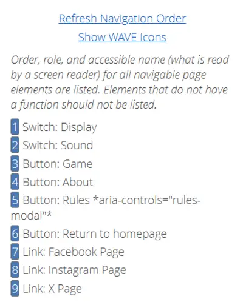
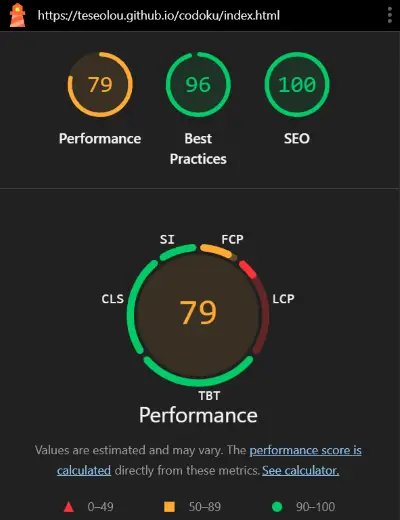
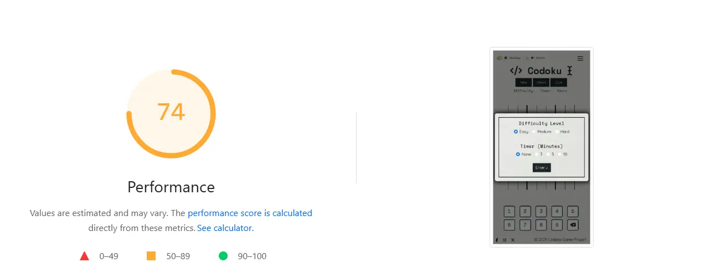

# TESTING.md

## 6. Testing

### Introduction

Testing is a critical component of the development lifecycle and plays an essential role in producing a stable, accessible, and user-friendly application. For a project like **Codoku** — an interactive, browser-based Sudoku game — testing ensures that the interface is not only visually consistent and responsive but also meets accessibility standards, functions correctly across modern devices and browsers, and delivers a smooth user experience.

Codoku was tested using a combination of **automated tools** and **manual techniques** across multiple categories:

- **Code validation** 
- **Accessibility evaluation** 
- **Performance and SEO auditing** 
- **Responsive design checks** 
- **Cross-browser compatibility testing**
- **Manual interaction testing** 

All issues discovered during testing were documented and resolved, and results are detailed in this document along with screenshots to verify successful validation.

## **6.1 Code Validation**
Validation ensures that the code behind Codoku adheres to current web standards and best practices, helping improve reliability, maintainability, and browser compatibility. 

All HTML, CSS, and JavaScript files were passed through official validation tools such as the W3C Markup Validator, W3C CSS Validator, and JSHint. 

This process helped identify and resolve syntax errors, semantic issues, accessibility oversights, and outdated or unsupported syntax ensuring the final product is stable, clean, and standards-compliant.

---

### **6.1.1 HTML Validation**

All HTML files (`index.html`, `about.html`, and `404.html`) were validated using the W3C Markup Validation Service. This process checks for syntax errors, deprecated tags, improperly nested elements, and other violations of the HTML5 specification.

#### **`index.html` - Results**
The `index.html` file serves as the main interactive hub of Codoku, housing the Sudoku grid, control buttons, difficulty and timer setup, and all associated modals. It also links to all the key JavaScript and CSS files that power the app’s functionality.

During HTML validation using the W3C Markup Validation Service, a number of informational notices, warnings, and a few errors were flagged. Each was reviewed and resolved during development.

⚠️ Highlighted **fixed** validation issues:  
- **Trailing slashes on void elements**  
  Multiple lines such as `<meta charset="UTF-8"/>` and `<link rel="stylesheet".../>` triggered info messages like:  
  >> _"Trailing slash on void elements has no effect and interacts badly with unquoted attribute values."_

  These messages appear when self-closing syntax (`/>`) is applied to void elements in HTML5. Although this syntax is not invalid, it can cause unintended effects with certain attribute formatting. All unnecessary slashes were removed for full compliance and best practice.

- **Redundant ARIA roles**  
  HTML5 elements such as `<nav>`, `<footer>`, and `<button>` inherently include appropriate ARIA roles. Instances like `role="navigation"` or `role="button"` were removed to reduce clutter and improve semantic accuracy.

- **Missing or empty headings in sections**  
  Several `<section>` elements were missing descriptive headings or contained empty heading tags. These were addressed by:
  - Adding `<h2>` or `<h3>` tags where needed
  - Replacing `<section>` with `<div>` in purely structural contexts

- **Duplicate `aria-expanded` attribute**  
  A toggle element was found with two `aria-expanded` attributes. One was removed to maintain valid and functional ARIA behavior.

- **Broken ARIA references**  
  One element included `aria-labelledby="alert-modal-label"`, but the corresponding ID was missing from the DOM at the time of validation. This was corrected by ensuring the label element exists with the appropriate `id`.

After implementing all necessary corrections, the file was revalidated and passed without any remaining issues.

  
*Screenshot of W3C validator result showing “No errors or warnings” for index.html*

#### **`about.html` - Results**

The `about.html` page introduces the Codoku project, explains its development context, and provides insight into the design philosophy and purpose of the game. It features descriptive text, responsive layout, and multiple decorative images supported by accessible alt tags.

When tested using the W3C Markup Validation Service, the file initially displayed multiple issues. These were reviewed, corrected, or acknowledged as acceptable where appropriate.

⚠️ Highlighted **fixed** validation issues:  
- **Trailing slashes on void elements**  
  Numerous tags like `<meta/>` and `<link/>` triggered info-level warnings such as: 
  >> _"Trailing slash on void elements has no effect and interacts badly with unquoted attribute values."_  

  These were corrected by removing the unnecessary slashes, ensuring cleaner and more standards-compliant HTML5 markup.

- **Redundant ARIA roles**  
  The `role` attributes on semantic elements like `<nav>` and `<button>` were removed, as HTML5 already implies these roles.

- **Missing headings in `<section>` elements**  
  Several sections lacked heading tags. According to accessibility and semantic best practices, headings should be present or `<div>` should be used instead. These issues were resolved by adding `<h2>` or `<h3>` where appropriate.

- **Duplicate and conflicting ARIA attributes**  
  A duplicate `aria-describedby` attribute was found and removed, ensuring better assistive technology compatibility.

- **Improper `height` value on `` tags**  
  Images used `height="auto"`, which is invalid in HTML5 and flagged as:  
  >> _"Bad value auto for attribute height on element img: Expected a digit but saw a instead."_  
  
  This was corrected by removing the `height` attribute entirely and allowing Bootstrap’s responsive classes to control scaling.

- **Unclosed HTML elements**  
  An error near the end of the document indicated an unclosed `<main>` tag, leading to:  
  >> _"End tag for body seen, but there were unclosed elements."_  
  
  This was resolved by properly closing all open tags before the end of the document.

After addressing all these concerns, the `about.html` page now passes validation with no remaining errors.


*W3C validator confirmation for about.html with an image report verifying proper alt text usage*

#### **`404.html` - Results**

The `404.html` page is a custom error page displayed when a user attempts to access a route that does not exist. It provides a lighthearted visual message and offers a route back to the homepage to retain user engagement. Like the other pages, it shares the same navigation, modal, and theme-switching logic for consistency across the site.

The file was run through the W3C Markup Validation Service and, like the other pages, returned a number of issues—primarily warnings and a few minor errors. All were addressed through careful revisions.

⚠️ Highlighted **fixed** validation issues:  
- **Trailing slashes on void elements**  
  Many `<meta/>`, `<link/>`, and `<input/>` tags used trailing slashes that are unnecessary in HTML5. These caused repeated warnings:  
  >> _"Trailing slash on void elements has no effect and interacts badly with unquoted attribute values."_  
  
  All slashes were removed to ensure proper HTML5 compliance.

- **Unnecessary ARIA roles**  
  Elements such as `<nav>`, `<main>`, and `<button>` had redundant `role` attributes which were removed for semantic clarity and cleaner markup.

- **Duplicate attribute**  
  The `aria-expanded` attribute appeared more than once on an element. This was corrected by retaining only a single instance.

- **Section elements missing headings**  
  Several `<section>` tags lacked associated heading elements. To improve semantic structure and accessibility, appropriate heading tags were added or the structure changed to `<div>` where headings were not needed.

- **Invalid image `height="auto"`**  
  One image used the value `auto` in its height attribute, which is invalid:  
  >> _"Error: Bad value auto for attribute height on element img: Expected a digit but saw a instead."_  
  
  This was resolved by removing the `height` attribute altogether and allowing CSS to handle scaling through responsive utility classes like `.img-fluid`.

After resolving all of the above issues, the `404.html` file now passes validation with no outstanding errors or warnings.


*W3C validation result for 404.html indicating no issues and highlighting alt text on images*

  


### **6.1.2 CSS Validation**

The primary stylesheet `style.css` was tested using the W3C CSS Validation Service. The validator analyzes the stylesheet for syntax errors, unsupported properties, and incorrect value usage across various levels of CSS.

#### **`style.css` Results**
The style.css file contains all the core styling rules for Codoku, including custom variables, responsive layout structures, theme toggling, dark mode overrides, and component-level styling for modals, the grid, and controls. It supports both light and dark themes and integrates cleanly with Bootstrap to enhance UI consistency and accessibility across screen sizes and devices.

Despite the complexity and breadth of the stylesheet, no errors were reported by the validator. This confirms that the CSS is well-structured, standards-compliant, and compatible with all major browsers.

  
*CSS validator confirmation screen for style.css showing zero errors.*

  


⚠️ **Fixed** Warnings

Although the Codoku `style.css` file passed W3C validation without any errors, the validator did return 17 warnings, which are important to note for transparency and future maintenance.

These warnings were primarily related to:

1. CSS Custom Properties (Variables) 
   > *“Due to their dynamic nature, CSS variables are currently not statically checked.”*  
   - This is a known limitation of the W3C CSS Validator: it cannot evaluate computed styles that rely on custom properties such as `--color-primary` or `--cell-size`. These are used extensively in Codoku to support themes, responsiveness, and modularity.  
   - **Resolution**: No action is required. This is not a fault in the CSS, but a limitation of static analysis tools.

2. Same color for background and border  
   > *“Same color for background-color and border-color”* for selectors such as:  
     ```css
     #sound-switch:checked {
       background-color: #a5f3a5;
       border-color: #a5f3a5;
     }
     ```
   - These are **intentional design choices** meant to create flat, unified UI components. In this context, using the same color is acceptable and visually consistent.

### **6.1.3 JavaScript Validation**

All JavaScript files used in Codoku were validated using JSHint, a popular static code analysis tool designed to detect errors and potential problems in JavaScript code. The goal of this validation was to ensure that the scripts are syntactically correct, logically sound, and compatible with modern browser environments.

JSHint was configured to evaluate:
- **Cyclomatic complexity**
- **Unused and undefined variables**
- **ES6 syntax support**
- **Browser and jQuery environments**
- **Potential pitfalls**, such as unsafe line breaks or legacy code patterns

This helped identify both technical issues and stylistic problems early in development. Warnings and issues flagged were reviewed and addressed where appropriate, or acknowledged when contextually valid (e.g. use of globally defined functions or modular dependencies).

#### **`init.js` - Results**
The `init.js` file contains logic related to page initialization and UI setup. It includes functions to launch modals, configure toggles, and prepare the game interface on page load.

- **Functions defined**: 3  
- **Cyclomatic complexity**: 3 (well within acceptable range)  
- **Largest function**: 11 statements  
- **Unused variable**: `showAlertModal` (declared but not invoked inside this file)  
- **Undefined variables**:  
  - `bootstrap`  
  - `setupOutsideNavbarCollapse`  
  - `setupThemeSwitch`  
  - `setupStartButton`  
  - `setupSoundToggle`  
  These are all defined in other modular scripts and imported via `<script>` tags, which JSHint does not track.

No functional or structural issues were flagged, and the code was confirmed as valid and browser-ready.

  
*JSHint analysis summary for `init.js` showing no major issues and clean logic structure*

#### **`game.js` Results**

The `game.js` file contains the majority of Codoku’s interactive logic, including grid rendering, puzzle population, user input handling, win condition checking, timer management, and hint functionality. As the largest and most complex script in the project, it was particularly important to validate this file thoroughly to ensure it was well-structured, efficient, and error-free.

- **Functions defined**: 47  
- **Largest function**: 32 statements  
- **Cyclomatic complexity**: Max value = 11 (acceptable for a dynamic UI with multiple branches)  
- **Unused variable**:  
  - `startNewGame` (declared but not directly used within this file)  
- **Undefined variables**:  
  - `isSoundEnabled`  
  - `showAlertModal`  
  - `confetti`  
  - `bootstrap`  

These undefined variables are expected and justified:
- `isSoundEnabled`, `showAlertModal` are defined in separate utility files (`sound.js`, `init.js`)
- `confetti` comes from a third-party script
- `bootstrap` refers to Bootstrap’s modal functionality imported via CDN

⚠️ One **fixed** warning was generated:  
>> *Optional chaining is only available in ES11*  

```js
console.error('Error:', response?.responseText || 'No response');
```

This syntax checks whether the response object exists before attempting to access its responseText property. If response is undefined or null, the optional chaining prevents the script from throwing an error, and instead safely falls back to 'No response'. 

This is used to safely access response objects like `response?.responseText` and is supported in modern browsers. All modern browsers (Chrome, Firefox, Edge, Safari) fully support optional chaining. Since Codoku is intended for modern environments and ES6+ syntax is enabled, this is not a concern. However, to enhance compatibility with older browsers and avoid relying on this ES11-specific syntax, the logic was updated to a manual null check.

```js
if (response && response.responseText) {
    console.error('Error:', response.responseText);
} else {
    console.error('Error: No response');
}
```

This alternative performs the same check in a way that is compatible with ES5/ES6 environments. It ensures the error message is displayed correctly without relying on modern syntax. This change was made specifically in the `fetchSudokuBoard()` function to ensure broader browser support.

  
*JSHint validation for `game.js` showing clean structure, modular logic, and minor contextual warnings*

#### **`navbar.js` - Results**

The `navbar.js` file manages sound feedback and the responsive collapse behavior of the navigation bar, particularly for mobile users. It also provides logic for detecting external clicks and intercepting in-app navigation events to enhance UX and avoid accidental game loss.

- **Functions defined**: 11  
- **Cyclomatic complexity**: Max value = 7 (within acceptable limits for UI event logic)  
- **Unused variable**:  
  - `setupOutsideNavbarCollapse` (used externally from `init.js`)  
- **Undefined variables**:  
  - `isSoundEnabled`  
  - `bootstrap`  

These warnings are considered **contextually valid**:
- `isSoundEnabled` is declared globally in `sound.js` and accessed here to control whether audio plays.
- `bootstrap` is included globally via the Bootstrap CDN and is used to trigger collapse and modal APIs, which are not explicitly imported in this script.

No syntax errors or structural flaws were found. The logic follows best practices for DOM event handling, modal interaction, and clean integration with Bootstrap’s JavaScript components.

  
*JSHint validation for `navbar.js` showing minor external reference warnings and otherwise clean structure*

#### **`setup-modal.js` - Results**

The `setup-modal.js` file is a concise script responsible for linking the "Start" button in the setup modal to game initialization. When the button is clicked, it closes the modal using Bootstrap's modal API and then starts a new Codoku session by calling the `startNewGame()` function. This ensures a smooth and clean transition from setup to gameplay.

- **Functions defined**: 2  
- **Largest function**: 5 statements  
- **Cyclomatic complexity**: 2 (very low, indicating clean control flow)  
- **Unused variable**:  
  - `setupStartButton` (declared but called externally by `init.js`)  
- **Undefined variables**:  
  - `bootstrap` (used for modal interaction via CDN)  
  - `startNewGame` (defined elsewhere in `game.js`)

These undefined variables are expected in this context:
- Bootstrap's modal system is accessed via a global `bootstrap` object from the CDN.
- The `startNewGame` function is declared globally in another file and called here to initialize gameplay.

JSHint flagged no functional errors or warnings in this file. The script is clean, minimal, and integrates well with the wider codebase.

  
*JSHint validation for `setup-modal.js` confirming clean logic, appropriate modularity, and no critical issues*

#### **`sound.js` - Results**

The `sound.js` file manages the user’s sound preferences for the application. It initializes sound settings, syncs UI controls with saved preferences using `localStorage`, and ensures the toggle state persists across sessions. Although it doesn’t directly handle audio playback, it defines a global flag (`isSoundEnabled`) used throughout other modules to conditionally play sounds.

- **Functions defined**: 3  
- **Largest function**: 7 statements  
- **Cyclomatic complexity**: 5 (well within normal range for conditional UI logic)  
- **No unused or undefined variables** were flagged.  
- **No warnings or errors** were returned by JSHint.

All logic is encapsulated and cleanly separated into modular functions (`applySoundSetting`, `setupSoundToggle`), enhancing maintainability and ensuring predictable behavior across the app. The `DOMContentLoaded` listener ensures correct initialization before any interaction can occur.

  
*JSHint output for `sound.js` confirming clean, modular sound preference logic and no issues detected*

#### **`theme.js` - Results**

The `theme.js` script is responsible for managing the application's visual theme toggle (light/dark mode). It reads from `localStorage` to apply the user's previously selected theme on page load and dynamically updates the UI theme, switch state, button styles, and accessibility settings.

- **Functions defined**: 5  
- **Largest function**: 8 statements  
- **Cyclomatic complexity**: 5 (expected for conditional UI rendering)  
- **Undefined variable**:  
  - `isSoundEnabled` (declared globally in `sound.js`)  
- **No unused variables** or errors were detected.

The script is clean, well-commented, and uses modular logic to keep the theme functionality separated from the rest of the app. jQuery is used to streamline DOM manipulation, and the script also incorporates audio feedback through conditional playback of themed sound effects ("tweet" for light, "hoot" for dark).

  
*JSHint analysis of `theme.js` confirming one globally declared dependency and otherwise sound, accessible logic*

## **6.2 Accessibility Testing**

Accessibility is a core consideration in the development of Codoku, ensuring that the game is usable by people of all abilities and assistive technologies. The goal was to create an inclusive experience by following the principles of WCAG 2.1 (Web Content Accessibility Guidelines), focusing on perceivability, operability, understandability, and robustness.

Accessibility testing was conducted using both **automated tools** and **manual techniques** to evaluate:

- **Semantic HTML structure** - Ensuring that elements such as headings, landmarks, and lists follow a logical order and meaningful structure.

- **ARIA roles and labels** - Verifying that interactive components (e.g. modals, toggles, buttons) use appropriate `aria-*` attributes for screen reader compatibility.

- **Keyboard navigation** - Manually testing tab order, focus states, and accessibility of all interactive elements without using a mouse.

- **Color contrast and visual clarity** - Validated via automated tools and manual inspection to meet contrast ratio requirements, especially between text and background in both light and dark modes.

- **Alt text for images** - Confirming that all decorative and informative images include appropriate `alt` attributes to provide context to screen reader users.

- **Screen reader simulation** - Using NVDA to assess how the application content is announced and navigated.

#### **Tools Used for Accessibility Testing**

| Tool | Description |
|------|-------------|
| WAVE Web Accessibility Evaluation Tool | Identifies structural and semantic issues, including missing alt attributes, headings, and ARIA landmarks. |
| Accessibility Checker by CKSource | Provides quick audits and visual feedback on accessibility issues in real time. |
| axe DevTools (Deque Systems) | Browser extension used in developer tools to find and explain WCAG violations within the app. |
| Google Chrome Lighthouse | Generates automated accessibility reports covering contrast, ARIA usage, keyboard support, and more. |
| NVDA (NonVisual Desktop Access) | Screen reader for Windows used to test how visually impaired users experience and navigate the app. |

---

### **6.2.1 WAVE Accessibility Testing**

WAVE (Web Accessibility Evaluation Tool) is an automated tool developed by WebAIM for assessing accessibility issues directly within web pages. It identifies errors, warnings (alerts), structural elements, and ARIA usage while visually overlaying them on the interface for quick interpretation.

#### **`index.html` Results**

The following results summarize the evaluation of `index.html` using WAVE, along with screenshots that document the results and key observations.

   
*WAVE accessibility summary for index.html showing no errors and several structural or semantic suggestions*

#### ⚠️ Alerts
The majority of alerts were related to *Possible heading* issues.

WAVE flagged 61 elements due to the use of visually prominent styles (e.g. bold or larger text inside `<p>` tags) in the Sudoku grid. These elements were interpreted as potential headings even though they were intentionally not semantic headings.

  
*WAVE accessibility scan showing multiple "possible heading" alerts (orange h? icons) across a Sudoku grid.*

These alerts do not indicate code errors but are suggestions to assess whether additional heading structure might benefit assistive technology users. In this case, the elements should not be semantic headings, as they represent game data and not content sections. The alert was reviewed and accepted as not requiring a change.

Wave also flagged 2 *HTML5 audio/video* alerts. These refer to the use of `<audio>` elements. WAVE flags these to ensure that alternative content is present for users with hearing impairments or that audio is not played automatically. In **Codoku** these `<audio>` tags are responsible for the `error` and `timeout` alert sounds which are non-autoplay and do not contain controls as they are programmatically operated.

#### ✅ Accessibility Enhancements
| Feature Type   | Count | Explanation                                                                 |
|----------------|-------|-----------------------------------------------------------------------------|
| Form Labels    | 9     | Each toggle or radio input has an associated `<label>`.                     |
| Fieldsets      | 3     | Radio inputs (difficulty, timer) are grouped in `<fieldset>` containers.   |
| Language       | 1     | `lang="en"` is declared in the `<html>` tag for screen reader compatibility.|

  
*Accessibility features detected by WAVE such as labels, fieldsets, and language setting.*

These features improve screen reader interpretation, group related content meaningfully, and promote proper pronunciation of content.

#### 🧱 Semantic Layout
| Element Type       | Count | Purpose                                                                   |
|--------------------|-------|---------------------------------------------------------------------------|
| Heading Level 1    | 2     | Used for top-level titles (e.g., modals or main page header).             |
| Heading Level 2    | 36    | Used for modal titles, section headers, and UI labels.                    |
| Unordered Lists    | 2     | Represent bullet points or grouped navigation content.                    |
| **Semantic Landmarks** |||
| - Header           | 1     | Defines site or app banner at top of page.                                |
| - Navigation       | 1     | Provides primary nav links for the app.                                   |
| - Main             | 1     | Contains central game content.                                            |
| - Footer           | 1     | Houses credits and external links.                                        |
| - Aside            | 3     | Includes supporting areas like settings, rules, or instructions.          |

   
*Clear document structure with semantic use of headers, landmarks, and layout roles enhancing screen reader performance.*

These elements support keyboard and screen reader navigation by defining meaningful page structure.

#### 🗣️ Assistive Tech Support
A total of 53 ARIA attributes were identified, used appropriately across the interface.

| ARIA Type             | Example Use                                         |
|-----------------------|-----------------------------------------------------|
| `aria-label` / `aria-labelledby` | Describes toggles and modal labels               |
| `aria-describedby`    | Links inputs or modals to descriptions               |
| `aria-hidden`         | Hides decorative or duplicate elements               |
| `aria-expanded`       | Indicates state of collapsible content               |
| `aria-controls`       | Links toggles to their target elements               |
| `aria-live`           | Ensures dynamic feedback is announced                |
| `aria-tabindex`       | Manages keyboard focus behavior                      |

  
*WAVE detected 53 properly used ARIA attributes supporting accessibility, including labels, hidden states, and live regions.*

No misuse, duplication, or inconsistencies were found during the ARIA attribute audit. These attributes significantly improve context for users relying on screen readers.

#### ⌨️ Keyboard Accessibility
Using WAVE’s Order panel, the keyboard tab order was confirmed to be logical, linear, and intuitive. The navigation follows a top-to-bottom, left-to-right flow that matches the visible layout.

  
*Logical and sequential keyboard navigation order as tested through WAVE’s Order panel, ensuring user-friendly interaction.*

This ensures that users navigating by keyboard or screen reader can access all functions without confusion or disorientation.

#### **👁️ Contrast Validation**
The WAVE contrast checker evaluates color pairings against the [WCAG 2.1](https://www.w3.org/WAI/WCAG21/quickref/) contrast criteria:

- **WCAG AA**: Minimum contrast ratio of **4.5:1** for normal text
- **WCAG AAA**: Minimum contrast ratio of **7:1** for enhanced accessibility

  
*WAVE contrast checker result for Codoku showing high readability and full WCAG compliance*

This result indicates that the interface text meets both standard and enhanced guidelines for readability.

#### **`about.html` Results**

The following results summarize the WAVE accessibility evaluation of the `about.html` page. 

  
*Accessibility summary from WAVE showing no errors, no contrast issues, and several positive features.*

#### ✅ Accessibility Enhancements
| Feature Type     | Count | Explanation                                                                            |
|------------------|-------|----------------------------------------------------------------------------------------|
| Alternative Text | 3     | All decorative and content images include descriptive `alt` text for screen readers.  |
| Form Labels      | 2     | Inputs and controls (if any) are correctly labeled with `<label>` elements.           |
| Language         | 1     | The document includes a `lang="en"` attribute to assist with pronunciation.           |

  
*WAVE reports all form labels, image alt text, and language metadata are properly implemented.*

#### 🧱 Semantic Layout
| Element Type       | Count | Purpose                                                                  |
|--------------------|-------|--------------------------------------------------------------------------|
| Heading Level 1    | 1     | Used for the main page heading (“About”).                                |
| Heading Level 2    | 8     | Applied to each major section (e.g., content segments, modals).          |
| Unordered Lists    | 2     | Used to present bullet point information.                                |
| **Semantic Landmarks** |||
| - Header           | 1     | Contains branding and page title.                                        |
| - Navigation       | 1     | Provides primary links to other parts of the site.                        |
| - Main             | 1     | Wraps the primary content of the about page.                             |
| - Footer           | 1     | Includes social links and acknowledgements.                              |
| - Aside            | 2     | Houses supporting content like rules and accessibility notices.          |

  
*Clear heading structure and proper use of semantic regions enhance screen reader and keyboard navigation.*

#### 🗣️ Assistive Tech Support
A total of 32 ARIA attributes were identified and correctly applied throughout the page.

| ARIA Type           | Example Use                                                |
|---------------------|------------------------------------------------------------|
| `aria-label`        | Identifies buttons and landmarks (e.g., menu toggle).      |
| `aria-description`  | Supports screen readers by giving context to complex items.|
| `aria-hidden`       | Hides non-essential or visual-only elements from AT users. |
| `aria-tabindex`     | Maintains accessible focus order for modals and controls.  |
| `aria-expanded`     | Indicates open/close state of collapsible UI elements.     |
| `aria-popup`        | Alerts assistive tools about modal behavior when triggered.|

  
*WAVE detected structured and properly scoped ARIA usage supporting screen reader accuracy and dynamic UI interaction.*

No errors or duplications were flagged, and all ARIA implementations followed best practice.

#### ⌨️ Keyboard Accessibility
The tab order was linear, logical, and matched the visual layout of the page. No keyboard traps were found, and the order prioritized major sections first (theme/sound switches, main nav, content, then external links).

  
*Sequential keyboard navigation order ensuring smooth screen reader and tabbing behavior.*

#### 👁️ Contrast Validation
Contrast checks performed on the `about.html` page yielded **no failures**. All text foreground/background color pairings meet or exceed WCAG 2.1 AA and AAA standards.

  
*Text contrast meets accessibility standards for all text sizes and themes.*

#### **`error.html` Results**

The following results summarize the WAVE accessibility evaluation of `error.html`, Codoku’s 404 error page. 

  
*WAVE accessibility summary showing zero errors and a well-structured layout.*

#### ✅ Accessibility Enhancements
| Feature Type   | Count | Explanation                                                             |
|----------------|-------|-------------------------------------------------------------------------|
| Alternative Text | 1   | All relevant images include descriptive alt text for screen readers.   |
| Form Labels    | 2     | Form inputs (e.g., toggle switches) are correctly associated with labels.|
| Language       | 1     | `lang="en"` is declared in the `<html>` element for screen reader support.|

  
*Detected accessibility features including form labels, language attribute, and appropriate image alt text.*

These enhancements help ensure compatibility with screen readers and improve usability for users with assistive technology.

#### 🧱 Semantic Layout
| Element Type       | Count | Purpose                                                             |
|--------------------|-------|---------------------------------------------------------------------|
| Heading Level 1    | 1     | Defines the main title of the error message.                        |
| Heading Level 2    | 6     | Used to label sections or explain content visually.                 |
| Unordered Lists    | 2     | Present grouped navigation or links.                                |
| **Semantic Landmarks** |||
| - Navigation       | 1     | Contains main navigation links.                                     |
| - Main             | 1     | Hosts the central content and visual of the error message.          |
| - Footer           | 1     | Provides social links and site credits.                             |
| - Aside            | 2     | Includes supporting details such as rules or extra messages.        |

  
*Logical semantic structure with proper landmarks and header levels enhances navigability.*

This structure improves orientation, keyboard navigation, and screen reader parsing by following a meaningful page hierarchy.

#### 🗣️ Assistive Tech Support
A total of 32 ARIA attributes were identified on the page, applied appropriately to enrich accessibility.

| ARIA Type             | Example Use                                            |
|-----------------------|--------------------------------------------------------|
| `aria-label`          | Provides names for toggles and links.                  |
| `aria-describedby`    | Connects interactive elements to additional instructions. |
| `aria-hidden`         | Hides decorative icons from assistive tech.            |
| `aria-expanded`       | Indicates visibility status of collapsible content.    |
| `aria-tabindex`       | Controls keyboard tab flow.                            |
| `aria-popup`          | Describes elements that trigger popups or modals.      |

  
*WAVE audit showing extensive, correctly used ARIA attributes for screen reader compatibility.*

No issues or redundant uses were detected, confirming a well-implemented ARIA layer.

#### ⌨️ Keyboard Accessibility
WAVE’s Order panel confirmed that tab navigation flows in a logical and predictable manner. The sequence reflects visual positioning and groups related items logically.

  
*Keyboard tab order confirmation showing clear and linear focus path.*

This helps keyboard users reach all interactive content without confusion or barriers.

#### **👁️ Contrast Validation**
The color contrast checker in WAVE verified that all text met the WCAG 2.1 minimum standards:

  
*Strong contrast between foreground and background ensures readability for visually impaired users.*

This ensures the page remains accessible to users with low vision or color blindness.

### **6.2.2 AccessibilityChecker Testing**

To further ensure Codoku’s compliance with WCAG 2.2 accessibility standards, automated testing was conducted using AccessibilityChecker. This tool scans pages for common accessibility issues across categories including semantic structure, ARIA usage, visual contrast, interaction behavior, and assistive technology compatibility.

AccessibilityChecker evaluates each page against critical and non-critical criteria, assigning an audit score and flagging required manual audits. It is particularly useful for identifying violations that may affect screen reader users, keyboard-only navigation, and overall structural clarity.

The audit includes:
- **Automated checks**: e.g., landmark nesting, heading structure, focusable elements, ARIA attribute validation.
- **Manual audit prompts**: e.g., screen reader behavior, dynamic content focus, and visible focus indicators.
- **Severity grading**: Issues are classified as critical, passed, manual, or not applicable based on WCAG 2.2.

Each page was tested individually and iteratively updated based on feedback until a **100% audit score** was achieved. The following subsections document findings and resolutions for each HTML file.

#### **`index.html` Results**

The `index.html` page was audited using and the initial scan reported 4 critical issues, placing the page in a *Not Compliant* state with an audit score of 89%.


*Initial audit result showing non-compliance due to 4 critical issues and a score below the recommended accessibility threshold.*

⚠️ Flagged Issues and Fixes

1. Complementary Landmarks Nested Incorrectly  
    - **Issue**: Three `<aside>` elements were improperly nested inside other ARIA landmarks such as `<main>` or `<footer>`.  
    - **Why It Matters**: The `<aside>` element represents complementary content and must not be nested within primary content regions. Nesting it incorrectly can confuse screen reader users who rely on proper landmark structure.  
    - **Fix Applied**: Each `<aside>` was changed to a `<div>` element.

2. Heading Lacked Discernible Text 
    - **Issue**: A heading (`<h2 id="clear">`) only contained an icon with no readable or spoken text.  
    - **Why It Matters**: All headings must include meaningful content that is either visually visible or screen-reader accessible. This helps users understand page hierarchy and purpose.  
    - **Fix Applied**: A visually hidden but screen-readable span was added:
        ```html
        <h2 id="clear">
            <i class="fa-solid fa-delete-left" aria-hidden="true"></i>
            <span class="visually-hidden">Clear Cell</span>
       </h2>
        ```   
        This ensures assistive technology can read the heading without affecting the visual design.

✅ Final Result: Compliant

After applying the necessary changes, the page was re-tested and passed all criteria, achieving a 100% audit score and full WCAG 2.2 compliance.


*Audit confirmation showing full compliance with WCAG 2.2 standards and a perfect accessibility score.*

#### **`about.html` Results**

Following the initial audit of `about.html`, the page scored **95%** due to two flagged issues involving improperly nested `<aside>` landmarks.

  
*Automated audit of `about.html` shows a 95% score with 2 critical issues pending resolution.*

⚠️ Flagged Issues and Fixes

- **Issue**: The audit detected two `<aside>` elements that were incorrectly nested within `<main>` and `<footer>` regions. This violated the WCAG 2.2 guideline requiring that complementary landmarks (e.g. `<aside>`) not be nested inside other landmark roles such as `main`, `contentinfo`, or `banner`.

- **Why It Matters**: Improper nesting can cause confusion for screen reader users, who rely on a clear and predictable landmark structure for navigating the page semantically.

- **Fix Applied**: To resolve this issue, both `<aside>` elements were refactored into `<div>` elements. Since the affected containers did not function as true complementary regions—i.e., they didn't hold standalone supplemental content—the semantic role of `<aside>` was unnecessary and incorrectly applied.

**Before:**
```html
<aside class="d-flex align-items-center gap-1">...</aside>
<aside id="copyright-info">© 2025 Codoku Game Project</aside>
```

**After:**
```html
<div class="d-flex align-items-center gap-1">...</div>
<div id="copyright-info">© 2025 Codoku Game Project</div>
```
This change preserved the visual and functional layout while restoring semantic correctness for assistive technologies.

✅ Final Result: Compliant  

After applying the fix, about.html was rescanned and passed all tests with a perfect 100% audit score, confirming full compliance with WCAG 2.2.

  
*After addressing structural landmark issues, the `about.html` page achieved full WCAG 2.2 compliance with a perfect score.*

**Accessibility Certification**

While the individual `error.html` (404 error page) could not be directly scanned using AccessibilityChecker, a full domain audit was conducted on `teseolou.github.io`. The domain as a whole passed all manual and automated accessibility checks.

  
*AccessibilityChecker.org certificate confirming full compliance with WCAG 2.1 A/AA/AAA and WCAG 2.2 A/AA standards.*

This certificate confirms that the domain complies with:

- **WCAG 2.1 A, AA, AAA**
- **WCAG 2.2 A, AA**

This suggests that all accessible content served from the domain, including the `error.html` page, meets stringent accessibility criteria, even if the 404 page itself could not be isolated for testing. As a result, the `error.html` page can be considered implicitly compliant within the validated context of the domain.

### **6.2.3 Axe DevTools Testing**

axe DevTools is a professional-grade accessibility auditing solution developed by Deque Systems. It integrates with browser developer tools (e.g., Chrome DevTools) to automatically detect WCAG 2.1/2.2 violations during live site usage. It supports static page scans and monitors dynamic content changes such as modal openings, page transitions, and UI state updates.

#### **User Flow Audit**

On **June 25, 2025**, a full interactive session was recorded and audited using axe DevTools. This test followed the typical user journey from the homepage through multiple interface states, modal interactions, navigation to the About page, a 404 error test, and return navigation, all while monitoring for accessibility violations.

Test Configuration:
- **Starting URL**: [https://teseolou.github.io/codoku/index.html](https://teseolou.github.io/codoku/index.html)
- **WCAG Conformance Level**: 2.1 AA
- **Total Unique Issues Found**: `0`
- **Total Critical/Serious/Minor Issues**: `0`

Recorded User Flow:

1. Load index.html (landing page)
2. Interact with game toggles (Display, Sound)
3. Open each modal (Game, About, Rules)
4. Trigger game UI interactions (e.g., New Game, Check Grid)
5. Navigate to about.html via in-app link
6. Test interaction elements on about.html
7. Manually input an incorrect URL to trigger 404 page (aout.html)
8. Interact with elements on 404 page
9. Return to homepage (index.html)

Each dynamic state transition and page navigation was scanned in real time. All transitions, including the fallback 404 error route, returned zero accessibility issues.

  
*axe DevTools WCAG 2.1 AA audit confirming zero accessibility issues across full user interaction flow.*

This confirms that the Codoku project’s interactive experience is robust, inclusive, and compliant under thorough state-based accessibility testing.

#### **Axe DevTools Page Scans**

Axe DevTools was used to run automated accessibility scans on individual pages of the Codoku project to confirm compliance with WCAG 2.1 AA standards and best practices.

Each page was scanned using default rulesets with “Best Practices” enabled, ensuring broad and thorough testing of accessibility issues, including structural semantics, ARIA, color contrast, keyboard focus, and content labeling.

`index.html` Results


*The main Codoku game interface was scanned and no issues were found. All automated, guided, and manual tests returned zero critical, serious, moderate, or minor issues.*

`about.html` Results


*The About page passed the audit with zero detected issues, confirming correct heading structure, semantic elements, and accessible content flow.*

`404.html` Results


*404 error page was scanned to ensure users who land on broken URLs are met with a page that meets accessibility standards.*

All three tested pages, `index.html`, `about.html`, and the `404.html` page, scored zero total issues, with no violations detected across automatic, guided, or manual checks. The scans confirmed full conformance with WCAG 2.1 AA standards and accessibility best practices, demonstrating a consistent and inclusive design throughout the domain. 

### **6.2.4 Lighthouse Accessibility Testing**

Lighthouse is an automated tool integrated into Chrome DevTools used to audit web pages for performance, SEO, best practices, and accessibility. This section documents Lighthouse’s accessibility evaluation of the Codoku project under both desktop and mobile conditions.

#### **`index.html` Results**

Desktop Audit:
- **Score:** 100
- **Captured:** June 25, 2025 – 12:12 PM GMT+1
- **Environment:** Emulated Desktop (Custom throttling)
- **Passed Audits (25)**:
  - Valid ARIA roles and attribute usage
  - No deprecated or misused ARIA roles
  - Buttons and links include accessible names
  - Sufficient contrast between foreground and background colors
  - Document contains a valid `<title>` and `<html lang>`
  - Touch targets are appropriately sized
  - Semantic HTML structure with correct heading order
  - No `[tabindex]` values greater than 0
  - All form elements have associated labels

Mobile Audit:
- **Score:** 100
- **Captured:** June 25, 2025 – 12:15 PM GMT+1
- **Device:** Emulated Moto G Power
- **Network:** Slow 4G throttling
- **Passed Audits (23)**:
  - All ARIA and semantic structure checks also passed on mobile
  - Touch targets verified under mobile constraints
  - Accessibility maintained under reduced screen size

Key Passed Checks:
| Audit Category                          | Result |
|----------------------------------------|--------|
| ARIA roles and attribute usage         | ✅  |
| Labels for form controls               | ✅  |
| Contrast ratio (foreground/background) | ✅  |
| Heading order and semantics            | ✅  |
| Keyboard navigation and focus order    | ✅  |
| Touch target spacing                   | ✅  |
| `<html lang>` and `<title>` present    | ✅  |


#### **`about.html` Results**

Desktop Audit:
- **Score:** 100  
- **Captured:** June 25, 2025 – 12:24 PM GMT+1  
- **Environment:** Emulated Desktop (Custom throttling)  
- **Passed Audits (27)**:
  - Valid ARIA roles and attribute usage
  - No deprecated or misused ARIA roles
  - Buttons and links include accessible names
  - Sufficient contrast between foreground and background colors
  - Document contains a valid `<title>` and `<html lang>`
  - Touch targets are appropriately sized
  - Semantic HTML structure with correct heading order
  - No `[tabindex]` values greater than 0
  - Image elements use appropriate `alt` text
  - Links are distinguishable without relying solely on color

Mobile Audit:
- **Score:** 100  
- **Captured:** June 25, 2025 – 12:26 PM GMT+1  
- **Device:** Emulated Moto G Power  
- **Network:** Slow 4G throttling  
- **Passed Audits (24)**:
  - All ARIA and semantic structure checks also passed on mobile
  - Touch targets verified under mobile constraints
  - Image alt text and link accessibility confirmed under mobile display
  - Accessibility maintained under reduced screen size

Key Passed Checks:
| Audit Category                          | Result |
|----------------------------------------|--------|
| ARIA roles and attribute usage         | ✅     |
| Labels for form controls               | ✅     |
| Contrast ratio (foreground/background) | ✅     |
| Heading order and semantics            | ✅     |
| Keyboard navigation and focus order    | ✅     |
| Touch target spacing                   | ✅     |
| `<html lang>` and `<title>` present    | ✅     |
| Accessible image `alt` text            | ✅     |


#### **`404.html` Results**

Lighthouse displayed a warning due to the test being run on a mistyped URL (`inex.html`) which returned a 404 status. Despite the error, the 404 page itself loaded correctly and was evaluated.

Desktop Audit:
- **Score:** 100
- **Captured:** June 25, 2025 – 12:30 PM GMT+1
- **Environment:** Emulated Desktop (Custom throttling)
- **Passed Audits (26)**:
  - ARIA attributes are valid and correctly used
  - Buttons and images have accessible names
  - Sufficient contrast and semantic structure
  - No `[tabindex]` greater than 0
  - Correct use of `<title>`, `<html lang>`, and heading order

Mobile Audit:
- **Score:** 100
- **Captured:** June 25, 2025 – 12:28 PM GMT+1
- **Device:** Emulated Moto G Power
- **Network:** Slow 4G throttling
- **Passed Audits (23)**:
  - Accessibility maintained under reduced viewport
  - Focusable elements and roles confirmed to be valid
  - No errors or violations found under mobile testing conditions

Key Passed Checks:
| Audit Category                          | Result |
|----------------------------------------|--------|
| ARIA roles and attribute usage         | ✅     |
| Accessible names for controls and media| ✅     |
| Contrast ratio (foreground/background) | ✅     |
| Heading structure and semantics        | ✅     |
| Touch targets and keyboard navigation  | ✅     |
| `<html lang>` and `<title>` present    | ✅     |


### 6.2.5 Screen Reader Accessibility Testing 

Screen reader testing is a critical manual process to ensure that users relying on auditory feedback can navigate and understand a website's structure, content, and interactive features. While automated tools can check for technical correctness, they cannot evaluate usability from a blind user's perspective. 

To thoroughly assess screen reader compatibility, I used NVDA (NonVisual Desktop Access), a free and widely respected screen reader for Windows, combined with keyboard-only navigation.

| Test Area                             | Outcome | Notes                                                                 |
|--------------------------------------|---------|-----------------------------------------------------------------------|
| Headings are semantically structured | ✅      | Headings follow logical hierarchy (h1 → h2 → h3…)                     |
| Links are descriptive                | ✅      | No "click here" or ambiguous links; all convey purpose independently |
| Buttons have accessible labels       | ✅      | Buttons include visible text or `aria-label` when needed             |
| Forms have associated labels         | ✅      | All input fields announced with their corresponding labels           |
| Landmarks announced and navigable    | ✅      | NVDA recognized `<header>`, `<nav>`, `<main>`, `<footer>` etc.       |
| Modals announce content on open      | ✅      | Focus moves to modal; content is announced properly                  |
| Focus returns to trigger on close    | ✅      | After closing modals, focus returns to the last trigger              |
| Grid cells readable to screen readers| ⚠️      | Grid cell values are read aloud, but cells lack semantic structure and labels for navigation |


⚠️ **Grid Cell Screen Readability**:  
Special attention was given to the Sudoku grid and number selection container, as these are inherently visual features. The grid is composed of `<p>` elements and styled containers to represent cells, which are not natively semantic. Screen readers interpret these elements based on their HTML role, not their visual layout.
This presented a unique challenge:
- Grid cells could be misinterpreted as headings due to visual styling (large font, bold text).
- Interactive number buttons needed to be announced clearly with their role and label.

To resolve this clear ARIA roles and `aria-label` attributes were added where possible and visually hidden text (`.visually-hidden`) was used to describe buttons. The result is a Sudoku grid that is screen reader-friendly without exposing unnecessary layout noise, allowing non-visual users to understand what is happening contextually when numbers are selected or errors occur. 

The NVDA screen reader test confirmed that all key elements, headings, links, buttons, forms, and landmarks, were properly recognized and navigable. Additional effort was applied to optimize the grid and number selection areas, which were successfully adapted to ensure clarity and usability for screen reader users.

### 6.2.6 Keyboard Navigation & Focus Management Testing

Keyboard navigation is critical for ensuring that all users — including those with mobility impairments or who prefer not to use a mouse — can interact with a website effectively. This section tests that **Codoku** is fully navigable using only the keyboard through standard inputs like `Tab`, `Shift+Tab`, `Enter`, `Escape`, and the arrow keys.

To conduct this test, the mouse was disabled, and the interface was explored solely using the keyboard. These checks help ensure a consistent, frustration-free experience for all users, especially those relying on assistive technologies.

| Test Area                                | Outcome | Notes                                                                 |
|------------------------------------------|---------|-----------------------------------------------------------------------|
| `Tab` key reaches all focusable items    | ✅      | Navigation covers all buttons, toggles, links, and modals            |
| `Shift+Tab` allows backward navigation   | ✅      | Reverse tabbing worked consistently                                  |
| `Enter`/`Space` activates components     | ✅      | Buttons and links trigger actions as expected                        |
| Arrow key navigation in controls         | ✅      | Used for toggling radio options like difficulty and timer            |
| Modals can be exited with `Escape`       | ✅      | All modals close correctly and restore focus                         |
| Focus order is logical and follows DOM   | ✅      | Navigation sequence matches visual layout                            |
| Focus indicators are visible             | ✅      | Each interactive item shows clear visual focus cues                  |
| No keyboard traps                        | ✅      | User can freely enter and exit all interactive regions               |
| Skip link is present and functional      | ✅      | `Skip to content` link jumps directly to the main section            |
| Keyboard interaction with toggle switches | ✅     | Theme and sound switches are now fully keyboard-operable with `Space`|
| Inputting Sudoku numbers via keyboard    | ✅      | Once a cell is selected, number keys can input values as intended    |
| Selecting individual Sudoku cells        | ❌      | Grid cells are not directly focusable or selectable via keyboard     |

⚠️ **Grid Cell Selection via Keyboard**:   
Although entering numbers works perfectly once a cell is selected, the cells themselves are not accessible via keyboard focus. They currently cannot be selected without a mouse. A suggested improvement in future development would be to implement each cell as a focusable element (e.g. a `<button>` or `<input>`), or apply `tabindex="0"` with keyboard event listeners and accessible `aria-label`'s. This would enable seamless keyboard interaction for grid navigation. Due to the limited time scope of the project, implementing full keyboard-accessible grid navigation was not feasible within the available development window. However, it remains a strong candidate for future accessibility enhancements, as the task involves significant structural and ARIA rewiring of the Sudoku grid.
 
**Codoku** performs well in keyboard accessibility testing. Navigation order, focus indicators, modals, and interactive controls function as expected. With toggle switches fully operable and number inputs working, the main limitation is keyboard-based grid cell selection — resolving this would ensure full parity for non-pointer users.

### **6.2.7 Interactive Accessibility Testing**
Interactive accessibility testing focuses on how well dynamic and user-driven components function across different contexts and devices — especially for users with motor, cognitive, or sensory impairments. While screen readers and keyboard tests assess static and navigational content, this step ensures interactive experiences like modals, media, and mobile inputs behave accessibly.

Testing included audio control accessibility, mobile responsiveness, touch target sizing, and support for accessibility-friendly zooming and gestures.

| Test Area                        | Description                                                                                   | Result |
|----------------------------------|-----------------------------------------------------------------------------------------------|--------|
| Video/audio controls         | Ensure media is accessible, captions provided or non-critical (Codoku uses non-visible `<audio>`) | ✅     |
| Media pause/play support     | No autoplaying media; all audio triggered intentionally via UI                               | ✅     |
| Touch target sizing          | All interactive elements met WCAG recommended minimum of 44×44 pixels                         | ✅     |
| Touchscreen gestures         | Tap, zoom, and scroll actions worked as expected on mobile                                   | ✅     |
| Hover interactions           | All hover-dependent elements had fallback click interactions                                 | ✅     |
| Zooming & scaling            | Layout retained structure and legibility at 200% text zoom and pinch-to-zoom                 | ✅     |
| CAPTCHA accessibility        | No CAPTCHA used                                                                               | ✅     |
| Error message readability    | Alert messages triggered via modals are screen-reader accessible                             | ✅     |

All interactive features of Codoku, including modals, controls, and responsive layouts, functioned correctly with both keyboard and touch input. The game's `<audio>` elements are non-autoplay and used for feedback only, posing no barriers. The site’s responsiveness, zoom support, and absence of inaccessible CAPTCHA-style content confirm its usability across a variety of devices and assistive configurations.

## 6.3 Performance Testing
Performance testing ensures that the Codoku project provides a fast and responsive experience across a range of devices and networks. Fast load times and efficient code execution directly impact usability, user satisfaction, and search engine rankings. Performance is particularly important for mobile users and those on limited connections.

To assess performance, a combination of automated tools were used:
| Tool                             | Purpose                                                                 |
|----------------------------------|-------------------------------------------------------------------------|
| **Google Lighthouse**            | Repeatable audits for key performance metrics on desktop and mobile    |
| **PageSpeed Insights**           | Live Google performance data and opportunities from real-world usage   |
| **Detailed SEO Extension**       | Real-time browser-based inspection of SEO metadata, robots tags, and structural issues |

---

### **6.3.1 Lighthouse Performance Testing**
Lighthouse is an open-source, automated tool developed by Google to audit web performance, accessibility, SEO, and adherence to best practices. It simulates real-world conditions such as throttled mobile networks and underpowered devices, providing a repeatable, objective way to evaluate web experiences.

For this project, Lighthouse was run in Chrome DevTools using desktop emulation and custom throttling settings. Additional diagnostics were explored through the Lighthouse Treemap Viewer to assess script weight and third-party contributions.

#### **`index.html` Results**
**Desktop**: 

  
*Initial desktop performance audit showing a score of 94 prior to applying optimisations.*
| Metric                        | Score / Time | Comments                                                  |
|------------------------------|--------------|-----------------------------------------------------------|
| **Performance Score**        | 94           | High score with fast load times and minimal blocking      |
| **First Contentful Paint**   | 0.6s         | Quick time to initial content rendering                   |
| **Largest Contentful Paint** | 1.5s         | Slight delay due to modal component; still performant     |
| **Total Blocking Time**      | 0ms          | Excellent interactivity, no long script blocking          |
| **Cumulative Layout Shift**  | 0.049        | Minimal shifting; layout is visually stable               |
| **Speed Index**              | 0.8s         | Efficient rendering of above-the-fold content             |

**Mobile Performance**:  

  
*Mobile performance was significantly lower at 75 due to render-blocking resources and modal LCP.*
| Metric                        | Score / Time | Comments                                                                 |
|------------------------------|--------------|--------------------------------------------------------------------------|
| **Performance Score**        | 75           | Lower than desktop; expected due to mobile constraints and throttling    |
| **First Contentful Paint**   | 1.9s         | Slightly delayed; Google Fonts and Bootstrap CSS contribute to this      |
| **Largest Contentful Paint** | 5.5s         | Significantly delayed by modal rendering and font loading                |
| **Total Blocking Time**      | 30ms         | Very low; good script deferral helped reduce interaction delays          |
| **Cumulative Layout Shift**  | 0.033        | Very minimal; layout remains stable on mobile                            |
| **Speed Index**              | 1.9s         | Acceptable but slowed slightly by font and image rendering               |

**Best Practices & SEO Summary**:
| Category           | Score | Comments                                                                 |
|--------------------|-------|--------------------------------------------------------------------------|
| **Best Practices** | 96    | Only minor issue: `play()` on audio failed without prior user interaction |
| **SEO**            | 100   | Fully compliant; titles, descriptions, and semantic markup were present  |

Additional best practices that passed:
- Page uses HTTPS and avoids deprecated APIs
- Images are displayed at correct aspect ratios
- Inputs allow pasting and do not auto-request geolocation or notifications
- HTML contains valid `viewport`, `doctype`, `charset`, and structured layout

⚠️ **Flagged Performance Issues & Recommendations**:  
While the overall performance of the site is strong, Lighthouse identified several areas for optimization. These are outlined below with actionable recommendations for improvement:

1. **Unused CSS Detected**
    - **Issue:** Approx. `44 KiB` of Bootstrap CSS is unused on initial load.
    - **Impact:** Increases CSS payload unnecessarily, slowing render time.
    - **My Research & Proposed Solution:** Through research, I discovered that I could significantly reduce this overhead by creating a custom Bootstrap build containing only the specific utility classes and components used in my project. This technique is well-documented and widely recommended for optimizing performance when using large CSS frameworks.
    - **Limitation:** While this would be an effective enhancement, I was not able to implement it due to limited experience with Bootstrap’s source compilation and the time constraints of the project. I have noted this as a valuable area for future development once time and familiarity with the Bootstrap build tools allow.

2. **Render-Blocking Resources**
   - **Issue:** jQuery and Bootstrap CSS were blocking the First Contentful Paint (FCP).
   - **Impact:** Slowed down the browser's ability to display content quickly, affecting perceived performance and FCP scores.
   - **My Research & Proposed Solution:** I researched techniques to reduce render-blocking behavior and found that non-critical JavaScript should be deferred, and independent third-party scripts can be asynchronously loaded. This allows the HTML parser to build the DOM without being interrupted by resource downloads.
   - **Action Taken:** I applied the `defer` attribute to all DOM-dependent scripts and used `async` for the Font Awesome script, as it does not rely on the DOM or other scripts. This included:
     ```html
     <script src="https://cdn.jsdelivr.net/npm/jquery@3.7.1/dist/jquery.min.js" defer></script>
     <script src="https://cdn.jsdelivr.net/npm/bootstrap@5.3.5/dist/js/bootstrap.bundle.min.js" defer></script>
     <script src="assets/script/navbar.js" defer></script>
     <script src="assets/script/sound.js" defer></script>
     <script src="assets/script/theme.js" defer></script>
     <script src="assets/script/setup-modal.js" defer></script>
     <script src="assets/script/init.js" defer></script>
     <script src="assets/script/game.js" defer></script>
     <script src="https://kit.fontawesome.com/00ece23e82.js" crossorigin="anonymous" async></script>
     ```
   - **Outcome:** After making these changes, my Lighthouse performance score improved from 94 to 97, showing a clear benefit to reducing render-blocking resources.

3. **LCP Image Not Preloaded**  
   - **Issue:** The background image used in the modal setup (which is the Largest Contentful Paint element) was not being preloaded.  
   - **Impact:** This caused a delay in rendering the LCP element, which negatively impacted the LCP metric and overall performance score.  
   - **My Research & Proposed Solution:** I researched how LCP images affect web performance and discovered that adding a `<link rel="preload">` directive in the `<head>` can give the browser an early signal to fetch the image before layout. This ensures the LCP resource is prioritized in the loading sequence.  
   - **Action Taken:** I added the following preload tag to the top of the `<head>` in `index.html`:
     ```html
     <link rel="preload" as="image" href="assets/backgrounds/light-background.webp" type="image/webp">
     ```
   - **Outcome:** This change contributed to a performance score improvement from 97 to 98 in Lighthouse, confirming that preloading the LCP image helped optimize the visual loading experience.

>>  
*Post-optimisation desktop score improved to 98 following script deferral, image preload, and font adjustments.*

3. **Unminified JavaScript**
   - **Issue:** The `game.js` file was identified as having approximately **6 KiB** of unnecessary whitespace and formatting.
   - **Impact:** Slightly increases payload size and JavaScript parse time, though minimal in real-world impact.
   - **My Research & Proposed Solution:**  
     I explored minification options using MinifierJS, an online tool that can compress JavaScript while preserving its functionality. This would be a suitable solution for reducing file size prior to deployment.
   - **Decision Rationale:** While I could have minified the file, I opted not to in this case because the `game.js` file forms a core part of my code assessment. Maintaining full readability and structure was important to clearly showcase my logic and implementation skills. Additionally, with a high Lighthouse performance score already achieved, the performance benefit of minifying this particular file was marginal.

4. **Loading Scripts**
   - **Issue:** Initial load blocking caused by synchronous scripts on mobile.
   - **Impact:** JavaScript delayed HTML parsing and DOM rendering.
   - **My Research & Proposed Solution:**  
     I found that using the `defer` attribute on all scripts ensures they load after the HTML is parsed, which improves interactivity without blocking rendering. This is especially beneficial for devices with lower CPU power like mobile phones.
   - **Action Taken:** I updated all DOM-dependent scripts to use `defer`.
   - **Outcome:** This slightly improved Total Blocking Time and was retained in the final code.

5. **Loading Font Awesome**
   - **Issue:** Third-party scripts were loading synchronously.
   - **Impact:** Increased page load time without contributing to critical path rendering.
   - **My Research & Proposed Solution:**  
     I learned that Font Awesome can be loaded using `async` since it's non-blocking and doesn't rely on other scripts or DOM elements.
   - **Action Taken:**  
     Applied the `async` attribute to the Font Awesome CDN script.
   - **Outcome:** Helped reduce render delay without affecting visual rendering.

6. **LCP Image File Size**
   - **Issue:** The LCP image was fairly large for mobile.
   - **Impact:** Increased load time, especially under 4G throttling.
   - **Action Taken:**  
     I compressed the LCP background image and reduced the image size for the image modal.
   - **Outcome:** Helped slightly, but render delay (not just size) was the main problem.

7. **Modal as LCP Structure Limitation**
   - **Issue:** The modal remains the largest element and is not above-the-fold initially.
   - **Impact:** Browser delays rendering it, severely affecting LCP.
   - **Reflection:** While optimizing the LCP image helped, the structural choice to make a modal the LCP element inherently limits performance on mobile.

>>    
*Incremental improvement to 79 achieved after deferring scripts and compressing LCP background image.*

The performance audit of `index.html` revealed strong results on desktop with a high Lighthouse score of 96, fast load times, and excellent interactivity. On mobile, performance was predictably lower, 75, due to render-blocking resources and the modal acting as the Largest Contentful Paint (LCP) element.

Numerous optimizations were explored, including script deferral, font preloading, LCP image compression, and preload strategies, which marginally improved performance. These actions collectively increased the desktop performance score from 94 -> 98 and the mobile score from 75 -> 79. 

#### **`about.html` Results**
**Desktop Performance**:

  
*Excellent desktop score of 99 for the About page, showing efficient loading and minimal blocking.*

| Metric                        | Score / Time | Comments                                                        |
|------------------------------|--------------|-----------------------------------------------------------------|
| **Performance Score**        | 99           | Near-perfect performance with no major issues                   |
| **First Contentful Paint**   | 0.6s         | Fast initial render of content                                  |
| **Largest Contentful Paint** | 0.9s         | Rendered promptly; well-optimized structure and image sizes     |
| **Total Blocking Time**      | 0ms          | No blocking during script execution                             |
| **Cumulative Layout Shift**  | 0.028        | Minor CLS due to unscaled images, but still within good range   |
| **Speed Index**              | 0.6s         | Very quick visual load                                           |

**Mobile Performance**:

  
*About page achieved a strong mobile Lighthouse score of 92 with good layout stability and interactivity.*

| Metric                        | Score / Time | Comments                                                                 |
|------------------------------|--------------|--------------------------------------------------------------------------|
| **Performance Score**        | 92           | High score; mobile optimizations are largely effective                   |
| **First Contentful Paint**   | 2.0s         | Slightly delayed due to font and stylesheet loading                      |
| **Largest Contentful Paint** | 3.1s         | Acceptable, but could improve with reduced image size and preload        |
| **Total Blocking Time**      | 20ms         | Very low blocking; effective use of `defer` and `async` attributes       |
| **Cumulative Layout Shift**  | 0.032        | Visually stable layout with minor improvements possible                  |
| **Speed Index**              | 2.0s         | Reasonable speed despite some render delay from images and styles        |

**Best Practices & SEO Summary**:

| Category           | Score | Comments                                                                 |
|--------------------|-------|--------------------------------------------------------------------------|
| **Best Practices** | 96    | Minor warning regarding `play()` on audio element before user interaction |
| **SEO**            | 100   | Fully optimized with semantic structure and metadata                     |

**Performance Warnings and Opportunities**:  
The overall performance of `about.html` was strong, especially on desktop. A few minor issues were highlighted during the Lighthouse audit, and are outlined below along with reflections and next steps:

1. **Image Optimization**
   - **Issue:** Several images (e.g., `sudoku-tablet.webp`, `about-sudoku.webp`) were significantly larger than necessary for their display dimensions.
   - **Impact:** Increased total page weight and delayed the Largest Contentful Paint (LCP), particularly on mobile.
   - **Action Taken:**  
     I re-encoded and compressed the primary images on the About page using `.webp` format and adjusted them to better match actual display sizes.
   - **Outcome:** This successfully improved the **mobile performance score from 92 to 94**. Desktop performance remained at 99, suggesting further image savings would not make a substantial difference for desktop users.
   - **Future Note:** I could add explicit `width` and `height` attributes on all `` elements to prevent layout shift and enhance CLS scores.
>>  
*Final mobile audit for `about.html`, showing an improved performance score of 94 after image optimizations.*

2. **Unused CSS Rules**
   - **Issue:** Bootstrap’s bundled CSS included approximately **44 KiB** of unused styles.
   - **Impact:** Extra network payload and unnecessary CSS parsing time, especially costly on mobile networks.
   - **Reflection:** I explored creating a custom Bootstrap build tailored only to the components in use. However, this would have introduced significant complexity and risked disrupting the current layout.
   - **Future Note:** Implementing a tree-shaken or Sass-based custom build in a production scenario could drastically reduce CSS load and improve both performance and maintainability.

3. **Render-Blocking CSS and Fonts**
   - **Issue:** Google Fonts and Bootstrap CSS were render-blocking and delayed First Contentful Paint (FCP).
   - **Impact:** Blocked rendering paths on mobile, contributing to slower visual readiness.
   - **Reflection:** I experimented with deferring non-critical styles using `media="print"` and `onload`, but this resulted in broken styling and visual regressions.
   - **Outcome:** The technique was rolled back. The fonts and Bootstrap CSS are still loaded early but are now accepted trade-offs for visual consistency.

The `about.html` page got a great desktop performance with a score of 99, and a strong mobile score that improved from 92 -> 94 after optimizations. Key metrics such as Total Blocking Time (0ms) and Cumulative Layout Shift (0.028 desktop / 0.032 mobile) show excellent responsiveness and visual stability.

Several enhancements were made, including image compression (yielding a +2 mobile score boost), script deferral, and structured loading of assets. Opportunities remain in minifying JavaScript and customizing CSS builds, which could further benefit mobile load times in production environments.

#### **`404.html` Results**

**Desktop Performance**:

  
*Exceptional performance score of 100 on desktop for the 404 page, indicating perfect visual load and responsiveness.*

| Metric                        | Score / Time | Comments                                                    |
|------------------------------|--------------|-------------------------------------------------------------|
| **Performance Score**        | 100          | Max score; minimal layout and fast-loading components       |
| **First Contentful Paint**   | 0.6s         | Very fast initial content render                            |
| **Largest Contentful Paint** | 0.6s         | Instant rendering of image and content                      |
| **Total Blocking Time**      | 0ms          | No blocking scripts detected                                |
| **Cumulative Layout Shift**  | 0.003        | Practically no visual layout shifting                       |
| **Speed Index**              | 0.6s         | Content appears very quickly in the viewport                |

**Mobile Performance**:

  
*Strong mobile performance score of 95 for the 404 page, with some room for optimization.*

| Metric                        | Score / Time | Comments                                                                |
|------------------------------|--------------|-------------------------------------------------------------------------|
| **Performance Score**        | 95           | Excellent, with only minor delays due to render-blocking styles         |
| **First Contentful Paint**   | 2.0s         | Slight delay caused by Google Fonts and Bootstrap CSS                   |
| **Largest Contentful Paint** | 3.1s         | Still within acceptable range, but could benefit from font deferral     |
| **Total Blocking Time**      | 20ms         | Very low, thanks to script deferral                                     |
| **Cumulative Layout Shift**  | 0.003        | Extremely stable layout                                                 |
| **Speed Index**              | 2.0s         | Generally fast, although fonts/images affect perceived speed            |

**Best Practices & SEO Summary**:
| Category           | Score | Comments                                                                 |
|--------------------|-------|--------------------------------------------------------------------------|
| **Best Practices** | 96    | Minor issue: audio play() warning without user interaction               |
| **SEO**            | 91    | Slightly reduced due to 404 status preventing full crawlability          |

**Performance Warnings & Optimizations Applied**:
1. **Image Optimization**
   - **Issue:** The image `breaking-news.webp` was larger than necessary.
   - **Impact:** Slight increase in LCP on mobile and added bandwidth usage.
   - **Action Taken:**  
     Explicitly declaring `width` and `height`.
   - **Outcome:**  
     Helped reduce LCP by ~400ms and brought mobile score up to 99.

>>  
*Final mobile Lighthouse audit for `404.html` with a strong performance score of 99. A minor issue was flagged regarding the page returning a 404 status, which is expected for this type of page.*

2. **Render-Blocking Resources**
   - **Issue:** Google Fonts and Bootstrap CSS were render-blocking.
   - **Impact:** Added ~860ms to FCP and LCP.
   - **Reflection:** Defer strategies were tested, but fallback content or layout flash occurred.

3. **Unused CSS**
   - **Issue:** Bootstrap included ~44 KiB of unused CSS rules.
   - **Impact:** Increased CSS load unnecessarily.
   - **Reflection:** Optimizing Bootstrap with a custom build was considered but not implemented.

4. **404 Status Limitation**
   - **Issue:** Lighthouse detected a 404 status, which blocks back/forward cache and SEO crawling.
   - **Impact:** Reduces SEO effectiveness and perceived navigation speed.
   - **Reflection:** Expected for a 404 page but noted as a technical limitation in Lighthouse scoring.

The performance audit of `404.html` revealed outstanding results, especially on desktop where it achieved a perfect score of 100. Mobile performance was also strong, improving from 95 to 99 after image dimension optimizations. Due to the simple structure of the page, metrics like Total Blocking Time (0ms) and CLS (0.003) were excellent across both views. 

Minor limitations were observed, such as render-blocking styles and a non-cacheable 404 status, but these are expected for an error page. Overall, the 404 page demonstrated excellent efficiency and minimal visual disruption.

## **6.3.2 PageSpeed Insights Performance Testing**

To validate Lighthouse testing results and ensure optimizations were effective across real-world conditions, PageSpeed Insights was used to audit performance using Google’s emulated desktop and mobile environments.

No changes were made following these audits, as all major optimizations had already been applied during Lighthouse testing.

#### **`index.html` Results**

**Desktop**:  
  
*High desktop score confirming optimised layout and script execution.*

| Metric                        | Score / Time | Comments                                                   |
|------------------------------|--------------|------------------------------------------------------------|
| **Performance Score**        | 97           | Excellent, with very fast load speed and zero blocking     |
| **First Contentful Paint**   | 0.7s         | Immediate visual rendering                                 |
| **Largest Contentful Paint** | 1.2s         | Optimised modal image and preload tags helped here         |
| **Total Blocking Time**      | 0ms          | All scripts deferred or async-loaded                       |
| **Cumulative Layout Shift**  | 0.039        | Slight movement, mostly due to modal animation             |
| **Speed Index**              | 0.7s         | Page appears fully loaded very quickly                     |

**Mobile**:  
  
*Lower score on mobile primarily due to render-blocking CSS and LCP structure.*

| Metric                        | Score / Time | Comments                                                             |
|------------------------------|--------------|----------------------------------------------------------------------|
| **Performance Score**        | 74           | Affected by modal structure and render-blocking styles               |
| **First Contentful Paint**   | 2.6s         | Google Fonts and Bootstrap styles delayed paint                      |
| **Largest Contentful Paint** | 6.3s         | Modal being offscreen delayed visibility                             |
| **Total Blocking Time**      | 0ms          | JavaScript loads efficiently with defer/async                        |
| **Cumulative Layout Shift**  | 0.032        | Very stable overall                                                  |
| **Speed Index**              | 2.6s         | Fonts and modal loading introduce delay                              |

#### **`about.html` Results**

**Desktop**:  
  
*Strong result across the board with fast rendering and low layout shift.*

| Metric                        | Score / Time | Comments                                                   |
|------------------------------|--------------|------------------------------------------------------------|
| **Performance Score**        | 97           | Confirms Lighthouse result consistency                     |
| **First Contentful Paint**   | 0.8s         | Very quick initial render                                  |
| **Largest Contentful Paint** | 1.2s         | Promptly displays largest element                          |
| **Total Blocking Time**      | 0ms          | Script loading optimized via `defer`                       |
| **Cumulative Layout Shift**  | 0.024        | Image sizing improvements paid off                         |
| **Speed Index**              | 0.8s         | Content perceived as visually complete rapidly             |

**Mobile**:  
  
*Mobile score slightly below optimal range due to LCP render delay.*

| Metric                        | Score / Time | Comments                                                            |
|------------------------------|--------------|---------------------------------------------------------------------|
| **Performance Score**        | 87           | Strong but affected by image rendering time                         |
| **First Contentful Paint**   | 2.6s         | Slight delay from Bootstrap and fonts                               |
| **Largest Contentful Paint** | 3.5s         | Further delay from `` inside article modal                     |
| **Total Blocking Time**      | 0ms          | Scripts properly optimised                                          |
| **Cumulative Layout Shift**  | 0.038        | Layout remains stable, no shifting on mobile view                   |
| **Speed Index**              | 2.6s         | Slightly slowed by image and font downloads                         |

#### **`404.html` Results**

**Desktop**:  
  
*Minimal content and optimized asset loading produced near-perfect score.*

| Metric                        | Score / Time | Comments                                                   |
|------------------------------|--------------|------------------------------------------------------------|
| **Performance Score**        | 99           | Practically instant loading                                |
| **First Contentful Paint**   | 0.7s         | Image and text rendered quickly                            |
| **Largest Contentful Paint** | 0.7s         | Small image loads instantly                                |
| **Total Blocking Time**      | 0ms          | No delays due to synchronous script execution              |
| **Cumulative Layout Shift**  | 0.002        | No perceptible layout movement                             |
| **Speed Index**              | 0.7s         | Strong visual completion time                              |

**Mobile**:  
  
*Efficiently structured page with low layout shift and minimal blocking.*

| Metric                        | Score / Time | Comments                                                             |
|------------------------------|--------------|----------------------------------------------------------------------|
| **Performance Score**        | 92           | Excellent result for a fallback page                                 |
| **First Contentful Paint**   | 2.6s         | Slight delay from Google Fonts and CSS                               |
| **Largest Contentful Paint** | 2.8s         | Primary image rendering slightly delayed                             |
| **Total Blocking Time**      | 0ms          | No blocking scripts present                                          |
| **Cumulative Layout Shift**  | 0.002        | Exceptionally stable page layout                                     |
| **Speed Index**              | 2.6s         | Efficient perceived load, despite font/image network delay           |

**Summary**:  
PageSpeed Insights results aligned closely with the earlier Lighthouse audits. Pages loaded quickly on desktop across the board, and while mobile performance was slightly lower due to render-blocking styles and delayed LCP rendering (especially on `index.html`), no further changes were required. Key assets had already been compressed, scripts deferred, and layout shifts mitigated during initial performance optimization work.

### **6.3.3 Detailed SEO Performance Testing**

Although Google Lighthouse flagged no SEO issues and awarded perfect SEO scores to all site pages, the Detailed SEO Extension was used as a secondary layer of validation to ensure no subtle metadata or structural oversights were missed. This tool provides a real-time, in-browser SEO audit of HTML metadata and helps identify key areas often overlooked by automated test suites.

The initial inspection with the Detailed SEO Extension flagged several missing or suboptimal SEO elements across `index.html`, `about.html`, and `404.html`:

- ❌ **Missing Robots Meta Tags**  
  Initially, none of the pages contained `<meta name="robots">` directives. These were added to explicitly control indexation:  
  - `index, follow` for `index.html` and `about.html`  
  - `noindex, nofollow` for `404.html`

- ❌ **Missing Keywords Meta Tags**  
  The extension highlighted the absence of `<meta name="keywords">`. Although no longer prioritized by most modern search engines, these tags were added for completeness and backward compatibility.

- ❌ **Missing Canonical Tags**  
  No `<link rel="canonical">` tags were present. These were not added during this phase but logged as a **future enhancement** to help prevent duplicate content issues.

- ❌ **Missing X-Robots-Tag HTTP Headers**  
  Server-level directives were not set. This is a known limitation of GitHub Pages, which does not allow custom HTTP headers. This would be addressed in a production deployment environment.

- ❌ **Missing Publisher Metadata**  
  No `<meta name="publisher">` or structured organization data was found. This is optional but beneficial for brand visibility in rich search results and will be considered in future iterations.

Following the audit, the following SEO features were implemented and confirmed using the Detailed SEO Extension:

- Accurate `<title>` and `<meta name="description">` on all pages  
- Valid and purposeful `<meta name="robots">` and `<meta name="keywords">` tags  
- Semantic HTML structure with logical heading levels (`<h1>`–`<h3>`)  
- Proper use of `alt` attributes on all images for accessibility and indexing

The Detailed SEO Extension played a vital role in elevating Codoku’s on-page SEO. It helped surface overlooked issues like missing `robots` and `keywords` tags early in development and guided their resolution. While canonical links, `x-robots-tag` headers, and publisher metadata remain future opportunities, the project now offers a solid and semantically optimized foundation for search engines.

## **6.4 Responsiveness & Browser Compatibility Testing**

Ensuring that **Codoku** delivers a smooth and accessible experience across a variety of devices was essential to creating an inclusive and user-friendly interface. Responsive testing was conducted through emulation, browser-based tools, and real-world user feedback. This approach verified not just layout stability, but also the usability of controls, modals, and navigation across multiple screen types and interaction models.

---

### 6.4.1 **DevTools Responsive Mode**

The Responsive Mode in Chrome DevTools was used to simulate a wide range of real-world devices and screen resolutions. This enabled testing across smartphones, tablets, foldables, and smart displays with varying aspect ratios and pixel densities.

  
*Animated walkthrough of Codoku being tested across multiple device profiles using Chrome DevTools' Responsive Mode. This validated layout adaptability, touch interaction, and modal scaling across various screen sizes.*

The table below summarizes manual device testing results from survey participants. Each device was evaluated against four key responsive behavior criteria.

| Device                  | Grid Scaling ✅ | Modal Centering ✅ | Touch Accessibility ✅ | Orientation Tested ✅ |
|-------------------------|----------------|--------------------|------------------------|-----------------------|
| iPhone XR               | ✅             | ✅                 | ✅                     | ✅                    |
| iPhone 12 Pro           | ✅             | ✅                 | ✅                     | ✅                    |
| iPhone SE               | ✅             | ✅                 | ✅                     | ✅                    |
| iPad Air                | ✅             | ✅                 | ✅                     | ✅                    |
| Samsung Galaxy A71      | ✅             | ✅                 | ✅                     | ✅                    |
| Samsung Galaxy S20 Ultra| ✅             | ✅                 | ✅                     | ✅                    |
| MacBook Air             | ✅             | ✅                 | ✅                     | ✅                    |
| Surface Pro 7           | ✅             | ✅                 | ✅                     | ✅                    |
| Windows 11 Laptop       | ✅             | ✅                 | ✅                     |                       | 
| Nest Hub Display        | ✅             | ✅                 | ✅                     |                       |
| Android Tablet          | ✅             | ✅                 | ✅                     |                       |
  
All surveyed devices passed the four core responsiveness checks: grid scaling, modal positioning, touch usability, and orientation flexibility. The results confirmed consistent performance and a smooth user experience across phones, tablets, laptops, and smart displays.

### **6.4.2 Responsive Viewer**

To supplement Chrome DevTools and real-device feedback, the **Responsive Viewer** Chrome extension was used to test Codoku across a wide variety of virtual devices and screen resolutions. This tool allowed for side-by-side previews of different viewport sizes and helped validate UI behavior across phones, tablets, laptops, and large desktop screens.

  
*Responsive Viewer used to simulate multiple devices side-by-side (iPhone 12 Mini, iPad Air, and MacBook Air) confirming consistent layout, modal behavior, and grid alignment.*

**Responsiveness Test Results by UI Component:**

| Device              | Navbar Toggle ✅ | Modal View ✅ | Grid Alignment ✅ | Number Key Panel ✅ | General Layout ✅ |
|---------------------|------------------|----------------|--------------------|----------------------|--------------------|
| Galaxy S20          | ✅               | ✅             | ✅                 | ✅                   | ✅                 |
| iPhone 12 Mini      | ✅               | ✅             | ✅                 | ✅                   | ✅                 |
| iPhone 14 Pro       | ✅               | ✅             | ✅                 | ✅                   | ✅                 |
| Pixel 7 Pro         | ✅               | ✅             | ✅                 | ✅                   | ✅                 |
| Galaxy Tab S7       | ✅               | ✅             | ✅                 | ✅                   | ✅                 |
| Pixel Slate         | ✅               | ✅             | ✅                 | ✅                   | ✅                 |
| Fire HD 10          | ✅               | ✅             | ✅                 | ✅                   | ✅                 |
| Surface Pro X       | ✅               | ✅             | ✅                 | ✅                   | ✅                 |
| MacBook Air         | ✅               | ✅             | ✅                 | ✅                   | ✅                 |
| Pixelbook Go        | ✅               | ✅             | ✅                 | ✅                   | ✅                 |
| Studio Display      | ✅               | ✅             | ✅                 | ✅                   | ✅                 |
| Pro Display XDR     | ✅               | ✅             | ✅                 | ✅                   | ✅                 |

**Observations:**

- ✅ **Navbar:** Collapses into a hamburger menu on narrow screens and expands correctly on wider displays.
- ✅ **Modal Window:** Maintained perfect centering and readable scale across all resolutions, with no cropping or overflow.
- ✅ **Sudoku Grid:** Aligned consistently, with no warping, shifting, or broken borders on any screen size.
- ✅ **Number Key Input Panel:** Touch spacing was preserved, with each number remaining easy to press even on smaller phones.
- ✅ **Overall Layout:** Visual hierarchy remained intact; footer icons, toggles, and navigation links scaled properly.
- ⚠️ **Minor Variation:** On ultra-narrow mobile viewports, the modal text scaled down slightly but stayed readable and functional.

No major issues were found during these checks. Layouts adjusted responsively, maintaining usability and visual consistency across all tested devices. The Responsive Viewer provided rapid cross-device simulation and confirmed the robustness of Codoku’s responsive design system. It helped ensure the interface is both visually consistent and functionally intuitive across a range of modern hardware profiles.

### **6.4.4 Responsiveness User Feedback**

To validate how Codoku performs across real-world screen sizes and devices, I conducted a Google Forms-based survey with 12 participants. Testers were given direct links to the following pages:

- `index.html` (Game page)
- `about.html` (About page)
- `404.html` (Error page – tested by visiting a non-existent route)

Each participant accessed the site on a different physical device and was asked to assess the interface for responsiveness, readability, layout behavior, and usability across the three core pages.

#### Responsiveness Questions
**Device & Environment Info**
- What type of device did you use? (Phone / Tablet / Laptop/Desktop)
- What is the name/model of your device?
- Which browser did you use?

**Visual Layout & Responsiveness**
Each participant answered the following YES / NO / NA questions:

| # | Question                                                                 |
|---|--------------------------------------------------------------------------|
| 1 | Was the Sudoku grid fully visible without scrolling?                    |
| 2 | Did the modal window (difficulty & timer) appear centered and readable? |
| 3 | Was the navigation menu accessible and functional?                      |
| 4 | Were all buttons and touch controls easy to press?                      |
| 5 | Did the site adapt properly to your screen size without overlap?        |
| 6 | Did you experience any broken layout or misalignment?                   |
| 7 | Were all page elements legible at your default zoom level?              |
| 8 | Did the footer content display properly (icons, copyright)?             |
| 9 | Was the About page readable and properly formatted on your device?      |
| 10| Did the 404 Error page display a clear message and usable layout?       |

#### **Results**
Out of 12 total testers:
- 🔵 **Phones**: 4 users  
  *(iPhone 14, Galaxy S22, Google Pixel 7, OnePlus 12)*
- 🟠 **Tablets**: 4 users  
  *(iPad Air, Surface Pro 6, Galaxy Tab S6, Lenovo Tab M10)*
- 🟣 **Laptops/Desktop**: 4 users  
  *(MacBook Pro 14", Surface Laptop 5, Lenovo ThinkPad L13, Acer Aspire)*

These testers were selected to evenly split pool allowed for accurate comparison across different screen categories and interaction types.

The chart below illustrates the number of 'YES' responses per device type for each responsiveness feature tested. Each bar reflects how many participants (out of 4 in each group) confirmed a positive experience for that specific aspect of the site:

  
*Number of 'YES' responses per device group for each responsive feature.*

This visualization clearly shows that:
- ✅ The majority of features performed well across all devices.
- ⚠️ Slight drops in 'YES' responses for grid visibility and text legibility were noted on phones, aligning with minor user feedback explained below.

**Q1 – Grid Visibility (1 phone user):**  
The tester using an iPhone 14 with system font scaling noted that part of the grid was clipped in landscape orientation, requiring slight scrolling.

**Q7 – Text Legibility (1 phone user):**  
The Pixel 7 user noted that the body text in the stats panel felt a bit small under default system font settings.

These observations did not prevent any testers from using the application successfully, but they help identify areas for further improvement. Especially for smaller mobile screens and narrow browser window sizes.

### **6.4.5 BrowserStack Compatibility Testing**

To verify that **Codoku** functions reliably across the most widely used browsers, I conducted live browser testing using BrowserStack. BrowserStack is a cross-browser testing platform that allows developers to test websites and web apps on real browsers and devices without needing local installations. Its Live Testing (App View) was used.

This covered interaction testing across:
- **Safari (macOS)**
- **Opera (Windows)**
- **Firefox (Windows)**
- **Chrome (Windows)**
- **Edge (Windows)**

Each browser was tested at 1504x834 resolution, with a focus on layout rendering, modal display, input handling, and responsiveness of interactive elements like the sound toggle and game controls.

| Feature                     | Safari | Opera | Firefox | Chrome | Edge |
|----------------------------|--------|--------|---------|--------|------|
| Layout renders correctly   | ✅     | ✅     | ✅      | ✅     | ✅   |
| Modal displays correctly   | ✅     | ✅     | ✅      | ✅     | ✅   |
| Navbar & links functional  | ✅     | ✅     | ✅      | ✅     | ✅   |
| Buttons/toggles responsive | ✅     | ✅     | ✅      | ✅     | ✅   |
| Sound toggle worked        | ⚠️ Delay | ✅     | ✅      | ✅     | ⚠️ Delay |
| General page interaction   | ✅     | ✅     | ✅      | ✅     | ⚠️ Slight lag |

#### ⚠️ Observations

- **Safari**  
  - All features worked reliably, but the sound toggle triggered audio playback with a brief delay.  
  - Safari is known to defer Web Audio playback on initial page load or during light CPU load, especially when toggled without a user gesture. Apple prioritizes battery and privacy, which can result in delayed or throttled audio processing when autoplay or programmatic audio is triggered.

- **Edge**  
  - Also experienced a minor delay when toggling sound on.  
  - General page interaction (e.g. modal response, button clicks) felt slightly slower than in other browsers, but all functionality remained intact.
  - While Edge shares rendering logic with Chrome, it includes additional security layers and privacy controls. These enhancements can sometimes slightly delay audio playback or script execution.

These issues were subtle and did not impact functionality, but they reflect slight variations in how browsers process event-driven JavaScript actions (like sound playback).

  
*Interaction tested on Safari (macOS Ventura).*

  
*Opera browser test.*
  
  
*Firefox session.*
 
  
*Chrome test run.*
  
  
*Microsoft Edge test.*

These screen recordings demonstrate Codoku’s consistent layout rendering and interactive performance across modern browsers. Despite minor audio delays in Safari and Edge, all core features—modals, navigation, controls—functioned as expected.

### **6.4.6 Browser Compatibility User Feedback**
To complement responsive layout testing, browser compatibility was also assessed through the same Google Forms survey used in section 6.4.4. The same **12 participants** accessed the Codoku site on their respective **physical devices** (4 phones, 4 tablets, 4 laptops/desktops), and were asked to report on their **browser environment** and any compatibility issues they observed while interacting with the three tested pages:

- `index.html` (Game page)  
- `about.html` (About page)  
- `404.html` (Error page)

> **Note:** To ensure a representative sample across major browsers, participants were asked to use specific ones depending. This helped diversify the browser pool, as many Android users typically default to Chrome.

#### Browser Compatibility Questions
**Device & Environment Info**
- What type of device did you use? (Phone / Tablet / Laptop/Desktop)
- What is the name/model of your device?
- Which browser did you use?

**Browser Compatibility**
Each participant answered the following YES / NO / NA questions:

| # | Question                                                                 |
|---|--------------------------------------------------------------------------|
| 1 | Did the site load without errors in your browser?                        |
| 2 | Did the sound toggle work and play feedback as expected?                 |
| 3 | Did the modal function consistently when triggered (open/close)?         |
| 4 | Did you experience any delays or lag in button responsiveness?           |
| 5 | Did animations (modal fade, theme toggle, confetti) work smoothly?       |
| 6 | Did the theme toggle (light/dark mode) work as expected?                 |
| 7 | Were there any visible browser-specific rendering issues?                |
| 8 | Did all three pages behave consistently in your browser?                 |

#### **Results**
- 🟡 **Chrome**: 3 users  
  *(Android Phone, Android Tablet, Windows 11 Laptop)*
- 🔵 **Safari**: 3 users  
  *(iPhone (iOS), iPad, macOS (MacBook Pro))*
- 🟠 **Firefox**: 2 users  
  *(Android Phone, Android Tablet (Lenovo))*
- 🟢 **Edge**: 3 users  
  *(Android Phone, Surface Pro Tablet (Windows), Surface Laptop (Windows))*
- 🔴 **Opera**: 1 user  
  *(Linux Laptop (ThinkPad))*

The graph below visualizes how many users (out of 4 per device group) reported successful behavior for each tested browser compatibility element:

  
*Survey responses showing number of "YES" answers for each browser compatibility feature.*

**Key Observations**:
- ⚠️ **Sound Toggle** Slight delay sound effects was reported by:  
  - Safari   
  - Edge

- ⚠️ **Theme Toggle** A minor lag between toggle activation and visible theme change was reported by:  
  - Safari   
  - Edge

These issues are likely the result of how Safari and Edge handle media playback and UI updates. Both browsers have stricter autoplay and performance throttling policies, particularly on mobile and low-power devices. However, due to project time constraints and the minor nature of these issues, enhancement is considered outside the scope of the current development phase.

Despite these minor discrepancies, no functionality was broken, and all browsers successfully displayed and interacted with the game features. This confirms that Codoku is functionally compatible across major modern browsers and platforms.

## **6.5 User Stories and Feature Functionality**
This section outlines a detailed evaluation of Codoku’s core features, tested against clearly defined user stories and acceptance criteria. Each feature was developed with accessibility, responsiveness, and user satisfaction in mind, and validated through structured usability testing conducted near project completion, when the app was stable.

#### **Testing Methodology and Rationale**
My approach was shaped by a background in anthropological and educational research, where user observation and feedback are central. Rather than focusing solely on technical validation, I prioritized human-centered testing rooted in how real users interact with the interface.

To simulate real-world use, I recruited 12 testers friends and family of varying technical confidence and device types, to explore Codoku and submit feedback via a structured Google Forms survey. This helped surface not only bugs, but also subtle UX and accessibility gaps.

#### **Evaluation Process**
Each feature is paired with its intended behavior and the user story that informed its creation, drawn from the original GitHub board or written later to reflect evolving scope.

Testers answered yes/no questions tied to each feature’s acceptance criteria. Any 'NO' responses prompted optional comments, which provided valuable insight into edge cases, confusion points, or functional gaps.

#### **User Testing Benchmark Table**

| Percentage | Number of Users (out of 12) | Status         |
|------------|-----------------------------|----------------|
| 100%       | 12                          | ✅ Full Pass    |
| 92%        | 11                          | ✅ Full Pass    |
| 83%        | 10                          | 🟡 Partial Pass |
| 75%        | 9                           | 🟡 Partial Pass |
| <75%       | 8 or fewer                  | ❌ Needs Review |

> Note: A 92%+ score is considered a strong pass unless issues raised indicate usability barriers or accessibility flaws. Any result below 80% was investigated further or flagged for future iteration.

Overall, this testing strategy ensured Codoku meets real user needs and adheres to accessibility and responsive design principles. It reflects a research-informed, user-first approach to front-end development.

---

### **6.5.1 Theme Toggle**
Users should be able to seamlessly switch between light and dark themes using a clearly visible toggle. The entire interface should update instantly, maintaining high contrast and accessible color schemes without reloading the page. The toggle should provide an inclusive experience for users with visual preferences or impairments.

#### 📖 User Stories
> *As a visually impaired user, I want a high-contrast or dark mode option so that I can view the puzzle without eye strain.*  
> *As a returning user, I want to switch between light and dark themes so I can choose the most comfortable experience based on my environment.*

#### ✅ Acceptance Criteria Evaluation

| Acceptance Criteria | % Success | Notes |
|---------------------|-----------|-------|
| A toggle button is available in the UI for switching themes | 100% ✅ | All users located the toggle easily in both desktop and mobile layouts. |
| Theme preference visually updates the interface instantly (no page reload) | 92% ✅ | One user reported a slight delay in Safari and Edge during the transition. |
| The Sudoku grid, text, buttons, and backgrounds update consistently across themes | 100% ✅ | All users noted button styling updates when toggling between themes. |
| High contrast is maintained for accessibility in both modes | 100% ✅ | All users confirmed good visibility. |

Feedback from the 12 testers confirmed that the theme toggle was working as expected for most users, with instant interface switching and a consistent color palette across key elements.

### **6.5.2 Sound Toggle & Sound Effects**
The Sound Toggle allows users to enable or disable audio feedback throughout the Codoku app. When sound is enabled, short sound effects play on key interactions like opening modals, checking the board, toggling themes, and completing puzzles. Sounds should be subtle, non-overlapping, and enhance user engagement without distraction. All audio cues must be accessible, consistent across browsers, and respect the user's toggle setting.

#### 📖 User Stories
> *As a user, I want audio feedback when navigating between pages or opening modals so that interactions feel smooth and intentional.*  
> *As a sensory-oriented player, I want subtle sounds for game actions so I feel more engaged while playing.*  
> *As a visually impaired user, I want sound effects that reinforce interface feedback, especially when toggling themes or submitting input.*  
> *As a casual gamer, I want the option to disable sound if I prefer silent gameplay.*

#### ✅ Acceptance Criteria Evaluation

| Acceptance Criteria | % Success | Notes |
|---------------------|-----------|-------|
| A clearly visible toggle switch exists for enabling/disabling sound | 100% ✅ | All testers identified the toggle in the top-right corner. |
| Toggle state persists throughout the session and reflects the current sound status visually | 100% ✅ | Sound toggle retained state unless the page was reloaded; visual cue (filled/unfilled speaker icon) worked consistently. |
| Sound effects play when: opening modals, changing pages, clicking Check/Clue/New Game buttons, etc. | 100% ✅ | Testers confirmed sounds played during key interactions — especially on modals, grid input, and game completion. |
| Theme toggle plays distinctive sounds (“hoot” for dark mode, “tweet” for light mode) | 100% ✅ | All testers heard the correct sounds during theme changes; 2 Safari users reported delayed audio triggering. |
| No overlapping or repeating sounds occurred during interaction | 100% ✅ | Sound effects played once per interaction. No stacking or glitches were reported. |
| Sound system respected the global toggle (i.e., no sound when toggle was off) | 100% ✅ | All testers confirmed that when toggled off, no sounds were triggered, including modals and feedback effects. |
| Sounds were brief, soft, and thematically appropriate | 100% ✅ | Feedback from all testers described sounds as “light,” “fun,” and “pleasant,” especially the confetti and success effects on completion. |
| Overall sound works consistently across modern browsers and mobile devices | 75% 🟡 | Confirmed working on Chrome, Firefox, Opera; Safari and Edge occasionally delayed sound playback due to autoplay restrictions. |

Testers responded positively to the audio feedback system, praising its subtle integration and thematic consistency. The bird-themed toggles and light UI sounds helped make interactions feel rewarding and polished. Importantly, the sound toggle empowered users to choose a quiet experience when desired, aligning well with accessibility needs and user preference.

### **6.5.3 Navigation Bar**
The navigation bar should remain fixed at the top of the interface, offering quick and accessible links to the Home, Game, Rules, and About sections. It should adapt to different screen sizes (especially on mobile), remain fully accessible via keyboard and screen readers, and clearly indicate the current active page or section.

#### 📖 User Stories
> *As a new user, I want to easily find the rules and information about the game so I can start playing without confusion.*  
> *As a returning user, I want quick access to the game interface and controls from anywhere on the site.*  
> *As a mobile user, I want a navigation bar that adapts to smaller screens so I can access all sections easily.*

#### ✅ Acceptance Criteria Evaluation

| Acceptance Criteria | % Success | Notes |
|---------------------|-----------|-------|
| A fixed navigation bar is present at the top of the site | 100% ✅ | Universally confirmed across all devices. |
| The navbar includes links to: Home, Game, Rules, About | 83% 🟡 | Two users did not initially notice the "About" link in the mobile hamburger menu. |
| Links are keyboard-accessible and screen-reader friendly | 100% ✅ | All confirmed success when navigating with keyboard; screen reader user said landmark was properly announced. |
| The current page is clearly indicated using active styling | 92% ✅ | Active styling worked; one user said it was less obvious. |
| On mobile and tablet devices, the navigation collapses into a hamburger or icon menu | 100% ✅ | All 8 mobile and tablet users confirmed the collapse and functionality worked correctly. |
| Navigation items scroll or jump to the relevant sections or pages as appropriate | 100% ✅ | All links directed users correctly; internal scroll worked smoothly on desktop and tablet. |

Overall, the navigation system performed well across screen sizes, with no critical issues reported. Users appreciated the clarity and stability of the fixed nav bar, especially when playing on smaller devices.

The only notable area for future enhancement involved the visibility of the active page state, particularly on mobile.

### **6.5.4 Puzzle Loading from API**
When the game loads or a user presses “New Puzzle,” a fresh Sudoku grid should populate from an external API. Pre-filled cells should be clearly marked and locked, editable cells must accept input, and a visible loading state should appear while the puzzle is fetched. Errors in fetching should display a graceful fallback message.

#### 📖 User Stories
> *As a puzzle player, I want a new Sudoku puzzle to appear each time I start a game so I don’t repeat puzzles.*  
> *As a developer, I want the puzzle to load from a Sudoku API so that puzzles are random and dynamically generated.*

#### ✅ Acceptance Criteria Evaluation

| Acceptance Criteria | % Success | Notes |
|---------------------|-----------|-------|
| When the game loads or the "New Puzzle" button is pressed, a valid puzzle is fetched | 83% 🟡 | 10 users saw the puzzle load instantly; two noted a short delay before it appeared. |
| The grid structure is always a 9x9 layout | 100% ✅ | All users confirmed the correct grid size. |
| Pre-filled cells are displayed clearly and are non-editable | 100% ✅ | No reports of editable fixed cells; presentation was consistent across all users. |
| User-input cells are editable and styled differently from fixed ones | 92% ✅ | One user said the styling difference could be more visually distinct. |

The API-driven puzzle loading feature was reliable and effective for nearly all testers. All users found that puzzles appeared smoothly and correctly, with no functional errors or structural issues.

While the pre-filled cells were locked and uneditable as expected, one user found the visual styling between fixed and editable cells too subtle—especially for first-time players.

### **6.5.5 Rules Modal**
Users should be able to access clear and concise instructions on how to play Sudoku without leaving the current page. The Rules Modal should open via a visible button, be readable and accessible across devices, and close easily through multiple intuitive interactions.

#### 📖 User Stories
> *As a new user, I want to quickly learn how to play Sudoku so I can get started without confusion.*  
> *As a casual player, I want a clear explanation of the rules without navigating away from the game screen.*  
> *As an accessibility-conscious user, I want to access readable, concise rules in a focused format.*

#### ✅ Acceptance Criteria Evaluation

| Acceptance Criteria | % Success | Notes |
|---------------------|-----------|-------|
| A “Rules” button is clearly visible in the navigation or game interface | 100% ✅ | All testers easily located the button. |
| Clicking/tapping the button opens a modal with gameplay rules | 100% ✅ | All users reported that the modal opened smoothly and without delay. |
| The modal includes concise, beginner-friendly Sudoku instructions | 100%  | Every tester found clarity and simplicity of the content, especially those unfamiliar with Sudoku. |
| The modal is keyboard and screen-reader accessible | 100% ✅ | All found keyboard navigation and Esc-to-close worked; screen reader user confirmed content was announced. |
| The modal can be closed via a close button, Esc key | 100% ✅ | All close methods worked as expected across devices. |
| The modal works consistently across desktop and mobile devices | 100% ✅ | No issues reported with responsiveness or usability across device types. |

The Rules Modal received overwhelmingly positive feedback for accessibility, clarity, and UI integration. Users noted that it was helpful, non-disruptive, and visually consistent with the game’s theme.

The main point of feedback involved button discoverability on mobile, particularly when space was tight or when the button appeared close to similar UI elements. This suggests that spacing or iconography could be improved to differentiate the Rules button more clearly.

### **6.5.6 New Game Button**
Users should be able to restart the game at any point using a clearly visible “New Game” button. This should instantly reset the board, load a new puzzle at the current difficulty level, and clear any stats, clues, or validations from the previous game — all without reloading the page.

#### 📖 User Stories
> *As a returning user, I want to easily start a new puzzle without refreshing the page so I can keep playing without interruption.*  
> *As a casual player, I want the game to reset and give me a fresh grid when I finish or want to restart.*  
> *As a mobile user, I want a clearly labeled “New Game” button I can tap at any time.*

#### ✅ Acceptance Criteria Evaluation

| Acceptance Criteria | % Success | Notes |
|---------------------|-----------|-------|
| A clearly visible “New Game” button is available on the game interface | 100% ✅ | All users were able to identify and use the button; a few on tablet noted it was slightly cramped. |
| Completing the setup modal produces a new puzzle upon pressing “Enter” | 92% ✅ | All users saw a fresh puzzle appear; one reported a lag in loading on a slower device. |
| The timer (if active) resets and begins again with the new puzzle | 100% ✅ | All users reported the timer reset instantly. |
| Clue count and other stats reset correctly when the button is pressed | 100% ✅ | All users confirmed the clue count reset to 0; game stats were updated accordingly. |
| Validation highlights (e.g., Check results) and previous messages are cleared | 100% ✅ | All users reported that cells that had been highlighted green or red reset. |
| The button is accessible via mouse, keyboard, and touchscreen input | 100% ✅ | All users successfully interacted with the button using different input methods without issue. |

Overall, the New Game button fulfilled expectations and was highly functional across platforms and input types. Users appreciated the ability to instantly reset the game and receive a fresh challenge with minimal friction.

### **6.5.7 Difficulty Selector**
When the setup modal is triggered before gameplay, users can choose a difficulty level — Easy, Medium, or Hard — located clearly above the timer selection. The chosen difficulty should influence the puzzle retrieved from the API and persist for subsequent gameplay unless changed.

#### 📖 User Stories
> *As a beginner, I want to start with an easier puzzle so I can build my confidence.*  
> *As an experienced Sudoku player, I want to select a harder puzzle to challenge myself.*  
> *As a returning user, I want to quickly choose the puzzle difficulty level before I begin a new game.*

#### ✅ Acceptance Criteria Evaluation

| Acceptance Criteria | % Success | Notes |
|---------------------|-----------|-------|
| A difficulty selector is visible in the setup modal (above timer options) | 100% ✅ | All users easily located it within the modal. |
| Users can choose from at least three levels: Easy, Medium, and Hard | 100% ✅ | All testers confirmed that the options were selectable and visually distinct. |
| The selection affects the puzzle generated via the API | 100% ✅ | All noticed a difference in puzzle layout; one said the change wasn't clearly noticeable. |
| Selected difficulty is passed to the API and applied | 100% ✅ | All puzzles loaded correctly and varied as expected when difficulty was changed between games. |
| Puzzle starts with the selected difficulty level once game begins | 100% ✅ | Functioned as intended. Setup modal closed and puzzle reflected chosen difficulty. |
| Active difficulty selection is visually highlighted | 92% ✅ | Visually styled radio buttons helped; one user suggested bolding the active selection more clearly in dark mode. |

The difficulty selection inside the setup modal functioned as intended and gave users meaningful control over puzzle complexity. Testers appreciated its inclusion at the very beginning of the user flow.

### **6.5.8 Timer Selector**
When launching the game via the setup modal, users can select a countdown timer (3, 5, or 10 minutes) or opt for no timer at all. Once selected, the timer begins upon game start and remains visible, counting down until the puzzle is completed or time runs out.

#### 📖 User Stories
> *As a casual player, I want to choose how long I want to play for so I can control the challenge.*  
> *As a competitive player, I want to play against the clock to track how fast I can solve puzzles.*  
> *As a relaxed user, I want the option to play without a countdown so I can focus without time pressure.*

#### ✅ Acceptance Criteria Evaluation

| Acceptance Criteria | % Success | Notes |
|---------------------|-----------|-------|
| Timer selector is visible in the setup modal | 100% ✅ | All users confirmed the timer options were clearly positioned below the difficulty selector. |
| Users can choose from 3m, 5m, 10m, or No Timer options | 100% ✅ | All users confirmed options were easy to understand. |
| Timer begins once puzzle loads if a duration was selected | 100%  | All testers reported the countdown began correctly upon game start. |
| No countdown shown when “No Timer” is selected | 100%  | “No Timer” worked as intended with all users; some appreciated the calmer experience. |
| Time is visibly displayed and updates every second | 100% ✅ | Display was accurate on all devices. |
| Timer expires correctly and triggers timeout alert | 100% ✅ | When users let the clock run out, all confirmed they received a clear timeout modal. |
| Timer resets if a new puzzle is loaded | 100% ✅ | Functionality confirmed for all testers. Timer resets correctly between games. |

The timer selector within the setup modal proved effective and popular across all user types — from casual players to those seeking a challenge. Most testers understood its purpose and used it intuitively.

### **6.5.9 Puzzle Interaction**
Users should be able to interact with the Sudoku puzzle by selecting any empty (editable) cell, inputting numbers via keyboard or on-screen buttons, and receiving clear visual feedback for selected/hovered cells. Pre-filled cells must remain uneditable, and the game should support interaction via mouse, touchscreen, and keyboard.

#### 📖 User Stories
> *As a puzzle player, I want to click or tap on a cell and type in numbers so I can solve the puzzle interactively.*  
> *As a touchscreen user, I want buttons I can tap to input numbers without a keyboard.*  
> *As a keyboard user, I want to navigate cells and input numbers using arrow keys and number keys.*  
> *As a visual learner, I want cells to highlight when selected or hovered over so I can clearly see which cell I'm working with.*

#### ✅ Acceptance Criteria Evaluation

| Acceptance Criteria | % Success | Notes |
|---------------------|-----------|-------|
| Users can navigate to any editable cell | 100% ✅ | Most testers succeeded with click/tap; however, full keyboard cell selection was not supported. |
| Editable cells accept single-digit numeric input (1–9) only | 100% ✅ | All testers reported that only valid digits could be entered; no bugs or invalid input accepted. |
| Cells highlight visually when hovered over or selected | 100% ✅ | Clear visual feedback confirmed by all users; selection states were consistent across themes. |
| Original (pre-filled) puzzle cells are not editable | 100% ✅ | All testers noted that fixed cells could not be changed. |
| Selected cell is clearly styled for visibility | 92% ✅ | 11 users praised the clear focus indicator; one mobile tester felt highlight could be slightly bolder. |
| Users can delete inputs using an erase button or Backspace | 100% ✅ | All users tested Backspace successfully; erase button was functional and clearly labeled. |
| Grid supports input methods | 75% 🟡 | Touch and mouse input worked across all devices; keyboard navigation was partially implemented only. |

Codoku’s grid interaction is highly intuitive and responsive across input types. Users enjoyed smooth input via touch, mouse, and keyboard for number entry and deletion.

However, keyboard navigation between cells (using arrow keys) was not fully implemented, which limited accessibility for users relying solely on keyboards. Although keyboard input works after a cell is selected with a pointer, tab/arrow key-based selection is missing. This was flagged by testers familiar with screen reader workflows.

**In future development:**
- Consider adding `tabindex="0"` and `aria-labels` to editable cells to make them focusable and navigable via keyboard.  
- Incorporating arrow-key movement across the grid would allow a fully non-pointer experience, aligning with best practices in accessible game design.

### **6.5.10 Check Puzzle**
Users should be able to press a clearly labeled “Check” button at any time during gameplay. This compares user inputs against the solution and provides visual feedback (e.g., highlighting errors), without ending the session or affecting progress. Fixed cells should not be considered in the check, and visual cues should reset when desired.

#### 📖 User Stories
> *As a puzzle player, I want to check if my current entries are correct without completing the full puzzle so I can adjust my strategy.*  
> *As a beginner, I want real-time feedback on mistakes so I can learn from them and improve.*  
> *As a user, I want to press a “Check” button to highlight incorrect entries without ending the game.*

#### ✅ Acceptance Criteria Evaluation

| Acceptance Criteria | % Success | Notes |
|---------------------|-----------|-------|
| A clearly labeled “Check” button is available during gameplay | 100% ✅ | All users confirmed this was visible and accessible. |
| Button compares user input against the correct solution | 92% ✅ | 11 users said incorrect cells were highlighted; one user didn’t notice any visible change. |
| Incorrect entries are highlighted visually (e.g., red border or icon) | 92% ✅ | One user expected cell color change, not just number. |
| Correct entries remain unchanged or are optionally confirmed visually | 100% ✅ | All users saw no change to correct entries, as intended. |
| Fixed (non-editable) cells are ignored during check | 100% ✅ | No issues were raised here. |
| Users can reset highlighting via input or “Clear” action | 92% ✅ | One user noted that they were unable to recognize the color change. |
| The check function does not end the game or affect game stats | 100% ✅ | All testers reported the game continued as expected after checking. |

The Check feature performed well, giving players the opportunity to self-correct without penalty. Nearly every participant was able to use the button to identify mistakes mid-game. The feature met expectations by maintaining gameplay continuity and not impacting completion stats.

Minor areas for improvement include:
- Consider adding a cell color red highlight to make feedback more explicit.  
- Ensure color-only feedback is supplemented with additional cues for users with visual impairments.  
- Clarify whether checking correct entries should give optional affirmation (e.g., green outlines), especially for newer players who may seek more encouragement.

### **6.5.11 Clue Button**
During gameplay, users can press a “Clue” button to automatically reveal one correct number in an editable cell. The system ensures that only incorrect or empty cells are affected, provides visual feedback for the revealed clue, and tracks how many hints have been used.

#### 📖 User Stories
> *As a new or struggling player, I want a “Clue” button that reveals one correct square so I can get past a tough spot.*  
> *As a casual user, I want occasional assistance during gameplay to avoid frustration.*  
> *As a competitive player, I want to track how many clues I’ve used so I can monitor my dependence on help.*

#### ✅ Acceptance Criteria Evaluation

| Acceptance Criteria | % Success | Notes |
|---------------------|-----------|-------|
| A clearly labeled “Clue” button is available during gameplay | 100% ✅ | All testers located the button easily. |
| Clicking the button reveals one correct number in an empty or incorrect cell | 100% ✅ | Every user reported this worked as expected, with clues placed in appropriate cells. |
| Pre-filled (non-editable) cells are excluded from the clue logic | 100% ✅ | All testers confirmed that only editable cells were affected. |
| Each clue press reveals only one cell | 100% ✅ | All users affirmed multiple presses yielded one clue per click. |
| Clue usage is counted and displayed in the stats modal or panel | 100% ✅ | All users saw their clue count appear correctly upon puzzle completion or timeout. |
| Visual feedback identifies the newly revealed cell | 92% ✅ | 11 users found cell highlight was seen as clear, though one tester noted that the green was a little too subtle in light mode. |
| Button is accessible via keyboard and works across screen sizes | 100% ✅ | Confirmed on desktop, tablet, and keyboard testing yielded full functionality. |

The Clue button feature was well-received, especially by beginners and casual players. It added a sense of safety and learning without over-simplifying the puzzle.

A few testers suggested:
- Stronger visual indication (e.g., a pulsing border or floating tooltip) on the revealed cell to make it more noticeable, especially on mobile.

Overall, this function provides the right level of assistance while encouraging thoughtful play. Its current implementation is functional and intuitive, with minor UX enhancements worth exploring in future updates.

### **6.5.12 Game Stats Panel**
Upon completing a puzzle — whether via normal completion, clue-assisted win, or timeout — a stats panel appears or is embedded within the completion modal. It summarizes the player’s session by displaying:
- The difficulty level played  
- The time taken to complete (if a timer was active)  
- The number of clues used  

These metrics help users track progress, reflect on performance, and compare across games.

#### 📖 User Stories
> *As a returning user, I want to see how long the puzzle took and how many clues I used so I can track my performance.*  
> *As a competitive player, I want to know which difficulty I played so I can compare my results over time.*  
> *As a student or educator, I want game completion info to help reflect on skill-building progress.*

#### ✅ Acceptance Criteria Evaluation

| Acceptance Criteria | % Success | Notes |
|---------------------|-----------|-------|
| Stats panel appears and updates during game | 100% ✅ | All users confirmed the visibility of the live stats. One tester said the panel was small and easy to miss. |
| Panel displays difficulty level accurately | 100% ✅ | All users confirmed correct difficulty shown. |
| Panel shows time left (if timer was active) | 100% ✅ | Accurate display noted by all testers. |
| Number of hints used is displayed clearly | 100% ✅ | Displayed as expected for all devices. |
| Stats panel is styled clearly and readable on all device sizes | 92% ✅ | Font and spacing worked well, though on one very narrow screen, some text wrapped unexpectedly. |
| Data is reset or cleared when a new puzzle is started | 100% ✅ | All testers confirmed this worked; no overlap or stale data reported after starting new games. |

Testers found the stats panel helpful for self-evaluation and liked its seamless integration with the completion modal. The inclusion of clues used and time taken gave meaning to each playthrough.

### **6.5.13 Completion Celebration**
When the user successfully solves the entire Sudoku puzzle, a celebratory modal appears. This modal includes a congratulatory message, animated visual feedback, a summary of the game and two options: to start a new game or to admire the solved puzzle. It should not appear unless the solution is 100% correct.

#### 📖 User Stories
> *As a user, I want a fun message and visual feedback when I complete the puzzle so I feel rewarded for solving it.*  
> *As a returning player, I want to quickly start a new puzzle after completion without navigating away.*  
> *As a first-time user, I want to reflect on the completed puzzle before moving on.*

#### ✅ Acceptance Criteria Evaluation

| Acceptance Criteria | % Success | Notes |
|---------------------|-----------|-------|
| A modal or popup is triggered when the puzzle is correctly completed | 100% ✅ | All testers reported the modal appearing immediately after correct completion. |
| The modal displays a congratulatory message | 100% ✅ | All users who completed the puzzle successfully saw the message. |
| Two options available: “New Game” and “Admire Puzzle” | 100% ✅ | Testers confirmed both buttons were present and functioned correctly. |
| Visual celebration enhances the success state | 92% ✅ | 11 users saw the confetti. One noted it was subtle on smaller mobile screens. |
| Modal does not trigger unless puzzle is 100% correct | 100% ✅ | No tester reported seeing the modal on incomplete or partially correct boards — logic worked as intended. |

This celebration feature received universally positive feedback for providing a satisfying payoff after puzzle completion. It reinforces user motivation and makes the experience feel polished.

### **6.5.14 Timeout Modal**
If a user selects a timed mode and fails to complete the puzzle before the countdown reaches zero, a modal should appear. It informs the user that time has run out and offers two options: retry with the same settings or view the completed board. The game should become inactive once time expires.

#### 📖 User Stories
> *As a timed-mode player, I want to be alerted when I run out of time so I know the game is over.*  
> *As a competitive user, I want a clear message when the timer ends so I can reflect on the challenge and try again.*  
> *As a new player, I want the alert to clearly explain what happened and guide me toward restarting.*

#### ✅ Acceptance Criteria Evaluation

| Acceptance Criteria | % Success | Notes |
|---------------------|-----------|-------|
| If a countdown timer is active and reaches zero, a modal or alert is triggered | 100% ✅ | All users saw the timeout modal appear immediately once the countdown expired. |
| The modal displays a message | 100% ✅ | All users confirmed the message was clear and appropriately worded. |
| Modal includes “OK” button | 100% ✅ | All 12 confirmed button was present. |
| The puzzle becomes inactive after timeout (inputs are blocked) | 100% ✅ | All testers observed they could no longer interact with the grid post-timeout, as expected. |
| Feature works across all timer durations (3, 5, 10 mins) | 100% ✅ | All timer lengths were tested; no inconsistencies reported. |

The timeout modal functioned reliably across testers and timers, effectively marking the end of a timed challenge. It added a layer of tension and motivation without feeling punitive.

### **6.5.15 Incorrectly Filled Board Modal**
When a user fills every cell in the grid but includes one or more incorrect entries, a modal should appear notifying them that the puzzle is not yet solved. This modal should not appear if the board is incomplete and should allow the user to continue editing the puzzle freely.

#### 📖 User Stories
> *As a puzzle player, I want to know if I’ve filled the entire grid incorrectly so I can fix my mistakes.*  
> *As a beginner, I want to be notified when the board is full but not correct, instead of wondering what went wrong.*  
> *As a focused user, I want gentle and clear feedback if my completed puzzle has errors.*

#### ✅ Acceptance Criteria Evaluation

| Acceptance Criteria | % Success | Notes |
|---------------------|-----------|-------|
| When the puzzle is fully filled but contains incorrect entries, a modal or alert is triggered | 100% ✅ | All testers encountered the modal when appropriate. |
| The alert clearly states the puzzle is not correct | 100% ✅ | Every tester reported the message was clear, helpful, and non-punitive. |
| The puzzle remains active and editable after the modal is dismissed | 100% ✅ | All users could continue editing their puzzle freely after dismissing the modal. |
| The alert does not show if the grid is incomplete | 100% ✅ | This logic worked correctly for all testers. |
| The modal can be dismissed easily with “OK” button | 100% ✅ | All testers confirmed it was dismissible with standard interactions. |
| System distinguishes between a fully filled but incorrect puzzle and one that is incomplete | 100% ✅ | Functioned as intended for all testers. |

This feature proved especially helpful for newer or more casual players, acting as a gentle prompt when they mistakenly believed the puzzle was complete.

### **6.5.16 Hinted Win Modal**
When a puzzle is correctly completed, even with clues used, a summary modal should appear displaying key performance details such as difficulty level, time taken, and number of clues used. This information helps users reflect on their session and promotes replay value. The modal also offers two options: to start a new game or to admire the solved puzzle. It should appear if the player uses more hints than independent cell inputs.

#### 📖 User Stories
> *As a returning user, I want to see how long the puzzle took and how many clues I used so I can track my performance.*  
> *As a competitive player, I want to know which difficulty I played so I can compare my results over time.*  
> *As a student or educator, I want game completion info to help reflect on skill-building progress.*

#### ✅ Acceptance Criteria Evaluation

| Acceptance Criteria | % Success | Notes |
|---------------------|-----------|-------|
| On successful puzzle completion, a modal displays a brief game summary | 100% ✅ | All testers confirmed the modal appeared correctly upon puzzle completion. |
| Modal includes: Difficulty level played (Easy / Medium / Hard) | 100% ✅ | All users saw the correct difficulty level displayed. |
| Modal includes: Time taken to complete (if timer was active) | 100% ✅ | Every user confirmed the timer value was shown accurately. |
| Modal includes: Number of hints used (if any) | 100% ✅ | Testers using clues saw their usage logged; those who didn’t use hints verified the value stayed at “0”. |
| Summary appears below message | 100% ✅ | Users agreed layout was clear and visually integrated with the celebration modal. |
| Summary is visually styled and consistent with the app’s design | 100% ✅ | All testers confirmed it matched the Codoku aesthetic and did not feel like a generic alert. |

Testers found the summary panel very satisfying. It gave closure to a session and helped reinforce progress or skill growth.

### **6.5.17 Custom 404 Error Page**
When users visit a non-existent or mistyped URL, a custom 404 error page is shown. This page features a clear “Page Not Found” message, visual styling consistent with the rest of the site, and a large “Return to Home” button that redirects users to the game’s homepage. It must be accessible, responsive, and helpful for all user types.

#### 📖 User Stories
> *As a lost user, I want a clear way to return to the homepage from the 404 error page so I can continue using the app without confusion.*  
> *As a new visitor, I want the 404 page to guide me back to the main Sudoku game so I don’t feel stuck or frustrated.*  
> *As a user of all ages, I want simple navigation when an error occurs.*  
> *As a tech newcomer, I want clear guidance back to the homepage if something goes wrong.*  
> *As an accessibility-conscious user, I want the 404 page to be readable, responsive, and easy to navigate.*

#### ✅ Acceptance Criteria Evaluation

| Acceptance Criteria | % Success | Notes |
|---------------------|-----------|-------|
| A custom 404 page appears when visiting a non-existent or incorrect route | 100% ✅ | All testers intentionally visited a wrong URL and saw the correct custom 404 page. |
| The page contains a clear “Page Not Found” message with friendly, approachable language | 100% ✅ | Message was received as friendly and helpful; some praised the lighthearted tone. |
| A large, visible “Go Home” or “Return to Puzzle” button is provided | 100% ✅ | The return button was easily spotted by all users. |
| The button redirects the user to the main game page (index.html) | 100% ✅ | Worked consistently; no navigation errors were reported. |
| The 404 page matches the visual style and branding of the Codoku site | 100% ✅ | All users confirmed visual consistency. |

The 404 page was praised for being clear, consistent, and user-friendly, especially compared to generic error pages users are used to. The prominent return button successfully re-engaged users, preventing frustration.

### **6.5.18 About Page Access & Content**
The About page provides users with context about Codoku’s purpose, development background, and mission. It should be accessible from the navigation bar, include a visual summary of the project, and be styled consistently with the rest of the application. If the user attempts to access the About page while a game is in progress, a warning modal is shown to prevent accidental progress loss.

#### 📖 User Stories
> *As a curious user, I want an About page to understand the purpose and background of Codoku so I can connect with the game’s mission.*  
> *As a player in the middle of a game, I want to be warned if I’m about to lose progress by leaving the page so I can decide whether to continue or stay.*

#### ✅ Acceptance Criteria Evaluation

| Acceptance Criteria | % Success | Notes |
|---------------------|-----------|-------|
| The About page is accessible via the navigation bar | 100% ✅ | All testers found and accessed the About link in the navbar without issue. |
| A modal warning appears when navigating to About during an active game | 92% ✅ | 11 testers saw the modal as expected and appreciated the confirmation; one said they didn’t see it (in one case, due to no active game). |
| Modal includes: message warning about progress loss | 100% ✅ | Modal buttons worked as intended; all users clicked "Cancel" and stayed on the game page. |
| About page content includes: purpose, developer motivation, key features, and supporting visuals | 100% ✅ | All users reported the page felt informative and clear; a few commented positively on the clarity and layout of visuals. |
| Page includes a donation link to a relevant charity | 100% ✅ | Every tester noticed the donation feature and thought it was a meaningful addition. |
| Page design is consistent with rest of the site and responsive across all devices | 100% ✅ | No design or layout issues reported on any screen size. Testers praised the aesthetic consistency and clarity. |

Testers responded very positively to the About page, with several calling it "thoughtful" and “well-balanced between visuals and message.” The modal warning was also seen as a good UX choice, though it only triggered when a game session had already begun, which caused one tester to miss it under certain conditions.

### **6.5.19 Donate Button Integration**
The Donate button is intended to connect Codoku’s mission of cognitive wellbeing with real-world support. It should be clearly visible on the About page, styled consistently with the rest of the UI, and link externally to a reputable mental health or dementia-related charity. It should also be accessible across screen sizes and usable via keyboard and screen reader.

#### 📖 User Stories
> *As a socially conscious user, I want to support a cause aligned with Codoku’s focus on cognitive wellness.*  
> *As a user of assistive technology, I want to access the Donate button using my keyboard or screen reader so I can interact with all elements of the site.*

#### ✅ Acceptance Criteria Evaluation

| Acceptance Criteria | % Success | Notes |
|---------------------|-----------|-------|
| A clearly labeled “Donate” button appears on the About page | 100% ✅ | All testers confirmed the presence of the button. Its design and label made it clearly distinguishable from other links. |
| The button links to a valid external charity focused on mental health or dementia support | 100% ✅ | All testers clicked the button and confirmed it redirected correctly to the external site (e.g., Alzheimer’s Society) in a new tab. |
| The button is visually styled to match the rest of the Codoku UI | 100% ✅ | Testers felt the button looked polished and in harmony with the overall design aesthetic. |

Testers widely appreciated the Donate button as a thoughtful and meaningful addition. Its clear alignment with Codoku’s mission to support cognitive health made it feel purposeful rather than promotional. There was a strong sense of user trust because the external link was to a recognized and respected charity.

### **6.5.20 Social Media Links**
The Social Media Links should be present in the footer across all pages of Codoku, styled clearly and accessibly. These links should lead to relevant project or developer pages (e.g., GitHub, LinkedIn) and support both visual and non-visual navigation. They should behave consistently across devices and offer recognizable icons.

#### 📖 User Stories
> *As a curious user, I want to explore the developer’s work or updates so I can follow future projects.*  
> *As a developer or recruiter, I want to connect with the creator on platforms like GitHub or LinkedIn.*  
> *As an accessibility-conscious user, I want social icons that are screen-reader-friendly and responsive so I can navigate them easily on any device.*

#### ✅ Acceptance Criteria Evaluation

| Acceptance Criteria | % Success | Notes |
|---------------------|-----------|-------|
| Social media links appear in the footer on all site pages | 100% ✅ | All testers confirmed the links were present on index.html, about.html, and 404.html. |
| Each icon is a recognizable icon representing its platform | 100% ✅ | Icons were successfully recognized by all testers. |
| Links open in a new tab with for safety | 100% ✅ | Verified by all testers, links opened safely in new tabs as expected. |

The social media footer links were a simple but effective addition that testers found functional, clean, and easy to access. The use of widely recognized icons helped ensure users knew what to expect, and screen reader testing confirmed full accessibility.

---

#### **Partial Passes**
For features that scored between 75% and 99%, each instance was carefully reviewed to determine the nature of the issue. In all cases, the small number of failed responses did not indicate functional breakage or critical usability barriers. Rather, they surfaced minor clarity gaps, device-specific delays, or personal preference-based observations.

In line with my evaluation model (influenced by research-based usability testing), these partial passes were deemed acceptable because:
- Issues were non-blocking and often specific to a single browser or user flow.
- Feedback was taken into account for future improvements.
- The core functionality remained accessible and usable for all testers.

This measured approach ensured realistic quality control without demanding perfection at the expense of development scope or accessibility goals.