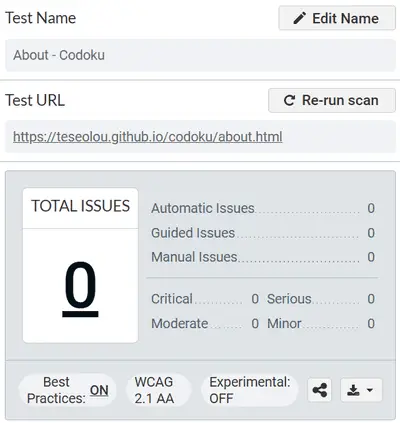

# TESTING.md

## 6. Testing

### Introduction

Testing is a critical component of the development lifecycle and plays an essential role in producing a stable, accessible, and user-friendly application. For a project like **Codoku** — an interactive, browser-based Sudoku game — testing ensures that the interface is not only visually consistent and responsive but also meets accessibility standards, functions correctly across modern devices and browsers, and delivers a smooth user experience.

Codoku was tested using a combination of **automated tools** and **manual techniques** across multiple categories:

- **Code validation** to check compliance with HTML and CSS standards
- **Accessibility evaluation** using tools and hands-on navigation testing
- **Performance and SEO auditing** using Lighthouse
- **Manual interaction testing** for gameplay features
- **Responsive design checks** across a variety of screen sizes
- **Cross-browser compatibility testing**

All issues discovered during testing were documented and resolved, and results are detailed in this document along with screenshots to verify successful validation.

## **6.1 Code Validation**
Validation ensures that the code behind Codoku adheres to current web standards and best practices, helping improve reliability, maintainability, and browser compatibility. 

All HTML, CSS, and JavaScript files were passed through official validation tools such as the [W3C Markup Validator](https://validator.w3.org/), [W3C CSS Validator](https://jigsaw.w3.org/css-validator/), and [JSHint](https://jshint.com/). 

This process helped identify and resolve syntax errors, semantic issues, accessibility oversights, and outdated or unsupported syntax ensuring the final product is stable, clean, and standards-compliant.

### **6.1.1 HTML Validation**

All HTML files (`index.html`, `about.html`, and `404.html`) were validated using the [W3C Markup Validation Service](https://validator.w3.org/). This process checks for syntax errors, deprecated tags, improperly nested elements, and other violations of the HTML5 specification.

#### **`index.html` - Results**
The `index.html` file serves as the main interactive hub of Codoku, housing the Sudoku grid, control buttons, difficulty and timer setup, and all associated modals. It also links to all the key JavaScript and CSS files that power the app’s functionality.

During HTML validation using the W3C Markup Validation Service, a number of informational notices, warnings, and a few errors were flagged. Each was reviewed and resolved during development.

⚠️ Highlighted validation issues:  
- **Trailing slashes on void elements**  
  Multiple lines such as `<meta charset="UTF-8"/>` and `<link rel="stylesheet".../>` triggered info messages like:  
  >> _"Trailing slash on void elements has no effect and interacts badly with unquoted attribute values."_

  These messages appear when self-closing syntax (`/>`) is applied to void elements in HTML5. Although this syntax is not invalid, it can cause unintended effects with certain attribute formatting. All unnecessary slashes were removed for full compliance and best practice.

- **Redundant ARIA roles**  
  HTML5 elements such as `<nav>`, `<footer>`, and `<button>` inherently include appropriate ARIA roles. Instances like `role="navigation"` or `role="button"` were removed to reduce clutter and improve semantic accuracy.

- **Missing or empty headings in sections**  
  Several `<section>` elements were missing descriptive headings or contained empty heading tags. These were addressed by:
  - Adding `<h2>` or `<h3>` tags where needed
  - Replacing `<section>` with `<div>` in purely structural contexts

- **Duplicate `aria-expanded` attribute**  
  A toggle element was found with two `aria-expanded` attributes. One was removed to maintain valid and functional ARIA behavior.

- **Broken ARIA references**  
  One element included `aria-labelledby="alert-modal-label"`, but the corresponding ID was missing from the DOM at the time of validation. This was corrected by ensuring the label element exists with the appropriate `id`.

After implementing all necessary corrections, the file was revalidated and passed without any remaining issues.

  
*Screenshot of W3C validator result showing “No errors or warnings” for index.html*

#### **`about.html` - Results**

The `about.html` page introduces the Codoku project, explains its development context, and provides insight into the design philosophy and purpose of the game. It features descriptive text, responsive layout, and multiple decorative images supported by accessible alt tags.

When tested using the W3C Markup Validation Service, the file initially displayed multiple issues. These were reviewed, corrected, or acknowledged as acceptable where appropriate.

⚠️ Highlighted validation issues:  
- **Trailing slashes on void elements**  
  Numerous tags like `<meta/>` and `<link/>` triggered info-level warnings such as: 
  >> _"Trailing slash on void elements has no effect and interacts badly with unquoted attribute values."_  

  These were corrected by removing the unnecessary slashes, ensuring cleaner and more standards-compliant HTML5 markup.

- **Redundant ARIA roles**  
  The `role` attributes on semantic elements like `<nav>` and `<button>` were removed, as HTML5 already implies these roles.

- **Missing headings in `<section>` elements**  
  Several sections lacked heading tags. According to accessibility and semantic best practices, headings should be present or `<div>` should be used instead. These issues were resolved by adding `<h2>` or `<h3>` where appropriate.

- **Duplicate and conflicting ARIA attributes**  
  A duplicate `aria-describedby` attribute was found and removed, ensuring better assistive technology compatibility.

- **Improper `height` value on `` tags**  
  Images used `height="auto"`, which is invalid in HTML5 and flagged as:  
  >> _"Bad value auto for attribute height on element img: Expected a digit but saw a instead."_  
  
  This was corrected by removing the `height` attribute entirely and allowing Bootstrap’s responsive classes to control scaling.

- **Unclosed HTML elements**  
  An error near the end of the document indicated an unclosed `<main>` tag, leading to:  
  >> _"End tag for body seen, but there were unclosed elements."_  
  
  This was resolved by properly closing all open tags before the end of the document.

After addressing all these concerns, the `about.html` page now passes validation with no remaining errors.


*W3C validator confirmation for about.html with an image report verifying proper alt text usage*

#### **`404.html` - Results**

The `404.html` page is a custom error page displayed when a user attempts to access a route that does not exist. It provides a lighthearted visual message and offers a route back to the homepage to retain user engagement. Like the other pages, it shares the same navigation, modal, and theme-switching logic for consistency across the site.

The file was run through the W3C Markup Validation Service and, like the other pages, returned a number of issues—primarily warnings and a few minor errors. All were addressed through careful revisions.

⚠️ Highlighted validation issues:  
- **Trailing slashes on void elements**  
  Many `<meta/>`, `<link/>`, and `<input/>` tags used trailing slashes that are unnecessary in HTML5. These caused repeated warnings:  
  >> _"Trailing slash on void elements has no effect and interacts badly with unquoted attribute values."_  
  
  All slashes were removed to ensure proper HTML5 compliance.

- **Unnecessary ARIA roles**  
  Elements such as `<nav>`, `<main>`, and `<button>` had redundant `role` attributes which were removed for semantic clarity and cleaner markup.

- **Duplicate attribute**  
  The `aria-expanded` attribute appeared more than once on an element. This was corrected by retaining only a single instance.

- **Section elements missing headings**  
  Several `<section>` tags lacked associated heading elements. To improve semantic structure and accessibility, appropriate heading tags were added or the structure changed to `<div>` where headings were not needed.

- **Invalid image `height="auto"`**  
  One image used the value `auto` in its height attribute, which is invalid:  
  >> _"Error: Bad value auto for attribute height on element img: Expected a digit but saw a instead."_  
  
  This was resolved by removing the `height` attribute altogether and allowing CSS to handle scaling through responsive utility classes like `.img-fluid`.

After resolving all of the above issues, the `404.html` file now passes validation with no outstanding errors or warnings.


*W3C validation result for 404.html indicating no issues and highlighting alt text on images*

  


### **6.1.2 CSS Validation**

The primary stylesheet `style.css` was tested using the [W3C CSS Validation Service](https://jigsaw.w3.org/css-validator/). The validator analyzes the stylesheet for syntax errors, unsupported properties, and incorrect value usage across various levels of CSS.

#### **`style.css` Results**
The style.css file contains all the core styling rules for Codoku, including custom variables, responsive layout structures, theme toggling, dark mode overrides, and component-level styling for modals, the grid, and controls. It supports both light and dark themes and integrates cleanly with Bootstrap to enhance UI consistency and accessibility across screen sizes and devices.

Despite the complexity and breadth of the stylesheet, no errors were reported by the validator. This confirms that the CSS is well-structured, standards-compliant, and compatible with all major browsers.

  
*CSS validator confirmation screen for style.css showing zero errors.*

  


⚠️ Warnings

Although the Codoku `style.css` file passed W3C validation without any errors, the validator did return 17 warnings, which are important to note for transparency and future maintenance.

These warnings were primarily related to:

1. CSS Custom Properties (Variables) 
   > *“Due to their dynamic nature, CSS variables are currently not statically checked.”*  
   - This is a known limitation of the W3C CSS Validator: it cannot evaluate computed styles that rely on custom properties such as `--color-primary` or `--cell-size`. These are used extensively in Codoku to support themes, responsiveness, and modularity.  
   - **Resolution**: No action is required. This is not a fault in the CSS, but a limitation of static analysis tools.

2. Same color for background and border  
   > *“Same color for background-color and border-color”* for selectors such as:  
     ```css
     #sound-switch:checked {
       background-color: #a5f3a5;
       border-color: #a5f3a5;
     }
     ```
   - These are **intentional design choices** meant to create flat, unified UI components. In this context, using the same color is acceptable and visually consistent.

### **6.1.3 JavaScript Validation**

All JavaScript files used in Codoku were validated using [JSHint](https://jshint.com/), a popular static code analysis tool designed to detect errors and potential problems in JavaScript code. The goal of this validation was to ensure that the scripts are syntactically correct, logically sound, and compatible with modern browser environments.

JSHint was configured to evaluate:
- **Cyclomatic complexity**
- **Unused and undefined variables**
- **ES6 syntax support**
- **Browser and jQuery environments**
- **Potential pitfalls**, such as unsafe line breaks or legacy code patterns

This helped identify both technical issues and stylistic problems early in development. Warnings and issues flagged were reviewed and addressed where appropriate, or acknowledged when contextually valid (e.g. use of globally defined functions or modular dependencies).

#### **`init.js` - Results**
The `init.js` file contains logic related to page initialization and UI setup. It includes functions to launch modals, configure toggles, and prepare the game interface on page load.

- **Functions defined**: 3  
- **Cyclomatic complexity**: 3 (well within acceptable range)  
- **Largest function**: 11 statements  
- **Unused variable**: `showAlertModal` (declared but not invoked inside this file)  
- **Undefined variables**:  
  - `bootstrap`  
  - `setupOutsideNavbarCollapse`  
  - `setupThemeSwitch`  
  - `setupStartButton`  
  - `setupSoundToggle`  
  These are all defined in other modular scripts and imported via `<script>` tags, which JSHint does not track.

No functional or structural issues were flagged, and the code was confirmed as valid and browser-ready.

  
*JSHint analysis summary for `init.js` showing no major issues and clean logic structure*

#### **`game.js` Results**

The `game.js` file contains the majority of Codoku’s interactive logic, including grid rendering, puzzle population, user input handling, win condition checking, timer management, and hint functionality. As the largest and most complex script in the project, it was particularly important to validate this file thoroughly to ensure it was well-structured, efficient, and error-free.

- **Functions defined**: 47  
- **Largest function**: 32 statements  
- **Cyclomatic complexity**: Max value = 11 (acceptable for a dynamic UI with multiple branches)  
- **Unused variable**:  
  - `startNewGame` (declared but not directly used within this file)  
- **Undefined variables**:  
  - `isSoundEnabled`  
  - `showAlertModal`  
  - `confetti`  
  - `bootstrap`  

These undefined variables are expected and justified:
- `isSoundEnabled`, `showAlertModal` are defined in separate utility files (`sound.js`, `init.js`)
- `confetti` comes from a third-party script
- `bootstrap` refers to Bootstrap’s modal functionality imported via CDN

⚠️ One warning was generated:  
>> *Optional chaining is only available in ES11*  

```js
console.error('Error:', response?.responseText || 'No response');
```

This syntax checks whether the response object exists before attempting to access its responseText property. If response is undefined or null, the optional chaining prevents the script from throwing an error, and instead safely falls back to 'No response'. 

This is used to safely access response objects like `response?.responseText` and is supported in modern browsers. All modern browsers (Chrome, Firefox, Edge, Safari) fully support optional chaining. Since Codoku is intended for modern environments and ES6+ syntax is enabled, this is not a concern. However, to enhance compatibility with older browsers and avoid relying on this ES11-specific syntax, the logic was updated to a manual null check.

```js
if (response && response.responseText) {
    console.error('Error:', response.responseText);
} else {
    console.error('Error: No response');
}
```

This alternative performs the same check in a way that is compatible with ES5/ES6 environments. It ensures the error message is displayed correctly without relying on modern syntax. This change was made specifically in the `fetchSudokuBoard()` function to ensure broader browser support.

  
*JSHint validation for `game.js` showing clean structure, modular logic, and minor contextual warnings*

#### **`navbar.js` - Results**

The `navbar.js` file manages sound feedback and the responsive collapse behavior of the navigation bar, particularly for mobile users. It also provides logic for detecting external clicks and intercepting in-app navigation events to enhance UX and avoid accidental game loss.

- **Functions defined**: 11  
- **Cyclomatic complexity**: Max value = 7 (within acceptable limits for UI event logic)  
- **Unused variable**:  
  - `setupOutsideNavbarCollapse` (used externally from `init.js`)  
- **Undefined variables**:  
  - `isSoundEnabled`  
  - `bootstrap`  

These warnings are considered **contextually valid**:
- `isSoundEnabled` is declared globally in `sound.js` and accessed here to control whether audio plays.
- `bootstrap` is included globally via the Bootstrap CDN and is used to trigger collapse and modal APIs, which are not explicitly imported in this script.

No syntax errors or structural flaws were found. The logic follows best practices for DOM event handling, modal interaction, and clean integration with Bootstrap’s JavaScript components.

  
*JSHint validation for `navbar.js` showing minor external reference warnings and otherwise clean structure*

#### **`setup-modal.js` - Results**

The `setup-modal.js` file is a concise script responsible for linking the "Start" button in the setup modal to game initialization. When the button is clicked, it closes the modal using Bootstrap's modal API and then starts a new Codoku session by calling the `startNewGame()` function. This ensures a smooth and clean transition from setup to gameplay.

- **Functions defined**: 2  
- **Largest function**: 5 statements  
- **Cyclomatic complexity**: 2 (very low, indicating clean control flow)  
- **Unused variable**:  
  - `setupStartButton` (declared but called externally by `init.js`)  
- **Undefined variables**:  
  - `bootstrap` (used for modal interaction via CDN)  
  - `startNewGame` (defined elsewhere in `game.js`)

These undefined variables are expected in this context:
- Bootstrap's modal system is accessed via a global `bootstrap` object from the CDN.
- The `startNewGame` function is declared globally in another file and called here to initialize gameplay.

JSHint flagged no functional errors or warnings in this file. The script is clean, minimal, and integrates well with the wider codebase.

  
*JSHint validation for `setup-modal.js` confirming clean logic, appropriate modularity, and no critical issues*

#### **`sound.js` - Results**

The `sound.js` file manages the user’s sound preferences for the application. It initializes sound settings, syncs UI controls with saved preferences using `localStorage`, and ensures the toggle state persists across sessions. Although it doesn’t directly handle audio playback, it defines a global flag (`isSoundEnabled`) used throughout other modules to conditionally play sounds.

- **Functions defined**: 3  
- **Largest function**: 7 statements  
- **Cyclomatic complexity**: 5 (well within normal range for conditional UI logic)  
- **No unused or undefined variables** were flagged.  
- **No warnings or errors** were returned by JSHint.

All logic is encapsulated and cleanly separated into modular functions (`applySoundSetting`, `setupSoundToggle`), enhancing maintainability and ensuring predictable behavior across the app. The `DOMContentLoaded` listener ensures correct initialization before any interaction can occur.

  
*JSHint output for `sound.js` confirming clean, modular sound preference logic and no issues detected*

#### **`theme.js` - Results**

The `theme.js` script is responsible for managing the application's visual theme toggle (light/dark mode). It reads from `localStorage` to apply the user's previously selected theme on page load and dynamically updates the UI theme, switch state, button styles, and accessibility settings.

- **Functions defined**: 5  
- **Largest function**: 8 statements  
- **Cyclomatic complexity**: 5 (expected for conditional UI rendering)  
- **Undefined variable**:  
  - `isSoundEnabled` (declared globally in `sound.js`)  
- **No unused variables** or errors were detected.

The script is clean, well-commented, and uses modular logic to keep the theme functionality separated from the rest of the app. jQuery is used to streamline DOM manipulation, and the script also incorporates audio feedback through conditional playback of themed sound effects ("tweet" for light, "hoot" for dark).

  
*JSHint analysis of `theme.js` confirming one globally declared dependency and otherwise sound, accessible logic*

## **6.2 Accessibility Testing**

Accessibility is a core consideration in the development of Codoku, ensuring that the game is usable by people of all abilities and assistive technologies. The goal was to create an inclusive experience by following the principles of WCAG 2.1 (Web Content Accessibility Guidelines), focusing on perceivability, operability, understandability, and robustness.

Accessibility testing was conducted using both **automated tools** and **manual techniques** to evaluate:

- **Semantic HTML structure** - Ensuring that elements such as headings, landmarks, and lists follow a logical order and meaningful structure.

- **ARIA roles and labels** - Verifying that interactive components (e.g. modals, toggles, buttons) use appropriate `aria-*` attributes for screen reader compatibility.

- **Keyboard navigation** - Manually testing tab order, focus states, and accessibility of all interactive elements without using a mouse.

- **Color contrast and visual clarity** - Validated via automated tools and manual inspection to meet contrast ratio requirements, especially between text and background in both light and dark modes.

- **Alt text for images** - Confirming that all decorative and informative images include appropriate `alt` attributes to provide context to screen reader users.

- **Screen reader simulation** - Using NVDA to assess how the application content is announced and navigated.

#### **Tools Used for Accessibility Testing**

| Tool | Description |
|------|-------------|
| WAVE Web Accessibility Evaluation Tool | Identifies structural and semantic issues, including missing alt attributes, headings, and ARIA landmarks. |
| Accessibility Checker by CKSource | Provides quick audits and visual feedback on accessibility issues in real time. |
| axe DevTools (Deque Systems) | Browser extension used in developer tools to find and explain WCAG violations within the app. |
| Google Chrome Lighthouse | Generates automated accessibility reports covering contrast, ARIA usage, keyboard support, and more. |
| NVDA (NonVisual Desktop Access) | Screen reader for Windows used to test how visually impaired users experience and navigate the app. |

### **6.2.1 WAVE Accessibility Testing**

[WAVE](https://wave.webaim.org/) (Web Accessibility Evaluation Tool) is an automated tool developed by WebAIM for assessing accessibility issues directly within web pages. It identifies errors, warnings (alerts), structural elements, and ARIA usage while visually overlaying them on the interface for quick interpretation.

#### **`index.html` Results**

The following results summarize the evaluation of `index.html` using WAVE, along with screenshots that document the results and key observations.

   
*WAVE accessibility summary for index.html showing no errors and several structural or semantic suggestions*

#### ⚠️ Alerts
The majority of alerts were related to *Possible heading* issues.

WAVE flagged 61 elements due to the use of visually prominent styles (e.g. bold or larger text inside `<p>` tags) in the Sudoku grid. These elements were interpreted as potential headings even though they were intentionally not semantic headings.

  
*WAVE accessibility scan showing multiple "possible heading" alerts (orange h? icons) across a Sudoku grid.*

These alerts do not indicate code errors but are suggestions to assess whether additional heading structure might benefit assistive technology users. In this case, the elements should not be semantic headings, as they represent game data and not content sections. The alert was reviewed and accepted as not requiring a change.

Wave also flagged 2 *HTML5 audio/video* alerts. These refer to the use of `<audio>` elements. WAVE flags these to ensure that alternative content is present for users with hearing impairments or that audio is not played automatically. In **Codoku** these `<audio>` tags are responsible for the `error` and `timeout` alert sounds which are non-autoplay and do not contain controls as they are programmatically operated.

#### ✅ Accessibility Enhancements
| Feature Type   | Count | Explanation                                                                 |
|----------------|-------|-----------------------------------------------------------------------------|
| Form Labels    | 9     | Each toggle or radio input has an associated `<label>`.                     |
| Fieldsets      | 3     | Radio inputs (difficulty, timer) are grouped in `<fieldset>` containers.   |
| Language       | 1     | `lang="en"` is declared in the `<html>` tag for screen reader compatibility.|

  
*Accessibility features detected by WAVE such as labels, fieldsets, and language setting.*

These features improve screen reader interpretation, group related content meaningfully, and promote proper pronunciation of content.

#### 🧱 Semantic Layout
| Element Type       | Count | Purpose                                                                   |
|--------------------|-------|---------------------------------------------------------------------------|
| Heading Level 1    | 2     | Used for top-level titles (e.g., modals or main page header).             |
| Heading Level 2    | 36    | Used for modal titles, section headers, and UI labels.                    |
| Unordered Lists    | 2     | Represent bullet points or grouped navigation content.                    |
| **Semantic Landmarks** |||
| - Header           | 1     | Defines site or app banner at top of page.                                |
| - Navigation       | 1     | Provides primary nav links for the app.                                   |
| - Main             | 1     | Contains central game content.                                            |
| - Footer           | 1     | Houses credits and external links.                                        |
| - Aside            | 3     | Includes supporting areas like settings, rules, or instructions.          |

   
*Clear document structure with semantic use of headers, landmarks, and layout roles enhancing screen reader performance.*

These elements support keyboard and screen reader navigation by defining meaningful page structure.

#### 🗣️ Assistive Tech Support
A total of 53 ARIA attributes were identified, used appropriately across the interface.

| ARIA Type             | Example Use                                         |
|-----------------------|-----------------------------------------------------|
| `aria-label` / `aria-labelledby` | Describes toggles and modal labels               |
| `aria-describedby`    | Links inputs or modals to descriptions               |
| `aria-hidden`         | Hides decorative or duplicate elements               |
| `aria-expanded`       | Indicates state of collapsible content               |
| `aria-controls`       | Links toggles to their target elements               |
| `aria-live`           | Ensures dynamic feedback is announced                |
| `aria-tabindex`       | Manages keyboard focus behavior                      |

  
*WAVE detected 53 properly used ARIA attributes supporting accessibility, including labels, hidden states, and live regions.*

No misuse, duplication, or inconsistencies were found during the ARIA attribute audit. These attributes significantly improve context for users relying on screen readers.

#### ⌨️ Keyboard Accessibility
Using WAVE’s Order panel, the keyboard tab order was confirmed to be logical, linear, and intuitive. The navigation follows a top-to-bottom, left-to-right flow that matches the visible layout.

  
*Logical and sequential keyboard navigation order as tested through WAVE’s Order panel, ensuring user-friendly interaction.*

This ensures that users navigating by keyboard or screen reader can access all functions without confusion or disorientation.

#### **👁️ Contrast Validation**
The WAVE contrast checker evaluates color pairings against the [WCAG 2.1](https://www.w3.org/WAI/WCAG21/quickref/) contrast criteria:

- **WCAG AA**: Minimum contrast ratio of **4.5:1** for normal text
- **WCAG AAA**: Minimum contrast ratio of **7:1** for enhanced accessibility

  
*WAVE contrast checker result for Codoku showing high readability and full WCAG compliance*

This result indicates that the interface text meets both standard and enhanced guidelines for readability.

#### **`about.html` Results**

The following results summarize the WAVE accessibility evaluation of the `about.html` page. 

  
*Accessibility summary from WAVE showing no errors, no contrast issues, and several positive features.*

#### ✅ Accessibility Enhancements
| Feature Type     | Count | Explanation                                                                            |
|------------------|-------|----------------------------------------------------------------------------------------|
| Alternative Text | 3     | All decorative and content images include descriptive `alt` text for screen readers.  |
| Form Labels      | 2     | Inputs and controls (if any) are correctly labeled with `<label>` elements.           |
| Language         | 1     | The document includes a `lang="en"` attribute to assist with pronunciation.           |

  
*WAVE reports all form labels, image alt text, and language metadata are properly implemented.*

#### 🧱 Semantic Layout
| Element Type       | Count | Purpose                                                                  |
|--------------------|-------|--------------------------------------------------------------------------|
| Heading Level 1    | 1     | Used for the main page heading (“About”).                                |
| Heading Level 2    | 8     | Applied to each major section (e.g., content segments, modals).          |
| Unordered Lists    | 2     | Used to present bullet point information.                                |
| **Semantic Landmarks** |||
| - Header           | 1     | Contains branding and page title.                                        |
| - Navigation       | 1     | Provides primary links to other parts of the site.                        |
| - Main             | 1     | Wraps the primary content of the about page.                             |
| - Footer           | 1     | Includes social links and acknowledgements.                              |
| - Aside            | 2     | Houses supporting content like rules and accessibility notices.          |

  
*Clear heading structure and proper use of semantic regions enhance screen reader and keyboard navigation.*

#### 🗣️ Assistive Tech Support
A total of 32 ARIA attributes were identified and correctly applied throughout the page.

| ARIA Type           | Example Use                                                |
|---------------------|------------------------------------------------------------|
| `aria-label`        | Identifies buttons and landmarks (e.g., menu toggle).      |
| `aria-description`  | Supports screen readers by giving context to complex items.|
| `aria-hidden`       | Hides non-essential or visual-only elements from AT users. |
| `aria-tabindex`     | Maintains accessible focus order for modals and controls.  |
| `aria-expanded`     | Indicates open/close state of collapsible UI elements.     |
| `aria-popup`        | Alerts assistive tools about modal behavior when triggered.|

  
*WAVE detected structured and properly scoped ARIA usage supporting screen reader accuracy and dynamic UI interaction.*

No errors or duplications were flagged, and all ARIA implementations followed best practice.

#### ⌨️ Keyboard Accessibility
The tab order was linear, logical, and matched the visual layout of the page. No keyboard traps were found, and the order prioritized major sections first (theme/sound switches, main nav, content, then external links).

  
*Sequential keyboard navigation order ensuring smooth screen reader and tabbing behavior.*

#### 👁️ Contrast Validation
Contrast checks performed on the `about.html` page yielded **no failures**. All text foreground/background color pairings meet or exceed WCAG 2.1 AA and AAA standards.

  
*Text contrast meets accessibility standards for all text sizes and themes.*

#### **`error.html` Results**

The following results summarize the WAVE accessibility evaluation of `error.html`, Codoku’s 404 error page. 

  
*WAVE accessibility summary showing zero errors and a well-structured layout.*

#### ✅ Accessibility Enhancements
| Feature Type   | Count | Explanation                                                             |
|----------------|-------|-------------------------------------------------------------------------|
| Alternative Text | 1   | All relevant images include descriptive alt text for screen readers.   |
| Form Labels    | 2     | Form inputs (e.g., toggle switches) are correctly associated with labels.|
| Language       | 1     | `lang="en"` is declared in the `<html>` element for screen reader support.|

  
*Detected accessibility features including form labels, language attribute, and appropriate image alt text.*

These enhancements help ensure compatibility with screen readers and improve usability for users with assistive technology.

#### 🧱 Semantic Layout
| Element Type       | Count | Purpose                                                             |
|--------------------|-------|---------------------------------------------------------------------|
| Heading Level 1    | 1     | Defines the main title of the error message.                        |
| Heading Level 2    | 6     | Used to label sections or explain content visually.                 |
| Unordered Lists    | 2     | Present grouped navigation or links.                                |
| **Semantic Landmarks** |||
| - Navigation       | 1     | Contains main navigation links.                                     |
| - Main             | 1     | Hosts the central content and visual of the error message.          |
| - Footer           | 1     | Provides social links and site credits.                             |
| - Aside            | 2     | Includes supporting details such as rules or extra messages.        |

  
*Logical semantic structure with proper landmarks and header levels enhances navigability.*

This structure improves orientation, keyboard navigation, and screen reader parsing by following a meaningful page hierarchy.

#### 🗣️ Assistive Tech Support
A total of 32 ARIA attributes were identified on the page, applied appropriately to enrich accessibility.

| ARIA Type             | Example Use                                            |
|-----------------------|--------------------------------------------------------|
| `aria-label`          | Provides names for toggles and links.                  |
| `aria-describedby`    | Connects interactive elements to additional instructions. |
| `aria-hidden`         | Hides decorative icons from assistive tech.            |
| `aria-expanded`       | Indicates visibility status of collapsible content.    |
| `aria-tabindex`       | Controls keyboard tab flow.                            |
| `aria-popup`          | Describes elements that trigger popups or modals.      |

  
*WAVE audit showing extensive, correctly used ARIA attributes for screen reader compatibility.*

No issues or redundant uses were detected, confirming a well-implemented ARIA layer.

#### ⌨️ Keyboard Accessibility
WAVE’s Order panel confirmed that tab navigation flows in a logical and predictable manner. The sequence reflects visual positioning and groups related items logically.

| Tab Order | Element Description                     |
|-----------|------------------------------------------|
| 1         | Switch: Display                          |
| 2         | Switch: Sound                            |
| 3         | Button: Game                             |
| 4         | Button: About                            |
| 5         | Button: Rules (links to rules modal)     |
| 6         | Button: Return to homepage               |
| 7         | Link: Facebook Page                      |
| 8         | Link: Instagram Page                     |
| 9         | Link: X Page                             |

  
*Keyboard tab order confirmation showing clear and linear focus path.*

This helps keyboard users reach all interactive content without confusion or barriers.

#### **👁️ Contrast Validation**
The color contrast checker in WAVE verified that all text met the WCAG 2.1 minimum standards:

  
*Strong contrast between foreground and background ensures readability for visually impaired users.*

This ensures the page remains accessible to users with low vision or color blindness.

### **6.2.2 AccessibilityChecker Testing**

To further ensure Codoku’s compliance with WCAG 2.2 accessibility standards, automated testing was conducted using [AccessibilityChecker.org](https://www.accessibilitychecker.org/). This tool scans pages for common accessibility issues across categories including semantic structure, ARIA usage, visual contrast, interaction behavior, and assistive technology compatibility.

AccessibilityChecker evaluates each page against critical and non-critical criteria, assigning an audit score and flagging required manual audits. It is particularly useful for identifying violations that may affect screen reader users, keyboard-only navigation, and overall structural clarity.

The audit includes:
- **Automated checks**: e.g., landmark nesting, heading structure, focusable elements, ARIA attribute validation.
- **Manual audit prompts**: e.g., screen reader behavior, dynamic content focus, and visible focus indicators.
- **Severity grading**: Issues are classified as critical, passed, manual, or not applicable based on WCAG 2.2.

Each page was tested individually and iteratively updated based on feedback until a **100% audit score** was achieved. The following subsections document findings and resolutions for each HTML file.

#### **`index.html` Results**

The `index.html` page was audited using and the initial scan reported 4 critical issues, placing the page in a *Not Compliant* state with an audit score of 89%.


*Initial audit result showing non-compliance due to 4 critical issues and a score below the recommended accessibility threshold.*

⚠️ Flagged Issues and Fixes

1. Complementary Landmarks Nested Incorrectly  
    - **Issue**: Three `<aside>` elements were improperly nested inside other ARIA landmarks such as `<main>` or `<footer>`.  
    - **Why It Matters**: The `<aside>` element represents complementary content and must not be nested within primary content regions. Nesting it incorrectly can confuse screen reader users who rely on proper landmark structure.  
    - **Fix Applied**: Each `<aside>` was changed to a `<div>` element.

2. Heading Lacked Discernible Text 
    - **Issue**: A heading (`<h2 id="clear">`) only contained an icon with no readable or spoken text.  
    - **Why It Matters**: All headings must include meaningful content that is either visually visible or screen-reader accessible. This helps users understand page hierarchy and purpose.  
    - **Fix Applied**: A visually hidden but screen-readable span was added:
        ```html
        <h2 id="clear">
            <i class="fa-solid fa-delete-left" aria-hidden="true"></i>
            <span class="visually-hidden">Clear Cell</span>
       </h2>
        ```   
        This ensures assistive technology can read the heading without affecting the visual design.

✅ Final Result: Compliant

After applying the necessary changes, the page was re-tested and passed all criteria, achieving a 100% audit score and full WCAG 2.2 compliance.


*Audit confirmation showing full compliance with WCAG 2.2 standards and a perfect accessibility score.*

#### **`about.html` Results**

Following the initial audit of `about.html`, the page scored **95%** due to two flagged issues involving improperly nested `<aside>` landmarks.

  
*Automated audit of `about.html` shows a 95% score with 2 critical issues pending resolution.*

⚠️ Flagged Issues and Fixes

- **Issue**: The audit detected two `<aside>` elements that were incorrectly nested within `<main>` and `<footer>` regions. This violated the WCAG 2.2 guideline requiring that complementary landmarks (e.g. `<aside>`) not be nested inside other landmark roles such as `main`, `contentinfo`, or `banner`.

- **Why It Matters**: Improper nesting can cause confusion for screen reader users, who rely on a clear and predictable landmark structure for navigating the page semantically.

- **Fix Applied**: To resolve this issue, both `<aside>` elements were refactored into `<div>` elements. Since the affected containers did not function as true complementary regions—i.e., they didn't hold standalone supplemental content—the semantic role of `<aside>` was unnecessary and incorrectly applied.

**Before:**
```html
<aside class="d-flex align-items-center gap-1">...</aside>
<aside id="copyright-info">© 2025 Codoku Game Project</aside>
```

**After:**
```html
<div class="d-flex align-items-center gap-1">...</div>
<div id="copyright-info">© 2025 Codoku Game Project</div>
```
This change preserved the visual and functional layout while restoring semantic correctness for assistive technologies.

✅ Final Result: Compliant  

After applying the fix, about.html was rescanned and passed all tests with a perfect 100% audit score, confirming full compliance with WCAG 2.2.

  
*After addressing structural landmark issues, the `about.html` page achieved full WCAG 2.2 compliance with a perfect score.*

**Accessibility Certification**

While the individual `error.html` (404 error page) could not be directly scanned using AccessibilityChecker, a full domain audit was conducted on `teseolou.github.io`. The domain as a whole passed all manual and automated accessibility checks.

  
*AccessibilityChecker.org certificate confirming full compliance with WCAG 2.1 A/AA/AAA and WCAG 2.2 A/AA standards.*

This certificate confirms that the domain complies with:

- **WCAG 2.1 A, AA, AAA**
- **WCAG 2.2 A, AA**

This suggests that all accessible content served from the domain, including the `error.html` page, meets stringent accessibility criteria, even if the 404 page itself could not be isolated for testing. As a result, the `error.html` page can be considered implicitly compliant within the validated context of the domain.

### **6.2.3 Axe DevTools Testing**

axe DevTools is a professional-grade accessibility auditing solution developed by Deque Systems. It integrates with browser developer tools (e.g., Chrome DevTools) to automatically detect WCAG 2.1/2.2 violations during live site usage. It supports static page scans and monitors dynamic content changes such as modal openings, page transitions, and UI state updates.

#### **User Flow Audit**

On **June 25, 2025**, a full interactive session was recorded and audited using axe DevTools. This test followed the typical user journey from the homepage through multiple interface states, modal interactions, navigation to the About page, a 404 error test, and return navigation, all while monitoring for accessibility violations.

Test Configuration:
- **Starting URL**: [https://teseolou.github.io/codoku/index.html](https://teseolou.github.io/codoku/index.html)
- **WCAG Conformance Level**: 2.1 AA
- **Total Unique Issues Found**: `0`
- **Total Critical/Serious/Minor Issues**: `0`

Recorded User Flow:

1. Load index.html (landing page)
2. Interact with game toggles (Display, Sound)
3. Open each modal (Game, About, Rules)
4. Trigger game UI interactions (e.g., New Game, Check Grid)
5. Navigate to about.html via in-app link
6. Test interaction elements on about.html
7. Manually input an incorrect URL to trigger 404 page (aout.html)
8. Interact with elements on 404 page
9. Return to homepage (index.html)

Each dynamic state transition and page navigation was scanned in real time. All transitions, including the fallback 404 error route, returned zero accessibility issues.

  
*axe DevTools WCAG 2.1 AA audit confirming zero accessibility issues across full user interaction flow.*

This confirms that the Codoku project’s interactive experience is robust, inclusive, and compliant under thorough state-based accessibility testing.

#### **Axe DevTools Page Scans**

Axe DevTools was used to run automated accessibility scans on individual pages of the Codoku project to confirm compliance with WCAG 2.1 AA standards and best practices.

Each page was scanned using default rulesets with “Best Practices” enabled, ensuring broad and thorough testing of accessibility issues, including structural semantics, ARIA, color contrast, keyboard focus, and content labeling.

`index.html` Results


*The main Codoku game interface was scanned and no issues were found. All automated, guided, and manual tests returned zero critical, serious, moderate, or minor issues.*

`about.html` Results



*The About page passed the audit with zero detected issues, confirming correct heading structure, semantic elements, and accessible content flow.*

`404.html` Results


*404 error page was scanned to ensure users who land on broken URLs are met with a page that meets accessibility standards.*

All three tested pages, `index.html`, `about.html`, and the `404.html` page, scored zero total issues, with no violations detected across automatic, guided, or manual checks. The scans confirmed full conformance with WCAG 2.1 AA standards and accessibility best practices, demonstrating a consistent and inclusive design throughout the domain. 

### **6.2.4 Lighthouse Accessibility Testing**

Lighthouse is an automated tool integrated into Chrome DevTools used to audit web pages for performance, SEO, best practices, and accessibility. This section documents Lighthouse’s accessibility evaluation of the Codoku project under both desktop and mobile conditions.

#### **`index.html` Results**

Desktop Audit:
- **Score:** 100
- **Captured:** June 25, 2025 – 12:12 PM GMT+1
- **Environment:** Emulated Desktop (Custom throttling)
- **Passed Audits (25)**:
  - Valid ARIA roles and attribute usage
  - No deprecated or misused ARIA roles
  - Buttons and links include accessible names
  - Sufficient contrast between foreground and background colors
  - Document contains a valid `<title>` and `<html lang>`
  - Touch targets are appropriately sized
  - Semantic HTML structure with correct heading order
  - No `[tabindex]` values greater than 0
  - All form elements have associated labels

Mobile Audit:
- **Score:** 100
- **Captured:** June 25, 2025 – 12:15 PM GMT+1
- **Device:** Emulated Moto G Power
- **Network:** Slow 4G throttling
- **Passed Audits (23)**:
  - All ARIA and semantic structure checks also passed on mobile
  - Touch targets verified under mobile constraints
  - Accessibility maintained under reduced screen size

Key Passed Checks:
| Audit Category                          | Result |
|----------------------------------------|--------|
| ARIA roles and attribute usage         | ✅  |
| Labels for form controls               | ✅  |
| Contrast ratio (foreground/background) | ✅  |
| Heading order and semantics            | ✅  |
| Keyboard navigation and focus order    | ✅  |
| Touch target spacing                   | ✅  |
| `<html lang>` and `<title>` present    | ✅  |


#### **`about.html` Results**

Desktop Audit:
- **Score:** 100  
- **Captured:** June 25, 2025 – 12:24 PM GMT+1  
- **Environment:** Emulated Desktop (Custom throttling)  
- **Passed Audits (27)**:
  - Valid ARIA roles and attribute usage
  - No deprecated or misused ARIA roles
  - Buttons and links include accessible names
  - Sufficient contrast between foreground and background colors
  - Document contains a valid `<title>` and `<html lang>`
  - Touch targets are appropriately sized
  - Semantic HTML structure with correct heading order
  - No `[tabindex]` values greater than 0
  - Image elements use appropriate `alt` text
  - Links are distinguishable without relying solely on color

Mobile Audit:
- **Score:** 100  
- **Captured:** June 25, 2025 – 12:26 PM GMT+1  
- **Device:** Emulated Moto G Power  
- **Network:** Slow 4G throttling  
- **Passed Audits (24)**:
  - All ARIA and semantic structure checks also passed on mobile
  - Touch targets verified under mobile constraints
  - Image alt text and link accessibility confirmed under mobile display
  - Accessibility maintained under reduced screen size

Key Passed Checks:
| Audit Category                          | Result |
|----------------------------------------|--------|
| ARIA roles and attribute usage         | ✅     |
| Labels for form controls               | ✅     |
| Contrast ratio (foreground/background) | ✅     |
| Heading order and semantics            | ✅     |
| Keyboard navigation and focus order    | ✅     |
| Touch target spacing                   | ✅     |
| `<html lang>` and `<title>` present    | ✅     |
| Accessible image `alt` text            | ✅     |


#### **`404.html` Results**

Lighthouse displayed a warning due to the test being run on a mistyped URL (`inex.html`) which returned a 404 status. Despite the error, the 404 page itself loaded correctly and was evaluated.

Desktop Audit:
- **Score:** 100
- **Captured:** June 25, 2025 – 12:30 PM GMT+1
- **Environment:** Emulated Desktop (Custom throttling)
- **Passed Audits (26)**:
  - ARIA attributes are valid and correctly used
  - Buttons and images have accessible names
  - Sufficient contrast and semantic structure
  - No `[tabindex]` greater than 0
  - Correct use of `<title>`, `<html lang>`, and heading order

Mobile Audit:
- **Score:** 100
- **Captured:** June 25, 2025 – 12:28 PM GMT+1
- **Device:** Emulated Moto G Power
- **Network:** Slow 4G throttling
- **Passed Audits (23)**:
  - Accessibility maintained under reduced viewport
  - Focusable elements and roles confirmed to be valid
  - No errors or violations found under mobile testing conditions

Key Passed Checks:
| Audit Category                          | Result |
|----------------------------------------|--------|
| ARIA roles and attribute usage         | ✅     |
| Accessible names for controls and media| ✅     |
| Contrast ratio (foreground/background) | ✅     |
| Heading structure and semantics        | ✅     |
| Touch targets and keyboard navigation  | ✅     |
| `<html lang>` and `<title>` present    | ✅     |


### 6.2.5 Screen Reader Accessibility Testing 

Screen reader testing is a critical manual process to ensure that users relying on auditory feedback can navigate and understand a website's structure, content, and interactive features. While automated tools can check for technical correctness, they cannot evaluate usability from a blind user's perspective. 

To thoroughly assess screen reader compatibility, I used NVDA (NonVisual Desktop Access), a free and widely respected screen reader for Windows, combined with keyboard-only navigation.

| Test Area                             | Outcome | Notes                                                                 |
|--------------------------------------|---------|-----------------------------------------------------------------------|
| Headings are semantically structured | ✅      | Headings follow logical hierarchy (h1 → h2 → h3…)                     |
| Links are descriptive                | ✅      | No "click here" or ambiguous links; all convey purpose independently |
| Buttons have accessible labels       | ✅      | Buttons include visible text or `aria-label` when needed             |
| Forms have associated labels         | ✅      | All input fields announced with their corresponding labels           |
| Landmarks announced and navigable    | ✅      | NVDA recognized `<header>`, `<nav>`, `<main>`, `<footer>` etc.       |
| Modals announce content on open      | ✅      | Focus moves to modal; content is announced properly                  |
| Focus returns to trigger on close    | ✅      | After closing modals, focus returns to the last trigger              |
| Grid cells readable to screen readers| ⚠️      | Grid cell values are read aloud, but cells lack semantic structure and labels for navigation |


⚠️ **Grid Cell Screen Readability**:  
Special attention was given to the Sudoku grid and number selection container, as these are inherently visual features. The grid is composed of `<p>` elements and styled containers to represent cells, which are not natively semantic. Screen readers interpret these elements based on their HTML role, not their visual layout.
This presented a unique challenge:
- Grid cells could be misinterpreted as headings due to visual styling (large font, bold text).
- Interactive number buttons needed to be announced clearly with their role and label.

To resolve this clear ARIA roles and `aria-label` attributes were added where possible and visually hidden text (`.visually-hidden`) was used to describe buttons. The result is a Sudoku grid that is screen reader-friendly without exposing unnecessary layout noise, allowing non-visual users to understand what is happening contextually when numbers are selected or errors occur. 

The NVDA screen reader test confirmed that all key elements, headings, links, buttons, forms, and landmarks, were properly recognized and navigable. Additional effort was applied to optimize the grid and number selection areas, which were successfully adapted to ensure clarity and usability for screen reader users.

### 6.2.6 Keyboard Navigation & Focus Management Testing

Keyboard navigation is critical for ensuring that all users — including those with mobility impairments or who prefer not to use a mouse — can interact with a website effectively. This section tests that **Codoku** is fully navigable using only the keyboard through standard inputs like `Tab`, `Shift+Tab`, `Enter`, `Escape`, and the arrow keys.

To conduct this test, the mouse was disabled, and the interface was explored solely using the keyboard. These checks help ensure a consistent, frustration-free experience for all users, especially those relying on assistive technologies.

| Test Area                                | Outcome | Notes                                                                 |
|------------------------------------------|---------|-----------------------------------------------------------------------|
| `Tab` key reaches all focusable items    | ✅      | Navigation covers all buttons, toggles, links, and modals            |
| `Shift+Tab` allows backward navigation   | ✅      | Reverse tabbing worked consistently                                  |
| `Enter`/`Space` activates components     | ✅      | Buttons and links trigger actions as expected                        |
| Arrow key navigation in controls         | ✅      | Used for toggling radio options like difficulty and timer            |
| Modals can be exited with `Escape`       | ✅      | All modals close correctly and restore focus                         |
| Focus order is logical and follows DOM   | ✅      | Navigation sequence matches visual layout                            |
| Focus indicators are visible             | ✅      | Each interactive item shows clear visual focus cues                  |
| No keyboard traps                        | ✅      | User can freely enter and exit all interactive regions               |
| Skip link is present and functional      | ✅      | `Skip to content` link jumps directly to the main section            |
| Keyboard interaction with toggle switches | ✅     | Theme and sound switches are now fully keyboard-operable with `Space`|
| Inputting Sudoku numbers via keyboard    | ✅      | Once a cell is selected, number keys can input values as intended    |
| Selecting individual Sudoku cells        | ❌      | Grid cells are not directly focusable or selectable via keyboard     |

⚠️ **Grid Cell Selection via Keyboard**:   
Although entering numbers works perfectly once a cell is selected, the cells themselves are not accessible via keyboard focus. They currently cannot be selected without a mouse. A suggested improvement in future development would be to implement each cell as a focusable element (e.g. a `<button>` or `<input>`), or apply `tabindex="0"` with keyboard event listeners and accessible `aria-label`'s. This would enable seamless keyboard interaction for grid navigation. Due to the limited time scope of the project, implementing full keyboard-accessible grid navigation was not feasible within the available development window. However, it remains a strong candidate for future accessibility enhancements, as the task involves significant structural and ARIA rewiring of the Sudoku grid.
 
**Codoku** performs well in keyboard accessibility testing. Navigation order, focus indicators, modals, and interactive controls function as expected. With toggle switches fully operable and number inputs working, the main limitation is keyboard-based grid cell selection — resolving this would ensure full parity for non-pointer users.

### **6.2.7 Interactive Accessibility Testing**
Interactive accessibility testing focuses on how well dynamic and user-driven components function across different contexts and devices — especially for users with motor, cognitive, or sensory impairments. While screen readers and keyboard tests assess static and navigational content, this step ensures interactive experiences like modals, media, and mobile inputs behave accessibly.

Testing included audio control accessibility, mobile responsiveness, touch target sizing, and support for accessibility-friendly zooming and gestures.

| Test Area                        | Description                                                                                   | Result |
|----------------------------------|-----------------------------------------------------------------------------------------------|--------|
| Video/audio controls         | Ensure media is accessible, captions provided or non-critical (Codoku uses non-visible `<audio>`) | ✅     |
| Media pause/play support     | No autoplaying media; all audio triggered intentionally via UI                               | ✅     |
| Touch target sizing          | All interactive elements met WCAG recommended minimum of 44×44 pixels                         | ✅     |
| Touchscreen gestures         | Tap, zoom, and scroll actions worked as expected on mobile                                   | ✅     |
| Hover interactions           | All hover-dependent elements had fallback click interactions                                 | ✅     |
| Zooming & scaling            | Layout retained structure and legibility at 200% text zoom and pinch-to-zoom                 | ✅     |
| CAPTCHA accessibility        | No CAPTCHA used                                                                               | ✅     |
| Error message readability    | Alert messages triggered via modals are screen-reader accessible                             | ✅     |

All interactive features of Codoku, including modals, controls, and responsive layouts, functioned correctly with both keyboard and touch input. The game's `<audio>` elements are non-autoplay and used for feedback only, posing no barriers. The site’s responsiveness, zoom support, and absence of inaccessible CAPTCHA-style content confirm its usability across a variety of devices and assistive configurations.

## 6.3 Performance Testing
Performance testing ensures that the Codoku project provides a fast and responsive experience across a range of devices and networks. Fast load times and efficient code execution directly impact usability, user satisfaction, and search engine rankings. Performance is particularly important for mobile users and those on limited connections.

To assess performance, a combination of automated tools were used:
| Tool                             | Purpose                                                                 |
|----------------------------------|-------------------------------------------------------------------------|
| **Google Lighthouse**            | Repeatable audits for key performance metrics on desktop and mobile    |
| **PageSpeed Insights**           | Live Google performance data and opportunities from real-world usage   |
| **WebPageTest**                  | Detailed load sequence, filmstrip views, and HTTP waterfall diagnostics|
| **Chrome DevTools (Network tab)**| Identify render-blocking resources, asset loading, and throttling tests|

### **6.3.1 Lighthouse Testing**
Lighthouse is an open-source, automated tool developed by Google to audit web performance, accessibility, SEO, and adherence to best practices. It simulates real-world conditions such as throttled mobile networks and underpowered devices, providing a repeatable, objective way to evaluate web experiences.

For this project, Lighthouse was run in Chrome DevTools using desktop emulation and custom throttling settings. Additional diagnostics were explored through the Lighthouse Treemap Viewer to assess script weight and third-party contributions.

#### **`index.html` Results**
Desktop Performance:

| Metric                        | Score / Time | Comments                                                  |
|------------------------------|--------------|-----------------------------------------------------------|
| **Performance Score**        | 96           | High score with fast load times and minimal blocking      |
| **First Contentful Paint**   | 0.6s         | Quick time to initial content rendering                   |
| **Largest Contentful Paint** | 1.5s         | Slight delay due to modal component; still performant     |
| **Total Blocking Time**      | 0ms          | Excellent interactivity, no long script blocking          |
| **Cumulative Layout Shift**  | 0.049        | Minimal shifting; layout is visually stable               |
| **Speed Index**              | 0.8s         | Efficient rendering of above-the-fold content             |

Mobile Performance:


Treemap Diagnostics:
- **Heaviest Asset:** jQuery (`28.9 KiB`) and Bootstrap bundle were the most significant scripts.
- **Custom Game Logic:** Only `8.4 KiB`, very lightweight and efficient.
- **Font Awesome Kit:** Moderate load time impact (~4.8 KiB JavaScript + fonts).
- **No Main-Thread Blocking by Third Parties:** All third-party scripts were loaded asynchronously or deferred.

Best Practices & SEO Summary:
| Category           | Score | Comments                                                                 |
|--------------------|-------|--------------------------------------------------------------------------|
| **Best Practices** | 96    | Only minor issue: `play()` on audio failed without prior user interaction |
| **SEO**            | 100   | Fully compliant; titles, descriptions, and semantic markup were present  |

Additional best practices that passed:
- Page uses HTTPS and avoids deprecated APIs
- Images are displayed at correct aspect ratios
- Inputs allow pasting and do not auto-request geolocation or notifications
- HTML contains valid `viewport`, `doctype`, `charset`, and structured layout

⚠️ **Flagged Performance Issues & Recommendations**:  
While the overall performance of the site is strong, Lighthouse identified several areas for optimization. These are outlined below with actionable recommendations for improvement:

1. **Unused CSS Detected**
    - **Issue:** Approx. `44 KiB` of Bootstrap CSS is unused on initial load.
    - **Impact:** Increases CSS payload unnecessarily, slowing render time.
    - **My Research & Proposed Solution:** Through research, I discovered that I could significantly reduce this overhead by creating a custom Bootstrap build containing only the specific utility classes and components used in my project. This technique is well-documented and widely recommended for optimizing performance when using large CSS frameworks.
    - **Limitation:** While this would be an effective enhancement, I was not able to implement it due to limited experience with Bootstrap’s source compilation and the time constraints of the project. I have noted this as a valuable area for future development once time and familiarity with the Bootstrap build tools allow.

2. **Render-Blocking Resources**
   - **Issue:** jQuery and Bootstrap CSS were blocking the First Contentful Paint (FCP).
   - **Impact:** Slowed down the browser's ability to display content quickly, affecting perceived performance and FCP scores.
   - **My Research & Proposed Solution:** I researched techniques to reduce render-blocking behavior and found that non-critical JavaScript should be deferred, and independent third-party scripts can be asynchronously loaded. This allows the HTML parser to build the DOM without being interrupted by resource downloads.
   - **Action Taken:** I applied the `defer` attribute to all DOM-dependent scripts and used `async` for the Font Awesome script, as it does not rely on the DOM or other scripts. This included:
     ```html
     <script src="https://cdn.jsdelivr.net/npm/jquery@3.7.1/dist/jquery.min.js" defer></script>
     <script src="https://cdn.jsdelivr.net/npm/bootstrap@5.3.5/dist/js/bootstrap.bundle.min.js" defer></script>
     <script src="assets/script/navbar.js" defer></script>
     <script src="assets/script/sound.js" defer></script>
     <script src="assets/script/theme.js" defer></script>
     <script src="assets/script/setup-modal.js" defer></script>
     <script src="assets/script/init.js" defer></script>
     <script src="assets/script/game.js" defer></script>
     <script src="https://kit.fontawesome.com/00ece23e82.js" crossorigin="anonymous" async></script>
     ```
   - **Outcome:**  
   After making these changes, my Lighthouse performance score improved from 96 to 97, showing a clear benefit to reducing render-blocking resources.

3. **LCP Image Not Preloaded**  
   - **Issue:** The background image used in the modal setup (which is the Largest Contentful Paint element) was not being preloaded.  
   - **Impact:** This caused a delay in rendering the LCP element, which negatively impacted the LCP metric and overall performance score.  
   - **My Research & Proposed Solution:** I researched how LCP images affect web performance and discovered that adding a `<link rel="preload">` directive in the `<head>` can give the browser an early signal to fetch the image before layout. This ensures the LCP resource is prioritized in the loading sequence.  
   - **Action Taken:** I added the following preload tag to the top of the `<head>` in `index.html`:
     ```html
     <link rel="preload" as="image" href="assets/backgrounds/light-background.webp" type="image/webp">
     ```
   - **Outcome:**  
     This change contributed to a performance score improvement from 97 to 98 in Lighthouse, confirming that preloading the LCP image helped optimize the visual loading experience.

3. **📉 Unminified JavaScript**
   - **Issue:** The `game.js` file was identified as having approximately **6 KiB** of unnecessary whitespace and formatting.
   - **Impact:** Slightly increases payload size and JavaScript parse time, though minimal in real-world impact.
   - **My Research & Proposed Solution:**  
     I explored minification options using MinifierJS, an online tool that can compress JavaScript while preserving its functionality. This would be a suitable solution for reducing file size prior to deployment.
   - **Decision Rationale:**  
     While I could have minified the file, I opted not to in this case because the `game.js` file forms a core part of my code assessment. Maintaining full readability and structure was important to clearly showcase my logic and implementation skills. Additionally, with a high Lighthouse performance score already achieved, the performance benefit of minifying this particular file was marginal.
   - **Future Consideration:**  
     If this project were to move into a production environment, integrating a minified version of `game.js` using a simple tool like **MinifierJS** would be a quick win to further optimize load performance.

Each of these improvements targets either load time, stability, or user safety — and offers clear next steps for future optimization cycles.